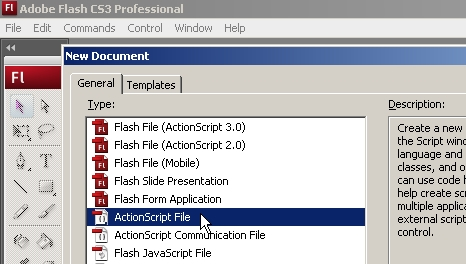
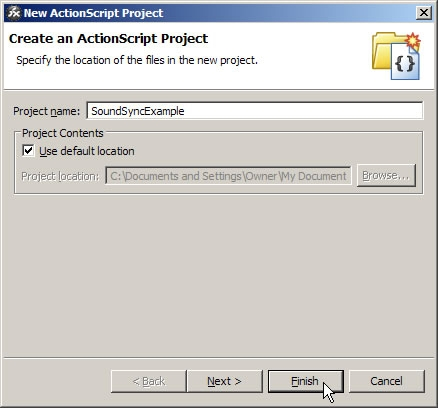
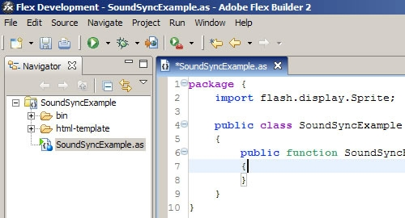
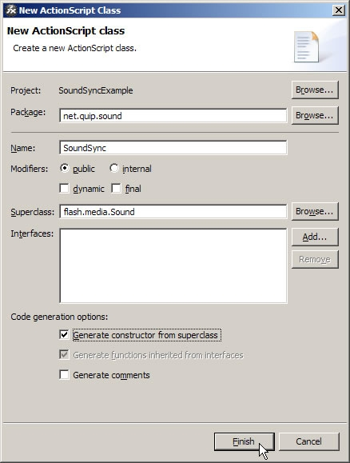
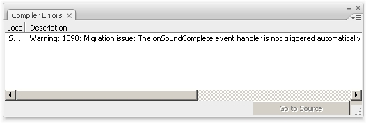
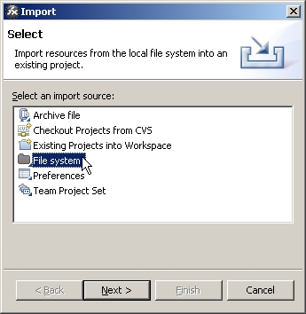

# Handling audio file cue points in ActionScript 2 and ActionScript 3

by David Stiller

## Content

- [SoundSync class in ActionScript 2](#soundsync-class-in-actionscript-2d)
- [SoundSync class in ActionScript 3](#soundsync-class-in-actionscript-3)
- [Where to go from here](#where-to-go-from-here)

## Requirements

### Prerequisite knowledge

Intermediate knowledge of ActionScript 2 and ActionScript 3.  Introductory
experience with Flash CS3 or later, or Flex Builder 2 or later.

### User level

Intermediate

### Required products

- Flash Builder or Adobe Animate (formerly Flash Professional)

### Sample files

- Sample Project Missing
<!-- - [sound_sync.zip](https://web.archive.org/web/20151105182152/http://www.adobe.com/content/dotcom/en/devnet/actionscript/articles/cue_points_audio/_jcr_content/articlePrerequistes/multiplefiles/node_1275446929093/file.res/sound_sync.zip)
  (5997 KB) -->

Both Flash CS3 Professional (or later) and Flex Builder 2 (or later) support cue
points for Flash video (FLV) files out of the box. In Flash, all you need is an
instance of the FLVPlayback component and you're set. You may define cue points
at any number of steps along the way: during the Import Video wizard, by using
the Component Inspector panel or Property inspector, or by calling the
`FLVPlayback.addAsCuePoint()` method as needed with ActionScript. In Flex
Builder 2, all you need is an instance of the CuePointManager class associated
with a VideoDisplay instance. In either case, set up a listener for cuePoint
events and respond as desired.

Cue points for audio files are a bit harder to implement. Although it's possible
in Flash to load MP3 files with one of the media components (MediaController,
MediaDisplay, or MediaPlayback), keep in mind that these components are geared
toward Flash Player 6 and 7 and require ActionScript 2. Built on an older
architecture than FLVPlayback, any one of the media components adds a minimum
55K file size to the published SWF file. FLVPlayback adds only 49K in
ActionScript 3 documents (35K in ActionScript 2 documents), but the newer
component does not load MP3 files. Likewise in Flex Builder, the VideoDisplay
class loads only video. To work around this, you could produce audio-only FLV
files (that is, files with no video content), but this practice isn't
particularly widespread. In team settings, especially, you may have no control
over external assets. Chances are significantly high that your audio will be
comprised of MP3 files. Fortunately, a bit of ActionScript quickly fits the
bill.

In this article, you'll explore two versions of one particular solution: a
custom SoundSync class that supports cue points for internal sound assets or
external MP3 files. This code will be presented in ActionScript 3 for Flash or
Flex Builder and in ActionScript 2 for Flash documents intended for publication
to players earlier than Flash Player 9.

In either language, your approach is the same. Both versions of ActionScript
provide a Sound class capable of presenting embedded or loaded audio files. Both
languages allow audio to be played, either from the beginning or from a point
after that, paused, looped, and more. You certainly don't want to reinvent that
wheel! All the existing functionality is useful. The only thing missing is
support for cue points, so it makes sense to extend the existing Sound class in
order to retain the original feature set.

The custom SoundSync adds the following new public methods to its base class:

- **addCuePoint():** Adds a cue point object
- **getCuePoint():** Returns a cue point object based on its cue point name or
  time
- **removeCuePoint():** Removes a cue point object based on its cue point name
  or time
- **removeAllCuePoints():** Removes all cue point objects

In addition, a number of private methods are added. Some are overridden, too,
depending on the language used. In a nutshell, this SoundSync class uses a timer
to repeatedly check the current cue point object's time property against the
current position of the sound asset in play. Even with the advent of Flash
support for ActionScript 3, which provides numerous improvements over its
predecessor, a great number of Flash developers (as of this writing) are still
on the migration path toward the new language. Let's begin in ActionScript 2, to
cover the basic concepts of this class and then translate the solution to
ActionScript 3.

### SoundSync class in ActionScript 2

The code in this custom class must be saved in an external text file named
**SoundSync.as**. According to recommended best practices, you should place this
file inside nested folders that reflect the class's package structure. In this
case, you'll need a folder named **sound** inside a folder named **quip** inside
a folder named **net** that resides within a folder specified in your global
classpath setting. (In Flash CS3, select the Edit \> Preferences \> ActionScript
category \> ActionScript 2 Settings button.) I personally keep one folder for
ActionScript 2 classes and another for ActionScript 3 classes. When you
encounter the ActionScript 3 version of this class later in the article, you'll
repeat these first few steps, including the creation of nested package folders
inside the root ActionScript 3 classpaths folder of your choice. In either case,
the `net.quip.sound` package is based on my domain name by convention; feel free
to personalize the package structure to suit your needs. For details, see
"[About setting and modifying the classpath](https://web.archive.org/web/20151105182152/http://help.adobe.com/en_US/FlashPlatform/reference/actionscript/2/help.html?content=00000164.html)"
under "Learning ActionScript 2 in Adobe Flash" in the Flash documentation.

#### Creating the ActionScript 2 class file

Launch Flash CS3 Professional and select File \> New \> General tab \>
ActionScript File to begin (see Figure 1).

Figure 1. Starting a new ActionScript file in Flash CS3

Type the following ActionScript into your empty file:

    import mx.events.EventDispatcher;
    class net.quip.sound.SoundSync extends Sound {
    	// PROPERTIES
    	// CONSTRUCTOR
    	// METHODS
    	// EVENT HANDLERS
    }

Save this file as **SoundSync.as** in the net/quip/sound folder structure
described earlier.

The first line imports a native class, EventDispatcher, used later in the code.
In ActionScript 2, the import statement is a convenience that allows you to
reference a class without having to type its full package name.

Next, the class is declared as a derivative of the base Sound class. This is
followed by a handful of commented placeholders for properties, the constructor,
methods, and event handlers. While these comments are not essential to the
class, I generally find it useful to block out the overall structure and fill in
the details as I go.

#### Declaring the properties

Type the following ActionScript after the `// PROPERTIES` comment:

    private var _cuePoints:Array;
    private var _currentCuePoint:Number;
    private var _interval:Number;
    private var _intervalDuration:Number;
    private var _secondOffset:Number;
    // Event dispatcher
    public var addEventListener:Function;
    public var removeEventListener:Function;
    private var dispatchEvent:Function;

By convention, private variable names begin with an underscore (\_). This
provides a quick visual reminder that the property in question is for internal
use only (that is, inaccessible outside the class). Each of these properties
will be explained as the class unfolds. Note, however, that the final three
lines (highlighted) are required by EventDispatcher, which allows this class to
dispatch events related to the goings-on of any SoundSync instance, including
cuePoint events. The private variable in this last bunch is something of an
oddball because it does not begin with an underscore. But every rule has its
exception, and because we didn't write these functions, we'll roll with what
we've been given.

#### The constructor

Type the following ActionScript after the `// CONSTRUCTOR` comment:

    public function SoundSync(target:MovieClip) {
    	super(target);
    	init();
    }

This function ensures that SoundSync can be used in the same way as any Sound
instance. The super statement invokes the superclass version of the constructor
(that is, the base class's constructor), which accepts an optional MovieClip
reference. Anything the base class does to initialize itself now occurs here,
too, thanks to this statement. This is followed by a custom `init()` method,
described next, which sets up additional initialization.

#### The methods

This class requires a bit of its own preparatory housekeeping. You'll accomplish
this with an `init()` method.

#### init()

Type the following ActionScript after the `// METHODS` comment:

    private function init():Void {
    	// Initialize properties
    	_cuePoints = new Array();
    	_currentCuePoint = 0;
    	_intervalDuration = 50;
    	_secondOffset = 0;
    	// Initialize class instance as valid event broadcaster
    	EventDispatcher.initialize(this);
    }

Here, several of the class properties are initialized to their default values.
The \_cuePoints property is an Array instance that holds references to each cue
point object, using \_currentCuePoint as its index. The \_intervalDuration
property determines the span of time, in milliseconds, between repeated checks
of the audio's current position. The \_secondOffset property specifies the
number of seconds that should pass before the audio starts to play (by default,
this is zero).

The final line invokes the static `EventDispatcher.initialize()` method with a
parameter of `this`, which establishes each instance of this class as an object
capable of dispatching events.

#### addCuePoint()

At this point, you're already geared up for the `addCuePoint()` method. Type the
following ActionScript after the `init()` method:

    // Add Cue Point
    public function addCuePoint(cuePointName:String, cuePointTime:Number):Void {
    	_cuePoints.push(
    		{
    			type: "cuePoint",
    			name: cuePointName,
    			time: cuePointTime,
    			target: this
    		}
    	);
    	_cuePoints.sortOn("time", Array.NUMERIC);
    }

This method accepts two parameters, `cuePointName` and `cuePointTime`, which
represent the name and temporal position of a given cue point. These are used as
properties of a generic Object instance stored in the `_cuePoints` array via the
`Array.push()` method; the curly braces, `{}`, are shorthand for invoking the
`new Object()` constructor. In addition, each cue point object needs a `type`
property, which is always set to the string "cuePoint". Finally, a `target`
property refers to the `SoundSync` instance (`this`) that dispatched the event.

As each cue point object is added, the `_cuePoints` array is sorted numerically
by the `cuePoint.time` property. In this way, any cue points added out of
sequence will still be positioned correctly.

#### getCuePoint()

For the sake of symmetry, let's provide a way to retrieve cue points after
they've been added. Type the following ActionScript after the `addCuePoint()`
method:

    // Get Cue Point
    public function getCuePoint(nameOrTime:Object):Object {
    	var counter:Number = 0;
    	while (counter < _cuePoints.length) {
    		if (typeof(nameOrTime) == "string") {
    			if (_cuePoints[counter].name == nameOrTime) {
    				return _cuePoints[counter];
    			}
    		} else if (typeof(nameOrTime) == "number") {
    			if (_cuePoints[counter].time == nameOrTime) {
    				return _cuePoints[counter];
    			}
    		}
    		counter++;
    	}
    	return null;
    }

This method accepts a single parameter, either the cue point's name or time,
which means the parameter might be a string or a number. To cover either
possibility, the parameter is typed as Object. Inside the method, a simple
counter variable, whose purpose is to step through the \_cuePoints array, is
declared and set to zero. In a `while()` loop, the `nameOrTime` parameter is
checked for its specific type with the typeof operator. If it is a string,
`nameOrTime` is compared with the current cue point's `name` property; if it is
a number, it is compared with the cue point's `time` property. Because counter
is incremented with each loop, the first occurrence of a given name or time is
returned, even if there are duplicates. If no match is found, the method returns
`null`.

#### getCurrentCuePointIndex() and getNextCuePointIndex()

These methods are "behind the scenes" functions that are only accessed inside
the class by other methods. Their purpose is to return the current or next cue
point's position (index) in the \_cuePoints array, used respectively to remove
cue points and determine which cue point to focus on next.

Type the following ActionScript after the `getCuePoint()` method:

    // Get Current Cue Point Index
    private function getCurrentCuePointIndex(cuePoint:Object):Number {
    	var counter:Number = 0;
    	while (counter < _cuePoints.length) {
    		if (_cuePoints[counter].name == cuePoint.name) {
    			return counter;
    		}
    		counter++;
    	}
    	return null;
    }
    // Get Next Cue Point Index
    private function getNextCuePointIndex(seconds:Number):Number {
    	seconds = (seconds) ? seconds : 0;
    	var counter:Number = 0;
    	while (counter < _cuePoints.length) {
    		if (_cuePoints[counter].time >= seconds * 1000) {
    			return counter;
    		}
    		counter++;
    	}
    	return null;
    }

The first method, `getCurrentCuePointIndex()`, accepts a cue point object as its
only parameter. Employing the same `while()` mechanism used earlier, this method
checks the name property of the parameter object against the name property of
each cue point object in the \_cuePoints array. If a match occurs, the method
returns the number value of the current index in the array; otherwise, `null`.

The second method, `getNextCuePointIndex()`, is a little more interesting. The
purpose of this method is to determine which cue point to look for next,
depending on the specified time. Imagine three cue points exist at 10, 20, and
30 seconds, respectively. If the audio has been playing for 22 seconds, the next
pertinent cue point is the one set at 30 seconds — that is, the third cue point
in this example, or index 2 (because arrays start at zero).

This method is called by two others in the class, `start()` and
`pollCuePoints()`, discussed later in this article. Two circumstances pose a
challenge here:

- It's entirely possible that the `seconds` parameter may not be provided, in
  which case its value would be `null`
- A cue point's `time` property is stored in milliseconds but the nature of the
  base `Sound` class in ActionScript 2 requires a parameter in seconds

Fortunately, both challenges are easy to resolve. First, the conditional
operator (`?:`) checks the value of seconds in the parentheses preceding the
question mark. If the value is nonzero, the value is simply set to itself (it
stays the same); otherwise, a default value of zero is assigned.

Next, a `while()` loop once again steps through the \_cuePoints array. Each cue
point's time property is compared against the seconds parameter multiplied by
1,000 (thus, seconds are converted to milliseconds). Because this loop starts at
zero, the first seconds time slot equal to or greater than a given cue point's
time property represents the next relevant cue point.

#### removeCuePoint() and removeAllCuePoints()

The next two methods allow you to remove an existing cue point or all cue points
directly. Type the following ActionScript after the `getNextCuePointIndex()`
method:

    // Remove Cue Point
    public function removeCuePoint(cuePoint:Object):Void {
    	_cuePoints.splice(getCurrentCuePointIndex(cuePoint), 1);
    }
    // Remove All Cue Points
    public function removeAllCuePoints():Void {
    	_cuePoints = new Array();
    }

The first method, `removeCuePoint()`, accepts a cue point object as its only
parameter. The `Array.splice()` method is invoked on the \_cuePoints array to
remove the specified element. The index of this element is determined by the
return value of the `getCurrentCuePointIndex()` method outlined above. Because
only a single element should be removed, 1 is supplied as the second parameter
to `Array.splice()`.

The second method, `removeAllCuePoints()`, simply replaces the existing
\_cuePoints array with a new, empty Array instance.

#### Overriding the start(), stop(), and loadSound() methods

There are two ways to begin playing audio with the base Sound class in
ActionScript 2: `Sound.start()` and `Sound.loadSound()`. When either of these
occurs, SoundSync must begin continuously polling the audio's position to
compare it against the time property of each cue point object. Likewise, polling
should stop when the `Sound.stop()` method is called.

To accomplish this feat, SoundSync provides its own version of these methods,
invoking super to let the base class manage its own functionality, and then
following with additional instructions.

Type the following ActionScript after the `removeAllCuePoints()` method:

    // Start
    public function start(secondOffset:Number, loops:Number):Void {
    	super.start(secondOffset, loops);
    	dispatchEvent({type:"onStart", target:this});
    	// Reset current cue point
    	_secondOffset = secondOffset;
    	_currentCuePoint = getNextCuePointIndex(secondOffset);
    	// Poll for cue points
    	clearInterval(_interval);
    	_interval = setInterval(this, "pollCuePoints", _intervalDuration);
    }
    // Load Sound
    public function loadSound(url:String, isStreaming:Boolean):Void {
    	super.loadSound(url, isStreaming);
    	clearInterval(_interval);
    	_interval = setInterval(this, "pollCuePoints", _intervalDuration);
     }
    // Stop
    public function stop(linkageID:String):Void {
    	if (linkageID) {
    		super.stop(linkageID);
    	} else {
    		super.stop();
    	}
    	dispatchEvent({type:"onStop", target:this});
    	// Kill polling
    	clearInterval(_interval);
    }

Right off the bat, the `start()` method calls `super.start()` and passes it the
two optional parameters available to that method. Next, an onStart event is
dispatched to alert you that audio has started playing.

Two important private properties are set based on the value of the optional
`secondOffset` parameter. The first is simply a copy of the parameter's value
for later use; the second, \_currentCuePoint, is derived from
`getNextCuePointIndex()`, with `secondOffset` as its parameter. Remember that
`secondOffset` is not a required parameter (it may be null) so it's a good thing
`getNextCuePointIndex()` accounts for that!

Finally, if a `setInterval()` cycle is already in play, it's cancelled by
`clearInterval()` and a new cycle of cue point polling begins. There are two
ways to use the `setInterval()` function, and the usage here—where the first
parameter is `this`—sets the scope of this polling to the class itself rather
than to the `setInterval()` function.

Of course, the developer might bypass the `start()` method altogether by using
`loadSound()`. In this case, the SoundSync version calls `super.loadSound()` and
passes it the parameters it expects. Then, as before, polling is set in motion.

To save processor cycles, it's a good idea to stop polling if the developer
invokes the `stop()` method. Because the linkageID parameter is optional in the
base Sound class, the SoundSync version tests to see if it's present and invokes
`super.stop()` as appropriate. An onStop event is dispatched and polling is
canceled with `clearInterval()`.

#### The brains of the class: pollCuePoints()

Here's where it all comes together! Type the following ActionScript after the
`stop()` method:

    private function pollCuePoints():Void {
    	// If current position is near the current cue point's time ...
    	var time:Number = _cuePoints[_currentCuePoint].time;
    	var span:Number = (_cuePoints[_currentCuePoint + 1].time) ? _cuePoints[_currentCuePoint + 1].time : time + _intervalDuration * 2;
    	if (position >= time && position <= span) {
    		// Dispatch event
    		dispatchEvent(_cuePoints[_currentCuePoint]);
    		// Advance to next cue point ...
    		if (_currentCuePoint < _cuePoints.length) {
    			_currentCuePoint++;
    		} else {
    			_currentCuePoint = getNextCuePointIndex(_secondOffset);
    		}
    	}
    }

The `pollCuePoints()` method is a little densely packed but straightforward.
Called every 50 milliseconds (approximately 20 times a second), this method
compares the Sound.position property of the playing audio with the current and
next cue point objects' time properties. If position is greater than or equal to
the current cue point's time and less than or equal to the next cue point's
time, the current cue point object is dispatched as an event.

Note the two local variables: time and span. The first is simply set to the
current cue point's time value. The second is set either to the next cue point's
time value — if another cue point follows — or to the current object's time
value plus twice the time span in which polling is invoked. This multiplication
is an arbitrary formula but it bears out fairly well and is used only when the
final cue point in the array is encountered.

As soon as a cuePoint event is dispatched, \_currentCuePoint is incremented if
additional cue points remain. If not, because the audio has reached an end and
may be looped, then \_currentCuePoint is reset to the earliest relevant cue
point based on your optional `secondOffset` preference.

#### Commandeering a base class event

Even if you do not explicitly invoke `stop()`, the audio will eventually stop on
its own. Polling should be cancelled when this happens, so type the following
ActionScript after the `// EVENT HANDLERS` comment:

    // onSoundComplete
    public function onSoundComplete():Void {
    	// Kill polling
    	clearInterval(_interval);
    	// Reset current cue point
    	_currentCuePoint = 0;
    	// Dispatch event
    	dispatchEvent({type:"onSoundComplete", target:this});
    }

Unfortunately, this hijacks a useful event of the Sound class. As a consolation,
however, SoundSync dispatches a replacement onSoundComplete event after
`clearInterval()` halts the polling and \_currentCuePoint is reset to zero. In
this way, you are still allowed to trigger actions based on the audio's
completion.

### Using the ActionScript 2 version

The SoundSync class is easy to use. Wherever audio cue points are required in a
FLA file or another ActionScript class, instantiate SoundSync in place of Sound.
After invoking `addCuePoint()` as necessary, set up a listener object to handle
cuePoint events:

    import net.quip.sound.SoundSync;

    var ss:SoundSync = new SoundSync();
    ss.addCuePoint("first", 1000);
    ss.addCuePoint("second", 2000);
    ss.addCuePoint("third", 3000);
    ss.loadSound("sample.mp3", true);

    var listener:Object = new Object();
    listener.cuePoint = function(evt:Object):Void {
    	trace(evt.name + ", " + evt.time);
    }
    ss.addEventListener("cuePoint", listener);

To see a demonstration that advances the timeline based on cue points, open
green_presidents_as2.fla from the ZIP file that accompanies this article (this
file opens in Flash 8 or later). Make sure the companion audio file,
green_presidents.mp3, is in the same folder as the FLA file. Also, make sure
that the ActionScript 2 version of SoundSync.as is in a folder named "sound"
inside a folder named "quip" inside a folder named "net" that is accessible to
your global classpaths setting.

### SoundSync class in ActionScript 3

Whew! Ready to run the course again? The ActionScript 3 version of SoundSync
parallels the ActionScript 2 version very closely. There are inevitable
differences, of course, but migration needn't be a frightening endeavor.

#### Creating the ActionScript 3 class file

Here you have two choices: either Flash or Flex/Flash Builder. If you're
continuing on with Flash, simply create a new SoundSync.as file—a text file, as
before—inside the same nested folder structure (net/quip/sound) described at the
beginning of the article. This time, put those nested folders inside a root
folder set aside for ActionScript 3 classes. Use the Edit \> Preferences \>
ActionScript category \> ActionScript 3 Settings button to specify the location
of this root folder. This lets Flash know how to set paths separately to the
distinct folders for these two languages.

Alternatively, if you want to continue on with Flex, perform the following steps
to set up the SoundSync.as file within the context of the Flex Builder authoring
environment. Once the class file is created, you may proceed under either
platform. Flash developers may, at this point, safely skip to the "Starting with
the class groundwork" section.

Here's the Flex detour. Launch Flex Builder 2 and select File \> New \>
ActionScript Project to begin (see Figure 2).

Figure 2. Starting a new ActionScript project in Flex Builder

Name the project SoundSyncExample and then click the Finish button. This creates
a new project in Flex Builder, including bin and html-template folders used by
Flex and a SoundSyncExample.as class file that acts as the main entry point into
your new application. SoundSyncExample will instantiate the ActionScript 3
version of SoundSync; it corresponds to the Flash frame script in the previous
"Using the ActionScript 2 version" section.

Note that Flex Builder automatically generates a package and class declaration
for you (see Figure 3), which you'll flesh out later. For now, save this file
and close it. (This file is not needed if you're using Flash.)

Figure 3. Flex Builder automatically generating a package and class declaration

Create the net.quip.sound package folders inside this project by selecting File
\> New \> Folder. In the New Folder dialog box, select the SoundSyncExample
folder and provide the path net/quip/sound in the Folder Name field. Click the
Finish button.

Finally, select File \> New \> ActionScript Class. In the New ActionScript Class
dialog box, make sure the Package field reads net.quip.sound. Type SoundSync
into the Name field and type flash.media.Sound into the Superclass field. Check
the Generate Constructor from Superclass option (see Figure 4).

Figure 4. Creating the SoundSync class file

Here, as in the previous version, SoundSync extends the Sound class. Click the
Finish button and note that Flex Builder again generates an automatic package
and class declaration for you, as well as the necessary call to super inside the
SoundSync constructor.

#### Starting with the class groundwork

In ActionScript 3, import statements are not only a convenience, they are
required when writing class files. As part of its code completion feature set,
Flex Builder automatically supplies relevant import statements as needed. For
the sake of this tutorial, however, or if you're using Flash, update your code
manually to reflect the following full import list, as well as the
organizational comments:

    package net.quip.sound
    {
    	import flash.events.Event;
    	import flash.events.TimerEvent;
    	import flash.media.Sound;
    	import flash.media.SoundChannel;
    	import flash.media.SoundLoaderContext;
    	import flash.media.SoundTransform;
    	import flash.net.URLRequest;
    	import flash.utils.Timer;

    	public class SoundSync extends Sound
    	{
    		// PROPERTIES
    		// CONSTRUCTOR
    		public function SoundSync(stream:URLRequest=null, context:SoundLoaderContext=null)
    		{
    			super(stream, context);
    			init();
    		}
    		// METHODS
    		// EVENT HANDLERS
    	}
    }

Note that ActionScript 3 class files feature a package statement, rather than
put the package path within the class statement. Don't forget the call to
`init()` in the constructor!

#### Declaring the properties

Type the following ActionScript after the `// PROPERTIES` comment:

    private var _cuePoints:Array;
    private var _currentCuePoint:uint;
    private var _timer:Timer;
    private var _timerInterval:uint;
    private var _startTime:Number;
    private var _loops:uint;
    private var _soundChannel:SoundChannel;

Here, \_cuePoints and \_currentCuePoint are identical to their ActionScript 2
counterparts. The \_timer and \_timerInterval properties correspond to the
previous version's \_interval and \_intervalDuration, while \_startTime
corresponds to the previous \_secondOffset. Finally, \_loops and \_soundChannel
are new and will be explained as the class unfolds.

Note the new uint data type (highlighted) for several of the numeric properties.
In ActionScript 3, the familiar Number data type refers to double-precision
floating-point numbers, which can take up to 53 bits to represent. The new int
data type refers to 32-bit signed integers (postive or negative) and uint refers
to 32-bit unsigned integers (positive only). As of Flash Player 9, ActionScript
handles int and uint more efficiently than Number, so unless you specifically
need floating-point numbers, use one of the new data types.

#### The constructor

Your constructor should already be up to date, but let's take a quick review:

    // CONSTRUCTOR
    public function SoundSync(stream:URLRequest=null, context:SoundLoaderContext=null) {
    	super(stream, context);
    	init();
    }

This should look familiar, thanks to its similarity to the ActionScript 2
version. As before, this constructor defers to its superclass and then performs
its own initialization. Note, however, that in ActionScript 3, optional
parameters must be given a default value (here, `null`, for both).

#### The methods

Much of this will feel familiar.

#### init()

Type the following ActionScript after the `// METHODS` comment:

    // init
    private function init():void {
    	_cuePoints = new Array();
    	_currentCuePoint = 0;
    	_timerInterval = 50;
    	_startTime = 0.0;
    }

Here, a number of private properties are initialized to their default values.
Note the lowercase _v_ in the void data type appended to the function, which
differs from the uppercase _V_ in the Void data type in ActionScript 2.

#### addCuePoint()

This method represents the first significant departure from the ActionScript 2
original. In ActionScript 3, event handling has been revamped across the board
for consistency, control, and ease of use. To accommodate this overhaul, you
must replace the generic Object instances in the \_cuePoints array with
instances of a custom CuePointEvent class that extends the new Event class.

If you're using Flash, create a new ActionScript file and save it as
**CuePointEvent.as** in the same folder that contains the ActionScript 3 version
of SoundSync.as. If you're using Flex Builder, select File \> New \>
ActionScript Class. In the New ActionScript Class dialog box, make sure the
Package field reads net.quip.sound. Type **CuePointEvent** into the Name field
and type **Event** into the Superclass field. Check the Generate Constructor
from Superclass option and then click the Finish button. Update the result
with—or, in Flash, simply type—the following ActionScript into the
CuePointEvent.as file:

    package net.quip.sound
    {
    	import flash.events.Event;

    	public class CuePointEvent extends Event
    	{
    		// PROPERTIES
    		public static const CUE_POINT:String = "cuePoint";
    		public var name:String;
    		public var time:uint;

    		// CONSTRUCTOR
    		public function CuePointEvent(type:String, cuePointName:String, cuePointTime:uint, bubbles:Boolean = false, cancelable:Boolean = false)
    		{
    			super(type, bubbles, cancelable);
    			this.name = cuePointName;
    			this.time = cuePointTime;
    		}

    		// METHODS
    		// Clone
    		public override function clone():Event
    		{
    			return new CuePointEvent(type, name, time, bubbles, cancelable);
    		}
    	}
    }

This class features three public properties, the first of which is a constant:
the string cuePoint. The reason for this property is so that the event's type
can be specified in outside code according to recommended best practices; that
is, with CuePointEvent.CUE_POINT, rather than the string it represents. The
second and third properties declare the cue point's name and time properties.

As you update your copy of this code, pay attention to the order of the
parameters in the constructor. CuePointEvent requires `type`, `cuePointName`,
and `cuePointTime`, and then accepts a couple more that are optionally used by
the base Event class. The call to super passes along some of these parameters in
the order expected by Event. The others set the values of their corresponding
properties.

Finally, the `Event.clone()` method is overridden to return a new instance of
the derivative class, CuePointEvent, rather than Event itself.

Now you're set to write the `SoundSync.addCuePoint()` method. Return to the
SouncSync.as file and type the following ActionScript after the `init()` method:

    // Add Cue Point
    public function addCuePoint(cuePointName:String, cuePointTime:uint):void {
    	_cuePoints.push(new CuePointEvent(CuePointEvent.CUE_POINT, cuePointName, cuePointTime));
    	_cuePoints.sortOn("time", Array.NUMERIC);
    }

Outside of the new requirement for a custom Event derivative, this method is
nearly identical to the ActionScript 2 version.

#### getCuePoint()

Only a single data type change makes this method differ from its previous
version. Here, the local counter variable is typed as uint instead of Number.
Type the following after the `addCuePoint()` method:

    // Get Cue Point
    public function getCuePoint(nameOrTime:Object):Object {
    	var counter:uint = 0;
    	while (counter < _cuePoints.length) {
    		if (typeof(nameOrTime) == "string") {
    			if (_cuePoints[counter].name == nameOrTime) {
    				return _cuePoints[counter];
    			}
    		} else if (typeof(nameOrTime) == "number") {
    			if (_cuePoints[counter].time == nameOrTime) {
    				return _cuePoints[counter];
    			}
    		}
    		counter++;
    	}
    	return null;
    }

#### More of the same

The next four methods (`getCurrentCuePointIndex()`, `getNextCuePointIndex()`,
`removeCuePoint()`, and `removeAllCuePoints()`) change only superficially in the
course of this migration. The Number data type is replaced with uint where
appropriate, Void is replaced with void, and the previous "challenges" dealt
with in the `getNextCuePoint()` method are handled differently. This time, the
incoming parameter is already supplied in milliseconds and the possible null
value is ascertained with `isNaN()` due to stricter number handling in
ActionScript 3.

That said, type the following code after the `getCuePoint()` method:

    // Get Current Cue Point Index
    private function getCurrentCuePointIndex(cuePoint:CuePointEvent):uint {
    	var counter:uint = 0;
    	while (counter < _cuePoints.length) {
    		if (_cuePoints[counter].name == cuePoint.name) {
    			return counter;
    		}
    		counter++;
    	}
    	return null;
    }
    // Get Next Cue Point Index
    private function getNextCuePointIndex(milliseconds:Number):uint {
    	if (isNaN(milliseconds)) {
    		milliseconds = 0;
    	}
    	var counter:uint = 0;
    	while (counter < _cuePoints.length) {
    		if (_cuePoints[counter].time >= milliseconds) {
    			return counter;
    		}
    		counter++;
    	}
    	return null;
    }
    // Remove Cue Point
    public function removeCuePoint(cuePoint:CuePointEvent):void {
    	_cuePoints.splice(getCurrentCuePointIndex(cuePoint), 1);
    }
    // Remove All Cue Points
    public function removeAllCuePoints():void {
    	_cuePoints = new Array();
    }

#### play()

Here is the second major divergence from the original class's approach. In
ActionScript 3, the Sound class features neither a `start()` nor a `loadSound()`
method. The closest counterparts are `play()` and `load()`. Of those, only the
former causes audio to actually start playing. This means you only need to
override the `play()` method, but there's a bit more to account for in this
version.

Type the following ActionScript after the `removeAllCuePoints()` method:

    // Play
    public override function play(startTime:Number=0.0, loops:int=0, sndTransform:SoundTransform=null):SoundChannel {
    	_soundChannel = super.play(startTime, loops, sndTransform);
    	_soundChannel.addEventListener(Event.SOUND_COMPLETE, onSoundComplete);
    	// Reset current cue point
    	_startTime = startTime;
    	_loops = 0;
    	_currentCuePoint = getNextCuePointIndex(startTime);
    	// Poll for cue points
    	_timer = new Timer(_timerInterval);
    	_timer.addEventListener(TimerEvent.TIMER, pollCuePoints);
    	_timer.start();
    	return _soundChannel;
    }

Note the override keyword in the function declaration, which is now required for
this practice. In ActionScript 3, the audible manifestation of played audio is
managed by an instance of the SoundChannel class, which happens to be set by the
return value of the `play()` method. Your custom SoundSync class features a
private \_soundChannel property to reference this instance, which is immediately
employed to listen for a soundComplete event when the audio stops. This allows
you to cancel polling when appropriate.

Next, the `play()` method's optional startTime and loops parameters are noted
for later use. Actually, the private \_loops property isn't just a twin of the
loops parameter, which refers to the number of times the audio should repeat. In
the class you're writing, \_loops is incremented by the `pollCuePoints()` method
to facilitate some required arithmetic elsewhere in the class. In ActionScript
2, the Sound.position property restarts to zero when looped audio repeats, which
makes it easy to reset cue point polling. In ActionScript 3, the corresponding
property, SoundChannel.position, does not reset to zero. For this reason,
\_loops is used to compensate for the value of SoundChannel.position when
dealing with looped audio.

Next, the \_currentCuePoint property, as before, is set by way of
`getNextCuePointIndex()`. The new Timer class replaces the `setInterval()`
function to carry out the repeated polling. Here the \_timer property stores the
reference to a Timer instance and listens for the TimerEvent.TIMER event in
order to trigger the `pollCuePoints()` method. Finally, \_soundChannel is
returned to satisfy the `Sound.play()` override.

#### stop()

Similar to the original version, this method cancels polling when you choose to
explicitly stop the audio. Note that this not an override because stopping is
normally handled by the SoundChannel class in ActionScript 3. Type the following
ActionScript after the `play()` method:

    // Stop
    public function stop():void {
    	_soundChannel.stop();
    	dispatchEvent(new Event("stop"));
    	// Kill polling
    	_timer.stop();
    }

#### pollCuePoints()

The "brains of the class" in ActionScript 3 is remarkably similar to its
previous incarnation. Remember, in this version of the language,
SoundChannel.position does not reset to zero for looped audio, so the internal
\_loops property is used to multiply its value in cases of looping. Other than
that, the concept is the same: Note the current and next cue point's time
properties. If the audio's position falls between those values, dispatch a
cuePoint event. In cases where no next cue point is available, check the
arbitrary span of time between this cue point and twice the timer's interval
period.

Type the following ActionScript after the `stop()` method:

    // Poll Cue Points
    private function pollCuePoints(event:TimerEvent):void {
    	var time:Number = _cuePoints[_currentCuePoint].time + (length * _loops);
    	var span:Number = 0;
    	if (_cuePoints[_currentCuePoint + 1] == undefined) {
    		span = time + _timerInterval * 2;
    	} else {
    		span = _cuePoints[_currentCuePoint + 1].time + (length * _loops);
    	};
    	if (_soundChannel.position >= time && _soundChannel.position <= span) {
    		// Dispatch event
    		dispatchEvent(_cuePoints[_currentCuePoint]);
    		// Advance to next cue point ...
    		if (_currentCuePoint < _cuePoints.length - 1) {
    			_currentCuePoint++;
    		} else {
    			_currentCuePoint = getNextCuePointIndex(_startTime);
    			_loops++;
    		}
    	}
    }

#### Commandeering the same base class event

As before, make sure to cancel cue point polling in cases where the audio stops
on its own and dispatch a soundComplete event to make up for nabbing the one
already provided.

Type the following ActionScript after the `// EVENT HANDLERS` comment:

    // onSoundComplete
    public function onSoundComplete(event:Event):void {
    	// Reset current cue point
    	_currentCuePoint = 0;
    	// Kill polling
    	_timer.stop();
    	// Dispatch event
    	dispatchEvent(new Event(Event.SOUND_COMPLETE));
    }

### Using the ActionScript 3 version

If you're using Flash, you can call on the SoundSync class from a timeline frame
script in much the same way it was done in the earlier ActionScript 2 document.
The only difference, in fact, occurs in the way the audio is loaded and events
are handled:

    // Import class
    import net.quip.sound.SoundSync;
    import net.quip.sound.CuePointEvent;

    // Stop main timeline
    stop();

    // Create an instance of SoundSync
    var ss:SoundSync = new SoundSync();

    // Use instance to add cue points
    // (Note that even though presidents
    // are added alphabetically by surname,
    // they're triggered numerically by
    // cue point time)
    ss.addCuePoint("Benjamin Franklin", 20100);
    ss.addCuePoint("Ulysses S. Grant", 16479);
    ss.addCuePoint("Alexander Hamilton", 9431);
    ss.addCuePoint("Andrew Jackson", 13278);
    ss.addCuePoint("Thomas Jefferson", 2439);
    ss.addCuePoint("Abraham Lincoln", 5480);
    ss.addCuePoint("George Washington", 0);

    // Use instance to load external MP3
    ss.load(new URLRequest("green_presidents.mp3"));
    ss.play();

    // Assign event handlers
    ss.addEventListener(CuePointEvent.CUE_POINT, onCuePoint);
    ss.addEventListener(Event.SOUND_COMPLETE, onSoundComplete);

    // On Cue Point
    function onCuePoint(event:CuePointEvent):void {
    	play();
    }
    // On Sound Complete
    function onSoundComplete(event:Event):void {
    	play();
    }

The ZIP file that accompanies this article includes an ActionScript 3 version of
the timeline example shown earlier, this time named green_presidents_as3.fla.
Make sure the companion audio file, green_presidents.mp3, is in the same folder
as the FLA file. Also make sure that the ActionScript 3 version of SoundSync.as
and CuePointEvent.as are in a folder named "sound" inside a folder named "quip"
inside a folder named "net" that is accessible to a folder designated in your
global classpaths setting for ActionScript 3.

Note that Flash may give you a warning (see Figure 5) when you test your movie.
The full text of this warning is: "Migration issue: The onSoundComplete event
handler is not triggered automatically by Flash Player at run time in
ActionScript 3. You must first register this handler for the event using
addEventListener ('soundComplete', callback_handler)."

Figure 5. Possible warning at compile time

To be sure, this a helpful warning because it serves as a reminder that this
particular event is no longer a member of the Sound class in ActionScript 3; it
is now a member of SoundChannel. Flash thinks you're trying to override the
Sound.onSoundComplete event of ActionScript 2, but the occurrence of
`addEventListener()` inside the `play()` method of this class correctly
sidesteps the problem. In this case, you may ignore the warning.

Remember that SoundSyncExample.as file? If you're using Flex/Flash Builder, now
is the time to open it again. Update your file as follows:

    package {
    	import flash.display.Sprite;
    	import flash.events.Event;
    	import flash.net.URLRequest;

    	import net.quip.sound.CuePointEvent;
    	import net.quip.sound.SoundSync;

    	public class SoundSyncExample extends Sprite
    	{
    			// CONSTRUCTOR
    			public function SoundSyncExample()
    			{
    				var ss:SoundSync = new SoundSync();
    				ss.load(new URLRequest("green_presidents.mp3"));
    				ss.addCuePoint("Benjamin Franklin", 20100);
    				ss.addCuePoint("Ulysses S. Grant", 16479);
    				ss.addCuePoint("Alexander Hamilton", 9431);
    				ss.addCuePoint("Andrew Jackson", 13278);
    				ss.addCuePoint("Thomas Jefferson", 2439);
    				ss.addCuePoint("Abraham Lincoln", 5480);
    				ss.addCuePoint("George Washington", 0);
    				ss.load(new URLRequest("green_presidents.mp3"));
    				ss.play();
    				ss.addEventListener(CuePointEvent.CUE_POINT, onCuePoint);
    				ss.addEventListener(Event.SOUND_COMPLETE, onSoundComplete);
    			}
    			// On Cue Point
    			private function onCuePoint(event:CuePointEvent):void {
    				trace("Cue point: " + event.name + ", " + event.time);
    			}
    			// On Sound Complete
    			private function onSoundComplete(event:Event):void {
    				trace("Audio finished: " + event.type);
    			}
    	}
    }

Before you test this class in Flex Builder, make sure to import
green_presidents.mp3 from the ZIP file that accompanies this article into the
SoundSyncExample project. Select File \> Import and then choose File System in
the Import dialog box (see Figure 6).

Figure 6. Importing an MP3 file into a Flex Builder project

Click the Next button. In the From Directory field, browse to the folder into
which you unzipped this article's files. Place a check mark next to
green_presidents.mp3. In the Into Folder field, browse to the SoundSyncExample
project. Finally, click the Finish button.

Select Run \> Debug SoundSyncExample. This launches your default browser in
order to play the SWF file that contains your application. While the SWF file is
running in the browser, switch to Flex Builder and look at the Console panel to
see `trace()` outputs as cue points are reached. Note that even though
presidents are added alphabetically by surname, they're triggered numerically by
cue point time.

Alternatively, you may compile the SoundSyncExample class in Flash by using the
new Document Class field in the Property inspector for ActionScript 3 documents.
Select File \> New \> General tab \> Flash File (ActionScript 3) to create a new
document and save it by whatever name you choose. Since the SoundSyncExample.as
file resides wherever your Flex Builder projects are stored, you'll have to
update your global classpath settings in Flash to include the root folder of
your SoundSyncExample project.

Once this setting has been updated, put a copy of the MP3 file into the same
folder as the one that holds your new FLA file. Type **SoundSyncExample** into
the Document Class field of the Property inspector and select Control \> Test
Movie to compile a SWF file. Keep an eye on the Output panel to see the same
`trace()` output as seen in Flex Builder. (You may notice the same warning as
described earlier and may ignore it here for the same reason.)

### Where to go from here

In this tutorial, you stepped through the creation of a custom `SoundSync` class
in both ActionScript 2 and 3. The code extends the native `Sound` class in both
languages and adds cue point functionality to the playback of audio files. You
were introduced to a number of differences between these two versions of
ActionScript, including new data types and a change in the structure of familiar
objects.

Migrating code can be a daunting prospect, but I hope this exercise has quelled
a few fears of the unknown. Although the landscape in ActionScript 3 has
broadened significantly, it is still just ActionScript. With new trails for you
to explore, the hike just got more exciting!

To learn more about ActionScript 3, including tips on migrating to the new
language, consider the following resources:

- [ActionScript 3 overview](./actionscript3-overview.md)
- [Tips for learning ActionScript 3](./tips-for-learning-actionscript-3.md)
- [Learning ActionScript 3](https://help.adobe.com/en_US/as3/learn/index.html)
- [ActionScript 3 Developer's Guide](https://help.adobe.com/en_US/as3/dev/index.html)
- [ActionScript 3 Reference for the Adobe Flash Platform](https://help.adobe.com/en_US/FlashPlatform/reference/actionscript/3/index.html)
  (LiveDocs)

If you're still using ActionScript 2, consider these resources:

- [Learning ActionScript 2 in Flash](https://web.archive.org/web/20151105182152/http://help.adobe.com/en_US/FlashPlatform/reference/actionscript/2/help.html?content=Part1_Learning_AS2_1.html)
  (LiveDocs)
- [ActionScript 2 best practices](https://web.archive.org/web/20151105182152/http://www.adobe.com/devnet/archive/flash/articles/as_bestpractices.html)
- [Flash ActionScript 2 Language Reference](https://web.archive.org/web/20151105182152/http://help.adobe.com/en_US/FlashPlatform/reference/actionscript/2/Part2_AS2_LangRef_1.html)
  (LiveDocs)
- [Debugging ActionScript 2 code: Lifting the blindfold](https://web.archive.org/web/20151105182152/http://www.adobe.com/devnet/flash/articles/debugging_actionscript.html)

> This work is licensed under a
> [Creative Commons Attribution-Noncommercial-Share Alike 3.0 Unported License](https://creativecommons.org/licenses/by-nc-sa/3.0/)
