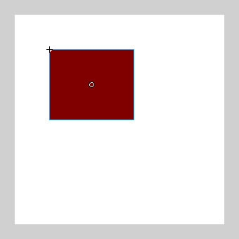
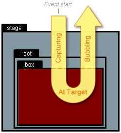
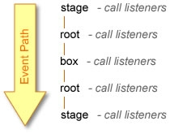
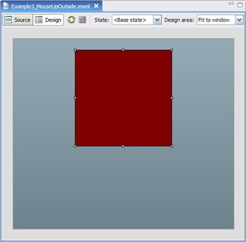
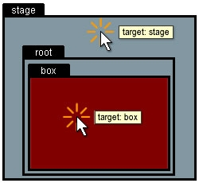
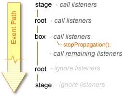
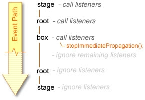
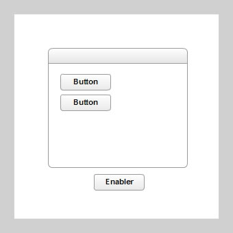
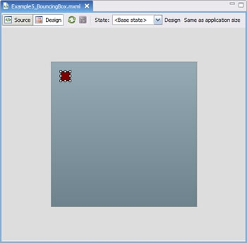

# Introduction to event handling in ActionScript 3.0

by Trevor McCauley

## Content

- [EventDispatcher class](#eventdispatcher-class)
- [Event propagation and phases](#event-propagation-and-phases)
- [Event targeting](#event-targeting)
- [Event properties](#event-properties)
- [Event methods](#event-methods)
- [Customizing events](#customizing-events)
- [Tips for ActionScript 3.0 events](#tips-for-actionscript-30-events)

## Requirements

### User level

Beginning

### Required products

- Flash Builder or Adobe Animate (formerly Flash Professional)

### Sample files

- [event_handling_as3](https://github.com/joshtynjala/adobe-developer-connection-samples-archive/tree/main/event_handling_as3)

Event handling in ActionScript has changed significantly over the past few
releases of Flash Player. With the introduction of ActionScript 3.0, this trend
continues. Using ActionScript 3.0, you have even more control when working with
events.

This article covers the new features related to event handling in ActionScript
3.0. You'll learn how the new EventDispatcher class works—especially in relation
to using mouse events. You will also learn about event propagation, event
objects, and how to create your own custom events.

### EventDispatcher class

Event handling in ActionScript 3.0 depends heavily on the EventDispatcher class.
Although this class isn't entirely new to ActionScript, it is the first time it
has been included as a core part of the ActionScript language. You may also be
familiar with EventDispatcher from JavaScript or ActionScript 2.0 when using V2
components. With V2 components, an external version of the EventDispatcher class
was used to handle component events. This version is slightly different from the
version of EventDispatcher used internally by ActionScript 3.0.

For those not familiar with EventDispatcher, the basic concept is this: First
you create functions, or event handlers, to react to various events. Then you
associate those functions with the events by using the `addEventListener()`
method, which is called from the object that will receive the event. This is
similar to the normal, core process in ActionScript 2.0 (not using
EventDispatcher). The difference is that in ActionScript 2.0, you define the
event handler within the object receiving the event—giving the function the name
of the event being received. For example, to react to an "onPress" event for a
button named `submitButton` in ActionScript 2.0, you would use:

    submitButton.onPress = function() { ... }

Using EventDispatcher, the same elements are at play; an object receiving an
event, an event name, and a function that reacts to an event—only the process is
slightly different. The code using EventDispatcher looks like this:

    function pressHandler(){ ... }
    submitButton.addEventListener("onPress", pressHandler);

This process adds what appears to be an extra step, but it allows for more
flexibility. Since you are using a function to add event handlers instead of
defining them directly on the target object itself, you can now add as many
handlers as you like to "listen" to a single event.

Removing events in ActionScript 2.0 just meant deleting the handler:

    delete submitButton.onPress;

Using EventDispatcher, you use `removeEventListener()`. This method removes an
event listener that matches the same definition used in addEventListener (up to
the third parameter).

    submitButton.removeEventListener("onPress", pressHandler);

#### Where is EventDispatcher?

You may have noticed that the code snippets above do not explicitly reference
EventDispatcher. In fact, it's rare that you would ever use EventDispatcher
directly in your code. EventDispatcher, in ActionScript 3.0, is actually a base
class, which other classes extend in order to be able to have access to
`addEventListener` and other EventDispatcher methods. In ActionScript 2.0,
EventDispatcher was a mixin class.

This meant in order for it to give these methods to other objects,
`EventDispatcher.initialize()` was used to copy them from EventDispatcher into
the desired object. Now classes just inherit the methods by extending
EventDispatcher. Luckily most classes that need to use EventDispatcher in
ActionScript 3.0, like MovieClip and other DisplayObjects already extend
EventDispatcher making it accessible and easy to use (though if necessary,
advanced users can also include EventDispatcher functionality through
composition).

#### EventDispatcher methods

Here is a summary of the methods in EventDispatcher for ActionScript 3.0. Many
of these methods are similar to the methods in the ActionScript 2.0 version:

- `addEventListener(type:String, listener:Function, useCapture:Boolean = false, priority:int = 0, useWeakReference:Boolean = false):void`
- `removeEventListener(type:String, listener:Function, useCapture:Boolean = false):void`
- `dispatchEvent(event:Event):Boolean`
- `hasEventListener(type:String):Boolean`
- `willTrigger(type:String):Boolean`

If you are familiar with ActionScript 2.0, you'll notice that there are two new
methods, `hasEventListener` and `willTrigger`. Additionally, `addEventListener`
for ActionScript 3.0 now only allows functions as listeners, not objects
(objects could be used as listeners in the older version). Since methods are now
bound to their instances in ActionScript 3.0, there is essentially no need to
use objects for listeners anymore. This means that the `this` keyword in a
function will always correctly reference the instance to which it was obtained.
It also eliminates the need for the ActionScript 2.0 Delegate class.

- **addEventListener():** Adds an event handler function to listen to an event
  so that when that event occurs, the function will be called.
- **removeEventListener():** Removes an event handler added to a listeners list
  using `addEventListener`. The same first 3 arguments used in
  `addEventListener` must be used in `removeEventListener` to remove the correct
  handler.
- **dispatchEvent():** Sends the passed event to all listeners in the listeners
  list of an object that relates to the event type. This method is most commonly
  used when creating custom events.
- **hasEventListener():** Determines whether or not an object has listeners for
  a specific type of event.
- **willTrigger():** Determines whether or not an object or any of its parent
  containers have listeners for a specific type event. This is much like
  `hasEventListener` but this method checks the current object as well as all
  objects that might be affected from the propagation of the event.

These methods, as well as any other function or method in ActionScript 3.0
language, can also be found in the
[ActionScript 3.0 Language Reference](https://help.adobe.com/en_US/FlashPlatform/reference/actionscript/3/index.html).

### Example 1: Clicking a box

As a simple example, consider clicking on a square instance named "box" on the
screen (see Figure 1). The goal of this example is to handle that event so that
the text "click" is traced in the Output panel when the box is clicked with the
mouse.

Figure 1. Clicking on the box instance causes the word "click" to appear in the
Output panel

To create this test movie, do the following:

#### Using Flash CS3 Professional

1.  Create a new Flash document.
2.  Create a square movie clip on the screen.
3.  Give the square an instance name of **box**.
4.  Add the following timeline script in Frame 1:

        function clickHandler(event:MouseEvent):void {
              trace("click");
        }

        box.addEventListener(MouseEvent.CLICK, clickHandler);

#### Using Flex 3

1.  Create a new Flex MXML document.
2.  Use the following MXML:

        <?xml version="1.0" encoding="utf-8"?>
        <mx:Application xmlns:mx="http://www.adobe.com/2006/mxml"
            applicationComplete="initApp()""
            <mx:Script>
                <![CDATA[
                    public function clickHandler(event:MouseEvent):void {
                        trace("click");
                    }
                    public function initApp():void {
                        box.addEventListener(MouseEvent.CLICK, clickHandler);
                    }
                ]]>
            </mx:Script>

            <mx:Canvas id="box" width="200" height="200" backgroundColor="#800000">
            </mx:Canvas>

        </mx:Application>

Let's take a look at the script. The first step is to define the event handler
(listener function). As with all events, this accepts in its parameter list a
single event instance that's automatically passed into the function when called
from an event dispatcher. After that, the function is set as a listener to the
box instance—the event dispatcher—listening for a `MouseEvent.CLICK` event using
a basic `addEventListener` call (this occurs in the `initApp` method in Flex).
Since the box is an instance of MovieClip (Canvas in Flex) it inherits from
EventDispatcher and has access to all the EventDispatcher methods, including
`addEventListener`.

`MouseEvent.CLICK` is a constant variable defined in the MouseEvent class. It
simply provides the string of the event; for `MouseEvent.CLICK` that's "click."
Other event types are also stored in similar constants in the MouseEvent class,
as well as other event-related classes. Note that many of these have changed
compared to their own ActionScript 2.0 counterparts. For example, rather than
using the onPress event in ActionScript 2.0, you would use MouseEvent.MOUSE_DOWN
(or "mouseDown") in ActionScript 3.0. You can find more of these distinctions
within the
[ActionScript 3.0 Language Reference](https://help.adobe.com/en_US/FlashPlatform/reference/actionscript/3/index.html)
in the events package and in the different Event classes that exist within that
package.

For this example you could just as easily have used "click" instead of
`MouseEvent.CLICK`, but using these constants helps you detect typos in your
code. Mistyping the string "click," for example, would not result in a
compile-time error since, as a string, Flash has no way of knowing whether or
not its contents are accurate. If you misspell `MouseEvent.CLICK`, however,
Flash will be able to recognize the error and can throw a compile-time error.
Most event classes have these constants that relate to their event type strings.
It is highly recommended that you use them instead of the actual string itself.

Testing the movie will display a clickable box that, when clicked, traces the
word "click".

**Note:** Flex users should be sure to test the movie using _Debug_ so that the
trace output can be captured by Flex Builder.

### Event propagation and phases

Although you might not have realized it in the previous example, the event that
took place as a result of the box being clicked actually affects many different
objects, not just the object being clicked. The big, new feature in ActionScript
3.0 event handling is the support for event propagation—the transference of a
single event applying to multiple objects. Each of those objects receives the
event, instead of just the object in which the event originated.

With ActionScript 2.0, there was no such thing as event propagation. In fact,
you couldn't even have objects with certain event handlers associated with them
inside another object that had its own event handler. For example, in
ActionScript 2.0, if you were to assign an `onPress` event handler to a window
object that had a button within it, any `onPress` (or similar) event handlers
assigned to the button would not function and receive events. With ActionScript
3.0, you no longer have that issue. Instead, you have events that propagate
through instances and their parents.

With event propagation you're dealing with three "phases" of an event (see
Figure 2). Each phase represents a path or the location of an event as it works
itself through the display objects in Flash that relate to that event. The three
phases of an event are _capturing_, _at target_, and _bubbling_:

- **Capturing phase:** This represents the parent objects of the target object
  from which the event originated. Any propagated event starts with the topmost
  parent (stage) and works down the display object hierarchy until reaching the
  original target.
- **At target phase:** The target phase is the phase where the event is at the
  target object or the object from which the event originated. Unlike the
  capturing and bubbling phases, this phase always relates to only one object,
  the target object.
- **Bubbling phase:** When an event "bubbles" it follows the reverse path of the
  capturing phase and works its way back up the parent hierarchy of the target
  object until reaching the top-most parent or stage.

Not all propagated events (and not all events propagate) go through each phase,
however. If the Stage object, for example, receives an event, there will only be
an at target phase since there are no objects beyond the stage for the capturing
or bubbling phases to take place.

Figure 2. Diagram of three event phases that occur when clicking the box

**Note:** The hierarchy in Flex is a little different because it contains the
Application instance between root and the box Canvas instance (not shown).

As the event makes its way though each phase and each object within those
phases, it calls all of the listener functions that were added for that event.
This means that clicking on the box doesn't limit the event to the box; the
stage also receives the event. The stage receives the event twice, once in the
capturing phase and once in the bubbling phase (see Figure 3).

Figure 3. Event path that occurs when clicking the box

You can see how this all works more clearly by adding more listeners to our
example.

### Example 2: One box, many listeners

To see how a single mouse click propagates through many objects within the
display list hierarchy, you can add additional listeners to receive the event
for each of those objects it affects. For this example, however, we'll want to
have listeners for all phases of the event. For this we need to make use of the
third parameter in `addEventListener`, the `useCapture` parameter.

The `useCapture` parameter in `addEventListener` lets you specify whether or not
a listener should be listening in the capture phase. If not, it will be
listening for the event in the at target or bubbling phases. The default value
of false sets a listener to listen to the at target and bubbling phases. By
passing in a true value, you can listen to events in the capture phase. If you
want an event to listen for an event in all phases, you simply use
`addEventListener` twice, once with `useCapture` set to false (or omitted) and
once with `useCapture` set to true.

In this example (see Figure 4) we will add listeners for `stage`, `root`, and
`box`. For `stage` and `root` we will be adding event listeners that alternately
use and don't use the `useCapture` parameter.

Figure 4. Clicking the box propagates the events throughout all specified
listeners for all phases

#### Using Flash CS3 Professional

1.  Open Example 1.
2.  Replace the timeline script in Frame 1 with the following:

        function boxClick(event:MouseEvent):void {
              trace("box click");
        }
        function rootClick(event:MouseEvent):void {
              trace("root click");
        }
        function stageClick(event:MouseEvent):void {
              trace("stage click");
        }

        box.addEventListener(MouseEvent.CLICK, boxClick);
        root.addEventListener(MouseEvent.CLICK, rootClick);
        root.addEventListener(MouseEvent.CLICK, rootClick, true);
        stage.addEventListener(MouseEvent.CLICK, stageClick);
        stage.addEventListener(MouseEvent.CLICK, stageClick, true);

#### Using Flex 3

1.  Create a new Flex MXML document (or edit Example 1).
2.  Use the following MXML:

        <?xml version="1.0" encoding="utf-8"?>
        <mx:Application xmlns:mx="http://www.adobe.com/2006/mxml"
                applicationComplete="initApp()">
            <mx:Script>
                <![CDATA[
                    public function boxClick(event:MouseEvent):void {
                        trace("box click");
                    }
                    public function rootClick(event:MouseEvent):void {
                        trace("root click");
                    }
                    public function stageClick(event:MouseEvent):void {
                        trace("stage click");
                    }

                    public function initApp():void {
                        box.addEventListener(MouseEvent.CLICK, boxClick);
                        root.addEventListener(MouseEvent.CLICK, rootClick);
                        root.addEventListener(MouseEvent.CLICK, rootClick, true);
                        stage.addEventListener(MouseEvent.CLICK, stageClick);
                        stage.addEventListener(MouseEvent.CLICK, stageClick, true);
                    }
                ]]>
            </mx:Script>

            <mx:Canvas id="box" width="200" height="200" backgroundColor="#800000">
            </mx:Canvas>

        </mx:Application>

**Note:** Be sure to use the `applicationComplete` event in Flex to assure
access to `stage` and `root` within the Application script. The `stage` and
`root` will not be accessible in the `creationComplete` event.

Test this movie and click around to see the results. Clicking on the box should
give you the following output:

    stage click
    root click
    box click
    root click
    stage click

The output shows how both the stage and root objects received the event
twice—one time each in the capturing and bubbling phases of the event. In
contrast, the target of the event, the box, received the event only once in the
at target phase. Try clicking anywhere off of the box (on the stage) and, if you
are using Flash, you get an output of:

    stage click

Because the stage is at the top of the hierarchy in the Flash movie, the only
phase of a stage-based event is at target.

In Flex, when clicking the stage, you will get an output that looks more like
this:

    stage click
    root click
    root click
    stage click

This is a result of the intermediate application instance
(`Application.application`) containing the gradient background encompassing the
entire area of the stage. By clicking the stage you're actually clicking this
instance—which has no listeners—instead of the stage itself. If the intermediate
application instance is not present, only the stage listener will be called.

Though event propagation is most prevalent in mouse events, it also occurs in
other events such as keyboard events. Event propagation is also used in the
added and removed events in DisplayObjectContainer instances, where child
objects are added or removed from their display lists.

### Event targeting

All events, like mouse clicks, start off in Flash with the process of event
targeting. This is the process by which Flash determines which object is the
target of the event (where the event originates). In the previous examples we've
seen how Flash was able to determine whether or not you clicked on the box or
the stage. For every mouse event, the event references one object—the object of
highest arrangement capable of receiving the event (see Figure 5).

Figure 5. Event targeting when clicking in the Flash movie (through Flash
Player)

This behavior is almost the same as that seen in ActionScript 2.0. For example,
in ActionScript 2.0, when clicking once on two buttons that are placed directly
on top one another (assuming they both have event handlers assigned to them),
only the topmost button will receive the event. This remains to be the case with
ActionScript 3.0. Though both buttons are technically below the mouse during the
click, only the topmost button receives the event because that is the object
which is targeted for the event.

There is one difference with ActionScript 3.0: All display objects are, by
default, enabled to receive mouse events. This means that even if no event
handlers have been assigned to a particular display object, it will still be
targeted for an event when clicked, preventing anything below it from receiving
events. This is not the case with ActionScript 2.0. With ActionScript 2.0, movie
clip instances are enabled to receive events only when an event handler like
`onPress` is assigned to them. Without such a handler, the instances are ignored
by event targeting and those beneath can be targeted instead.

To get this behavior in ActionScript 3.0, use the
`InteractiveObject mouseEnabled` property. Setting it to `false` will disable an
interactive object instance from receiving mouse events and allows other
instances below it to be targeted for mouse events:

    myInteractiveObject.mouseEnabled = false;

#### Event objects

Event objects are the objects listener functions receive as an argument when
called during the occurrence of an event. Event objects in ActionScript 3.0 are
similar to those used in the ActionScript 2.0 version of the EventDispatcher
class. The main difference is that now they are a little more structured by
having their own class (the Event class) and have additional properties to
describe the event being handled.

The event objects received by listener functions are always of the type Event
but can also be a subclass of Event rather than specifically being an Event
instance. Common subclasses include MouseEvent for events associated with the
mouse and KeyboardEvent for events associated with the keyboard. Each class also
contains the event type constants used for listening to related events, e.g.
`MouseEvent.CLICK`.

#### The stage

The stage is a rather new concept in ActionScript 3.0, at least in terms of the
stage being an object that can be referenced in code. The stage represents the
topmost container of all display objects within a Flash movie, almost an
equivalent of `_root` in ActionScript 2.0. But with ActionScript 3.0, the `root`
(accessed via the DisplayObject root property, without an underscore) now exists
within the stage object.

Additionally, stage targeting for mouse events does not depend on stage contents
as is the case with other objects. With the box example, you have the basic
hierarchy of stage \> root \> box (in Flex the hierarchy is stage \> root \>
application \> box). To click on the box and have Flash target the box for the
click event, you need to click on the shape that makes up the box. Similarly, to
click on the root object, you need to click on its contents, or the box
instance. Clicking anywhere else will not be clicking on root since root
consists only of the box. For the stage, however, you can click on the stage by
clicking anywhere on the movie because the stage exists everywhere as a
persistent background for the movie, even if there is no other content on the
stage. In some cases (with mouse up and mouse move events for instance), the
stage can even detect interaction outside of the movie. This behavior will be
important when trying to achieve some tasks in ActionScript 3.0, as we will see.

### Event properties

Here is the basic rundown of common Event properties:

- `type:String`
- `eventPhase:uint`
- `bubbles:Boolean`
- `cancelable:Boolean`
- `target:Object`
- `currentTarget:Object`

Additional properties will apply to subclasses. MouseEvent instances, for
example, also have a `relatedObject` property which describes a display object
related to the current event (such as the display object you rolled off of to
get to the current roll over event), among others.

Some of the properties should look familiar. Here is a description of the
properties listed above:

- **type:** The type of event being handled. This is the same as the first
  parameter used to add the function as a listener in `addEventListener`. Ex:
  `MouseEvent.CLICK`.
- **eventPhase:** The current phase of the event. This is provided as a number
  that relates to the constants `EventPhase.CAPTURING_PHASE`,
  `EventPhase.AT_TARGET`, and `EventPhase.BUBBLING_PHASE`, depending on which
  phase the listener is being called.
- **bubbles:** Indicates whether or not the event is an event that bubbles (and
  captures). This does not mean that the event went through or is going through
  a capture or bubbles phase, but rather it is a kind of event that can. When
  clicking just the stage in the previous example, the event did not capture or
  bubble because stage was the only target. However, bubbles would still be true
  since the event was a mouse click.
- **cancelable:** Indicates whether or not an event is cancelable. Cancelable
  events are events that, by default, can result in additional consequences that
  can be stopped within an event handler. An example would be typing text in a
  text field to add characters to that field. By default, a character is added
  to the field every time a key on the keyboard is pressed or some other action
  occurs which causes the player to change the contents of a text field. A
  listener listening for a text input (`TextEvent.TEXT_INPUT`) event can
  recognize when this happens and cancel this default behavior. In such a case,
  the cancelable property would have a value of true.
- **target:** The object which Flash targeted for the event. This is the object
  that would receive the event in the at target phase.
- **currentTarget:** Refers to the object that is currently called by the
  listener when the event occurs. This is the same object on which
  addEventListener was called from when the listener was added.

These properties can be useful in determining specific actions that need to be
taken for various events.

### Example 3: Mouse up outside, ActionScript 3.0 style

One of the shortcomings of ActionScript 3.0 events is the lack of an equivalent
to the ActionScript 2.0 onReleaseOutside event. You have mouse down and mouse up
events for ActionScript 3.0, but nothing dealing with the release of an event
outside of a previously clicked object. Instead, you have to use a little bit of
trickery using the unique behavior of the stage to determine when the mouse is
clicked on an object and then released outside of it.

There are a couple of approaches to achieve this. Here's the easiest method:

1.  Detect a mouse down for the desired target.
2.  In a mouse down event handler, add a listener to the stage for a mouse up.
3.  In the stage mouse up listener, check to see if the target is the original
    object being clicked by checking the `target` property of the event object.
    If so, the mouse was released over the original target. If not, the mouse
    was released outside of that object.
4.  Remove the stage listener within the mouse up listener.

Because the stage captures all mouse events you can be fairly certain that any
mouse up event will be received by the stage. By adding a mouse up listener to
the stage within the mouse down listener of the target object, you will know
that the next time the mouse released it will be either for a mouse up over the
original object clicked or outside of the object (a mouse up outside event).

#### Using Flash CS3 Professional

1.  Open Example 2.
2.  Replace the timeline script in Frame 1 with the following:

        function boxDown(event:MouseEvent):void {
            trace("box down");
            stage.addEventListener(MouseEvent.MOUSE_UP, boxUpOutside);
        }

        function boxUpOutside(event:MouseEvent):void {
            if (event.target != box) {
                trace("box up outside");
            }
            stage.removeEventListener(MouseEvent.MOUSE_UP, boxUpOutside);
        }

        box.addEventListener(MouseEvent.MOUSE_DOWN, boxDown);

#### Using Flex 3

1.  Create a new Flex MXML document (or edit Example 2).
2.  Use the following MXML:

        <?xml version="1.0" encoding="utf-8"?>
        <mx:Application xmlns:mx="http://www.adobe.com/2006/mxml"
            applicationComplete="initApp()">
            <mx:Script>
                <![CDATA[
                    public function boxDown(event:MouseEvent):void {
                        trace("box down");
                        stage.addEventListener(MouseEvent.MOUSE_UP, boxUpOutside);
                    }

                    public function boxUpOutside(event:MouseEvent):void {
                      if (event.target != box) {
                          trace("box up outside");
                      }
                      stage.removeEventListener(MouseEvent.MOUSE_UP, boxUpOutside);
                    }

                    public function initApp():void {
                      box.addEventListener(MouseEvent.MOUSE_DOWN, boxDown);
                    }
                ]]>
            </mx:Script>

            <mx:Canvas id="box" width="200" height="200" backgroundColor="#800000">
            </mx:Canvas>

        </mx:Application>

Test the movie and click on the box. Try clicking and releasing the mouse while
it remains over the box. Then try clicking and dragging the mouse, releasing the
mouse button while the cursor is outside the box. You should see an output of
just "box down" when clicking on the box and an output of both "box down" and
"box up outside" when clicking on the box and releasing off of the box, even if
you release the mouse outside of the Flash Player window (this is specific to
mouse up events associated with the stage).

### Event methods

There are also a few useful methods associated with Event objects. They include
but are not limited to:

- `stopPropagation()`
- `stopImmediatePropagation()`
- `preventDefault()`
- `isDefaultPrevented()`

As with the properties, Event subclasses will often contain additional methods.
Both KeyboardEvent and MouseEvent instances, for example, also have an
`updateAfterEvent()` method. This method allows you to redraw the screen after
the event completes.

Here is a description of what some of these event methods can do:

- **stopPropagation():** When called within an event listener for an event that
  bubbles, it will stop the propagation of the event to the remaining objects
  which would otherwise receive the event within the current phase and any
  remaining phases (see Figure 6).

Figure 6. Behavior of the Event path when using stopPropagation

- **stopImmediatePropagation():** When called within an event listener for an
  event that bubbles, it will stop the propagation of the event within the
  current object as well as in remaining objects (see Figure 7). This works much
  like `stopPropagation` except `stopPropagation` will not prevent additional
  events in the current object to be called (if there is more than one listener
  listening for the same event in the same object).

Figure 7. Behavior of the Event path when using stopImmediatePropagation

- **preventDefault():** This is used with events that are cancelable to cancel
  the default behavior.
- **isDefaultPrevented():** This returns `true` or `false` depending or whether
  or not `preventDefault` has been called for the current event (either in the
  current listener or any previous listener that has also been called in
  response to this event).

### Example 4: Disable specific events within a container

As I mentioned earlier, mouse events are inherently enabled for all interactive
objects in ActionScript 3.0. You can disable mouse interaction by setting their
`mouseEnabled` property to `false`. Additionally, there's a similar property for
display object containers that allow you to disable mouse events for all
children of that object, `mouseChildren`. By setting `mouseChildren` to `false`,
you can effectively prevent the mouse from being enabled for all instances
within any display object container.

However, if you only want to disable certain mouse events for a collection of
objects within a container, you'll need to take an alternate approach. In this
situation, you'll use an event listener in the target parent instance listening
for the event to be disabled and have that listener stop propagation of that
event. This prevents the listeners working for objects within that container
from being called.

In our next example we'll create two buttons in a container window. We will set
their click actions enabled or disabled from another button outside of the
container. The third external button sets a property that determines whether or
not the container will stop propagation for the click event when detected in the
capture phase of the click event.

#### Using Flash CS3 Professional

1.  Create a new Flash document.
2.  Create a new Button symbol named **Button**.
3.  Give the button symbol unique button states for up, over, and down.
4.  Create a new movie clip symbol named **Window**.
5.  Within the Window movie clip, draw a window (it can be a simple rectangle).
6.  In a new layer above the window graphics, add two instances of the button
    symbol created earlier. Specify names for the button instances. Name the
    first button instance **button1** and the second button instance
    **button2**.
7.  On the main Timeline, if it's not already present, add an instance of the
    Window movie clip and an instance of the Button button. Name the Window
    instance **window** and the button instance **enabler** (see Figure 8).

Figure 8. Window movie clip containing two button instances, with Enabler button
outside

8.  Add the following timeline script in Frame 1:

        var clickEnabled:Boolean = true;

        function clickHandler(event:MouseEvent):void {
              trace("click: " + event.currentTarget.name);
        }

        function toggleEnabled(event:MouseEvent):void {
              clickEnabled = !clickEnabled;
        }

        function disableClickHandler(event:MouseEvent):void {
            if (clickEnabled == false) {
                event.stopPropagation();
            }
        }

        window.button1.addEventListener(MouseEvent.CLICK, clickHandler);
        window.button2.addEventListener(MouseEvent.CLICK, clickHandler);
        window.addEventListener(MouseEvent.CLICK, disableClickHandler, true);
        enabler.addEventListener(MouseEvent.CLICK, toggleEnabled);

#### Using Flex 3

1.  Create a new Flex MXML document.
2.  Use the following MXML:

        <?xml version="1.0" encoding="utf-8"?>
        <mx:Application xmlns:mx="http://www.adobe.com/2006/mxml"
            applicationComplete="initApp()">
            <mx:Script>
                <![CDATA[
                  public var clickEnabled:Boolean = true;

                  public function clickHandler(event:MouseEvent):void {
                      trace("click: " + event.currentTarget.name);
                  }

                  public function toggleEnabled(event:MouseEvent):void {
                      clickEnabled = !clickEnabled;
                  }

                  public function disableClickHandler(event:MouseEvent):void {
                      if (clickEnabled == false) {
                          event.stopPropagation();
                      }
                  }

                  public function initApp():void {
                      button1.addEventListener(MouseEvent.CLICK, clickHandler);
                      button2.addEventListener(MouseEvent.CLICK, clickHandler);
                      container.addEventListener(MouseEvent.CLICK, disableClickHandler, true);
                      enabler.addEventListener(MouseEvent.CLICK, toggleEnabled);
                  }
                ]]>
            </mx:Script>

            <mx:Panel width="250" height="250" layout="absolute" id="window">
                <mx:Button x="30" y="25" label="Button" id="button1"/>
                <mx:Button x="30" y="55" label="Button" id="button2"/>
            </mx:Panel>
            <mx:Button label="Enabler" id="enabler"/>

        </mx:Application>

Test the movie to see how the enabler button uses the `clickEnabled` variable to
disable or enable the buttons within the container from receiving the click
event. This technique allows mouse events like roll over to continue to function
for the buttons within the window, because the `clickEnabled` variable is only
disabling the click events. The roll over mouse event won't work if the
`mouseChildren` property is set to false for the container.

### Customizing events

You can capture events with the EventDispatcher in ActionScript 3.0. You can
also use it to create your own events. This encompasses dispatching new or
existing events, creating new types of events, and defining new event classes
(based on the Event class) whose instances are to be passed to event handlers
listening for that event.

To dispatch events manually, you use the `dispatchEvent` method of
EventDispatcher. When calling `dispatchEvent` you pass an event object that
describes the event being dispatched. This event then makes its way through all
valid targets (multiple if propagated) causing any event handlers assigned as
listeners to those targets to be called (if they are listening for that
particular type of event). When the handlers are called, they each receive the
event object passed to dispatchEvent:

    target.dispatchEvent(new Event("type"));

New event instances are created with a type parameter and optional bubbles and
cancelable parameters. By default, at least in the Event class, both bubbles and
cancelable are false if not explicitly passed in as true. Subclasses of the
Event class like MouseEvent accept even more parameters, and in the case of the
MouseEvent class, the default setting for bubbles is true. For more information
on using MouseEvent and other Event classes, see the
[ActionScript 3.0 Language Reference](https://help.adobe.com/en_US/FlashPlatform/reference/actionscript/3/index.html).

You can create your own event classes by extending the core Event class. These
custom subclasses can be used in dispatching your own custom events and have
properties of your own choosing. In extending the Event class, however, you will
want to be sure to override the default method and implement your own `clone()`
method. Although it is not necessary in all situations, the clone method is
sometimes internally used by Flash to copy event instances. If the clone method
does not create an accurate copy of the event instance being cloned, an error
will occur.

### Example 5: Bouncing box and bounce events

Custom events are useful for indicating events which are not inherently
recognized within Flash player. By making your own Event classes, you can
provide handlers for those events by specifying additional information relating
to your custom event. This example will use a custom BounceEvent class that will
be used with a bounce event to indicate when a box on the screen has bounced off
the edge of the screen.

The BounceEvent class, as with ActionScript 2.0 classes, will be defined in an
external ActionScript file. In addition to your normal event properties, which
are all automatically inherited by extending the Event class, the BounceEvent
class includes an additional side property allowing the user to determine which
side of the screen the bouncing object originated from.

In addition to custom properties, it is a best practice to provide type
constants (e.g. `MouseEvent.MOUSE_DOWN`) in your custom event classes that
correspond to the different types used with the event. The BounceEvent class
will use one type of event named "bounce" which will be stored in the BOUNCE
constant. Here is the class definition:

    package {

        import flash.events.Event;

        public class BounceEvent extends Event {

            public static const BOUNCE:String = "bounce";

            private var _side:String = "none";

            public function get side():String {
                return _side;
            }

            public function BounceEvent(type:String, side:String){
                super(type, true);
                _side = side;
            }

            public override function clone():Event {
                return new BounceEvent(type, _side);
            }
        }
    }

Notice that a clone function was also included in the BounceEvent definition.
Although the returned value is a BounceEvent instance and not specifically an
Event instance, it's acceptable since BounceEvent extends Event, making it of
the type Event. (Event is required to be the return type of the clone function
since overrides must have the same function signature as the original methods
they override).

This class can now be used to create event instances to be dispatched when a box
bounces. Event handlers listening to the bounce event can receive the
BounceEvents relating to that event.

#### Using Flash CS3 Professional

1.  Create a new ActionScript document named **BounceEvent.as**.
2.  Copy the code from the BounceEvent class above into the document and save
    the file.
3.  Create a new Flash document that is 300 x 300 pixels.
4.  Create a small 20 x 20 pixel movie clip on the screen (see Figure 9). Make
    sure the registration point for this movie clip is set to the top left
    corner.
5.  Give the square an instance name of **box**.

Figure 9. Movie clip instance named "box" using the BounceEvent class

6.  Add the following timeline script in Frame 1:

        stage.scaleMode = StageScaleMode.NO_SCALE;
        stage.align = StageAlign.TOP_LEFT;

        var velocityX:Number = 5;
        var velocityY:Number = 7;
        var padding:Number = 10;

        function bounceHandler(event:BounceEvent):void {
              trace("Bounce on " + event.side + " side");
        }

        function moveBox(event:Event):void {
            box.x += velocityX;
            box.y += velocityY;

            var limitLeft:Number = padding;
            var limitRight:Number = stage.stageWidth - box.width - padding;
            var limitTop:Number = padding;
            var limitBottom:Number = stage.stageHeight - box.height - padding;

            if (box.x <= limitLeft) {
                velocityX = Math.abs(velocityX);
                box.dispatchEvent(new BounceEvent(BounceEvent.BOUNCE, "left"));

            }else if (box.x >= limitRight){
                velocityX = -Math.abs(velocityX);
                box.dispatchEvent(new BounceEvent(BounceEvent.BOUNCE, "right"));
            }

            if (box.y <= limitTop) {
                velocityY = Math.abs(velocityY);
                box.dispatchEvent(new BounceEvent(BounceEvent.BOUNCE, "top"));

            }else if (box.y >= limitBottom){
                velocityY = -Math.abs(velocityY);
                box.dispatchEvent(new BounceEvent(BounceEvent.BOUNCE, "bottom"));
            }
        }

        box.addEventListener(Event.ENTER_FRAME, moveBox);
        addEventListener(BounceEvent.BOUNCE, bounceHandler);

#### Using Flex 3

1.  Create a new ActionScript document named **BounceEvent.as**.
2.  Copy the code from the BounceEvent class above into that document and save
    the file.
3.  Create a new Flex MXML document.
4.  Use the following MXML:

        <?xml version="1.0" encoding="utf-8"?>
        <mx:Application xmlns:mx="http://www.adobe.com/2006/mxml"
            layout="absolute" width="300" height="300"
            applicationComplete="initApp()">
            <mx:Script>
                <![CDATA[
                    public var velocityX:Number = 5;
                    public var velocityY:Number = 7;
                    public var padding:Number = 10;

                    public function bounceHandler(event:BounceEvent):void {
                        trace("Bounce on " + event.side + " side");
                    }

                    public function moveBox(event:Event):void {
                        box.x += velocityX;
                        box.y += velocityY;

                        var limitLeft:Number = padding;
                        var limitRight:Number = stage.stageWidth - box.width - padding;
                        var limitTop:Number = padding;
                        var limitBottom:Number = stage.stageHeight - box.height - padding;

                        if (box.x <= limitLeft) {
                            velocityX = Math.abs(velocityX);
                            box.dispatchEvent(new BounceEvent(BounceEvent.BOUNCE, "left"));

                        }else if (box.x >= limitRight){
                            velocityX = -Math.abs(velocityX);
                            box.dispatchEvent(new BounceEvent(BounceEvent.BOUNCE, "right"));
                        }

                        if (box.y <= limitTop) {
                            velocityY = Math.abs(velocityY);
                            box.dispatchEvent(new BounceEvent(BounceEvent.BOUNCE, "top"));

                        }else if (box.y >= limitBottom){
                            velocityY = -Math.abs(velocityY);
                            box.dispatchEvent(new BounceEvent(BounceEvent.BOUNCE, "bottom"));
                        }
                    }

                    public function initApp():void {
                        box.addEventListener(Event.ENTER_FRAME, moveBox);
                        addEventListener(BounceEvent.BOUNCE, bounceHandler);
                    }
                ]]>
            </mx:Script>

            <mx:Canvas width="20" height="20" x="20" y="20" backgroundColor="#800000" id="box">
            </mx:Canvas>

        </mx:Application>

Test the movie. As the box bounces off of the sides of the stage, you should see
the following output:

    Bounce on bottom side
    Bounce on right side
    Bounce on top side
    Bounce on left side
    Bounce on bottom side
    ...

This is a result of the `bounceHandler` event handler function being called on
each bounce event. The bounce event is being dispatched within the `moveBox`
function (which is an event handler for the enter frame event) each time the box
instance is given a new direction using the `dispatchEvent` method. For example,
let's review this line of code:

    box.dispatchEvent(new BounceEvent(BounceEvent.BOUNCE, "left"));

This dispatches a new bounce event from the box instance to all listeners which
are able to determine that the side of the bounce was "left" using the custom
side property from the event object it was passed.

You may notice that even though the event was dispatched from box, the
`bounceHandler` (which was not a listener of the box instance) was still able to
receive the event. This occurs because in the BounceEvent definition, the call
to `super()` in the constructor (which runs the Event constructor), was given a
second argument of true—indicating that the event bubbles. That allowed
propagation to pass the event to all parents of the box including the one in
which `bounceHandler` was listening (root in Flash, application in Flex).

### Tips for ActionScript 3.0 events

If you're new to ActionScript 3.0, or very accustomed to ActionScript 2.0
events, you may find it difficult to get used to the new behaviors of the new
event system. In time it will become easier and you'll be able to fully
appreciate the level of control available. Here are a few additional tips and
precautions to keep in mind as you work with events in ActionScript 3.0:

- It's easy to stick with the ActionScript 2.0 mindset where an event will only
  occur for an object if that object is the target of the event. With
  ActionScript 3.0 events and propagation, that is not always the case and you
  may find that some objects are receiving propagated events you didn't
  originally expect them to get. By checking the `eventPhase` property of the
  Event object, you can get helpful feedback and prevent unwanted event
  propagation. If the `eventPhase` equals `EventPhase.AT_TARGET` then you can
  determine the event's target.
- When dealing with mouse over and mouse out events, ActionScript 3.0 provides
  two kinds of event types, `MouseEvent.ROLL_OVER` and `MouseEvent.ROLL_OUT`,
  and `MouseEvent.MOUSE_OVER` and `MouseEvent.MOUSE_OUT`. The difference is that
  the roll events won't bubble. This means you won't have confusion between
  mouse over and out events being propagated from an object's children. For
  other events, you can use the `mouseChildren` property to help prevent
  propagation confliction for mouse events.
- Don't forget that all display objects in ActionScript 3.0 are inherently
  targeted for events. If you want to prevent an object from being targeted,
  allowing objects below it to be targeted instead, set the `mouseEnabled`
  property of that object to `false`.
- The stage can be a useful object for event handling, but be cautious when
  doing so. The `stage` property is only accessible from display objects when
  they are within an active display list or rather, a display list that is
  attached to the stage and visible on the screen. If a display object is not
  contained within such a display list, its `stage` property is null. The same
  behavior applies to the `root` property as well.
- The added and removed events (`Event.ADDED` and `Event.REMOVED`) bubble just
  like mouse events, but remember that capturing and bubbling only goes through
  parents, not children. Children of an instance will not receive a parent's
  events. This means there is no easy way for children of a container to know if
  that container (or any of its parents) has been added to an active display
  list, thereby granting them to the `stage` and `root` properties of
  DisplayObject. The solution for this is using the `Event.ADDED_TO_STAGE` and
  `Event.REMOVED_FROM_STAGE` events added in Flash Player version 9,0,28,0
  (released on November 14, 2006). These events let any display object know when
  it has been added or removed to or from an active display list, thereby
  allowing it to know if `stage` and `root` are accessible.
- As with other mouse events, the mouse move event (`MouseEvent.MOUSE_MOVE`) in
  ActionScript 3.0 is only invoked when the mouse is over the object receiving
  the event. If you are using this event to move or drag objects on the screen,
  you might find that the event is lost if the mouse is inadvertently moved off
  the area of the object. To assure a consistent mouse move event, add listeners
  to the stage.
- Event handlers listening to the same event on the same target object are
  called in the order in which they were added. If you have an event handler
  that is added as a listener to an object after other handlers but you want it
  to be called before those listeners (which may be useful when utilizing
  `stopImmediatePropagation()`), you can use the fourth parameter in
  `addEventListener` which lets you set priority for the listener. Listeners
  with the highest priority are always called first.

### Where to go from here

When you learn any new development strategies, it is useful to build small test
files—like the examples described in this tutorial. Isolate the functionality
and try passing different values into the parameters to get a better
understanding for how events are controlled and captured in ActionScript 3.0.
Try investigating different scenarios, such as placing objects on top of each
other, to see how the new event handling differs from ActionScript 2.0. Tracing
the results to the Output panel will give you immediate feedback regarding the
events received.

Once you become familiar with how the new EventDispatcher behaves, you can begin
extending the Event class to create your own custom classes by defining them in
an external ActionScript file. Experiment with creating custom subclasses to
dispatch your own custom events with unique properties. By making your own Event
classes, you can use the default parameters and provide new handlers for a
custom event not currently handled by Flash Player. This strategy is very useful
for determining the location of an object in relation to the screen and for
enabling advanced user interactivity. Once you master using the new event
handling features in ActionScript 3.0, you will find that there are many new
development possibilities and increased control of input tracking.

Be sure to download and explore the sample files provided at the beginning of
this tutorial to review the concepts discussed here. As always, it is a good
idea to become familiar with the event-related classes and event handling
information available in the
[ActionScript 3.0 Language Reference](https://help.adobe.com/en_US/FlashPlatform/reference/actionscript/3/index.html).
