# Garbage collection internals for Flash Player and Adobe AIR

by Michelle Yaiser

## Content

- [Memory allocation](#memory-allocation)
- [Heap and stack](#heap-and-stack)
- [Flash Runtime garbage collection implementation](#flash-runtime-garbage-collection-implementation)
- [Incremental collection](#incremental-collection)
- [Imminence](#imminence)
- [Where to go from here](#where-to-go-from-here)

## Requirements

### Prerequisite knowledge

The article is designed for intermediate and advanced ActionScript developers.
An intermediate understanding of object oriented programming concepts and
ActionScript 3 development is required.

### User level

Intermediate

### Required products

- [Adobe AIR SDK](https://airsdk.dev/) or
  [Apache Flex SDK](https://flex.apache.org)
- Flash Builder or Adobe Animate (formerly Flash Professional)
- Flash Player or Adobe AIR runtime

All applications manage memory. An application's memory management includes the
guidelines used to determine when to allocate memory, how much memory to
allocate, when to put things in the trash, and when to empty the trash. MMgc is
the general-purpose memory manager used by Flash Player for nearly all memory
allocations. Understanding how the MMgc manages memory is an important part of
optimizing your code and your application's performance.

Memory that is reclaimed automatically by a garbage collector is considered
"managed memory." The garbage collector determines when memory is no longer
being used by the application and reclaims it. This article looks at memory
allocation, the garbage collection process and the new
`pauseForGCIfCollectionImminent()` API in Flash Player 11 and AIR 3.

### Memory allocation

Flash Player uses a page allocator (GCHeap) to allocate large blocks (megabytes)
of memory from the OS. The GCHeap then breaks the large block into smaller 4K
pages and gives the pages to the garbage collection (GC) memory manager as
needed.

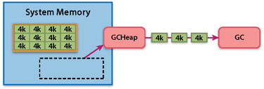

Figure 1. The GCHeap allocates memory from the OS, breaks it into 4K pages, and
gives it to the GC.

The GC then uses those 4K pages to provide memory for objects up to 2K in size
in the system.

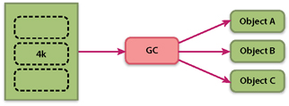

Figure 2. 4K pages are allocated to objects smaller than 2K by the GC

For objects larger than 2K (bitmaps, videos, files, etc.), GCHeap provides
groups of contiguous 4K blocks to a large memory allocator.

When almost all of the 4K pages in a large chunk are allocated, Flash Player
runs garbage collection to reclaim unused memory before the GCHeap attempts to
allocate more memory from the OS. In other words, garbage collection is only
triggered by memory allocations. This fact is important to remember during
testing and profiling because it means that the memory usage of an idle
application will never change.

### Heap and stack

The heap is the memory allocated for any object created or initialized at
runtime. Objects on the heap exist until they are garbage collected.

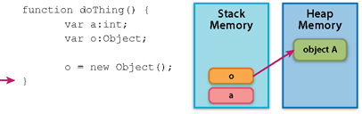

Figure 3. Object A exists on the heap. It is referenced by the local variable o
which is on the stack.

The stack is memory that stores all variables that are defined at compile time.
Stack memory is used and reused in a sequential manner. Push adds something to
the top of the stack. Pop removes something from the top of the stack. The only
way to access something in the middle of the stack is to remove all of the
things above it.

Local method variables, arguments, and information about where to return when a
method is complete are pushed onto the stack as the methods run. Changes to the
stack occur very quickly. Stack references to objects tend to be very temporary.
Those references to objects may exist on the stack, but the memory allocated to
those objects comes from the heap.

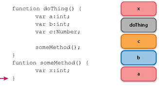

Figure 4. Local variables are pushed to the stack as they are defined.
Information about where to return after a method completes is also pushed onto
the stack.

### Flash Runtime garbage collection implementation

Flash Player and AIR use a combination of deferred reference counting and
conservative mark-and-sweep.

#### Deferred reference counting

In deferred reference counting, a distinction between heap and stack references
exists. Because the stack changes so quickly and tends to include references
that are very temporary, reference counting is not performed on stack
references. Reference counts are maintained for references on the heap.

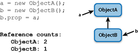

Figure 5. Objects keep track of how many references they have.

Each object on the heap keeps track of the number of things pointing to it. Each
time you create a reference to an object, the object's reference count is
incremented. When you delete a reference, the object's reference count is
decremented. If the object has a zero reference count (nothing is pointing to
it), it is added to the Zero Count Table (ZCT). When the ZCT is full, the stack
is scanned to find any references from the stack to an object on the ZCT. Any
object on the ZCT without a stack reference is deleted.

One of the problems of deferred reference counting is circular references. If
ObjectA and ObjectB refer to each other but no other objects in the system point
to them, they will never have a zero reference count and will therefore never be
eligible for garbage collection using reference counting. This is where mark and
sweep garbage collection helps.

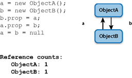

Figure 6. Object A and Object B refer to each other but have no other
references.

#### Mark/Sweep

Applications that run in Flash Player or AIR have multiple GCRoots. You can
think about a GCRoot as the trunk of a tree with the objects of the application
as the branches. The Stage is a GCRoot. Loaders are GCRoots. Certain menus are
GCRoots. Every object that is still in use by the application is reachable from
one of the GCRoots within the application. GCRoots are never garbage collected.

Every object in an application has a "mark bit." When the Mark phase of garbage
collection begins, all of those mark bits are cleared. The MMgc keeps track of
all GCRoots in the application. The garbage collector starts from those roots,
traces through each object and sets the mark bit for every object it reaches.
Any object that is no longer reachable from any of the roots is no longer
reachable from anywhere in the application – its mark bit does not get set
during the Mark phase. Once the collector is done marking all of the objects it
finds, the Sweep phase begins. Any object that doesn't have a set mark bit is
destroyed and its memory reclaimed.

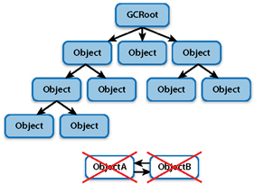

Figure 7. Objects in a circular reference have not been marked.

Figure 7 shows that every reachable object from a GCRoot has its mark bit set
(blue). The two objects (ObjectA and ObjectB) caught in a circular reference are
not reachable from a GCRoot. Their mark bits will not be set. Therefore even
though they do not have a zero reference count, these two objects will be
garbage collected.

#### Weak references

Flash Player can also maintain something called a 'weak reference' to certain
types of objects. A weak reference is a reference that is invisible to the
normal tracing procedure (the process of following all roots to find reachable
objects) of the garbage collector.

When you instantiate a new Dictionary, you can indicate that you want it to hold
onto the keys of the Dictionary weakly.

    var d:Dictionary = new Dictionary( true );
    d[ someObject ] = someValue;

You can also set the `useWeakReference` parameter of the `addEventListener()`
function to true when adding an event listener.

    obj.addEventListener( "type", handler, false, 0, true );

In both cases, you are asking Flash Player to keep a reference between two
objects but to keep that reference in a weak way. Practically this means that
this particular reference won't be followed during marking.

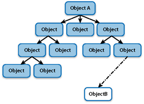

Figure 8. A weak reference is not traced during marking.

In this case the only path to Object B is weak. It will not be travelled during
tracing and hence Object B is not marked and will be collected. However, if
there is another strong path to ObjectB, Object B will be marked and will
persist.

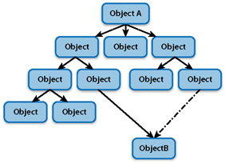

Figure 9. Objects with strong references will be found during tracing and
marked.

You should always clean up unused references by removing unused items from
dictionaries and by using `removeEventListener()` . However, there are some
times when cleaning up unused references is impractical or impossible. One such
time is when your class is instantiated and destroyed without your knowledge –
item renderers are used in this way. In these cases, maintaining weak references
to the objects will allow Flash Player to eventually remove them and reclaim the
memory.

#### Conservative collection

The MMgc is considered a conservative collector for mark/sweep. The MMgc can't
tell if certain values in memory are object pointers (memory addresses) or a
numeric value. In order to prevent accidentally collecting objects the values
may point to, the MMgc assumes that every value could be a pointer. Therefore,
some objects that are not really being pointed to will never be collected and
will be considered a memory leak. Although you want to minimize memory leaks to
optimize performance, the occasional leaks that result from conservative GC tend
to be random, not to grow over time, and have much less of an impact on an
application's performance than leaks caused by developers.

### Incremental collection

Unfortunately garbage collection can cause Flash Player to pause periodically as
the process completes. This pause is proportional to the amount of memory the
application is currently using. It can be longer than desired and can be
observable in some programs.

The Mark phase is the most time intensive part of the garbage collection
process. Due to this fact, the marking process has been incrementalized using a
work queue and a tri-color algorithm. The queue maintains the marking state
between marking increments.

**Table 1.** Tri-color algorithm

|     |     |
| --- | --- |

|
 | Black objects have been marked and are no longer in
the queue. | |
 | Gray objects are in the queue and have not yet been
marked. | |
 | White objects are neither marked nor in the queue.
|

At the beginning of the Mark phase, all GCRoots are pushed onto the queue and
become gray.

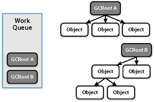

Figure 10. GCRoots become gray when pushed into the work queue.

As the Mark process continues, marked objects become black and are removed from
the work queue.

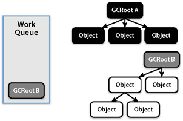

Figure 11. Marked objects are black and no longer in the work queue.

This process continues without problems until a new object (white) is added to a
black object. When that happens, the white objects would never have their mark
bit set because their GCRoot has already been marked. Without their mark bit
set, they will be garbage collected during the Sweep phase.

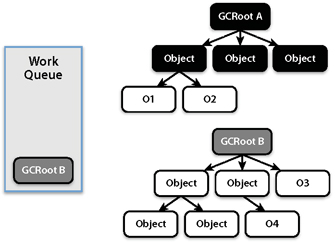

Figure 12. New objects are added to previously marked objects.

To prevent this problem, a write barrier is used within MMgc to force any white
object that gets added to a black object onto the work queue immediately.

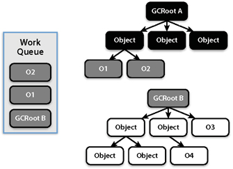

Figure 13. New objects added to previously marked objects are immediately added
to the work queue.

By using the work queue and the tri-color algorithm, the Mark phase can be
started and stopped to help prevent large, unwanted garbage collection pauses.

### Imminence

The Mark phase may be the most time intensive part of the garbage collection,
but actually emptying the trash – reallocating freed memory – takes time too.
Reallocation can also cause the application to pause. How close the garbage
collector is to finishing the Mark phase and beginning Sweep (reallocation) is
called imminence.

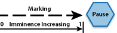

Figure 14. Imminence

`public static function pauseForGCIfCollectionImminent(imminence:Number = 0.75):void`
is a new method in Flash Player 11 and AIR 3 that allows you to advise garbage
collector that it's a good time to both complete the marking and perform
collection
([API entry in the ActionScript Reference](<https://help.adobe.com/en_US/FlashPlatform/reference/actionscript/3/flash/system/System.html#pauseForGCIfCollectionImminent()>)).
Scheduling potential pauses for times when the user won't notice them makes for
a better user experience. For example, a game might call this function upon the
completion of a level in a game, thus reducing the chances of a pause occurring
during gameplay.

The imminence value you pass to this method is compared to where the garbage
collector is in the Mark phase. If the value you pass it is smaller than the
collector's imminence value, Mark and Sweep will finish synchronously and cause
the application to pause. The garbage collector must be at least 25% of the way
through the process before recognizing this request to pause for collection.
Passing a small value (although greater than .25) will most likely force
collection and cause the application to pause. Passing a larger value tells the
garbage collector to finish collection only if it was going to happen soon
anyway.

### Where to go from here

Understanding how memory management and garbage collection work in Flash Player
and AIR will help you optimize your code and develop better performing
applications. Check out Michael Labriola's presentation on garbage collection
[Talking Trash](https://web.archive.org/web/20140406204426/http://www.digitalprimates.net/author/codeslinger/2011/10/11/talking-trash-an-overview-of-player-gc/).
Read Christian Cantrell's
[Providing Hints to the Garbage Collector in AIR 3](https://web.archive.org/web/20140406204426/http://blogs.adobe.com/cantrell/archives/2011/10/providing-hints-to-the-garbage-collector-in-air-3.html).
You can also read a detailed discussion of the
[MMgc](https://web.archive.org/web/20140406204426/https://developer.mozilla.org/en/MMgc)
that includes a description of the underlying C++ code.
