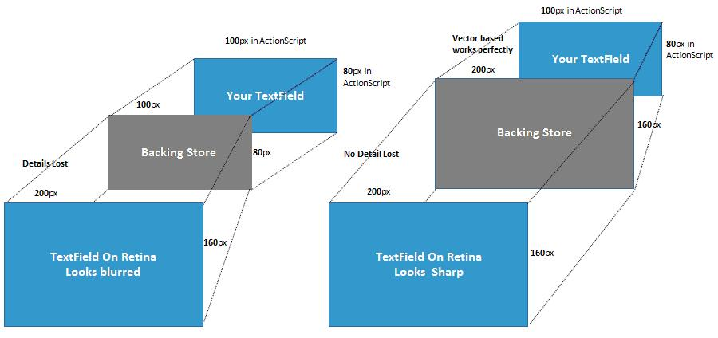

# Creating and using high resolution images in Flash Player

by Ruiyi Luo

## Content

- [Background: HiDPI support in Flash Player 11.2 and later](#background-hidpi-support-in-flash-player-112-and-later)
- [Problem: Blurred bitmaps in Flash on Retina Display](#problem-blurred-bitmaps-in-flash-on-retina-display)
- [Using high resolution images in Flash Player](#using-high-resolution-images-in-flash-player)
- [Creating high resolution images from vector based display objects](#creating-high-resolution-images-from-vector-based-display-objects)
- [Additional information: BitmapData](#additional-information-bitmapdata)

## Requirements

### Prerequisite knowledge

A basic understanding of the Apple’s HiDPI resolution (more), especially
application’s magnified mode and framework-scaled mode (more). Experience
working with ActionScript. Familiarity with Bitmap, and BitmapData.

### User level

Intermediate

### Required products

- [Adobe AIR SDK](https://airsdk.dev/) or
  [Apache Flex SDK](https://flex.apache.org)
- Flash Builder or Adobe Animate (formerly Flash Professional)

Retina Display for Mac has been increasing in popularity. Only high resolution
images suit the high density pixels display resolution of the Retina Display.
This article describes how to use a high resolution version of an image in
Flash, on a Mac Retina Display. You can also learn how to create a high
resolution version of an image from Flash vector based display objects.

### Background: HiDPI support in Flash Player 11.2 and later

Note the following before you begin:

- High resolution, HiDPI, and Retina Display all mean the same.
- A high resolution image is no different from a standard-resolution image,
  except that it has more pixels.
- On a Retina Display, there are four on-screen pixels for each point
  ([more](https://developer.apple.com/library/mac/documentation/GraphicsAnimation/Conceptual/HighResolutionOSX/Optimizing/Optimizing.html)).
  For a standard-resolution image sized at 50\*50 pixels, the high-resolution
  version must be sized at 100x100 pixels.

In versions earlier than 11.2, Flash Player is a standard-resolution application
on Mac OS X, and runs in magnified mode on OS X’s Retina Display. This means
that the content displayed in the Flash Player is automatically magnified by OS
X on it, as more pixels for the Retina Display’s high pixel density—pixels are
smaller and there are more of them per unit area.  However, the
auto-magnification by OS X causes all the display objects such as the Text and
vector circles to look pixelated in the Flash Player. The pixilation occurs
because the OSX, unlike Flash Player, is unable to take each applications
internal details into account.

Beginning 11.3, the enhanced Flash Player supports HiDPI resolution
([more](https://web.archive.org/web/20170906034810/http://blog.kaourantin.net/?p=176)).
It becomes a high-resolution-savvy application and runs in the framework-scaled
mode on OS X’s Retina Display. Flash Player no longer relies on
auto-magnification by OS X, instead, its rendering engine generates 2\*2 times
pixels for stage and display objects to OS X’s backing store. This means that an
ActionScript pixel (or point in OS X) results in generation of 2×2 screen pixels
by Flash Player on a Retina Display. As seen in Figure 1, for an ActionScript
defined 100px \* 80px TextField, Flash Player renders out a 200px \* 160px one
to OS X’s backing store on Retina Display as opposed to a 100px\*80px one with
the OS X’s auto-magnification in the previous versions. This process is
transparent to the end user and the vector based display objects work perfectly
as the Flash rendering engine can emit the exact pixel for each physical pixel
needed by the Retina Display. The vector based objects thus have a higher
quality on the Retina as seen in Figure 2.

Figure 1: To the left is auto-magnification by OSX and to the right is
generating enough pixels by Flash Player

Figure 2: To the left is a vector-based circle on Flash Player versions before
11.2 and to the right is the same circle on Flash version 11.2.

### Problem: Blurred bitmaps in Flash on Retina Display

For bitmapped images, their bitmap display objects are also magnified by the
Flash rendering engine for Retina Display (using an interpolation algorithm).
However, unlike the vector based display object, bitmapped images can’t always
be magnified without loss of clarity, as images need more real pixel than be
generated by an algorithm. Though the images sizes are accurate, magnification
leads to loss of clarity. Applications need to provide high-resolution versions
of images for the best user experience.

The next section describes how to load and use a high resolution image in Flash.
The basic principle being to load a high-resolution image and stop its
magnification process by Flash Player on the Retina Display.

### Using high resolution images in Flash Player

With the `contentsScaleFactor` property which was introduced in version 11.2,
you can load a high resolution image as and when needed. This section describes
the principle behind the use of the `contentsScaleFactor `property. You may need
to go back to the background section for all the details.

**Alternative load a high resolution image via contentsScaleFactor property**

Flash Player now includes the
[Stage.contentsScaleFactor](https://help.adobe.com/en_US/FlashPlatform/reference/actionscript/3/flash/display/Stage.html#contentsScaleFactor)
property that indicates whether the Stage is on a HiDPI display or not. You can
use this property in your code to decide  whether to load a high resolution
image in the Retina mode, or a regular version in the standard mode. See the
next section for a demonstration.

**Scale the high resolution image’s ActionScript size on Retina**

After the high resolution image for Retina is loaded, scale it twice, both in
width and height before adding it to stage on the Retina Display. Following is
the code snippet:

    bitmap = new Bitmap(bmp.bitmapData);
    bitmap.height /= 2.0;
    bitmap.width /= 2.0;
    addChild(bitmap);

You can also refer to the complete code for auto-loading a high resolution
version of an image on the Retina Display. You need two corresponding version
images to try it. The image on the left, in Figure 3, illustrates the effect
achieved with the method while the right one illustrates how the high resolution
image(loaded without the method) is twice as large and is blurred.

    const IMAGE_HD_URL:String = "LOG_HD.png";
    const IMAGE_NM_URL:String = "LOG_NM.png";

    var ldr:Loader = new Loader();
    ldr.contentLoaderInfo.addEventListener(Event.COMPLETE, ldr_complete);
    if(stage.contentsScaleFactor == 2)
    {
        ldr.load(new URLRequest(IMAGE_HD_URL));
    }else{
        ldr.load(new URLRequest(IMAGE_NM_URL));
    }

    var bitmap:Bitmap;

    function ldr_complete(evt:Event):void {
        var bmp:Bitmap = ldr.content as Bitmap;
        bitmap = new Bitmap(bmp.bitmapData);

        if(stage.contentsScaleFactor == 2)
        {
            bitmap.height /= 2.0;
            bitmap.width  /= 2.0;
        }

        bitmap.x = 50;
        bitmap.y = 50;
        addChild(bitmap);
    }

Figure 3: High resolution image using the method(left) vs. loading the same
image without the method (right).

**Why it works**

This approach works because it neutralizes the magnification process described
in the background on Retina Display. Considering that there is an inherent
matrix inside each display object and there also exists a camera matrix in Flash
Player, to generate more pixels on the Retina Display, the camera matrix
instructs the rendering engine to render out an area with width and height
doubled for each display object. However, when you set
`bitmap.height /= 2.0; bitmap.width /= 2.0;` in your ActionScript code, the
bitmap display object’s inherent matrix tells the rendering engine that both the
width and height need to be scaled twice. Both effects are neutralized before
the Flash Player rendering engine starts to work. Finally, each high resolution
image’s pixel corresponds to the psychical screen pixel, no scaling
(interpolation) is performed, and a sharp image is displayed on the screen.

### Creating high resolution images from vector based display objects

Sometimes you may want to draw high resolution images from display objects. This
sections describes a simple method that only works well for vector-based display
objects as bitmap-based ones can never have a perfect magnification.

**Using Matrix parameter to generate more pixels**

In Flash, you can also draw a high resolution version image from a vector based
display object in any display solution in Flash. Use the matrix parameter in
`BitmapData.draw()`. Following is the code snippet:

`var myBitmapData:BitmapData = new BitmapData(tf.height*2, tf.width*2);`

`var mat:Matrix = new Matrix(2.0, 0, 0, 2.0, 0, 0);`

`myBitmapData.draw(tf,mat,null,null,null,true);`

Following is a workable demo, which draws a high resolution version of an image
using `BitmapData.draw()` from `TextField` and adds the `BitmapData `drawn to
stage.

    // BitmapData.draw() from TextField and adds the BitmapData drawn to stage.
    import flash.display.Bitmap;
    import flash.display.BitmapData;
    import flash.text.TextField;
    import flash.text.TextFormat;
    import flash.geom.Matrix;

    var tf:TextField = new TextField();
    var fmt:TextFormat = new TextFormat();
    fmt.size = 30;
    tf.text = "TextField";
    tf.border = true;
    tf.x = 10;
    tf.y = 10;
    tf.backgroundColor = 0x00f0f0;
    tf.setTextFormat(fmt);
    tf.background = true;
    this.addChild(tf);

    // Draw the TextField to BitmapData. Auto draw a HiDPI version image on Retina.
    var myBitmapData:BitmapData;
    if(stage.contentsScaleFactor == 2)
    {
        myBitmapData = new BitmapData(tf.width*2, tf.height*2);
        var mat:Matrix = new Matrix(2,0,0,2,0,0);
        myBitmapData.draw(tf,mat,null,null,null,true);
    }else{
        myBitmapData = new BitmapData(tf.width, tf.height);
        myBitmapData.draw(tf,mat,null,null,null,true);
    }

    // Add it to Stage. If on Retina, use the HiDPI image.
    var bmp:Bitmap = new Bitmap(myBitmapData);
    if(stage.contentsScaleFactor == 2)
    {
        bmp.height /= 2;
        bmp.width  /= 2;
    }
    bmp.x = 10;
    bmp.y = 150;
    addChild(bmp);

**Why it works**

If you set `mat = {2.0;0;0;2.0;0;0}` in `myBitmapData.draw(tf,mat…)`, the Flash
Player rendering engine feeds the BitmapData with pixels doubled in both width
and height, which is exactly what the high resolution image is defined. Note
that the draw-to-BitmapData process is not affected by the camera matrix
described before as it is not related to the display on screen. This means that
the approach works irrespective of whether your screen is a high resolution one
or not. Ensure that you have allocated the right space for your BitmapData.

### Additional information: BitmapData

[BitmapData](https://help.adobe.com/en_US/FlashPlatform/reference/actionscript/3/flash/display/BitmapData.html)
is a class that you can use to work with the data (pixels) of a Bitmap object.
Note that it is in no way related to the display resolution. It is a class
stored data, that is, the operations on each pixel data can be performed in a
similar manner irrespective of whether it is a Retina Display or not.

### Where to go from here

This article describes a simple method to use and create high resolution image
for better user experience. Though very simple, it works well with the Flash
Player’s inherent rendering workflow. It is difficult for Flash Player to
provide an API change like Apple’s native API NSImage, because for most SWF
contents, they load the image via the internet, and the potential doubled
network request will have an undesirable impact on performance.

Check out Tinic Uro‘s article,
[HiDPI support coming to Flash Player](https://web.archive.org/web/20170906034810/http://blog.kaourantin.net/?p=176),
for more information about Retina Display support in Flash Player.
