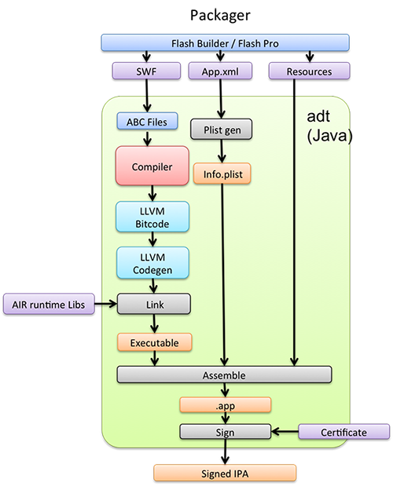
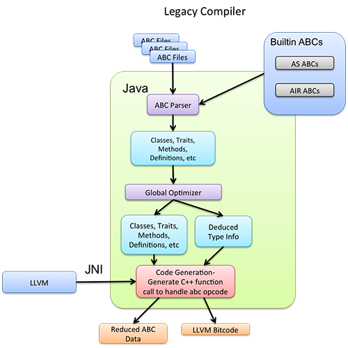
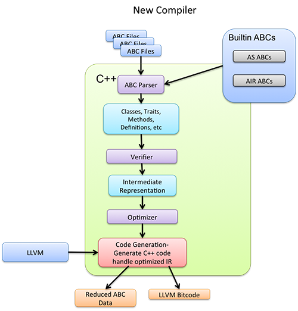
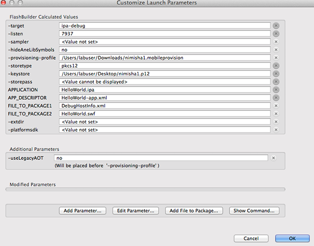
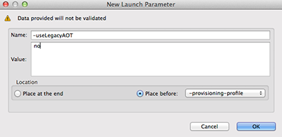
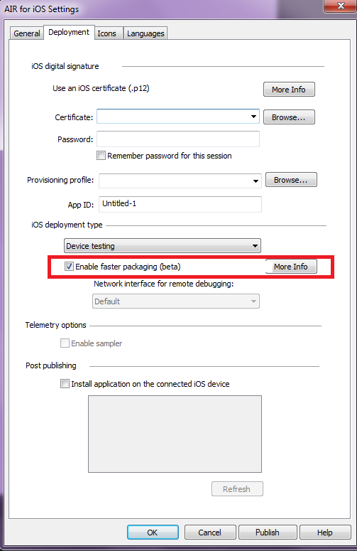
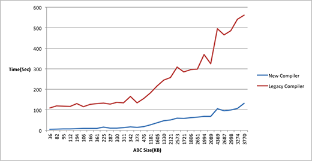
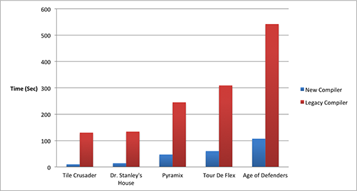

# Faster compiling with AIR for iOS

by Philomena Dolla

by Nimisha

by Govinda Gupta

## Content

- [Introduction](#introduction)
- [Compiled Mode Overview](#compiled-mode-overview)
- [Using the New Compiled Packaging Mode](#using-the-new-compiled-packaging-mode)
- [Results](#results)
- [Known Issues](#known-issues)

## Requirements

### User level

All

### Required products

- [Adobe AIR SDK](https://airsdk.dev/) or
  [Apache Flex SDK](https://flex.apache.org)

### Introduction

AIR applications for iOS can be packaged either by using the Fast packaging
(interpreted mode) or the Standard (compiled mode) options. The interpreted
mode, which is primarily employed for debugging, is faster than the compiled
mode. Though most development and testing can be performed using the interpreted
mode, run-time performance is achieved only in the compiled mode. Developers
publishing applications to the Application Store use the compiled mode for
better performance. The increased time required for packaging in the compiled
mode, however, is often undesirable.

AIR introduces a re-designed compiled packaging mode, which aims to considerably
reduce packaging time, for the same performance experience at run time. The beta
version of the re-designed compiler is currently available to all developers.

**Note**: From AIR SDK version 16.0 onwards, the legacy compiler will not be
supported and only the new compiler will be supported. As a result,
`-useLegacyAOT` switch will not be honored anymore.

### Compiled Mode Overview

When packaging an AIR application for iOS:

1.  The developer’s SWF file is parsed to extract the _Action Script Bytecode_
    (abc) chunks.
2.  The _abc_ content is then analyzed and each AS function is translated to the
    respective native function using the
    [LLVM API](https://llvm.org/docs/LangRef.html).
3.  An object file for the target platform is generated with the help of _LLVM
    code generation_.
4.  An executable file is then created by linking the object files with AIR
    Runtime libraries.

The iOS platform does not support loading executable code, dynamically. This
limitation, however, allows the AIR packager to employ optimization techniques
that increase run-time performance. This optimization is possible because the
entire code is available at compile time. See Figure 1 for an illustration of
the AIR application packaging in the compiled mode.

Figure 1. Packager.

#### Legacy compiler v/s New compiler

The new compiler is built on top of the Action Script virtual machine. Following
is a comparison of the re-designed compiler and the legacy compiler.

|                                                                                                    |                                                                                                                               |
| -------------------------------------------------------------------------------------------------- | ----------------------------------------------------------------------------------------------------------------------------- |
| **Legacy Compiler**                                                                                | **New Compiler**                                                                                                              |
| Developed using Java, and interacted with _LLVM_ using _JNI_ thus affecting performance adversely. | Developed using C++ and shares most of its code with the virtual machine.                                                     |
| Generates a function call for each _abc opcode._                                                   | Converts the _opcodes_ into SSA based _IR_ (intermediate representation) and generates the optimized IR.                      |
| Compiles _built-in library_ every time an application is packaged.                                 | Performs incremental compilation which means that the built-in library is compiled only once and is shipped with the AIR SDK. |

See Figures 2 and 3 for an illustration of the changes in the re-designed
compiler.

Figure 2. Legacy Compiler.

Figure 3. New Compiler.

### Using the New Compiled Packaging Mode

In **AIR 14**, you can use any of the following methods to start using the new
compiler.

#### Command Prompt

To start using the new compiler for packaging your IPA, use the –useLegacyAOT
argument and set its value to _no_:

    <AIR SDK>/bin/adt -package -target ipa-app-store -useLegacyAOT no -provisioning-profile abc.mobileprovision -storetype pkcs12 -keystore abc.p12 HelloWorld.ipa HelloWorld-app.xml HelloWorld.swf

#### Flash Builder

To use this feature in Flash Builder 4.7:

1\. Click _Project **\>** Debug/Run **\>** Debug Configurations/Run
Configurations_.

2\. Click _Customize Launch_ in the _Debug Configurations_ dialog box.  
The _Customize Launch Parameters_ window displays all the arguments passed to
ADT along with their respective values. See Figure 4.

Figure 4. Customize Launch Parameters

3\. Click _Add Parameter_ to add a new argument for the new compiler.

4\. Type -_useLegacyAOT_ in the name field and _no_ in the value field. Place
the new argument before the _-provisioning-profile_ argument. Click _OK_ to save
the new launch parameter. See Figure 5.  
The new launch parameter is now displayed in the _Customize launch_ window.

Figure 5. New Launch Parameter.

5\. Click _OK_ to save the _Debug/Run configuration_. Packaging now takes place
with the new compiler.

#### Flash Pro

This feature is available in Flash Pro CC 2014 and later. When packaging for
iOS, select _Enable faster packaging_ to enable `-useLegacyAOT no`.

**Beginning AIR 15.0**, the new compiler packaging mode is the default packaging
mode. This means that for all the AOT targets like ipa-app-store, ipa-test,
ipa-ad-hoc, and ipa-debug, the new compiler is used for packaging. You need not
use the `–useLegacyAOT` switch to use the new compiled packaging mode.

Note: If you want to use the legacy compiled packaging mode, use the
`–useLegacyAOT` switch with value _yes_ at the command prompt, or in Flash
Builder while packaging IPA.

### Results

The New compiler considerably reduces packaging time for the same performance
experience at run time.

#### Packaging time

Figure 6 and 7 illustrate how the new compiler is nearly 5 - 20 times faster
than the old compiler. For smaller applications the gain is mainly due to the
pre-compiled built-in library.

Figure 6

Figure 7

#### Run-time performance

You should not experience any major change in the run-time performance for
applications packaged with the new compiler.

Please report any issues you experience with run-time performance, to Adobe.

### Known Issues

The New compiler functionality is available as a Beta version. Though it works
for most applications, you may experience some issues with stability. For more
information, see [Known Issues](../../../kb/air/air-compiler-known-issues.md).
