# Signing Adobe AIR applications

## by Mihai Corlan

## Content

- [Why sign an application?](#why-sign-an-application)
- [Where to get a certificate](#where-to-get-a-certificate)
- [Procuring a certificate from Thawte](#procuring-a-certificate-from-thawte)
- [Signing desktop applications with Flash Builder 4.5](#signing-desktop-applications-with-flash-builder-45)
- [Signing desktop applications with Flash Professional CS5.5](#signing-desktop-applications-with-flash-professional-cs55)
- [Signing desktop applications with Dreamweaver CS5.5](#signing-desktop-applications-with-dreamweaver-cs55)
- [Signing desktop applications with the AIR SDK](#signing-desktop-applications-with-the-air-sdk)
- [Signing native installer applications](#signing-native-installer-applications)
- [Signing apps for Android](#signing-apps-for-android)
- [Signing apps for BlackBerry Tablet OS](#signing-apps-for-blackberry-tablet-os)
- [Signing apps for iOS](#signing-apps-for-ios)
- [Where to go from here](#where-to-go-from-here)

## Requirements

### Prerequisite knowledge

Knowledge of Flash Builder, Flash Professional, Dreamweaver, or command line
operations is recommended.

### User level

Intermediate

### Required products

- [Adobe AIR SDK](https://airsdk.dev/) or
  [Apache Flex SDK](https://flex.apache.org)
- Flash Builder, Adobe Animate (formerly Flash Professional), or Dreamweaver

#### Additional required other products

- [Firefox 3.6 or later](https://www.firefox.com/)

**Note:** This is an updated and expanded version of an article originally
written by Todd Prekaski.

When you're ready to ship an Adobe AIR application, you'll be required to
digitally sign it for the Adobe AIR installer to install it to the user's
system. The Adobe AIR runtime runs with the same user privileges as native
applications, allowing local file system access, network operations, bitmap
manipulations, local data access, and so on. By requiring your application to be
signed, Adobe instills confidence in your customers because they can validate
the source of the application. Adobe offers a few different ways to build your
AIR applications using Adobe Flash Builder 4.5, Adobe Flash Professional CS5.5,
or Adobe Dreamweaver CS5.5. In this article I will show you how to sign your AIR
applications using these tools when targeting the desktop as well as Android,
BlackBerry Tablet OS, and iOS mobile devices.

### Why sign an application?

When users install your application, they're trusting you, as the developer, to
not create an application that behaves maliciously, for example, by accessing
financial data files, deleting local images, or sending e-mails to all your
contacts. Users want to feel confident that the software they're installing
comes from a reliable vendor (publisher), and that what they're installing
hasn't been modified since that vendor released it. As a developer, you may
build a great application and release it to the world. After it's released,
though, you don't really have any control over other people modifying the
application, injecting some malicious code, and then redistributing it. Users
should be aware that software they install from the web could have been tampered
with or created by an unreliable malware vendor.

The best way to instill confidence in the end user is by requiring developers to
digitally sign their applications with a security certificate from a trusted
third-party vendor, such as [ChosenSecurity](https://www.chosensecurity.com/),
[GlobalSign](https://www.globalsign.com/), [Thawte](https://www.thawte.com/), or
[VeriSign](https://www.verisign.com/), called a certificate authority (CA). All
AIR applications must be digitally signed in order for the AIR runtime to
install them on the user's machine. Digital signing has found its way into
virtually all commercial software development, whether you're dealing with a
mobile app, device drivers for a major operating system, desktop applications
from big publishers, or the AIR applications that you create. When users install
software, they want to know who really built it, where the code came from, and
whether it was modified since its release.

Digital signing also allows customers to verify the organizational affiliation
of the software's publisher. For example, I can't sign an application with
another company's certificate. This eliminates the possibility of building fake
applications. Otherwise spyware makers could easily create an application, name
it Photoshop.exe to make it look like it is from Adobe, and have it perform
unauthorized, unwanted actions on users' systems.

In summary, code signing builds customer confidence that what they're installing
was created by the named publisher, and that the code hasn't been changed since
that publisher signed it.

### Where to get a certificate

A developer can use any class-3, high-assurance certificate provided by any CA
to sign an Adobe AIR application. However, only ChosenSecurity, GlobalSign,
Thawte, and VeriSign come preinstalled on most end user's machines (including
Mac OS X or Windows).

**Note:** For a list of CAs and certificate formats, see the Adobe AIR
documentation for
[Flash](https://web.archive.org/web/20160425154121/http://help.adobe.com/en_US/AIR/1.5/devappsflash/WS5b3ccc516d4fbf351e63e3d118666ade46-7ff0.html),
[Flex](https://web.archive.org/web/20160425154121/http://help.adobe.com/en_US/AIR/1.5/devappsflex/WS5b3ccc516d4fbf351e63e3d118666ade46-7ff0.html),
and
[HTML](https://web.archive.org/web/20160425154121/http://help.adobe.com/en_US/AIR/1.5/devappshtml/WS5b3ccc516d4fbf351e63e3d118666ade46-7ff0.html)
developers.

The Adobe AIR runtime uses the operating system's keystore of trusted
certificates when installing applications. Whatever the OS trusts, AIR will
trust. Most likely your users will have a ChosenSecurity, GlobalSign, Thawte, or
VeriSign root certificate on their systems, which means your users will be able
to see the valid publisher when Adobe AIR attempts to install your app. In this
article, I'll assume that you're getting a certificate from Thawte as it
simplifies the process for the developer. Using certificate authorities other
than ChosenSecurity, GlobalSign, Thawte, or VeriSign is going to require that
the end user (not the developer of the software), or a system administrator
charged with managing a computer on an enterprise network, manually install a
root certificate for that certificate authority.

A developer may also self-sign an Adobe AIR application so they can test it, but
when the AIR runtime tries installing the application, it presents the user with
a an UNKOWN publisher warning (see Figure 1)–unless, of course, your user has
installed your self-signed certificate on his or her machine.

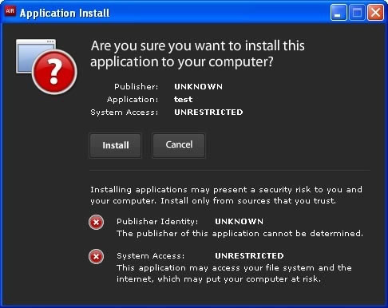

Figure 1. When installing an application with a self-signed developer
certificate the application is identified as being from an UNKNOWN publisher.

[ChosenSecurity](https://web.archive.org/web/20160425154121/http://www.chosensecurity.com/products/tc_publisher_id_adobe_air.htm),
[GlobalSign](https://web.archive.org/web/20160425154121/http://www.globalsign.com/developer/code-signing-certificate/index.htm),
[Thawte](https://web.archive.org/web/20160425154121/http://www.thawte.com/code-signing/index.html),
and
[VeriSign](https://web.archive.org/web/20160425154121/http://www.verisign.com/products-services/security-services/code-signing/digital-ids-code-signing/)
sell official Adobe AIR Developer Certificates on their websites. In the example
below, you're going to purchase a certificate from Thawte using the Firefox
browser, which is recommended for the process you're following here because it's
the easiest. Thawte offers certificates starting at about \$300 for one year.

**Note:** If you are familiar with security protocols, Java tools, and the
command line, there are other ways to get your Java certificate into the proper
format for signing an Adobe AIR application. You'll need the Java sign tools to
get the certificate and private key into the right format. Your goal is to end
up with a P12 file. Using the Java command line tools is beyond the scope of
this article. Using the Firefox method and Thawte is the simplest way to procure
a certificate, and you only have to do this once for the lifetime of your
certificate.

### Procuring a certificate from Thawte

Obtaining an official Adobe AIR Developer Certificate from Thawte is the easiest
way to get your code signed. For this example, I'll show you how to get a
certificate from Thawte using the Firefox web browser. When you use Firefox, the
purchased certificate is installed into the Firefox certificate manager where it
can be exported in a specific format required by all of the Adobe tools for
signing your Adobe AIR application.

1.  Go to the Thawte website, select Adobe AIR, specify the duration of your
    certificate and then click the red Buy button (see Figure 2).

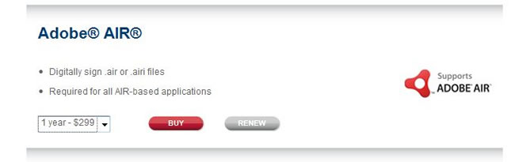

Figure 2. Starting the procurement process at Thawte's website for a certificate
to sign your Adobe AIR application.

2.  Follow the instructions on screen to provide your organizational
    information, website, and a password for managing your account.  
    When you complete the process Thawte will authenticate your organization and
    then request documentation from you. Be prepared to fax them information
    such as articles of incorporation, VAT certificates, partnership papers,
    fictitious name certificates, and so on. During this process they verify
    your identity and business association.  
    After organization verification is complete, Thawte will e-mail you
    instructions on how to retrieve the certificate. Again, be sure that you
    retrieve the certificate using Firefox since you're going to export the
    certificate from Firefox in a format needed by all the Adobe code signing
    tools.
3.  Open the link that you received from Thawte in the Firefox web browser and
    log into the Thawte website using the password you created when ordering the
    certificate.
4.  Click Fetch certificate. Thawte will automatically install the certificate
    you purchased from them into your Firefox certificate manager.  
    Now that Thawte has installed your certificate into Firefox, it's time to
    export it for use in Adobe tools.
5.  In Firefox, choose Tools \> Options, click Advanced, and then click the
    Encryption tab (see Figure 3).

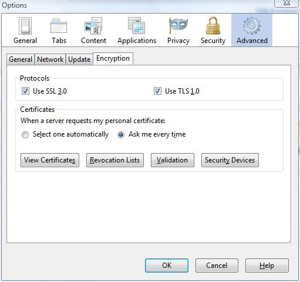

Figure 3. The Firefox Options dialog box.

6.  Click View Certificates (see Figure 4).

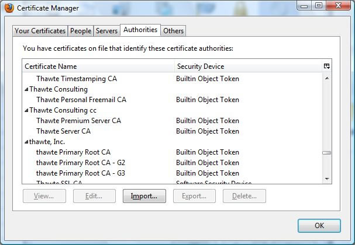

Figure 4. The Firefox certificate manager.

7.  Locate and select the certificate you purchased from Thawte, and then click
    Export. Firefox will save your certificate and private key in a P12 file
    (PKCS12 format), which will be required for signing from either the ADT
    command line tool in the Flex 4.5 SDK, Flash Builder 4.5, Dreamweaver CS5.5,
    or Flash CS5.5.

    **Note:** You may be required to change the file name extension to .pfx,
    depending on the toolset you're signing with.

8.  Specify the directory and name for the  file. Use a name that you'll
    remember later. I put mine in
    c:\mydev\certificates\air_cert.p12.

9.  You'll be prompted to create a password for your certificate and private key
    (see Figure 5); type it twice.

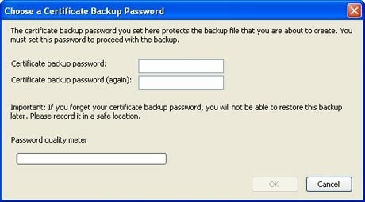

Figure 5. Create a password to protect your certificate and private key.

10. Click OK. After Firefox exports your certificate, you are ready to start
    signing your Adobe AIR applications.

### Signing desktop applications with Flash Builder 4.5

Flash Builder makes it easy to sign your AIR applications.

1.  Right-click the project in the Package Explorer and choose Export \> Flash
    Builder \> Release Build.
2.  In the Export Release Build wizard, specify the file name of the AIR file
    that will be created and the path for that file (if you leave the path
    empty, the AIR file will be created in the root folder of your project).
3.  Select Signed AIR Package (see Figure 5) and click Next.

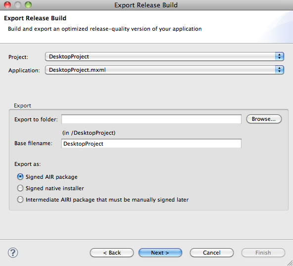

Figure 6. The Flash Builder Export Release Build wizard.

4.  Next, you'll need to provide the path to your certificate.
5.  If you don't have a certificate and you want to use a self-signed
    certificate, then click Create. In the Create Self-Signed Digital
    Certificate dialog box, type the Publisher name and password, fill out any
    other information you want to include, and click OK (see Figure 7).

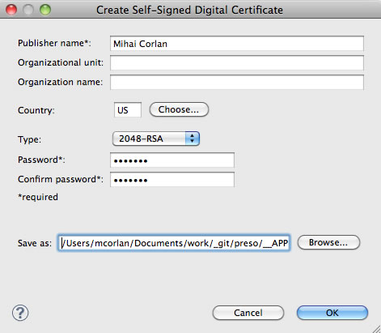

Figure 7. Generating a self-signed certificate using Flash Builder 4.5

6.  Assuming you have a certificate from Thawte or another CA, type the path to
    the certificate file (or browse to it) and type its password (see Figure 8).

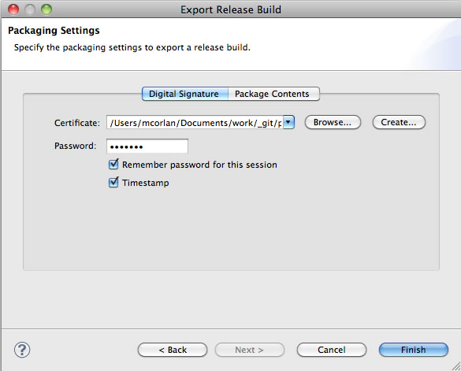

Figure 8. Specifying the certificate in the Export Release Build wizard.

7.  Click Finish.

Flash Builder will generate your AIR file.

### Signing desktop applications with Flash Professional CS5.5

You can also create signed AIR applications using Flash Professional CS5.5. When
you are ready to sign your application, follow these steps:

1.  Choose File \> Publish.
2.  In the AIR Settings dialog box, select the Signature tab (see Figure 9).
3.  Type the path to your certificate (or navigate to it) and type the password.

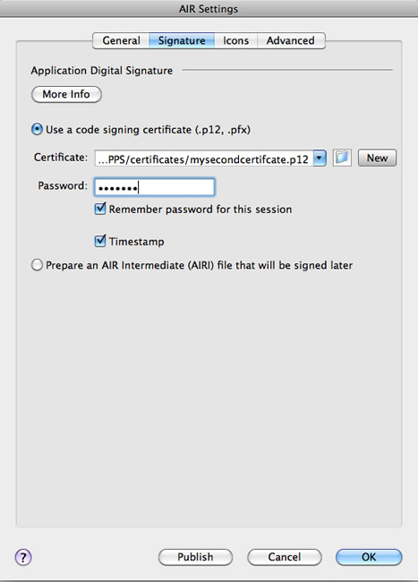

Figure 9. Specifying the certificate in Flash.

**Note:** If you don't have a certificate and you want to use a self-signed
certificate click New Then fill in all the fields, choose a name and a location
for the certificate (see Figure 10), and click OK. You should see a confirmation
window saying the certificate was created.

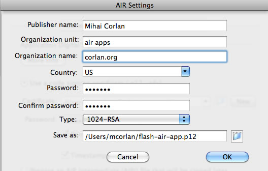

Figure 10. Generating a self-signed certificate in Flash.

4.  When you are ready to publish, click Publish.

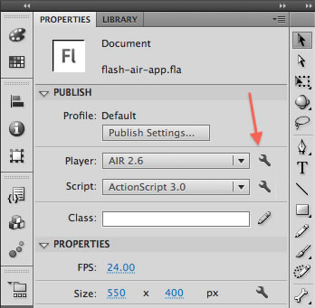

Figure 11. Accessing the AIR Settings dialog box.

### Signing desktop applications with Dreamweaver CS5.5

If you created your AIR app using HTML, CSS, and JavaScript then most likely
you've been using Dreamweaver.

**Note:** To enable support for AIR applications in Dreamweaver you have to
download and install the
[Adobe AIR extension for Dreamweaver](https://web.archive.org/web/20160425154121/http://www.adobe.com/products/air/tools/ajax/).

Follow these steps to create a signed AIR application in Dreamweaver:

1.  Choose Site \> AIR Application Settings (see Figure 12).

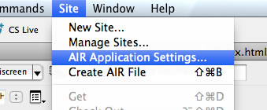

Figure 12. Choosing AIR Application Settings in Dreamweaver.

2.  In the AIR Application and Installer Settings dialog box, fill in the
    required information, including File Name, ID, and Initial Content.
3.  Click the Set button next to Digital Signature: AIR Package Will Be Signed
    With (see Figure 13).

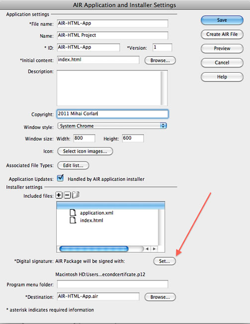

Figure 13. The AIR Application and Installer Settings dialog box.

4.  In the Digital Signature dialog box, specify the location of your
    certificate and type the password.

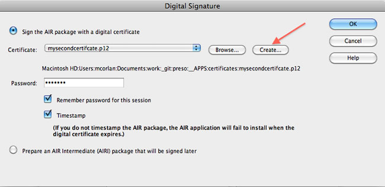

Figure 14. Specifying the certificate.

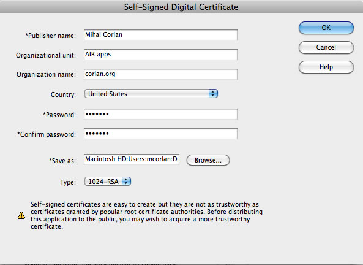

Figure 15. Creating a self-signed certificate in Dreamweaver.

5.  When you are ready to create the signed application, click Create AIR File
    from the AIR Application and Installer Settings dialog box. If you've
    previously specified settings for your certificate, you can choose Site \>
    Create AIR File directly. After a few seconds you should see a confirmation
    (see Figure 16).

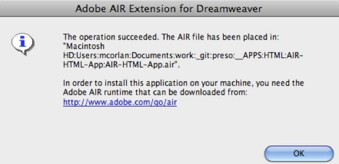

Figure 16. Confirming the AIR file has been created.

### Signing desktop applications with the AIR SDK

If you prefer working with command line tools, then you can use the ADT command
line tool from the AIR SDK to generate the certificate and sign your
application.

If you don't have a certificate from a CA and you want to use a self-signed
certificate, you can create one using ADT. Here is an example, which you can
execute at the command line in a Console or Terminal window:

    adt -certificate -cn YourNameOrCompanyOrAnythingYouWant 1024-RSA certificate_name.p12 certificate_password

For the `–cn` parameter you should set your name or company name. Don't forget
the password you set (in this example, it is `certificate_password`). You will
need it later. After executing this command you should have a certificate named
certificate_name.p12 in the directory in which you executed the command. (You
can specify an absolute path together with the certificate name if you want to
create the file in a different folder.)

When you are ready to package and sign your application, you can use the
following command:

    adt -package -storetype pkcs12 -keystore PATH_TO_YOUR_CERTIFICATE/certificate_name.p12 -storepass certificate_password YOUR_APPLICATION_NAME.air YOUR_APPLICATION_NAME-app.xml YOUR_APPLICATION_NAME.swf

Note that in the command above that you have to specify at least:

- the name of the AIR file that will be created
- the name of the application descriptor file
- the name of the SWF file

In this example, the command is meant to be run inside the folder that contains
these three resources are. If you want to add additional resources to the
package, such as icon images, just add the file names at the end of the command.

**Note:** To compile your application and obtain the SWF file you can use the
mxmlc application from the command line.

### Signing native installer applications

Starting with AIR 2 you can create native installers for your AIR application:
EXE files for Windows, DMG files for Mac OS, and DEB or RPM for Linux. This is
required if you want to communicate with other processes using the NativeProcess
class. The first thing you should know is that the signing process must take
place on the same platform as the native installer you are creating. For
example, if you want to create an EXE AIR application, then you have to do it on
a Windows machine. Likewise, if you want a DMG file, you have to package the
application on a Mac.

You can create native installers using the command line tool (ADT), Flash
Builder 4.5, or Flash Professional CS5.5.

In this section I won't explain the whole process for each method; see the
preceding sections for a more detailed description of the necessary steps.
Instead I will point out the differences when signing a native installer
application.

#### Using Flash Builder

1.  In Flash Builder (as before) right-click the project in Package Explorer and
    select Export \> Flash Builder \> Release Build.
2.  In the Export Release Build wizard, make sure you select the second option
    (Signed Native Installer) from the Export As section (see Figure 17).
3.  Follow the remaining steps in the wizard to create a native installer for
    the platform on which you are running Flash Builder.

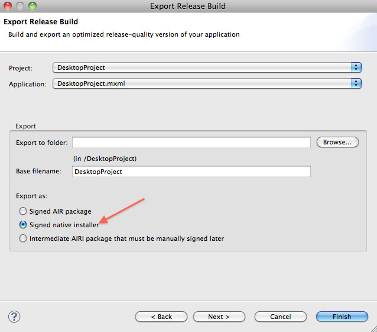

Figure 17. Selecting the native installer option in Flash Builder 4.5.

#### Using Flash Professional CS5.5

To create a native installer using Flash Professional CS5.5, start by opening
the AIR Settings dialog box—click the tool icon to right left of the Player
option in the Publish settings (see Figure 18).

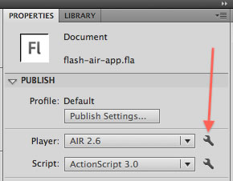

Figure 18. Opening the AIR Settings dialog box.

1.  In the AIR Settings dialog box, select the General tab.
2.  Select Mac Installer (.dmg) if you are on Mac OS (see Figure 19) or select
    Win Installer (.exe) if you are on Windows.

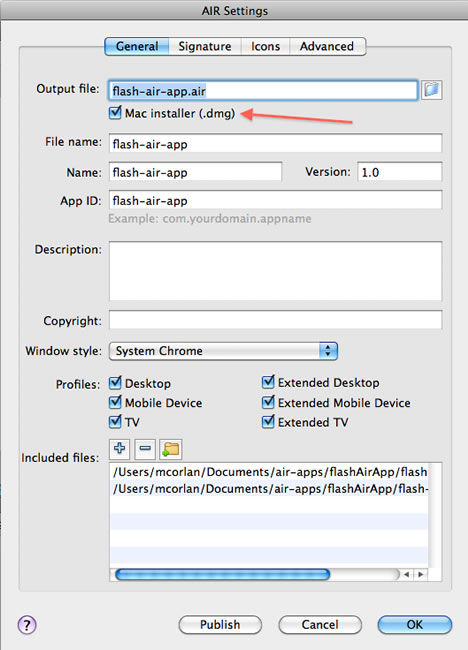

Figure 19. Enabling the platform installer.

3.  Configure any other needed settings and click Publish to create the native
    installer for your platform.

#### Using the command line

Finally, if you want to use the command line tool, ADT, then all you have to do
is insert an additional parameter (`-target native`) in the command described in
Signing an AIR application with the AIR SDK.

So the command will look like this on a Mac:

    adt -package -storetype pkcs12 -keystore PATH_TO_YOUR_CERTIFICATE/certificate_name.p12 -storepass certificate_password –target native YOUR_APPLICATION_NAME.dmg YOUR_APPLICATION_NAME-app.xml YOUR_APPLICATION_NAME.swf

For Windows it will look like this:

    adt -package -storetype pkcs12 -keystore PATH_TO_YOUR_CERTIFICATE/certificate_name.p12 -storepass certificate_password –target native YOUR_APPLICATION_NAME.exe YOUR_APPLICATION_NAME-app.xml YOUR_APPLICATION_NAME.swf

For Linux it will look like this:

    adt -package -storetype pkcs12 -keystore PATH_TO_YOUR_CERTIFICATE/certificate_name.p12 -storepass certificate_password –target native YOUR_APPLICATION_NAME.rpm YOUR_APPLICATION_NAME-app.xml YOUR_APPLICATION_NAME.swf

### Signing apps for Android

If you plan to distribute your AIR application to Android Marketplace you are
required to digitally sign your application using a self-generated code signing
certificate. Here are some points you should keep in mind when signing AIR apps
for Android:

- Applications that are not signed will not be installed on the user's Android
  device. So, you should always sign them.
- The certificate used to sign your application must have the expiration date
  set to cover a period of at least 25 years. This is required in any of the
  following use cases:
  - You plan to sign multiple applications using the same certificate
  - You plan to release multiple updates for your application
- If you plan to release updates for your application, then you must use the
  same certificate for the updates. Failing to do so will trigger the
  installation of the update as a different application than the older version.

You can use Flash Builder or Flash Professional CS5.5 to generate a self-signed
certificate that will meet these requirements or you can generate one using ADT.

#### Using the command line

If you want to use the ADT command line tool, you can use a command in the
following format (no new lines in between; everything on a single line):

    adt -certificate -cn name [-ou org_unit][-o org_name] [-c country] [-validityPeriod number_of_years] key_type pfx_file password

Here is an example for running this command on Mac OS (note that for the –cn I
escaped the space between Mihai and Corlan using a backslash):

    adt -certificate -cn Mihai\ Corlan -ou corlan.org -validityPeriod 25 2048-RSA ~/androidselfcert.p12 somepass

This command will generate a file named androidselfcert.p12 in your home
directory.

To sign your application using the command line, you also use ADT. Here is an
example of the command:

    ./adt -package -target apk -storetype pkcs12 -keystore PATH_TO_YOUR_CERTIFICATE -storepass YOUR_CERTIFICATE_PASSWORD YOUR_APPLICATION_NAME.apk YOUR_APP_XML_FILE-app.xml YOUR_SWF_FILE.swf

The command above can be used when you've already created a release build of
your application to generate the APK file.

#### Using Flash Builder

Follow these steps to sign an Android app using Flash Builder:

1.  Right-click the project in the Package Explorer and choose Export \> Flash
    Builder \> Release Build.
2.  In the Export Release Build wizard, select the Google Android target
    platform.
3.  Also select Signed Packages For Each Target Platform (see Figure 20).
4.  Click Next.

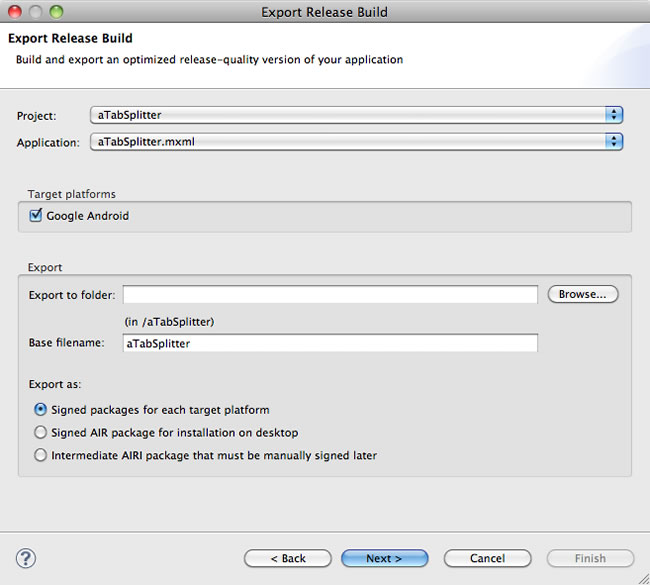

Figure 20. Exporting a release build of an Android app.

Next, you need to create a self-signed certificate:

1.  In the Digital Signature section, click Create.
2.  Provide the publisher name, organizational unit and name, and country.
3.  Select 2040-RSA for the type.
4.  Type and confirm the password you want to use.
5.  Specify the location and the name for the certificate.
6.  Click OK to create the certificate.
7.  Back in the Export Release Build wizard, click Finish to create the APK
    file.

The APK file is typically created inside the root of your project. You can
upload this file to the Android Market.

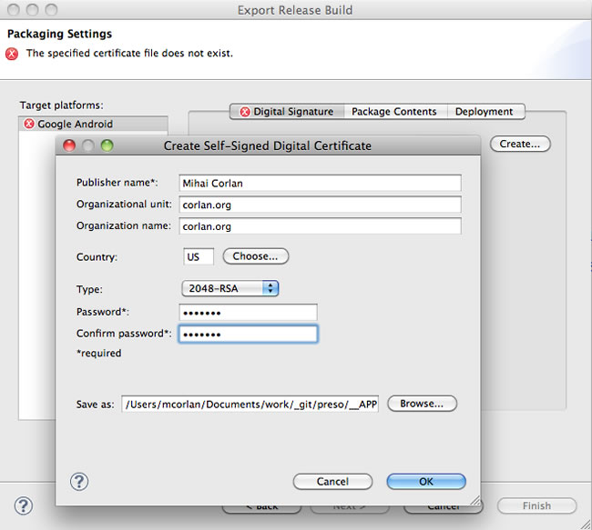

Figure 21. Generating a self-signed certificate.

Each time you want to release an update for your application, first increase the
versionNumber in your application descriptor file and then use the same
workflow. For updates, instead of creating a new certificate you will select the
one you created for the initial release.

#### Using Flash Professional CS5.5

Follow these steps to use Flash Professional CS5.5 to create AIR for Android
apps:

1.  When you are ready to sign your application, open the AIR for Android
    Settings dialog box by clicking the Tool icon on the right of the Player
    option in the Publish settings (see Figure 11).
2.  Click the General tab and set the name of the APK file, version number,
    orientation support, and files to be included in the APK.

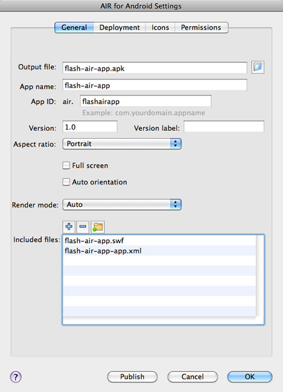

Figure 22. Signing an AIR app for Android in Flash Professional.

3.  Click the Deployment tab.
4.  Select the certificate you want to use and type the password. (If you need
    to create a self-signed certificate first, click Create.)
5.  Select Device Release as the Deployment Type (see Figure 23).
6.  You can specify where your users should get the AIR runtime depending on
    where you intend to submit your application (Google Android Market or Amazon
    Appstore).

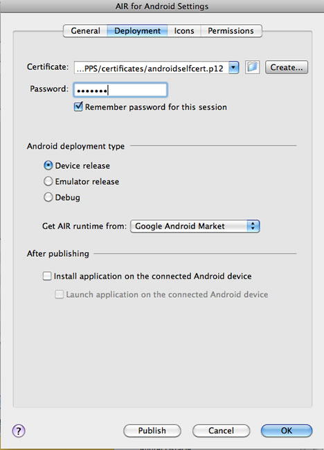

Figure 23. Setting deployment options.

On the Icons tab you can specify the icons used by your application. On the
Permissions tab you can specify the permissions required in your application,
including Internet access, SD card access, and so on (see Figure 24).

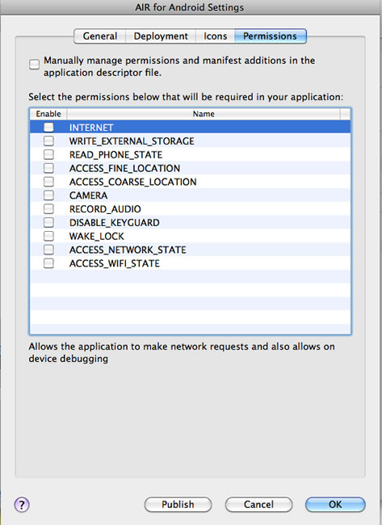

Figure 24. Setting application permission requirements.

7.  When you're finished with the settings, click Publish to start the packaging
    and signing process.

#### Submitting your APK file to Android Market

Before you can submit your application to Android Market, you'll need to
register at the
[Android Market portal](https://web.archive.org/web/20160425154121/http://market.android.com/publish/Home).
There is a one-time registration fee of \$25.

It is a good idea to prepare relevant screenshots of your application and a
description in advance because you'll need them when filling out the online form
for submitting your application.

The process is smooth and fast; you can publish your first application in
Android Market in fewer than 15 minutes, and that includes creating your Android
Market account and completing the forms.

### Signing apps for BlackBerry Tablet OS

There are two main steps you have to complete in order to sign AIR apps for
BlackBerry Tablet OS:

- Request permission to sign BlackBerry Tablet OS apps and get a CSJ
  registration file from RIM.
- Configure Flash Builder for signing PlayBook apps and sign your application.

The signing process for creating a BAR file that you can submit to BlackBerry
App World requires signing your application twice. First, you'll use a code
signing certificate as for any  AIR app (you can use a self-generated
certificate or one acquired from a CA). Second, you'll sign the application with
a RIM certificate.

#### Request permission to sign PlayBook apps

The first step is to make a request for signing PlayBook apps.

1.  Visit https://www.blackberry.com/SignedKeys and complete the BlackBerry Code
    Signing Keys order form.

    - Company – the value you set here must be used later on in Flash Builder
      when generating the code signing certificate.
    - PIN – remember this password (PIN) because it too will be needed later on.
      Make sure that your password is between 6 and 10 digits. If you use
      letters, they must be lowercase.
    - Select A Key – make sure you select one of the options that include
      BlackBerry Tablet OS.

    The credit card is required only for verification purposes.

    Once you finish this registration you should receive a confirmation email
    and within 24 hours you should receive five email messages, each one having
    either a CSI file or a CSJ file.

2.  Save the five files you receive in the same folder (see Figure 25). Note
    that the number part of the filename will be different for each
    registration.

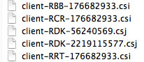

Figure 25. CSJ and CSI files needed for signing PlayBook apps.

If for some reason you forget your PIN you can submit another request. You'll
also need to submit another request if you want to sign applications from
another computer.

#### Sign the application using Flash Builder

You are now ready to use Flash Builder 4.5 to sign mobile ActionScript and Flex
apps for the BlackBerry PlayBook.

1.  Choose Window \> Preferences.
2.  Expand the Flash Builder item on the left and select Target Platforms \>
    BlackBerry Tablet OS \> Signing.
3.  To create a developer certificate for signing the code, click Create
    Certificate.
4.  Type a name for the file, the name of the publisher, and a password (see
    Figure 26).
5.  Click OK and Flash Builder will generate a new certificate.

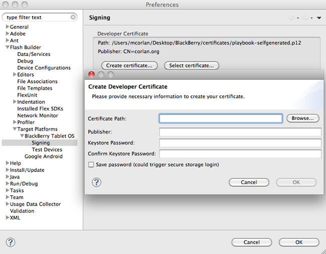

Figure 26. Generating a developer certificate.

Next, you have to register and configure the RIM certificate.

1.  Click the Create button in the RIM Certificate section (see Figure 27) and
    set a password (it must be at least 6 digits/chars long).
2.  Click Register.
3.  Select the last .CSJ file you received via email and provide the same PIN
    you set when you completed the online form.

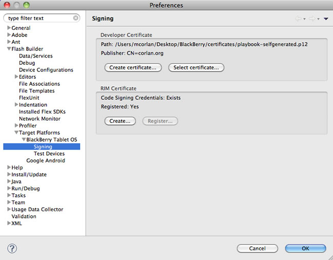

Figure 27. Configuring the RIM certificate.

4.  Click OK to save the configuration.
5.  In Flash Builder, open the application descriptor file for your project and
    make sure you set a version number in `<versionNumber>`. Each time you
    export a release build you'll have to increase this number.
6.  Open the blackberry-tablet.xml file and make sure that the value for the
    \<publisher\> node matches the one you set for your company when you
    registered for signing PlayBook apps and when you generated the developer
    certificate.
7.  Right-click the project in the Package Explorer and select Export \> Flash
    Builder \> Release Build (see Figure 28).

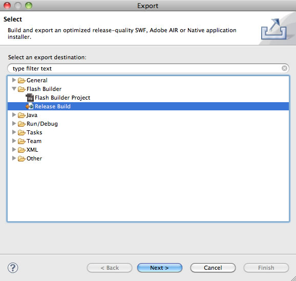

Figure 28. Starting the Export Release Build wizard.

14. In the Export Release Build wizard select BlackBerry Tablet OS as the Target
    Platform.
15. Select the Export And Sign A Platform-specific Application Package option
    (see Figure 29).
16. Click Next.

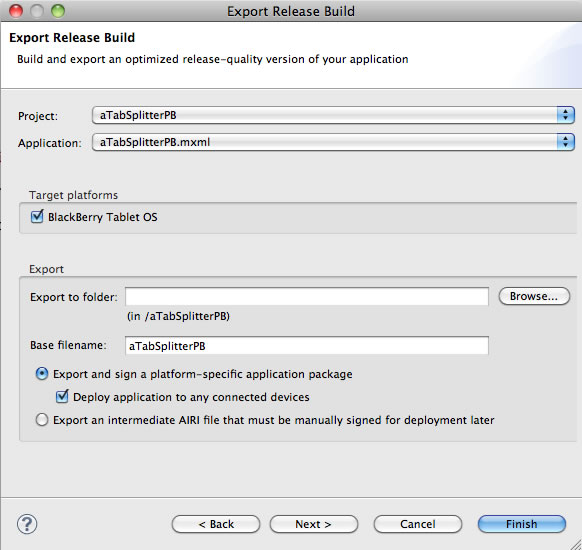

Figure 29. Configuring the export release build.

17. On the Digital Signature tab, select Enable Digital Signing (see Figure 30),
    which will direct Flash Builder to use the developer and RIM certificates
    you set earlier.
18. Click Finish.

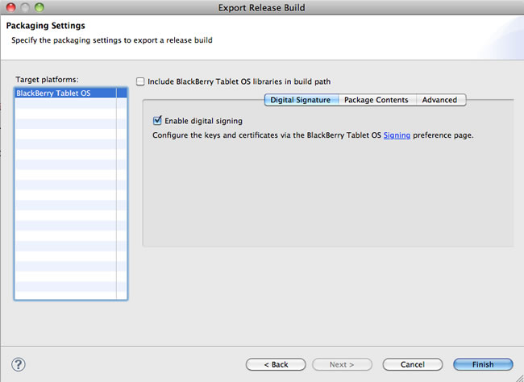

Figure 30. Enabling digital signing.

Flash Builder will generate your BAR file. If you get errors, see
[Application Signing Errors](https://web.archive.org/web/20160425154121/http://docs.blackberry.com/en/developers/deliverables/23959/App_signing_errors_1526016_11.jsp)
on the BlackBerry website.

You can submit your application (the BAR file) to the BlackBerry App World
portal, after you register as a vendor.

Currently, it doesn't cost you anything to become a vendor. However you should
start the process before you are ready to submit your application because it
takes a day or two. After you submit your request to become a vendor, you may
receive an email asking for additional information. Once you send the requested
information you should receive the confirmation in the next 24 hours.

Follow these steps to submit your app:

1.  Log in to your account and click the Manage Products link from the home
    page.
2.  Follow the five-step wizard to define your first product.  
    When you've completed the wizard, you will see that you now have a Product
    entry.
3.  Click the plus sign (+) in the Releases section to upload your BAR file.

### Signing apps for iOS

Flash Builder 4.5 includes support for packaging Flex and ActionScript
applications for Google Android, as well support for packaging ActionScript
applications for Apple iOS. An update to Flash Builder, scheduled for June 2011,
will provide additional options to package Flex applications for Apple iOS and
will include built-in support for packaging both Flex and ActionScript
applications for BlackBerry Tablet OS.

When it comes to packaging your application for specific platforms, the process
for acquiring signing certificates and provisioning files can vary. For Google
Android and BlackBerry Tablet OS the process is relatively straightforward,
whereas for Apple iOS there are a number of steps that must be completed before
an application can be deployed to a device, even for testing and debugging
purposes.

This section is for ActionScript and Flex developers, who are unfamiliar with
Apple's process and need to complete the necessary steps so that applications
built in Flash Builder can be deployed to iOS devices during the development and
testing phases of the project.

#### Registering to develop for Apple iOS

To package applications for testing/debugging on iOS devices or for deployment
to the Apple App Store you will need to enroll in the Apple Developer Program
(fees apply). For more information on the Apple Developer Program and to create
an account, visit
[Apple Developer Program Enrollment](https://web.archive.org/web/20160425154121/http://developer.apple.com/programs/start/standard/).

Once registered, you will need to login to the
[iOS Provisioning Portal](https://web.archive.org/web/20160425154121/http://developer.apple.com/ios/manage/overview/index.action) 
to complete the following tasks:

- Generate a development certificate
- Register devices that you wish to deploy applications to during development
- Define an App ID for the application you are developing
- Create a development provisioning profile

You will also use the iOS Provisioning Portal to distribute your application via
the App Store; that part of the process is not covered in this article, instead
you should refer to Apple's documentation.

The development certificate (in P12 format) and the provisioning profile are
required before you can package your application for iOS in Flash Builder.

#### Generate a development certificate

Follow the guide on the
[iOS Provisioning Portal](https://web.archive.org/web/20160425154121/http://developer.apple.com/ios/manage/certificates/team/howto.action)
to generate your development certificate. The guide assumes you are using Mac
OS, but it is possible to generate the certificate using Windows; for details
see the
[iOS Certificates section of Signing AIR applications](https://web.archive.org/web/20160425154121/http://help.adobe.com/en_US/air/build/WSfffb011ac560372f-19aa73f128cc9f05e8-8000.html#WSfffb011ac560372f46768d8712cd1d13954-7ffd)
in the Adobe AIR documentation.

#### Convert the developer certificate to P12 format

Before you can use the certificate with Flash Builder, you must convert it to
P12 format. See
[Converting a developer certificate into a P12 keystore file](https://web.archive.org/web/20160425154121/http://help.adobe.com/en_US/air/build/WSfffb011ac560372f-19aa73f128cc9f05e8-8000.html#WSfffb011ac560372f46768d8712cd1d13954-7ffc).

Store the P12 file on your computer, as you will need to use it with Flash
Builder later.

#### Register devices that you wish to deploy applications to during development

Devices that you wish to run/debug the application on must be specified in the
provisioning profile used to package the application; as such, you must register
the devices on the iOS Provisioning Portal.

To register a device you need the device's Unique Device Identifier (UDID). To
get this, follow these steps:

1.  Connect your device to your computer and launch iTunes.
2.  In iTunes, select your device in the Devices section and navigate to the
    Summary tab.
3.  Click the Serial Number label to reveal the Identifier field and the 40
    character UDID.
4.  Select the UDID and press Command/CTRL+C to copy it to your clipboard.

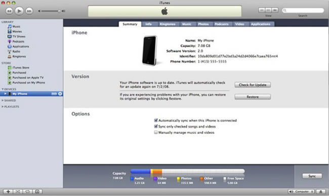

Figure 31. Getting the UDID using iTunes.

More information on locating the UDID and registering a device can be found in
the guide on the
[Apple website](https://web.archive.org/web/20160425154121/http://developer.apple.com/ios/manage/devices/howto.action).

#### Define an App ID for the application you are developing

Each application that you intend to deploy must have an App ID, which comprises
a Bundle Seed ID (also called the App ID Prefix) and a Bundle Identifier (also
called the App ID Suffix).

Follow the guide on the iOS Provisioning Portal to create your App ID:
[http://developer.apple.com/ios/manage/bundles/howto.action](https://web.archive.org/web/20160425154121/http://developer.apple.com/ios/manage/bundles/howto.action)

The Bundle Identifier _must_ be the same as the value of the \<id\> attribute in
your application's app.xml descriptor file in Flash Builder. For example, if you
create a Bundle Identifier as com.adobe.myApp, then your app.xml file must
contain the following:

    <!-- A universally unique application identifier. Must be unique across all AIR applications. Using a reverse DNS-style name as the id is recommended. Required. -->
    <id>com.adobe.myApp</id>

You can use a wildcard in the Bundle Identifier to create a provisioning profile
that is valid for a number of applications, for example a provisioning profile
with a Bundle Identifier specified as com.adobe.\* can be used with applications
with an id of com.adobe.myApp and com.adobe.myOtherApp.

**Note:** Once created, you cannot remove an App ID from the iOS Provisioning
Portal.

#### Create a development provisioning profile

The final step you need to complete using the iOS Provisioning Portal is to
create an iOS Development Provisioning Profile. You will define a profile name,
specify the certificate you created, select an App ID, and choose the device or
devices the application can be deployed to. More information on creating a
Provisioning Profile can be found in the guide on the Apple website:

[http://developer.apple.com/ios/manage/provisioningprofiles/howto.action](https://web.archive.org/web/20160425154121/http://developer.apple.com/ios/manage/provisioningprofiles/howto.action)

Download the provisioning file to your computer, as you will need to use it with
Flash Builder later.

#### Specify build packaging information for the project in Flash Builder

Before you are ready to deploy an application to an Apple iOS device you need to
specify the information required to package the application as an IPA file.

1.  In the Package Explorer in Flash Builder, right-click your project and
    select Properties.
2.  In the Properties dialog box (see Figure 32), select ActionScript Build
    Packaging \> Apple iOS (for an ActionScript project) or select Flex Build
    Packaging \> Apple iOS (for a Flex project).

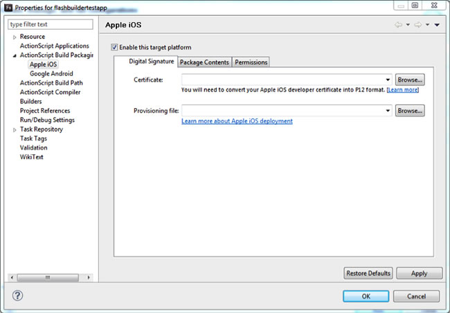

Figure 32. Apple iOS build package properties in Flash Builder.

3.  On the Digital Signature tab, specify the previously saved P12 certificate
    file and the provisioning file for your project.
4.  Click Apply and then OK.

To create an IPA file, right-click the project name in the Package Explorer and
select Export \> Flash Builder \> Release build. Follow the steps in the Export
Release Build wizard to generate your IPA file.

#### Deploy, debug or export a package for Apple iOS

With the build packaging information defined you are ready to deploy or debug
the application on an iOS device. Unlike with other platforms, it is not
possible for Flash Builder to automatically deploy the application to a device –
you will need to use Apple iTunes to complete this task.

Follow the steps in the documentation depending upon whether you are deploying
or debugging your application on your device or exporting a package for wider
deployment:

- [Deploy an application on an Apple iOS device](https://web.archive.org/web/20160425154121/http://help.adobe.com/en_US/flex/mobileapps/WSe4e4b720da9dedb5-2d82208b12e46a72ded-7ffc.html)
- [Debug an application on an Apple iOS device](https://web.archive.org/web/20160425154121/http://help.adobe.com/en_US/flex/mobileapps/WSe4e4b720da9dedb5-2d82208b12e46a72ded-7ffc.html)
- [Export Apple iOS packages for release](https://web.archive.org/web/20160425154121/http://help.adobe.com/en_US/flex/mobileapps/WSc5cd04c102ae3e97-401d98c112de0ad9dd6-7fff.html)

#### Creating an IPA using Flash Professional CS5.5

Once you have the provisioning file you can also use Flash Professional CS5.5
(instead of using Flash Builder 4.5) to sign and package your AIR app as an IPA
file.

1.  To begin, click the tool icon next to the Player option in the Publish
    settings (see Figure 33).
2.  In the AIR For iOS Settings dialog box, click the Deployment tab.
3.  Specify the certificate, password for the certificate, provisioning file,
    and the deployment type (testing, debugging, deployment on the local device
    or through Apple App Store).

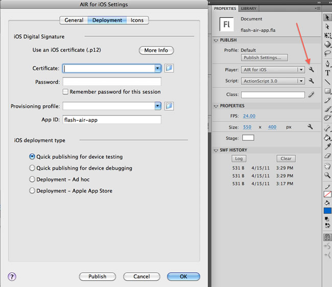

Figure 33. Creating an iOS app in Flash Professional CS5.5.

4.  Once you've finished with the settings click Publish to create the IPA file.

### Where to go from here

As you can see, Adobe offers many options for developing and signing AIR
applications. Likewise there are many options for purchasing your certificates
(for more information refer to the Adobe AIR documentation for
[ActionScript](https://web.archive.org/web/20160425154121/http://help.adobe.com/en_US/as3/dev/)
and
[HTML/JavaScript](https://web.archive.org/web/20160425154121/http://help.adobe.com/en_US/air/html/dev/)
developers). I strongly suggest getting your certificate from Thawte as
illustrated in this article, because it's so easy to manage with Firefox.
However, any class-3, high-assurance certificate should suffice. Remember that
ChosenSecurity, GlobalSign, VeriSign, and Thawte root certificates are installed
on all Windows and Mac OS systems by default, though, which makes them more
convenient for most users.
