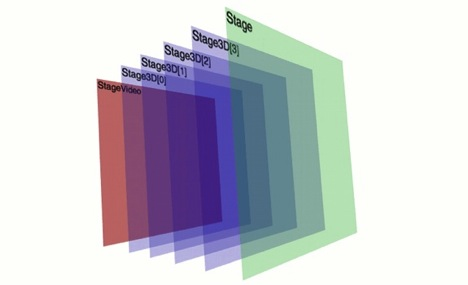
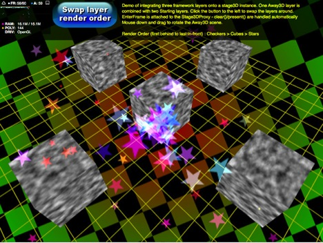
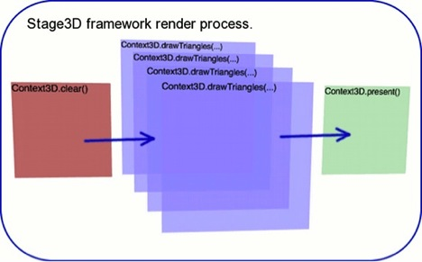
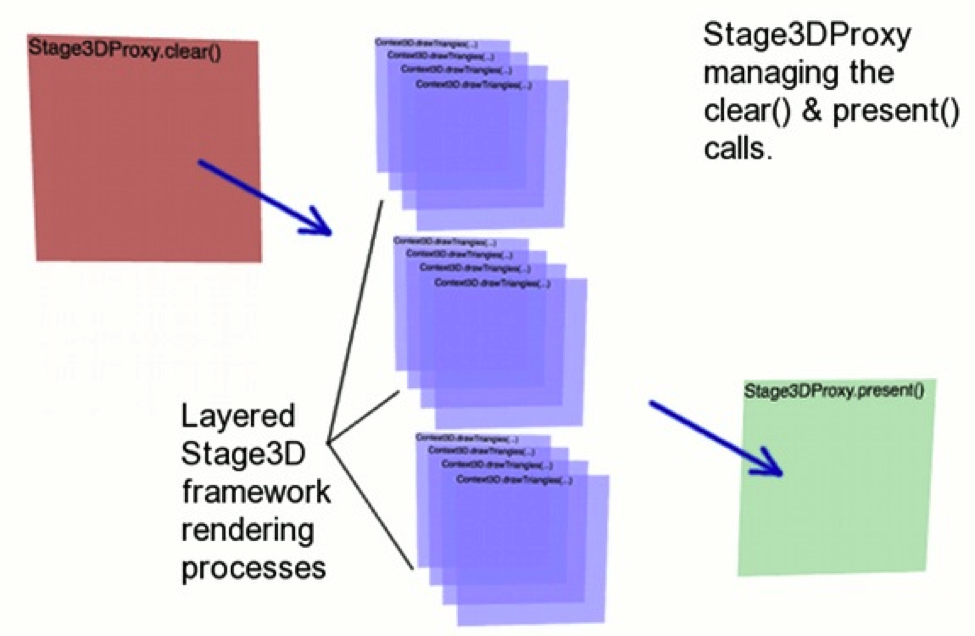

# Away3D and Starling interoperation

by Greg Caldwell

## Content

- [Initializing the shared Stage3D instance](#initializing-the-shared-stage3d-instance)
- [Constructing the render layers](#constructing-the-render-layers)
- [Rendering the layers](#rendering-the-layers)
- [Taking control – Manually](#taking-control--manually)
- [Taking control – Automatically](#taking-control--automatically)
- [Where to go from here](#where-to-go-from-here)

## Requirements

### Prerequisite knowledge

Good ActionScript 3 programming experience with Flash Builder or similar
integrated development environment (IDE) is recommended along with experience of
developing Stage3D based applications using both Away3D and Starling.

### User level

Intermediate

### Required products

- [Adobe AIR SDK](https://airsdk.dev/) or
  [Apache Flex SDK](https://flex.apache.org)
- Flash Builder
- Flash Player or Adobe AIR runtime
- [Away3D releases](https://github.com/away3d/away3d-core-fp11/releases)
- [Starling releases](https://github.com/Gamua/Starling-Framework/releases/)
- [Starling Particles Extension](https://github.com/PrimaryFeather/Starling-Extension-Particle-System)
  (latest sources from Github)

### Sample files

- [away3d-starling-interoperation](https://github.com/joshtynjala/adobe-developer-connection-samples-archive/tree/main/away3d-starling-interoperation)

Since the introduction of Stage3D in Adobe AIR 3 and Flash Player 11, numerous
ActionScript 3 frameworks have been introduced and others upgraded to take full
advantage of the newfound GPU acceleration. Away3D is one of those frameworks
now leveraging these GPU features allowing developers to create incredibly rich
3D interactive experiences. Starling, similarly, is another framework exploiting
the power of Stage3D but is focused on providing GPU accelerated 2D graphics.

There have been requests from both the Starling and Away3D developer communities
to be able to combine both 2D and 3D frameworks together in a single
application. However, this required modification to the APIs themselves or to
have each framework render in its own separate Stage3D instance. Unfortunately,
along with a greater performance overhead, transparent Stage3D instances are
currently unsupported so overlaying the instances obscures the instance beneath,
destroying the desired effect.

Figure 1. StageVideo, Stage3D and standard Stage instances

With the release of Away3D 4.0 Gold and the latest Starling sources from Github,
comes the ability to easily combine multiple frameworks into a single Stage3D
instance. You can now layer any combination and any number of Away3D or Starling
instances.

This tutorial will take you through an example of having a background Starling
layer, a middle Away3D layer and a foreground Starling layer.

Figure 2. Example of two Starling layers and one Away3D layer inter-mixed

### Initializing the shared Stage3D instance

Under normal operation, when either Away3D or Starling is being used
individually, management of the Stage3D is handled internally within the
respective framework. This internal management makes them extremely easy to use,
but also causes difficulties in sharing the Stage3D instance. Instead, each
framework needs access to a common Stage3D instance where all rendering will
happen. This is done through the `Stage3DManager` and `Stage3DProxy` classes
within the Away3D framework.

    // Stage manager and proxy instances
    private var stage3DManager : Stage3DManager;
    private var stage3DProxy : Stage3DProxy;

    /**
     * Global initialise function
     */
    private function init():void
    {
    	stage.scaleMode = StageScaleMode.NO_SCALE;
    	stage.align = StageAlign.TOP_LEFT;

    	initProxies();
    }

    /**
     * Initialise the Stage3D proxies
     */
    private function initProxies():void
    {
    	// Define a new Stage3DManager for the Stage3D objects
    	stage3DManager = Stage3DManager.getInstance(stage);

    	// Create a new Stage3D proxy to contain the separate views
    	stage3DProxy = stage3DManager.getFreeStage3DProxy();
    	stage3DProxy.addEventListener(Stage3DEvent.CONTEXT3D_CREATED, onContextCreated);
    	stage3DProxy.antiAlias = 8;
    	stage3DProxy.color = 0x0;
    }

The `Stage3DManager` is a singleton so to access it you have to explicitly
request the singleton instance using the `getInstance()` method. Using the
`Stage3DManager` instance, you can make a request to allocate the next available
Stage3D for your rendering by using the `getFreeStage3DProxy()` method.
Allocating the Stage3D is an asynchronous process and you must listen for a
`Stage3DEvent.CONTEXT3D_CREATED` event to know when it is complete.

Fortunately the `getFreeStage3DProxy()` method returns a `Stage3DProxy` instance
which allows you set properties such as the overall anti-alias level and
background color immediately.

### Constructing the render layers

When the `Stage3DEvent.CONTEXT3D_CREATED` event is fired, the Context3D and
Stage3D have been successfully allocated to your application and you are ready
to construct your layers for rendering.

In this example there is one Away3D scene and two Starling scenes. The Away3D
scene renders five textured cubes in a cross formation above of a wire frame
grid. The first Starling scene contains a rotating, gradient colored
checker-board whilst the second Starling scene contains a simple particle
effect. Ensure you are using at least Starling 1.2 as this contains the
necessary code to allow sharing of the Stage3D instance.

    private function onContextCreated(event : Stage3DEvent) : void {
    	initAway3D();
    	initStarling();
    	initMaterials();
    	initObjects();
    	initButton();
    	initListeners();
    	initListeners();
    }

    /**
     * Initialise the Away3D views
     */
    private function initAway3D() : void
    {
    	// Create the first Away3D view which holds the cube objects.
    	away3dView = new View3D();
    	away3dView.stage3DProxy = stage3DProxy;
    	away3dView.shareContext = true;

    	hoverController = new HoverController(away3dView.camera, null, 45, 30, 1200, 5, 89.999);

    	addChild(away3dView);

    	addChild(new AwayStats(away3dView));
    }

    /**
     * Initialise the Starling sprites
     */
    private function initStarling() : void
    {
    	// Create the Starling scene to add the checkerboard-background
    	starlingCheckerboard = new Starling(StarlingCheckerboardSprite, stage, stage3DProxy.viewPort, stage3DProxy.stage3D);

    	// Create the Starling scene to add the particle effect
    	starlingStars = new Starling(StarlingStarsSprite, stage, stage3DProxy.viewPort, stage3DProxy.stage3D);
    }

The `onContextCreated()` method performs a typical initialization process to
define the 3D scene, objects, materials, event listeners and also the Starling
setup.

In the `initAway3D()` method, you construct the `View3D` object as usual for an
Away3D scene, however, you set its `stage3DProxy` property to your shared
`Stage3DProxy` instance and instruct the View3D to work with a shared Stage3D by
setting `shareContext` to true.

Similarly the `initStarling()` method creates the Starling scenes. For each
scene it is necessary to pass a reference to the Starling sprite scene, the
stage and in the case of a shared Stage3D, you also need to pass a `Rectangle`
defining the size of the view port and a reference to your Stage3D instance.
Both of these are accessible directly from the `Stage3DProxy` instance as
`viewPort` and `stage3D` properties respectively.

Each Away3D scene and Starling sprite layer now has a reference to the shared
Stage3D instance. The rest of the scene setup continues as normal. The complete
demonstration in the zip file allows you to cycle through, swapping the layers
around. Initially, the Starling layer is at the back (the first rendered layer)
and rotates the checker-board pattern. On top of this is the 5 cube Away3D scene
and finally, on the topmost layer, is the Starling particle effect.

### Rendering the layers

When a Stage3D framework manages its own Stage3D instance, there are certain
functions in the rendering process which prevent it from being shared. In an
extremely simplified view, the rendering of a scene requires it to be cleared –
`clear()`, the elements rendered – `drawTriangles()` and finally, displayed –
`present()`. It is this _clearing_ and _displaying_ performed by the frameworks
that stop Stage3Ds being shared.

Figure 3. Typical simplified Stage3D framework rendering process

Now that Away3D and Starling have been instructed to use a shared Stage3D
instance, they only need to consider the rendering part of the process, leaving
the clearing and presenting responsibility to either you manually or the
`Stage3DProxy` object.

There are two rendering options available through the `Stage3DProxy` class which
are very similar but provide different control of the clearing and presenting.
The manual approach requires you to explicitly call the Stage3DProxy's `clear()`
and `present()` methods around your layer rendering calls whereas the more
automatic approach handles that for you.

Figure 4. Shared Stage3D layered rendering process

### Taking control – Manually

The manual approach to layered rendering with a shared Stage3D instance requires
you to first call the `stage3Dproxy.clear()` to clear and reset the back buffer
for the shared Stage3D instance. You can then render each layer, starting with
the background layers first and working to the foreground layer last, using
either Away3D's `view.render()` method or Starlings `starlingSprite.nextFrame()`
method. Finally you need to call `stage3Dproxy.present()` to complete the
rendering to the back buffer for display.

    /**
     * Set up the rendering processing event listeners
     */
    private function initListeners() : void {
    	stage.addEventListener(Event.ENTER_FRAME, onEnterFrame);
    }

    /**
     * The main rendering loop
     */
    private function onEnterFrame(event : Event) : void {

    	// Clear the Context3D object
    	stage3DProxy.clear();

    	// Render the Starling animation layer
    	starlingCheckerboard.nextFrame();

    	// Render the Away3D layer
    	away3dView.render();

    	// Render the Starling stars layer
    	starlingStars.nextFrame();

    	// Present the Context3D object to Stage3D
    	stage3DProxy.present();
    }

In the code above, the clearing, rendering and presenting are all performed
inside a stage `ENTER_FRAME` event handler, allowing you complete control of
when each part of the rendering process will take place.

### Taking control – Automatically

With the automatic approach, the Stage3DProxy instance performs the `clear()`
and `present()` calls internally. To process the rendering calls, you need to
add an `ENTER_FRAME` event handler to the Stage3DProxy instance rather than to
the stage instance. The rendering calls within this event handler are exactly
the same as in the manual approach except that the `clear()` and `present()`
calls are not made.

    /**
     * Set up the rendering processing event listeners
     */
    private function initListeners() : void {
    	stage3DProxy.addEventListener(Event.ENTER_FRAME, onEnterFrame);
    }

    /**
     * The main rendering loop
     */
    private function onEnterFrame(event : Event) : void {

    	// Render the Starling animation layer
    	starlingCheckerboard.nextFrame();

    	// Render the Away3D layer
    	away3dView.render();

    	// Render the Starling stars layer
    	starlingStars.nextFrame();
    }

This approach saves you from having to make explicit calls to `clear()` and
`present()` but still allows you to define the rendering order of your layers.

### Where to go from here

In this tutorial, you learned how to combine multiple Stage3D frameworks, both
2D and 3D layers, into a single application and render those layers on top of
one another.

Hopefully you see how easy it can be to build applications using the Away3D and
Starling frameworks together, making full use of the GPU acceleration offered by
Stage3D.

Also see the following for more information on framework interoperation, Away3D
and Starling:

- [More interoperation examples](https://github.com/away3d/integration-examples-fp11)
- [Away3D releases](https://github.com/away3d/away3d-core-fp11/releases)
- [Starling releases](https://github.com/Gamua/Starling-Framework/releases)
- [Starling framework website](https://gamua.com/starling)
- [Creating 3D games and apps with Away3D 4 and Stage3D](./creating-3d-games-and-apps-with-away3d.md)
- [Introducing the Starling 2D framework](./introducing-the-starling-2d-framework.md)

> This work is licensed under a
> [Creative Commons Attribution-Noncommercial-Share Alike 3.0 Unported License](https://creativecommons.org/licenses/by-nc-sa/3.0/)
