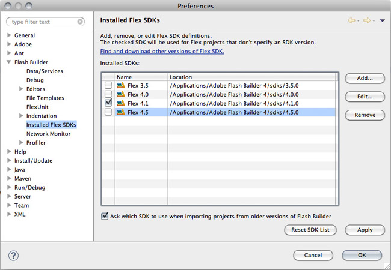
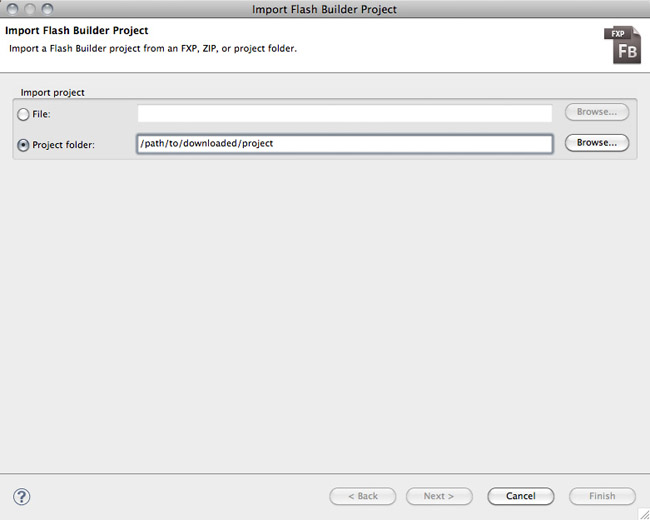
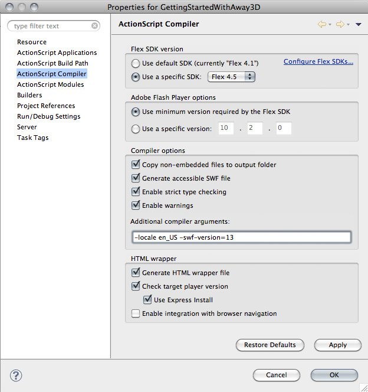
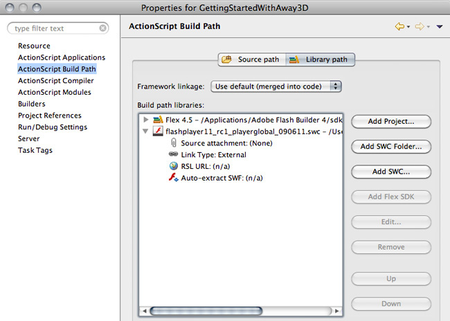
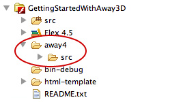
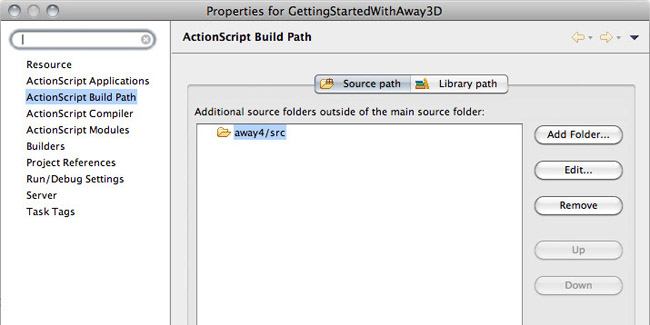
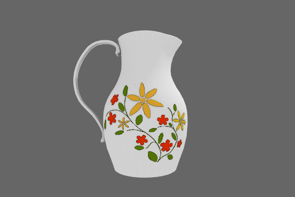

# Creating 3D games and apps with Away3D 4 and Stage 3D – Part 1: Setting up a 3D project in 30 minutes

by Richard Olsson

## Content

- [Setting up the project](#setting-up-the-project)
- [Creating a simple 3D product viewer](#creating-a-simple-3d-product-viewer)

## Requirements

### Prerequisite knowledge

Basic experience programming with ActionScript 3 and Flash Builder or a similar
integrated development environment (IDE) is recommended.

### User level

All

### Required products

- [Adobe AIR SDK](https://airsdk.dev/) or
  [Apache Flex SDK](https://flex.apache.org)
- Flash Builder
- Flash Player or Adobe AIR runtime
- [Away3D 4](https://github.com/away3d/away3d-core-fp11/releases)

### Sample files

- [getting-started-with-away3d](https://github.com/joshtynjala/adobe-developer-connection-samples-archive/tree/main/getting-started-with-away3d)

With the release of Adobe AIR 3 and Flash Player 11, which includes the hardware
accelerated Stage3D API, the number of 3D games, applications and online 3D
experiences is likely to increase dramatically over the coming years. The
Stage3D API is very powerful, but it comes with a fairly steep learning curve.
Fortunately, there are frameworks you can use to simplify 3D development in
Flash—such as the very popular open source 3D engine Away3D.

Away3D has been around since 2007 and supports Flash Player 9 and 10 as well as
the most recent Flash Player 11. It is developed as free, open source software
by a worldwide team of Flash 3D professionals and is used to develop games,
applications, interactive art, tools and more or less anything with 3D content.

In this series of articles, you'll take a tour of the different tasks required
to build a typical 3D project, such as loading assets, creating materials, and
animating 3D objects.

This first article in the series describes how to set up an Away3D 4 project and
create a simple 3D product viewer in just 30 minutes, using less than 60 lines
of code.

### Setting up the project

Before you can begin using Away3D 4, you need to set up the environment for AIR3
and Flash Player 11 development and ensure that you have downloaded the most
recent version of the Away3D library.

#### Preparing Flash Builder for Stage3D development

Stage3D was introduced in Adobe AIR 3 and Flash Player 11. Originally, Flash
Builder did not support Flash Player 11 out of the box. To get access to the new
APIs and compile for Flash 11, you may need to complete a couple of steps:

1.  First, if targeting Flash Player, you'll need Flash Player 11 or newer. If
targeting AIR only, you may skip this step. If you develop a significant number
of Flash projects, it makes sense to use the content debugger version of the
player instead of the release version.

2.  Next, download the most recent stable version of the
[AIR SDK](https://airsdk.dev) or [Flex SDK](https://flex.apache.org). Be sure to
add the new SDK to the list of Installed SDKs in the Flash Builder Preferences
(see Figure 1).

    

    Figure 1. Add the Flex SDK 4.5 to the list of installed SDKs in Flash Builder.

3.  The Flex SDK contains a file called playerglobal.swc, which contains all the
    native player APIs. To make sure that you're using the correct SWC file that
    supports the Flash Player 11 APIs, download the most recent
    [playerglobal.swc file](https://fpdownload.macromedia.com/get/flashplayer/updaters/32/playerglobal32_0.swc).

4.  For the purpose of this tutorial, you can import the Flash Builder project
    from the provided sample files. In Flash Builder, select Import \> Flash
    Builder Project from the File menu. Check the "project folder" radio button,
    and browse to the sample files folder that contains the src and
    html-template folders. Click Finish (see Figure 2).

    

    Figure 2. Choose Import \> Flash Builder Project to import the sample
    project.

    Note: Import the sample project from the root folder of the sample files zip
    archive, which contains a README.txt file, src and html-template folders as
    well as an empty away4 folder.

5.  Open the project properties for the imported project. In the ActionScript
    compiler section, make sure to select the latest version of the Flex SDK. In
    the Additional compiler arguments dialog box, add `-swf-version=13`. This
    setting ensures that you are compiling for the correct version of the SWF
    format. Click Apply (see Figure 3).

    

    Figure 3. Make sure that the Flex SDK 4.5 is selected and the target SWF
    version is set to 13.

    > If you are targeting a newer version of Flash Player or AIR, see the
    > [Table of SWF versions to use for specific AIR or Flash Player versions](https://github.com/BowlerHatLLC/vscode-as3mxml/wiki/swf%E2%80%90version-compiler-option)
    > to find a more appropriate value for the `swf-version` compiler option.
    > For example, to target Adobe AIR 32.0, it would be more appropriate to use
    > `-swf-version=43`.

6.  Navigate to the ActionScript Build Path section and click the Library path
    tab. Expand the Flex SDK and remove the playerglobal.swc if one already
    exists. Click the Add SWC button to add the newest version of
    playerglobal.swc that you just downloaded instead. Expand the options and
    make sure to set the Link Type to External. You can configure this by
    double-clicking the line that says "Link Type:". After making these changes,
    click OK to close the Project Properties dialog box (see Figure 4).

    

    Figure 4. Add the Flash Player 11 playerglobal.swc file to the library path
    and configure the library for external linkage.

7.  In the Package Explorer, navigate to the html-template folder, select
    index.template.html and right-click to bring up the context menu. Select
    Open With \> Text Editor. Make sure that the wmode parameter is set to:
    direct. This setting is required for the Stage3D APIs to work. Add a new
    line after line 48 and type the following line of code:

        params.wmode = "direct";

While these instructions may seem a bit tedious to set up a 3D project, remember
that you'll only need to complete the first three steps once.  When a new update
is released for Flash Builder even the next three steps can be omitted.

### Getting the Away3D library

After setting up Flash Builder to work with Flash Player 11, the next step
involves downloading the Away3D library and adding it to your project. Away3D is
a set of classes (a couple of hundred files or so), similar to the classes you
write yourself. So essentially, to install Away3D you can download the source
files and put them in the same folder (or a similar one) as your own source
code.

Away3D is distributed in a couple of shapes and forms. The best way to make sure
that you have the latest version is to visit the
[Github page](https://github.com/away3d) and download the source from there.
Review the list of Away3D repositories and select the one called
[away3d-core-fp11](https://github.com/away3d/away3d-core-fp11).

1.  Browse to the
    [away3d-core-fp11 repository page](https://github.com/away3d/away3d-core-fp11).
2.  If you are familiar with the Git Version Control System, you probably want
    to clone the repository to make sure it is always up-to-date. However, if
    you are not a Git user, simply click the large Downloads button in the top
    right and download the entire source tree as a ZIP file.
3.  Unzip the repository ZIP file. Open the uncompressed file to find a src
    folder, which contains the Away3D 4 source code. Place the src folder
    somewhere inside your Flash Builder project, e.g. in a subfolder called
    "away4". For your convenience, an empty folder with this name has already
    been created in the sample project (See Figure 5).

Figure 5. Create a folder named away4 and place a copy the src folder from the
Away3D repository inside it.

5.  In the Project Properties panel, select the ActionScript Build Path option
    and add the path to this src folder as a source path (see Figure 6).

Figure 6. Add the Away3D src folder to the project source path.

6.  At this point, you can compile the GettingStartedWithAway3D.as application
    without causing any errors, although right now the app doesn't actually do
    anything when you run it.

If you prefer to work with SWC files, look for the latest build on the
[Away3D releases page](https://github.com/away3d/away3d-core-fp11/releases), or
place the Away3D source in a Flash Builder Flex Library project to build your
own.

### Creating a simple 3D product viewer

Now that you've set everything up, you're ready to do some actual programming.
In this section, you'll create a simple 3D product viewer (for an online store
or product showcase) using less than 60 lines of code.

#### Setting up the view and rendering

When building a new 3D application or module, the first order of operations is
to create and configure the view, the core component which acts as a sort of
window through which the 3D world is seen. You can also think of the view as a
screen or canvas that displays the 3D output.

In the simplest case, you can create an instance of View3D and add it to the
display list. However, for this sample project you'll also enable anti-aliasing
and configure the background color of the view. Add the following five lines to
the constructor:

    _view = new View3D();
    _view.backgroundColor = 0x666666;
    _view.antiAlias = 4;
    this.addChild(_view);
    this.addEventListener(Event.ENTER_FRAME, onEnterFrame);

The constructor should now look like this:

    public function GettingStartedWithAway3D()
    {
    	_view = new View3D();
    	_view.backgroundColor = 0x666666;
    	_view.antiAlias = 4;
    	this.addChild(_view);
    	this.addEventListener(Event.ENTER_FRAME, onEnterFrame);
    }

Make sure that the Event class is imported properly from `flash.events.Event`.

When you enable anti-aliasing by setting it to a value of 2, 4, or 16, you are
specifying that the hardware renderer will smooth all edges by using several
sub-samples per pixel. Usually a setting of 4 provides acceptable results.

Although it poses as a display object that can be added to the display list,
View3D is really using the Stage3D API, which means that the 3D content is drawn
behind the display list. As a result, the regular background color settings will
not apply to Away3D 4 content. You'll use the backgroundColor property to define
the background color.

Next, make sure that the view is rendered on every frame, so that any changes to
the scene are redrawn. The previous code example includes an ENTER_FRAME
listener, so you have to add the proper listener function, like this:

    private function onEnterFrame(ev : Event) : void
    {
    	_view.render();
    }

This function ensures the view's `render()` method is invoked every frame, so
that the view is redrawn.

This is the basic boiler-plate code used for most 3D projects. You can run the
code now, but the app only displays a gray rectangle. What you're actually
seeing is the empty view's flat background color, which confirms that the view
is rendering properly.

### Loading a model

The process of loading external assets in Away3D 4 is simple and extremely
versatile. In an upcoming tutorial, I'll describe this system in more detail. In
the simplest case, all you need to do to load a 3D model is to create an
instance of the `Loader3D ` class, add it to the scene and commence the loading
process. This process mimics the way you can use the regular
`flash.display.Loader` class to load 2D artwork. However, it's a good idea to
listen for the proper events and add the loader to the scene only after you're
certain that the load was successful.

Add the following five lines of code to the constructor. As you type this code
in, make sure you're also importing the `away3d.loaders.parsers.Parsers`,
`away3d.events.LoaderEvent` and `flash.net.URLRequest` classes if they are not
already included in your Flash Builder project.

    Parsers.enableAllBundled();

    _loader = new Loader3D();
    _loader.addEventListener(LoaderEvent.RESOURCE_COMPLETE, onResourceComplete);
    _loader.addEventListener(LoaderEvent.LOAD_ERROR, onLoadError);
    _loader.load( new URLRequest('vase.awd') );

The constructor should now look like this:

    public function GettingStartedWithAway3D()
    {
    	_view = new View3D();
    	_view.backgroundColor = 0x666666;
    	_view.antiAlias = 4;

    	this.addChild(_view);
    	this.addEventListener(Event.ENTER_FRAME, onEnterFrame);

    	Parsers.enableAllBundled();

    	_loader = new Loader3D();
    	_loader.addEventListener(LoaderEvent.RESOURCE_COMPLETE, onResourceComplete);
    	_loader.addEventListener(LoaderEvent.LOAD_ERROR, onLoadError);
    	_loader.load( new URLRequest('vase.awd') );
    }

The first line above will enable all bundled parsers. This is the easiest
strategy, because you do not have to care about file formats, but may add
unnecessary weight to your SWF file.

The set of classes referred to as the parsers are responsible for converting a
storage format (such as OBJ 3D models or JPEG images) into a format that the
engine can use at runtime. Away3D uses a plug-in architecture for parsers, which
allows you to include only those that your project requires, or to write your
own. In addition, the parsers that you enable will be used for automatic file
format detection, meaning that your application doesn't have to know in advance
the file format of the asset being loaded. This is similar to how the native
Loader class works and may seem obvious, but many engines (including earlier
versions of Away3D) use slightly different loading processes for different file
formats.

The next four lines above create a `Loader3D` instance, add listeners for events
indicating success and failure respectively, and initiate the loading of a
resource called vase.awd.

The following function is an example of how the error handler could look. Add
these seven lines to your class:

    private function onLoadError(ev : LoaderEvent) : void
    {
    	trace('Could not find', ev.url);
    	_loader.removeEventListener(LoaderEvent.RESOURCE_COMPLETE, onResourceComplete);
    	_loader.removeEventListener(LoaderEvent.LOAD_ERROR, onLoadError);
    	_loader = null;
    }

The code above uses the trace method to display an error message in the Output
window and disposes of the loader. In order for the garbage collector to remove
the loader from memory, you'll need to also remove the event listeners.
Similarly, this is how the success handler should look:

    private function onResourceComplete(ev : LoaderEvent) : void
    {
    	_loader.removeEventListener(LoaderEvent.RESOURCE_COMPLETE, onResourceComplete);
    	_loader.removeEventListener(LoaderEvent.LOAD_ERROR, onLoadError);
    	_view.scene.addChild(_loader);
    }

Since the load operation was successful, this function adds the loader to the
scene, which can be accessed via the` View3D` instance. The `Loader3D` instance
acts as a container for all the visual assets found in the loaded resource. The
process of adding it to the scene means that the container's contents will be
visible when the view is rendered.

Try running the code now. You should see a textured vase in the center of the
view rectangle (see Figure 7).

Figure 7. A still frame of the loaded vase running in Away3D.

Hopefully you are enjoying the still frame of a vase, but the power in real-time
3D is rooted in the possibility of interaction with 3D content. After all, there
are easier ways to render a still picture of a vase.

As a very simple measure, the next and final steps will involve adding some
basic interaction to control the angle from which the vase is being rendered.
This is accomplished in two steps: you'll enable the user to pirouette the vase
around its Y axis by moving the mouse horizontally, and then allow the user to
move the point-of-view up and down by moving the mouse vertically.

There are many ways to achieve two-axis rotation like this, but arguably the
easiest way is to rotate the `Loader3D` instance around the Y axis, and to
rotate the camera around the X axis. First add the following line of code to the
`onEnterFrame()` method, before the `render() `call:

    _loader.rotationY = stage.mouseX - stage.stageWidth/2;

The `onEnterFrame()` method should now look like this:

    private function onEnterFrame(ev : Event) : void
    {
    	_loader.rotationY = stage.mouseX - stage.stageWidth/2;
    	_view.render();
    }

This code ties the Y-axis rotation of the Loader3D instance to the position of
the user's cursor relative to the center of the Stage. If you run the code at
this point, you can move your mouse to pan around the vase, looking at it from
all sides.

Next, add the following two lines, again right before the call to `render()`, to
control the camera's position on the Y axis:

    _view.camera.y = 3 * (stage.mouseY - stage.stageHeight/2);
    _view.camera.lookAt(_loader.position);

The `onEnterFrame()` method should now look like this:

    private function onEnterFrame(ev : Event) : void
    {
    	_loader.rotationY = stage.mouseX - stage.stageWidth/2;
    	_view.camera.y = 3 * (stage.mouseY - stage.stageHeight/2);
    	_view.camera.lookAt(_loader.position);
    	_view.render();
    }

This code moves the camera up and down as you move the cursor vertically. The
number 3 ensures the change in position is large enough. The `lookAt()` function
will re-orient the camera so that it continues to look straight at the vase even
as it moves up and down. In this example, it achieves this goal by rotating it
around its X axis to nod up and down.

### Where to go from here

In this basic tutorial, you learned how to create a simple 3D product viewer
with minimal effort using Away3D 4. The instructions provided here are usually
required regardless of the type of 3D projects you develop, so you are now ready
to follow along with sample projects that assume basic knowledge of Away3D, such
as the remaining tutorials in this series.

To continue on your journey into the third dimension, read the other parts of
this series (coming soon) which will describe working with the scene graph,
loading and managing 3D assets, materials and lighting, and animation
respectively.

Also see these online resources to learn more about Stage3D:

- [Introducing Stage3D (codename Molehill): 3D APIs for Adobe Flash Player and Adobe AIR](../../../inspire-archive/introducing-molehill-3d-apis-for-flash-player-and-air.md)
- [How Stage3D workss](./how-stage3d-works.md)
- [Vertex and fragment shaders](./vertex-and-fragment-shaders.md)
- [What is AGAL](./what-is-agal.md)
- [Hello Triangle](./hello-triangle.md)
- [Working with Stage3D and perspective projection](./working-with-stage3d-and-perspective-projection.md)
- [Working with 3D cameras](./working-with-3d-cameras.md)
- [Mipmapping for smoother textures in Stage3D](./mipmapping-for-smoother-textures-in-stage3d.md)

> This work is licensed under a
> [Creative Commons Attribution-Noncommercial-Share Alike 3.0 Unported License](https://creativecommons.org/licenses/by-nc-sa/3.0/)
