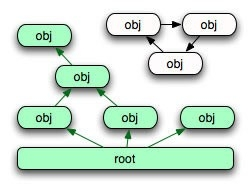
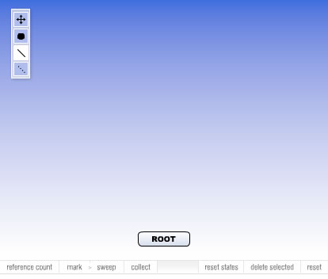

# Understanding garbage collection in Flash Player

by Grant Skinner

## Content

- [About the garbage collector](#about-the-garbage-collector)
- [Reference counting](#reference-counting)
- [Mark sweeping](#mark-sweeping)
- [Deferred garbage collector and indeterminacy](#deferred-garbage-collector-and-indeterminacy)
- [Where to go from here](#where-to-go-from-here)

## Requirements

### User level

Advanced

I've been playing around with ActionScript 3.0 for a while now, and I'm really
excited by its capabilities. The raw execution speed by itself provides so many
possibilities. Toss in E4X, sockets, byte arrays, the new display list model,
RegEx methods, a formalized event and error model, and a few dozen other
features for flavor, and you have a pretty heady brew.

With great power comes great responsibility, and this is very true for
ActionScript 3.0. A side effect of all this new control is that the garbage
collector is no longer able to make as many assumptions about what it should
automatically tidy up for you. This means that Flash developers moving to
ActionScript 3.0 will need to develop a very strong understanding of how the
garbage collector operates, and how to work with it effectively. Building even
seemingly simple games or applications without this knowledge could result in
SWFs that leak like a sieve, hogging all of a system's resources (CPU/RAM) and
causing the user's system to hang—potentially even forcing them to hard reboot
their computer.

To understand how to optimize your code for ActionScript 3.0, you'll first need
an understanding of how the garbage collector works in Flash Player 9 and above.
Flash has two processes for finding objects that are not in active use and
removing them. This article looks at both techniques and describes how they are
relevant to your code.

At the end of this article you can find a simulation of the garbage collector in
Flash Player 9 and above that visually demonstrates the concepts explained
herein.

### About the garbage collector

The garbage collector is a behind-the-scenes process that is responsible for
deallocating the memory used by objects that are no longer in use by the
application. An inactive object is one that no longer has any references to it
from other active objects. In order to understand this, it is very important to
realize that when working with non-primitive types (anything other than Boolean,
String, Number, uint, int), you are always passing around a reference to the
object, not the object itself. When you delete a variable you remove the
reference, not the object itself.

This is easily demonstrated in the code below:

    // create a new object, and put a reference to it in a:
    var a:Object = {foo:"bar"}
    // copy the reference to the object into b:
    var b:Object = a;
    // delete the reference to the object in a:
    delete(a);
    // check to see that the object is still referenced by b:
    trace(b.foo); // traces "bar", so the object still exists.

If I were to update the code in the example above and delete "b" as well, it
would leave my object with no active references and free it for garbage
collection. The ActionScript 3.0 garbage collector uses two methods for locating
objects with no active references: reference counting and mark sweeping.

### Reference counting

Reference counting is one of the simplest methods for keeping track of active
objects, and has been used in Flash since ActionScript 1.0. When you create a
reference to an object, its reference count is incremented. When you delete a
reference, its reference count is decremented. If the reference count of an
object reaches zero, it is marked for deletion by the garbage collector.

Here's an example:

    var a:Object = {foo:"bar"}
    // the object now has a reference count of 1 (a)
    var b:Object = a;
    // now it has a reference count of 2 (a & b)
    delete(a);
    // back to 1 (b)
    delete(b);
    // the reference count down is now 0
    // the object can now be deallocated by the garbage collector

Reference counting is simple, it doesn't carry a huge CPU overhead, and it works
well in most situations. Unfortunately, the reference counting method for
garbage collection is not optimal when it comes to circular referencing.
Circular referencing is the situation when objects cross-reference each other
(directly, or indirectly via other objects). Even if the application is no
longer actively using the objects, their reference counts remain above zero, so
the garbage collector never removes them. The code below illustrates how this
works:

    var a:Object = {}
    // create a second object, and reference the first object:
    var b:Object = {foo:a};
    // make the first object reference the second as well:
    a.foo = b;
    // delete both active application references:
    delete(a);
    delete(b);

In the code shown above, both of the active application references have been
deleted. I no longer have any way of accessing the two objects from my
application, but the reference counts of both objects are 1 because they
reference each other. This situation can become much more complex (_a_
references _c_, which references _b_, which references _a_, etc.) and can be
difficult to deal with in code. Flash Player 6 and 7 had issues relating to
circular referencing in XML objects: each XML node referenced both its children
and its parent, so they were never deallocated. Fortunately, Flash Player 8
[added a new garbage collection technique](https://web.archive.org/web/20140406204723/http://www.adobe.com/devnet/flashplayer/articles/fp8_performance.html)
called mark and sweep.

### Mark sweeping

The second strategy employed by the ActionScript 3.0 (and Flash Player 8)
garbage collector to find inactive objects is a method called mark and sweep.
Flash Player starts at the root object of your application (which is
conveniently called the "root" in ActionScript 3.0) and walks through every
reference in it, marking each object it finds.

Next, Flash Player iterates through each of the marked objects. It continues
this behavior recursively until it has traversed the entire object tree of your
application, marking everything it can reach through an active reference. At the
end of this process, Flash Player can safely assume that any objects in memory
that are not marked no longer have any active references to them and can be
safely deallocated. Figure 1 illustrates how this works: The green references
were followed by Flash Player during marking, the green objects are marked, and
the white objects will be deallocated.

Figure 1. Objects that no longer have active references are identified by Flash
Player using the mark and sweep method

Mark and sweep is very accurate. However, because Flash Player has to traverse
your entire object structure, the process is costly in terms of CPU usage. Flash
Player 9 reduces this cost by carrying out iterative mark and sweep—the process
occurs over a number of frames, instead of all at once—and by running this
process only occasionally.

### Deferred garbage collector and indeterminacy

In Flash Player 9, the garbage collector's operations are deferred. This is a
very important thing to understand. Your objects will not be removed immediately
when all active references are deleted. Rather, they will be removed at some
indeterminate time in the future (from a developer standpoint). The garbage
collector uses a set of heuristics that look at the RAM allocation and the size
of the memory stack, among other things, to determine when to run. As a
developer, you must accept the fact that you will have no way of knowing when,
or even if, your inactive objects will get deallocated. You must also be aware
that inactive objects will continue to execute indefinitely, until the garbage
collector deallocates them, so your code will keep running (enterFrame events
will continue), sounds will keep playing, loads will keep happening, other
events will keep firing, and so on.

It's very important to remember that you have no control over when the garbage
collector in Flash Player will deallocate your objects. As a developer, you will
want to make the objects in your games and applications as inert as possible
when you are finished with them. Strategies to manage this process will be the
focus of my companion article,
[Resource management strategies in Flash Player 9](./resource-management.md).

Notice the sawtooth pattern of the total memory in the following garbage
collection simulation (click Figure 2). The dips are caused when the collector
carries out a sweep. Click on the chart to focus it, then press Spacebar to
pause or restart, and hold the up/down arrows to change the memory usage trend
as it runs.

[Run simulation](https://web.archive.org/web/20140406204723/http://www.adobe.com/devnet/flashplayer/articles/garbage_collection/_jcr_content/articlecontentAdobe/swfmodal.content.html)

**Figure 2.** Garbage collection simulation (click to run)

As shown in the following simulation (click Figure 3), drag out objects (round
rectangles) and references to those objects. Then run reference counts or mark
and sweep to see which objects would be collected. The number in an object
indicates the number of references to that object.

[Run simulation](https://web.archive.org/web/20140406204723/http://www.adobe.com/devnet/flashplayer/articles/garbage_collection/_jcr_content/articlecontentAdobe/swfmodal_0.content.html)

**Figure 3.** Garbage collection simulation: mark and sweep (click to run)

### Where to go from here

Understanding garbage collection is going to be one of the most important steps
for writing optimized code that ensures that your Flash project runs with
minimal impact on the user's computer. Read my companion article,
[Resource management strategies in Flash Player 9](./resource-management.md) and
the related article
[Garbage collection internals for Flash Player and Adobe AIR](../../actionscript/learning/as3-fundamentals/garbage-collection.md).
