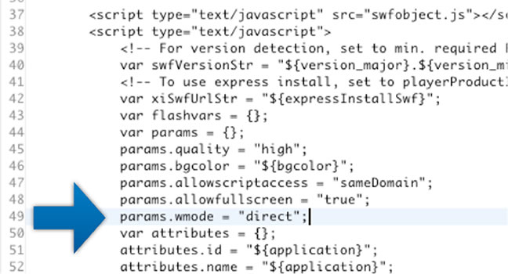
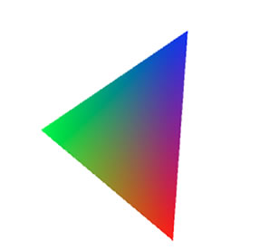
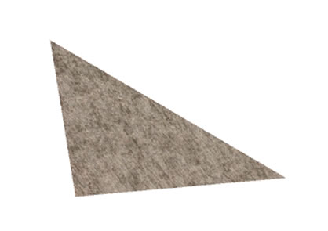

# Hello Triangle

by Marco Scabia

## Content

- [Setting up the build environment](#setting-up-the-build-environment)
- [Initializing Stage3D](#initializing-stage3d)
- [Creating a colored triangle geometry](#creating-a-colored-triangle-geometry)
- [Rendering the scene](#rendering-the-scene)
- [Applying texture mapping](#applying-texture-mapping)
- [Working with the Texture class in the Stage3D API](#working-with-the-texture-class-in-the-stage3d-api)
- [Where to go from here](#where-to-go-from-here)

## Requirements

### Prerequisite knowledge

Familiarity working with the Stage3D API and a basic understanding of how it is
structured is required. Basic knowledge of Vertex and Fragment Shaders, and the
AGAL shading language is also recommended. Before completing this tutorial, be
sure to follow along with the previous tutorials in this series on Stage3D (1.
[How Stage3D works](./how-stage3d-works.md), 2.
[Vertex and Fragment Shaders,](./vertex-and-fragment-shaders.md) 3.
[What is AGAL](./what-is-agal.md)).

### User level

Intermediate

### Required products

- [Adobe AIR SDK](https://airsdk.dev/) or
  [Apache Flex SDK](https://flex.apache.org)
- Flash Builder or Adobe Animate (formerly Flash Professional)
- Flash Player or Adobe AIR runtime

### Sample files

- [hello-triangle-textured](https://github.com/joshtynjala/adobe-developer-connection-samples-archive/tree/main/hello-triangle-textured)
- [hello-triangle-colored](https://github.com/joshtynjala/adobe-developer-connection-samples-archive/tree/main/hello-triangle-colored)

In this article you'll examine a working ActionScript application based on the
Stage3D API. First you'll to learn how to properly configure a Stage3D-ready
build environment. Once the sample project is set up, you'll see how to
initialize Stage3D from ActionScript, and how to create and render a super
simple 3D scene consisting of a single colored triangle using Stage3D.

Finally, you'll take a look at the process of applying texture mapping and
you'll review a Stage3D application with a texture mapped geometry.

### Setting up the build environment

When you get started building Stage3D apps, the first task involves preparing
your build environment and ensuring it is properly setup.

While it's certainly possible to build Stage3D applications using the barebones
Flex SDK from the command line, it is often more convenient to use an integrated
tool such as Flash Builder. The steps provided in this article focus on working
with Flash Builder 4.5.

Begin by downloading and installing the latest
[Adobe AIR SDK](https://airsdk.dev/) or
[Apache Flex SDK](https://flex.apache.org).

Next, download and install the latest version of the
[playerglobal.swc file](https://fpdownload.macromedia.com/get/flashplayer/updaters/32/playerglobal32_0.swc).
Copy the SWC file and paste it into the folder structure within the Flex SDK
that you just downloaded:

    <Flex SDK root folder>\frameworks\libs\player\11.0

Note: You'll have to manually create the "11.0" folder and then copy SWC file
inside it. Rename the file to playerglobal.swc if necessary. Future versions of
the SDK will include the Flash Player 11 version of playerglobal.swc file; once
the updated SDK is available this extra step won't be necessary anymore.

After that, add the latest AIR or Flex SDK that you just downloaded to your
Flash Builder environment. To do this, choose Preferences \> Flash Builder \>
Installed Flex SDKs. Use the interface to add the AIR or Flex SDK.

Obviously, you'll also need to download and install Flash Player version 11 or
Adobe AIR version 3, featuring Stage3D! Use the link in the Requirements section
to download it and install it now, if you haven't already done so.

Now that you've set up the new Flex 4.5 SDK with the playerglobal.swc file that
you just downloaded and added it to your installation of Flex Builder, you are
ready to create a new ActionScript project.

You'll also need to configure your project to target SWF version 13 or newer.
Open the Project Properties and click the ActionScript Compiler tab. Add an
"Additional compiler arguments" input equal to `-swf-version=13`. In the same
panel, also double-check that the app is targeting Flash Player version 11 or
newer.

> If you are targeting a newer version of Flash Player or AIR, see the
> [Table of SWF versions to use for specific AIR or Flash Player versions](https://github.com/BowlerHatLLC/vscode-as3mxml/wiki/swf%E2%80%90version-compiler-option)
> to find a more appropriate value for the `swf-version` compiler option. For
> example, to target Adobe AIR 32.0, it would be more appropriate to use
> `-swf-version=43`.

And finally, in order for Flash Player to actually use 3D hardware acceleration,
you'll need to set `WMODE` equal to `"direct"`. In Flash Builder, open the
index.template.html file and locate the area where `params` are being passed in
to the SWF file. Add the following line:

    params.wmode = 'direct';

The screenshot in Figure 1 illustrates where to add this line.

Figure 1. Setting wmode = "direct" in the index.template.html file.

This display setting refers to the ActionScript targeting Flash Player. When you
are building an AIR application, you'll set the `renderMode` element in the app
descriptor to `direct`.

Build your project now just to make sure that it works and runs properly. It
should simply show a blank window.

### Initializing Stage3D

Now that you've set up the ActionScript app, the first thing you'll do is
initialize Stage3D.

In order to perform 3D rendering, you'll need an instance of the Context3D
class, which is basically going to serve as a 3D rendering surface.

So, in the constructor, add the following code:

    public function HelloTriangleColored()
    {
    	stage.stage3Ds[0].addEventListener( Event.CONTEXT3D_CREATE, initMolehill );
    	stage.stage3Ds[0].requestContext3D();
    }

The code above simply requests a Context3D instance using the Stage3D API, and
registers an event listener. When the Context3D instance is ready, the
`initStage3D` function is called back by the event.

As soon as `initStage3D` is called, it's important to properly configure your
Context3D by calling the `Context3D::configureBackBuffer` method:

    protected function initMolehill(e:Event):void
    {
    	context3D = stage.stage3Ds[0].context3D;
    	context3D.configureBackBuffer(800, 600, 2, true);
    	...
    }

The code above specifies that you are using an 800 x 600 pixel rendering
viewport, with a minimal level of anti-aliasing (the third parameter), and
creating depth and stencil buffers for this rendering surface (the fourth
parameter).

### Creating a colored triangle geometry

In this section you'll create some 3D geometry (the 3D object to be rendered).
For this sample, you'll create the simplest geometry possible: a colored
triangle.

To accomplish this, you'll need a Vertex Buffer, and you are going to specify
Vertex Attributes for vertex position (x, y, z) and vertex color (r, g, b). Each
vertex has 6 components. Begin by defining this Vertex Buffer data into a
vector, like this:

    protected function initMolehill(e:Event):void
    {
    	...
    	var vertices:Vector.<Number> = Vector.<Number>([
    	-0.3,-0.3,0, 1, 0, 0, // x, y, z, r, g, b
    	-0.3, 0.3, 0, 0, 1, 0,
    	0.3, 0.3, 0, 0, 0, 1]);
    	...
    }

Then, create a VertexBuffer3D instance that you can use to upload the Vertex
Buffer data to the GPU.

    protected var vertexbuffer:VertexBuffer3D;
    ...
    protected function initMolehill(e:Event):void
    {
    	...
    	// Create VertexBuffer3D. 3 vertices, of 6 Numbers each
    	vertexbuffer:VertexBuffer3D = context3D.createVertexBuffer(3, 6);
    	// Upload VertexBuffer3D to GPU. Offset 0, 3 vertices
    	vertexbuffer.uploadFromVector(vertices, 0, 3);
    	...
    }

You'll also need an Index Buffer to define your triangle. In this case, the lone
triangle will simply consist of vertices 0, 1 and 2. Similar to the Vertex
Buffer, the Index Buffer must also be uploaded to the GPU. To achieve this
you'll use the IndexBuffer3D class:

    protected var indexbuffer:IndexBuffer3D;
    ...
    protected function initMolehill(e:Event):void
    {
    	...
    	var indices:Vector.<uint> = Vector.<uint>([0, 1, 2]);
    	// Create IndexBuffer3D. Total of 3 indices. 1 triangle of 3 vertices
    	indexbuffer = context3D.createIndexBuffer(3);
    	// Upload IndexBuffer3D to GPU. Offset 0, count 3
    	indexbuffer.uploadFromVector (indices, 0, 3);
    	...
    }

The code above defines the geometry. Now you need both a Vertex and a Fragment
Shader.

To keep it simple, you'll use the same Shader program discussed in a previous
article in this series titled [What is AGAL](./what-is-agal.md). The Vertex
Shader simply transforms the vertices according to a transform matrix passed in
from ActionScript, and then passes along the vertex color down the rendering
pipeline to the Fragment Shader.

    m44 op, va0, vc0
    mov v0, va1

The Fragment Shader gets the interpolated color from its input and passes it
along as output color.

    mov oc, v0

You'll use
[AGAL Mini Assembler](https://github.com/Gamua/Starling-Framework/blob/master/starling/src/com/adobe/utils/AGALMiniAssembler.as)
to assemble the Shader code into object code, and then use the Program3D API
class to upload the Shader to the GPU.

    protected function initMolehill(e:Event):void
    {
    	...
    var vertexShaderAssembler : AGALMiniAssembler = new AGALMiniAssembler();
    	vertexShaderAssembler.assemble( Context3DProgramType.VERTEX,
    		"m44 op, va0, vc0\n" + // pos to clipspace
    		"mov v0, va1" // copy color
    	);

    var fragmentShaderAssembler : AGALMiniAssembler= new AGALMiniAssembler();
    	fragmentShaderAssembler.assemble( Context3DProgramType.FRAGMENT,

    		"mov oc, v0 "
    	);

    	program = context3D.createProgram();
    program.upload( vertexShaderAssembler.agalcode, fragmentShaderAssembler.agalcode);
    	...
    }

### Rendering the scene

At this point, the scene is now ready for rendering. In this section, you'll set
up a rendering loop. Just create an `onRender` function that is called at every
frame by an ENTER_FRAME event.

    protected function onRender(e:Event):void
    {
    	if ( !context3D )
    		return;
    	...
    }

At the start of each frame render, you'll call `Context3D::clear.` This clears
the rendering color buffer (the surface on which the content is rendered) with a
background color that we pass in (as the depth and stencil buffers associated
with the Context3D get cleared). Use the code shown below to pass in a white
background:

    protected function onRender(e:Event):void
    {
    	...
    	context3D.clear ( 1, 1, 1, 1 );
    	...
    }

At each frame you'll have to enable the Program3D with the uploaded Shaders, as
well as the VertexBuffer3D, associating the Vertex Attributes with the proper
Shader Attribute Registers, as discussed in the previous article
[What is AGAL](./what-is-agal.md).

You'll also need to pass in the transform matrix, used by the Vertex Shader.
Let's use a rotation matrix that varies at each frame, to let our triangle spin
a little bit…

    protected function onRender(e:Event):void
    {
    			...
    	// vertex position to attribute register 0
    	context3D.setVertexBufferAt (0, vertexbuffer, 0,    Context3DVertexBufferFormat.FLOAT_3);
    	// color to attribute register 1
    	context3D.setVertexBufferAt(1, vertexbuffer, 3,     Context3DVertexBufferFormat.FLOAT_3);
    	// assign shader program
    	context3D.setProgram(program);

    	var m:Matrix3D = new Matrix3D();
    	m.appendRotation(getTimer()/40, Vector3D.Z_AXIS);
    	context3D.setProgramConstantsFromMatrix(Context3DProgramType.VERTEX, 0, m, true);
    	...
    }

After setting this up, it's time to perform the actual rendering. You'll need to
call the `Context3D::drawTriangles` method, passing in the Index Buffer; this
operation will render the triangle to the rendering surface (the color buffer).

Finally, after you are finished rendering all the 3D objects of the scene in
that frame (in this example, there is only one), you'll need to call
`Context3D::present`. This method tells Stage3D that the app has rendered the
frame and the frame is ready to be presented to the screen.

    protected function onRender(e:Event):void
    {
    	...
    	context3D.drawTriangles(indexbuffer);

    	context3D.present();
    }

Run the Hello Triangle Colored application to see the finished result and take a
moment to enjoy your creation (see Figure 2).

Figure 2. The completed Hello Triangle Colored application.

Here is the entire code sample used to create the Hello Triangle Colored
application:

    package
    {
    	import com.adobe.utils.AGALMiniAssembler;

    	import flash.display.Sprite;
    	import flash.display3D.Context3D;
    	import flash.display3D.Context3DProgramType;
    	import flash.display3D.Context3DVertexBufferFormat;
    	import flash.display3D.IndexBuffer3D;
    	import flash.display3D.Program3D;
    	import flash.display3D.VertexBuffer3D;
    	import flash.events.Event;
    	import flash.geom.Matrix3D;
    	import flash.geom.Rectangle;
    	import flash.geom.Vector3D;
    	import flash.utils.getTimer;

    	[SWF(width="800", height="600", frameRate="60", backgroundColor="#FFFFFF")]
    	public class HelloTriangleColored extends Sprite
    	{
    		protected var context3D:Context3D;
    		protected var program:Program3D;
    		protected var vertexbuffer:VertexBuffer3D;
    		protected var indexbuffer:IndexBuffer3D;

    		public function HelloTriangleColored()
    		{
    			stage.stage3Ds[0].addEventListener( Event.CONTEXT3D_CREATE, initMolehill );
    			stage.stage3Ds[0].requestContext3D();

    			addEventListener(Event.ENTER_FRAME, onRender);

    		}

    		protected function initMolehill(e:Event):void
    		{
    			context3D = stage.stage3Ds[0].context3D;
    			context3D.configureBackBuffer(800, 600, 1, true);

    			var vertices:Vector.<Number> = Vector.<Number>([
    				-0.3,-0.3,0, 1, 0, 0, // x, y, z, r, g, b
    				-0.3, 0.3, 0, 0, 1, 0,
    				0.3, 0.3, 0, 0, 0, 1]);

    			// Create VertexBuffer3D. 3 vertices, of 6 Numbers each
    			vertexbuffer = context3D.createVertexBuffer(3, 6);
    			// Upload VertexBuffer3D to GPU. Offset 0, 3 vertices
    			vertexbuffer.uploadFromVector(vertices, 0, 3);

    			var indices:Vector.<uint> = Vector.<uint>([0, 1, 2]);

    			// Create IndexBuffer3D. Total of 3 indices. 1 triangle of 3 vertices
    			indexbuffer = context3D.createIndexBuffer(3);
    			// Upload IndexBuffer3D to GPU. Offset 0, count 3
    			indexbuffer.uploadFromVector (indices, 0, 3);

    			var vertexShaderAssembler : AGALMiniAssembler = new AGALMiniAssembler();
    			vertexShaderAssembler.assemble( Context3DProgramType.VERTEX,
    				"m44 op, va0, vc0\n" + // pos to clipspace
    				"mov v0, va1" // copy color
    			);

    			var fragmentShaderAssembler : AGALMiniAssembler= new AGALMiniAssembler();
    			fragmentShaderAssembler.assemble( Context3DProgramType.FRAGMENT,

    				"mov oc, v0"
    			);

    			program = context3D.createProgram();
    			program.upload( vertexShaderAssembler.agalcode, fragmentShaderAssembler.agalcode);
    		}

    		protected function onRender(e:Event):void
    		{
    			if ( !context3D )
    				return;

    			context3D.clear ( 1, 1, 1, 1 );

    			// vertex position to attribute register 0
    			context3D.setVertexBufferAt (0, vertexbuffer, 0, Context3DVertexBufferFormat.FLOAT_3);
    			// color to attribute register 1
    			context3D.setVertexBufferAt(1, vertexbuffer, 3, Context3DVertexBufferFormat.FLOAT_3);
    			// assign shader program
    			context3D.setProgram(program);

    			var m:Matrix3D = new Matrix3D();
    			m.appendRotation(getTimer()/40, Vector3D.Z_AXIS);
    			context3D.setProgramConstantsFromMatrix(Context3DProgramType.VERTEX, 0, m, true);

    			context3D.drawTriangles(indexbuffer);

    			context3D.present();
    		}
    	}
    }

### Applying texture mapping

The Hello Triangle Colored application that you built in the previous part of
this article renders a colored triangle. The triangle's colors are specified as
Vertex Attributes, which are part of the Vertex Buffer. The triangle is an
example of colored geometry and the colors are specified per-vertex.

In this section you'll explore a different way to render a geometry, using a
common technique called texture mapping. Texture mapping is the process of using
an image (a texture) to apply it to the geometry. You can think of this texture
image as though it is an illustrated piece of paper, sort of like a piece of
wallpaper. Specify a triangle (or, more generally, a 3D object), and wrap this
illustrated paper around the surface of the object.

Using this strategy, you can render a 3D object **as if** it really contains all
those tiny details from the illustrated texture. In reality, the texture details
are not actually part of the geometry. The visual complexity is simply
illustrated details from the applied texture image.

When you apply texture mapping you'll specify the exact positions the texture
elements need to be placed on top of the geometry. Basically, when you wrap the
geometry around with the texture image, you need to create a precise mapping
that defines exactly where each pixel of the texture image should fall on the 3D
geometry.

#### Working with UV coordinates

The way to line up a texture on the 3D geometry involves specifying the mapping
on a per-vertex basis: for each vertex you specify a pair of 2D coordinates,
indicated as (U, V), that define the point of the texture image that corresponds
to that specific vertex. So, these UV coordinates are specified as Vertex
Attributes in the Vertex Buffer and the Vertex Shader receives them as an input
stream.

Then, as it normally happens with Vertex Attributes, the Vertex Shader passes
the UV coordinates out as outputs down the rendering pipeline, and the
Rasterizer interpolates them (for more details, see a previous article in this
series titled [Vertex and Fragment Shaders](./vertex-and-fragment-shaders.md)).
In this way, the Fragment Shader receives the proper values of the UV
coordinates for each triangle Fragment (for each pixel that will be rendered).
So, each pixel of each rendered triangle gets mapped to a specific pixel of the
texture (also known as a texture element, or texel).

In other words, by specifying the UV coordinates, you've created a mapping
between the 3D geometry and the texture image. The is the concept behind the
term texture mapping.

### Working with the Texture class in the Stage3D API

The Texture class in the Stage3D API includes support for applying textures.

A texture image must first be uploaded to the GPU memory in order to be used
during rendering. You can use the Texture class to upload a texture image to the
GPU, using the following code:

    protected var texture:Texture;
    ...

    protected function initMolehill(e:Event):void
    {
    	...

    	var bitmap:Bitmap = new TextureBitmap();
    	texture = context3D.createTexture(bitmap.bitmapData.width, bitmap.bitmapData.height, Context3DTextureFormat.BGRA, false);

    	texture.uploadFromBitmapData(bitmap.bitmapData);
    	...
    }

As discussed above, the Vertex Shader receives the UV texture coordinates as a
Vertex Attribute, and passes them as output down the rendering pipeline so that
they can be properly interpolated and fed to the Fragment Shader. The Vertex
Shader is very similar to the the colored triangle sample project described
above, except that Attribute Register 1 contains UV coordinates instead of color
values.

    m44 op, va0, vc0
    mov v0, va1

The Fragment Shader receives the interpolated UV coordinates and uses them to
sample the texture, through a Texture Sampler.

Let's imagine that the texture is associated to ActionScript to Texture
Sampler 0. In this case, the Fragment Shader will be:

    tex ft1, v0, fs0 <2d>
    mov oc, ft1

The first line of the Fragment Shader samples the texture using Texture Sampler
0 and the UV coordinates in varying register 0, and copies the result into
Temporary Register 1. The second line simply copies the content of Temporary
Register 1 (the sampled texture) to the output.

#### Modifying the Hello Triangle Colored application to apply a texture map

In this section you'll modify the previous Hello Triangle application, so that
it uses texture mapping.

The first thing to update in the application is to add an image for a texture.
Use the code below to import an external texture image:

    [Embed( source = "RockSmooth.jpg" )]
    protected const TextureBitmap:Class;
    ...

You'll also need to change the definition of the Vertex Buffer. Rather than
passing the color Vertex Attribute, you'll provide UV coordinates:

    protected function initMolehill(e:Event):void
    {
    	...
    	var vertices:Vector.<Number> = Vector.<Number>([
    		-0.3,-0.3,0, 1, 0, // x, y, z, u, v
    		-0.3, 0.3, 0, 0, 1,
    		0.3, 0.3, 0, 1, 1]);

    	// Create VertexBuffer3D. 3 vertices, of 5 Numbers each
    	vertexbuffer = context3D.createVertexBuffer(3, 5);
    	// Upload VertexBuffer3D to GPU. Offset 0, 3 vertices
    	vertexbuffer.uploadFromVector(vertices, 0, 3);
    	...
    }

Notice that UV coordinates are defined between 0 and 1, where (U, V) = (0, 0)
means the bottom-left corner of the texture image, and (U, V) = (1, 1) means the
top-right corner.

The rendering loop then enables the Texture object, and associates it to Texture
Sampler 0 that is used by the Fragment Shader:

    protected function onRender(e:Event):void
    {
    	...
    	// assign texture to texture sampler 0
    	context3D.setTextureAt(0, texture);
    	...
    }

After making these changes, run the application again to see the textured
triangle displayed in the Stage3D app you created (see Figure 3).

Figure 3. The completed Hello Triangle Textured application.

Here's the entire code sample used to create the Hello Textured Triangle
application:

    package
    {
    	import com.adobe.utils.AGALMiniAssembler;

    	import flash.display.Bitmap;
    	import flash.display.Sprite;
    	import flash.display3D.Context3D;
    	import flash.display3D.Context3DProgramType;
    	import flash.display3D.Context3DTextureFormat;
    	import flash.display3D.Context3DVertexBufferFormat;
    	import flash.display3D.IndexBuffer3D;
    	import flash.display3D.Program3D;
    	import flash.display3D.VertexBuffer3D;
    	import flash.display3D.textures.Texture;
    	import flash.events.Event;
    	import flash.geom.Matrix3D;
    	import flash.geom.Rectangle;
    	import flash.geom.Vector3D;
    	import flash.utils.getTimer;

    	[SWF(width="800", height="600", frameRate="60", backgroundColor="#FFFFFF")]
    	public class HelloTriangleTextured extends Sprite
    	{
    		[Embed( source = "RockSmooth.jpg" )]
    		protected const TextureBitmap:Class;

    		protected var texture:Texture;

    		protected var context3D:Context3D;
    		protected var program:Program3D;
    		protected var vertexbuffer:VertexBuffer3D;
    		protected var indexbuffer:IndexBuffer3D;

    		public function HelloTriangleTextured()
    		{
    			stage.stage3Ds[0].addEventListener( Event.CONTEXT3D_CREATE, initMolehill );
    			stage.stage3Ds[0].requestContext3D();

    			addEventListener(Event.ENTER_FRAME, onRender);
    		}

    		protected function initMolehill(e:Event):void
    		{
    			context3D = stage.stage3Ds[0].context3D;
    			context3D.configureBackBuffer(800, 600, 1, true);

    			var vertices:Vector.<Number> = Vector.<Number>([
    				-0.3,-0.3,0, 1, 0, // x, y, z, u, v
    				-0.3, 0.3, 0, 0, 1,
    				0.3, 0.3, 0, 1, 1]);

    			// Create VertexBuffer3D. 3 vertices, of 5 Numbers each
    			vertexbuffer = context3D.createVertexBuffer(3, 5);
    			// Upload VertexBuffer3D to GPU. Offset 0, 3 vertices
    			vertexbuffer.uploadFromVector(vertices, 0, 3);

    			var indices:Vector.<uint> = Vector.<uint>([0, 1, 2]);

    			// Create IndexBuffer3D. Total of 3 indices. 1 triangle of 3 vertices
    			indexbuffer = context3D.createIndexBuffer(3);
    			// Upload IndexBuffer3D to GPU. Offset 0, count 3
    			indexbuffer.uploadFromVector (indices, 0, 3);

    			var bitmap:Bitmap = new TextureBitmap();
    			texture = context3D.createTexture(bitmap.bitmapData.width, bitmap.bitmapData.height, Context3DTextureFormat.BGRA, false);
    			texture.uploadFromBitmapData(bitmap.bitmapData);

    			var vertexShaderAssembler : AGALMiniAssembler = new AGALMiniAssembler();
    			vertexShaderAssembler.assemble( Context3DProgramType.VERTEX,
    				"m44 op, va0, vc0\n" + // pos to clipspace
    				"mov v0, va1" // copy UV
    			);

    			var fragmentShaderAssembler : AGALMiniAssembler= new AGALMiniAssembler();
    			fragmentShaderAssembler.assemble( Context3DProgramType.FRAGMENT,
    				"tex ft1, v0, fs0 <2d>\n" +
    				"mov oc, ft1"
    			);

    			program = context3D.createProgram();
    			program.upload( vertexShaderAssembler.agalcode, fragmentShaderAssembler.agalcode);
    		}

    		protected function onRender(e:Event):void
    		{
    			if ( !context3D )
    				return;

    			context3D.clear ( 1, 1, 1, 1 );

    			// vertex position to attribute register 0
    			context3D.setVertexBufferAt (0, vertexbuffer, 0, Context3DVertexBufferFormat.FLOAT_3);
    			// UV to attribute register 1
    			context3D.setVertexBufferAt(1, vertexbuffer, 3, Context3DVertexBufferFormat.FLOAT_2);
    			// assign texture to texture sampler 0
    			context3D.setTextureAt(0, texture);
    			// assign shader program
    			context3D.setProgram(program);

    			var m:Matrix3D = new Matrix3D();
    			m.appendRotation(getTimer()/40, Vector3D.Z_AXIS);
    			context3D.setProgramConstantsFromMatrix(Context3DProgramType.VERTEX, 0, m, true);

    			context3D.drawTriangles(indexbuffer);

    			context3D.present();
    		}
    	}
    }

### Where to go from here

In this article you used the concepts learned in the previous articles in the
Stage3D series, to finally drill into the core processes and create two fully
working ActionScript applications based on Stage3D. Even though the sample
applications just created a simple scene, consisting of a single triangle, all
of the concepts of working with Stage3D are included. From here on as you
experiment with building Stage3D apps, things will only get deeper and more
interesting.

In the next article in the Stage3D series, you'll learn about a fundamental
topic for 3D rendering: working with perspective.

- [5. Working with Stage3D and perspective projection](./working-with-stage3d-and-perspective-projection.md)
- [6. Working with 3D cameras](./working-with-3d-cameras.md)
- [7. Mipmapping for smoother textures in Stage3D](./mipmapping-for-smoother-textures-in-stage3d.md)
