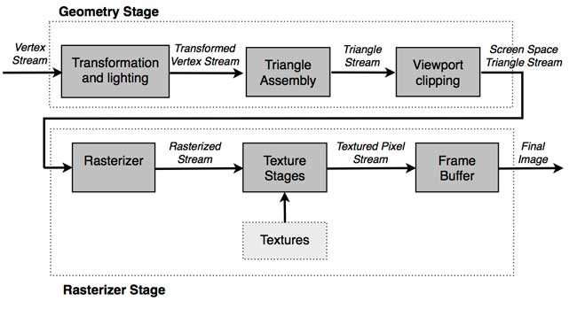
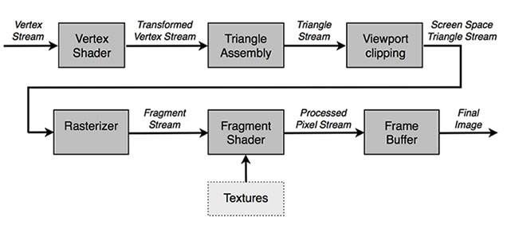
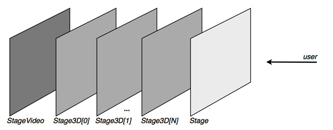

# How Stage3D works

by Marco Scabia

## Content

- [Understanding Stage3D](#understanding-stage3d)
- [Working with 3D hardware acceleration](#working-with-3d-hardware-acceleration)
- [Analyzing the 3D rendering pipeline](#analyzing-the-3d-rendering-pipeline)
- [Comparing the advantages and restrictions of working with Stage3D](#comparing-the-advantages-and-restrictions-of-working-with-stage3d)
- [Stage3D: The stage behind the Stage](#stage3d-the-stage-behind-the-stage)
- [Accessing Stage3D with ActionScript](#accessing-stage3d-with-actionscript)
- [Defining geometry with Vertex Buffers and Index Buffers](#defining-geometry-with-vertex-buffers-and-index-buffers)

## Requirements

### Prerequisite knowledge

A basic understanding of working with Flash Professional to build applications
is recommended. Prior experience developing with ActionScript 3 is also
required.

### User level

Beginning

### Required products

- [Adobe AIR SDK](https://airsdk.dev/) or
  [Apache Flex SDK](https://flex.apache.org)
- Flash Builder or Adobe Animate (formerly Flash Professional)
- Flash Player or Adobe AIR runtime

In this first tutorial in a series about working with Stage3D, you'll learn
about the new ActionScript API introduced by Adobe in AIR 3 and Flash Player 11
that allows to take advantage of hardware accelerated 3D rendering in Flash.
Over the course of this tutorial, you'll get an overview of what Stage3D is and
how it works. You'll also get to create some simple Stage3D geometry with Vertex
Buffers and Index Buffers using ActionScript.

### Understanding Stage3D

Over the past few years, developers have created some amazing projects using 3D
in Flash. 3D engines such as Papervision3D, Away3D, and Alternativa3D and all of
the great applications that have been made with these engines demonstrate the
strong demand for real-time 3D rendering in Flash.

Previously, Flash 3D rendering was performed without using 3D hardware
acceleration. In fact, all 3D rendering in Flash Player before version 11 was
accomplished using the software mode that relied on the CPU for rendering.
Software mode is slow and cannot be used to render detailed 3D scenes. Up until
now, it hasn't been possible to integrate advanced graphic effects that we're
all used to seeing in today's 3D games.

With the release of AIR 3 and Flash Player 11, new opportunities are now
available. Developers can leverage 3D hardware acceleration rather than relying
on the computer's CPU to do the rendering. The new mode of rendering enables
Flash 3D content to be handled by a secondary processor, part of the video
hardware of a computer, called the Graphics Processing Unit (GPU). GPU is a
piece of hardware that is totally dedicated to rendering objects in 3D.

#### Working with Stage3D

Stage3D is the new Flash API that Adobe recently released. It is dedicated to
real-time 3D rendering. With Stage3D, you can take full advantage of the
hardware accelerated capabilities of the user's computer GPU directly from
Flash.

The release of Stage3D is a huge event for Flash developers. Being able to use
3D acceleration in Flash opens up many possibilities for Flash games and Flash
applications that were previously not possible.

If you think back to the time when 3D hardware acceleration initially came out
for native platforms, you'll remember how it changed the world of 3D coding
forever. The quality and complexity of games increased exponentially. Hardware
acceleration has vastly improved the capabilities of 3D games, by enabling the
lightning-fast rendering required for complex models, realistic effects, and
responsive game play.

With its 98%+ of market penetration, Flash Player is ubiquitous. Games and
applications developed in Flash become instantly available for use on almost any
computer in the world. Users can enter the game's URL in a browser and begin
playing it immediately. Besides Flash Player, which is already installed on most
browsers, the user doesn't need to install anything: special runtime libraries,
OS versions, or special hardware are not required.

The ubiquity of Flash Player and 3D hardware acceleration is a powerful
combination that might transform the online gaming forever, similar to the rapid
evolution of computer games after the introduction of 3D-accelerated hardware.

Imagine the Flash websites common today: 2D experiences with content. And then
consider how they may change in the near future, as a 3D experience of a 3D
world, where users can immerse themselves in the environment as they explore it.
In the future, most websites may resemble a video game with interactive 3D
objects, rather than providing a simple 2D experience.

That's what Stage3D is all about. It's about leveraging the 3D hardware that is
present in any modern computer in order to build 3D games and 3D interactive
websites that can easily be experienced using every single computer connected to
the Internet.

### Working with 3D hardware acceleration

In this section, you'll get an overview of rendering Flash content with 3D
hardware acceleration.

3D hardware acceleration leverages a very advanced piece of hardware, the GPU,
which is included in all modern computers. GPU is totally dedicated to the task
of rendering content in 3D.

Using this setup, the software, your Flash application, will limit itself to
just specifying the definition of a 3D scene. It passes the 3D scene data to the
GPU hardware so that the hardware can process the data and render the scene.
This process is much faster than using the CPU to render 3D content with
software mode rendering.

Take a moment to compare the differences between software mode rendering and
hardware mode rendering.

Generally speaking, a 3D scene is defined as a group of 3D geometries (meshes).
Each geometry is specified as a set of triangles, and each triangle, in turn, is
comprised of a set of vertices. So, defining a 3D scene simply means to define a
set of vertices, and eventually add some related rendering information—such as
textures or vertex colors.

When you worked with the older software mode, a 3D engine such as Away3D would
receive this stream of vertices. It would calculate the screen positions of the
triangles and then prompt Flash Player to natively render those triangles one by
one, through a series of "fill" draw operations.

This process, although smartly coded within the engine, was extremely slow. In
some cases the rendering result wasn't particularly accurate. The content was
rendered per triangle, instead of per pixel. This caused depth sorting errors.
Triangles would sometimes render out of place, at the wrong depth.

In order to compare statistics, the software mode in Flash Player 10 typically
renders scenes with a maximum of 4,000 triangles to maintain acceptable
performance.

Now consider the possibilities with Stage3D. Using 3D hardware acceleration, the
software simply defines the geometries and then passes them on to the computer's
GPU. The geometries are uploaded to the GPU memory, which is a piece of memory
that sits on the video hardware that is dedicated for use by the GPU. The GPU
receives the data and processes it, completely taking over the job of rendering
the 3D content.

The software works much more efficiently because it is only required to pass the
parameters needed for rendering to the GPU. For example, the software specifies
where the eye point (the 3D camera) is located in the 3D scene, sets the
location of lights in the scene, and other details about the 3D objects and
effects in the scene.

The GPU receives all this data. It starts by analyzing the defined vertices and
begins rendering the scene triangle by triangle. The GPU produces the final
rendered image that is ready for display on the screen.

The GPU rendering process is much faster than software mode. The GPU is designed
to focus on a very specific task: it simply calculates the vertices and renders
triangles. That's it.

Since the hardware of the GPU is extremely specialized for this very specific
task, the hardware accelerated 3D rendering process is extremely efficient.

In contrast, the CPU is a generic processor. It not optimized for the specific
task of rendering triangles. As a result, it is much less efficient at the
rendering operation, as you may have experienced when rendering Flash 3D content
using software mode.

To compare the numbers, using hardware acceleration it's not uncommon to render
scenes that contain more than a million of triangles. A significant improvement
over the 4,000 triangles rendered in software mode.

### Analyzing the 3D rendering pipeline

Hardware-based 3D rendering is facilitated by a 3D rendering pipeline. The word
pipeline means that the rendering process is divided into a set of elementary
operations. The GPU consists of a series of blocks; each block is dedicated to
one of these elementary operations. The blocks are setup as a cascade so that
each block's output feeds the input of the following block.

The earliest type of 3D graphics rendering pipeline that was released was called
a fixed function pipeline. The word fixed refers to the fact that it was not a
programmable pipeline in any way. Fixed function pipelines are somewhat rigid,
because they simply receive geometry data as input, process the data through the
pipeline blocks, and produce the final output rendered image (see Figure 1).

Figure 1. The blocks of a fixed function graphics pipeline.

To work with a fixed function pipeline, you feed the GPU the following input:
geometry description (vertices and triangles), textures to apply to the
geometries, the position and orientation of the geometries in the 3D scene, the
position and orientation of the eye point (3D camera), lights (how many, what
color, and what position), and additional parameters needed to specify how the
rendering will take place.

In other words, using the older system, you pass the hardware a set of vertex /
triangle / texture data along with a set of parameters and the 3D hardware
renders it.

The fixed function pipeline includes a transform and lighting block that
transforms the vertices from local (model) space and projects them to the
screen. It also applies per-vertex lighting. This block is followed by a
viewport clipping block responsible for clipping the projected content to the
content that is actually visible, which adapts it to the format of the viewport
on the screen.

The projected and clipped data is then passed down the pipeline to the
rasterizer stage, which performs the texture mapping. It also eventually applies
fogging, alpha blending effects, and performs the depth buffering test necessary
for rendering triangle pixels with the proper depth sorted order.

Now, the fixed function pipeline has worked well for many years, but over time
it became apparent that this process of rendering was a bit rigid. Especially
regarding lighting, the rendering was limited to using the standard shading
models, such as the basic Goraud and Phong. The fixed function pipeline isn't
flexible enough for developers to add creatively fun and interesting effects. In
many cases, the renderings looked the same.

Then, the programmable graphics pipeline was introduced. A block diagram of the
programmable graphics pipeline illustrates the new process for rendering (see
Figure 2):

Figure 2. The blocks of the programmable graphics pipeline.

The big difference in the new system is the introduction of the two blocks
called Vertex Shader and Fragment Shader. These two blocks are actually
programmable. When you write an application using the programmable pipeline you
get to write code snippets, called Shaders, which affect what happens within the
rendering pipeline.

With the advent of this seemingly small change in the pipeline, the introduction
of Shaders, everything changed in the world of 3D rendering.

By writing little programs that affect how vertices are transformed and modified
(Vertex Shaders) and how triangle pixel colors are rendered (Fragment Shaders)
it is now possible to create amazing effects that could not be rendered before.
For example, using Shaders you can apply all kinds of lighting techniques, which
can now be custom programmed for a specific application, instead of using the
default lighting provided by the pipeline. Shaders make it possible to add
shadows, hardware accelerated bones systems, and many other cool effects.

Later in this tutorial series, you'll learn how to work with Shaders and the
programmable rendering pipeline. But for now, it's just important to know that
Stage3D is completely based on the programmable function pipeline. You don't
even have the option of using the fixed function pipeline. This is a benefit,
because you get to take advantage of the full power of the graphics hardware by
leveraging the programmability of Shaders. You can now create amazing effects in
Flash 3D projects.

With power also comes responsibility. In order to run even the simplest
rendering, you are required to write your own Shaders. Using the programmable
rendering pipeline, you cannot simply just set a few parameters and render a
project as before using the fixed function pipeline.

### Comparing the advantages and restrictions of working with Stage3D

In this section you'll learn the advantages of working with Stage3D compared to
the standard native platform 3D APIs: OpenGL and DirectX. OpenGL and Direct X
have been available for over a decade. They are the mainstream approach used to
create great games in modern computers.

To start, creating a 3D application using DirectX and OpenGL is not an easy
task. It's pretty straightforward to render a simple triangle, but creating a
full-blown 3D application in C++ requires quite a bit of skill. It's certainly
not a task for the inexperienced programmer.

One of the difficulties in creating a native 3D application has to do with using
the standard DirectX and OpenGL APIs. In order to provide developers with the
full power of the graphics hardware, the project must provide a full set of
hardware-specific options. The native APIs are really close to the hardware.
Development includes dealing with the hardware capabilities of the specific GPU
available when the application is running. And it is often necessary to tune
code, so that it can take full advantage of the most powerful hardware. This is
a benefit for developers, because you get to create the most amazing effects on
the most advanced hardware. But it also means that the application must be tuned
and tested for several different pieces of hardware.

This is not the case when working in Stage3D. You simply code against the
Stage3D abstractions, such as Context3D and Program3D. And the applications you
create will run on every platform that supports Flash Player (or the AIR
runtime).

In a way, Stage3D is a bit more abstract than native APIs and a bit more distant
from the hardware itself. As a result, Stage3D is much easier to use.

This, of course, also has some disadvantages because you don't really target
specific hardware in order to take advantage of the specific power available in
each platform. You just code generically for the virtual Stage3D platform;
Stage3D acts as a layer between your code and the actual hardware.

A big plus of Stage3D is that you combine 3D hardware accelerated code with the
great features and ease of use of regular 2D Flash authoring within the same
application.

When creating a native 3D application, the creation of the 2D UI often requires
custom solutions that rarely have authoring tools as flexible as Flash.

With Stage3D, regular Flash 2D content coexists with Stage3D content. So, you
get all the power of Flash and you also get 3D accelerated content. You can
choose to create a main 3D scene in the background or embed smaller 3D items
that are part of the 2D experience.

Stage3D applications can run on a multitude of platforms. You can execute
Stage3D applications as AIR applications as well as playing them with Flash
Player. This capability means that you can use Stage3D to create desktop 3D
applications, similar to the standard 3D games for the desktop. As of Adobe AIR
3.2, it is possible to use the same code to deploy the application to mobile
platforms, such as iOS and Android. When you consider the huge penetration of
Flash Player installed base, it's easy to see how wide the distribution of a
Stage3D application can potentially be.

#### Identifying the restrictions of Stage3D

The main drawbacks are based on the ability to develop one application for
multiple platforms. By targeting all platforms at the same time with a single
unified API, Stage3D cannot take advantage of the advanced features that are
only present in the most powerful 3D graphics.

To ensure that one app fits all, Stage3D has to abstract a 3D hardware device
that is a common denominator, in terms of graphics capabilities, among all the
platforms that are targeted.

For example, modern GPU hardware supports the Shader Model (the standard used
for Vertex and Fragment Shaders) version 4.0. However, Stage3D targets version
2.0 of the Shader Model.

This means that when you are coding in Stage3D you'll run across some
limitations that you wouldn't encounter on higher end hardware. For example, the
number of Shader registers available using a shading language such as AGAL are
quite limited. You can use a maximum of 8 temporary registers, instead of the
4096 available when coding registers in GLSL, with Shader Model 4.0.

Stage3D Shaders length can only contain a maximum of 200 OpCodes, while Shader
Model 4.0 supports 4096. And Stage3D Shaders do not support conditional
operations or loops, while Shader Model 3.0 and 4.0 do.

In other words, Shaders in Stage3D are designed to be very simple programs, as
opposed to coding for more advanced hardware and Shader Models. As a result,
some of the advanced effects using Shaders that you see in today's AAA games
might not be feasible with Stage3D.

### Stage3D: The stage behind the Stage

In this section you'll learn how Stage3D fits within the Flash display model.

Flash was designed based on the concept of the Stage. Every object displayed in
Flash is a `DisplayObject` that is added to the Stage. So, Stage is the
container of everything that is displayed. It is the root of all 2D items.

When Adobe introduced 3D rendering in Flash, they added a new set of special
Stages that are specifically dedicated to 3D. These special Stages are called
Stage3D (see Figure 3).

Figure 3. Understanding how Stage3D is displayed as the stage behind the Stage.

There are a series of Stage3D Stages, and they are located behind the main Flash
Stage. This means that the 3D content that you create with Stage3D is rendered
in the rectangular viewport of each specific Stage3D, and then the regular 2D
Flash content appears overlaid on top of it. You can see how you get the best of
both worlds in this way: you get the rendering of your 3D scene, using hardware
acceleration, and the 2D stuff (such as a game UI) on top. The UI can be created
using the power and flexibility of Flash, instead of working with some custom UI
creation tool.

You have a multitude of Stage3Ds available. Each Stage3D has its own rectangular
viewport. This means that you can have a rectangular 3D area in one portion of
your screen and add another one somewhere else, and lay the Flash 2D objects on
top of both. The various Stage3D and StageVideo layers can partially (or even
totally) overlap. However, this first release of Stage3D does not support
blending between layers. So, in areas where a Stage3D layer covers another
Stage3D layer, you'll only be able to see the top layer.

### Accessing Stage3D with ActionScript

In order to access the Stage3D API using ActionScript code, you'll declare one
of the Stage3D stages. The stages are available as an array as part of the main
Flash Stage.

You'll write code that looks something like this:

    var stage3D:Stage3D = stage.stage3Ds[0];

The primary class of the Stage3D API is not Stage3D itself. It is a class called
Context3D, which is more or less a rendering surface on steroids. It contains
the surface on which you will render the 3D objects, and includes all the
methods and properties needed to perform the rendering.

Context3D is the main entity you'll work with when using Stage3D.

The first thing you'll do with a Stage3D object is request a Context3D, like
this:

    stage.stage3Ds[0].addEventListener( Event.CONTEXT3D_CREATE, initStage3D );
    stage.stage3Ds[0].requestContext3D();
    ...
    protected function initStage3D(e:Event):void
    {
    	context3D = stage.stage3Ds[0].context3D;
    }

### Defining geometry with Vertex Buffers and Index Buffers

In Stage3D, the 3D scene that you render is comprised of a set of geometries (3D
meshes). Each geometry is defined by a set of triangles. And each triangle is
defined as a set of vertices.

All vertices that describe a geometry are packed together in a structure called
a Vertex Buffer. This structure contains all of the data relative to the
vertices. It is useful to keep this data all packed together because it can then
be uploaded in one batch to the GPU memory.

Here is an example of the definition of a Vertex Buffer:

    var vertices:Vector.<Number> = Vector.<Number>([
    	-0.3,-0.3,0, 1, 0, 0, // x, y, z, r, g, b
    	-0.3, 0.3, 0, 0, 1, 0,
    	0.3, 0.3, 0, 0, 0, 1,
    	0.3, -0.3, 0, 1, 0, 0]);

First, define all of the vertices in a Vector. Each vertex not only contains the
vertex positions, but may also contain additional data entries that specify
properties of that vertex. These fields in each vertex structure are called
Vertex Attributes.

Vertex Attributes can contain data related to the geometry that specifies how
the geometry will be rendered by the rendering pipeline. For example, vertex
colors or texture UV coordinates are usually specified for a geometry as Vertex
Attributes.

In the example above, the `vertices` Vector defines four vertices. Each line is
a vertex, and each vertex contains two Vertex Attributes: vertex position (the
first three entries of each line) and vertex color (the second three entries of
each line).

After creating this vector, you'll create a VertexBuffer3D instance.
VertexBuffer3D is a class in the Stage3D API that wraps the Vertex Buffer data
into the Stage3D API in order to upload the Vertex Buffer to GPU memory.

Here's the code you'll use to do that:

    // 4 vertices, of 6 Numbers each
    vertexbuffer = context3D.createVertexBuffer(4, 6);
    // offset 0, 4 vertices
    vertexbuffer.uploadFromVector(vertices, 0, 4);

In Stage3D, specifying a Vertex Buffer is not enough to define a geometry. This
is because 3D meshes in Stage3D are defined as indexed meshes.

In order to define a triangle, you must specify the three vertices of the
triangle. So, to define geometry triangles, you'll need an additional structure
that is used to index the vertices from the Vertex Buffer and assemble them into
triangles. This structure is called an Index Buffer.

If you consider that the Vertex Buffer above defines four vertices, imagine the
goal is to define a square, made of two triangles. The four vertices from the
Vertex Buffer, by themselves, are not enough to define the two triangles to
define a square.

Use the code below to create the additional Index Buffer:

    var indices:Vector.<uint> = Vector.<uint>([0, 1, 2, 2, 3, 0]);

In this code example, the first three entries in the `indices` Vector, 0, 1, and
2, specify that the first triangle consists of vertices 0, 1, and 2 taken from
the Vertex Buffer described above. Then, the Index Buffer generates a second
triangle that consists of vertices 2, 3 and 0, again from the Vertex Buffer.

Using an Index Buffer, you effectively define the triangles, in order to create
the geometry.

Like with the Vertex Buffer, the Index Buffer must be wrapped into its own
Stage3D specific structure, called IndexBuffer3D. You'll use the IndexBuffer3D
to upload your index buffer to the GPU, like this:

    // total of 6 indices. 2 triangles by 3 vertices each
    indexBuffer = context3D.createIndexBuffer(6);

    // offset 0, count 6
    indexBuffer.uploadFromVector (indices, 0, 6);

That's all that's required; the geometry is now defined.

### Where to go from here

At this point you've completed the overview of working with Stage3D, the new
powerful API released by Adobe that enables hardware accelerated 3D rendering
with AIR 3 and Flash Player 11. This tutorial is the first in a series of
tutorials on using Stage3D with ActionScript. Continue learning by following
along with the other tutorials in the series:

- [2. Vertex and fragment shaders](./vertex-and-fragment-shaders.md)
- [3. What is AGAL](./what-is-agal.md)
- [4. Hello Triangle](./hello-triangle.md)
- [5. Working with Stage3D and perspective projection](./working-with-stage3d-and-perspective-projection.md)
- [6. Working with 3D cameras](./working-with-3d-cameras.md)
- [7. Mipmapping for smoother textures in Stage3D](./mipmapping-for-smoother-textures-in-stage3d.md)
