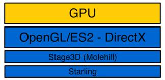
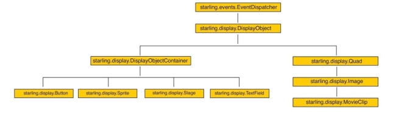
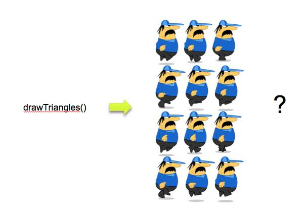
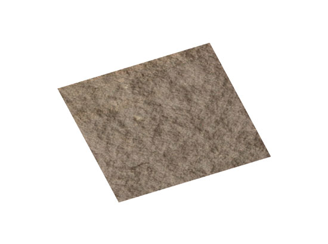
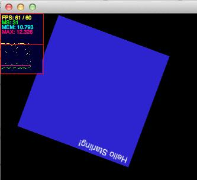
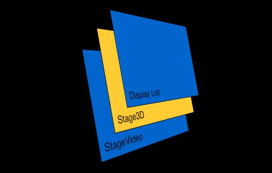
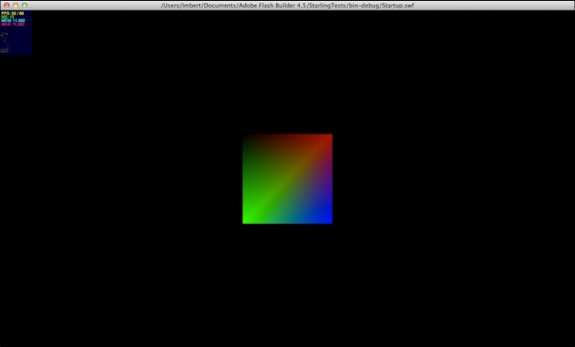
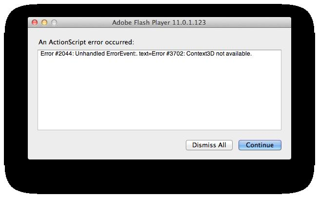
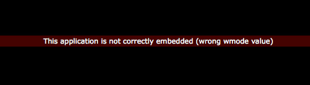

# Introducing the Starling 2D framework

by Thibault Imbert

## Content

- [Overview of Starling](#overview-of-starling)
- [Layering restrictions](#layering-restrictions)
- [Setting up a project](#setting-up-a-project)
- [Setting up a scene](#setting-up-a-scene)
- [Wmode requirements](#wmode-requirements)
- [Stage quality](#stage-quality)
- [Progressive enhancements](#progressive-enhancements)
- [Where to go from here](#where-to-go-from-here)

## Requirements

### Prerequisite knowledge

Prior experience programming with ActionScript 3 is required. Familiarity
developing projects in the Flash Builder workspace is recommended.

### User level

Advanced

### Required products

- [Adobe AIR SDK](https://airsdk.dev/) or
  [Apache Flex SDK](https://flex.apache.org)
- Flash Builder
- Flash Player or Adobe AIR runtime
- [Starling Framework](https://gamua.com/starling)

Starling is an ActionScript 3 2D framework developed on top of the Stage3D APIs,
available for the desktop in Adobe Flash Player 11 and AIR 3. Starling was
designed for game development, but you can use it for many other applications.
Starling makes it possible to write fast GPU accelerated applications without
having to touch the low-level Stage3D APIs.

Most Flash developers want the ability to leverage GPU acceleration (through
Stage3D) without having to write such higher-level frameworks and digging into
the low-level Stage3D APIs. Starling is completely based on the Flash Player
APIs and abstracts the complexity of Stage3D (Molehill). The result is intuitive
programming for everyone.

Starling is designed for ActionScript 3 developers, especially those involved in
2D game development. To use it, you must have a basic understanding of
ActionScript 3. Since Starling is lightweight, flexible and easy to use, you can
also use it for other project needs, such as UI programming. The framework is
designed to be as intuitive as possible, so any Java or .Net developer can begin
using it right away.

### Overview of Starling

Starling is intuitive and easy to learn. Flash and Flex developers will
understand it immediately because it follows most of the ActionScript dogmas and
abstracts the complexity of the low-level Stage3D APIs. Rather than coding
against concepts like vertices buffer, perspective matrices, shader programs,
and assembly bytecode, Starling uses familiar concepts such as a DOM display
list, an event model, and familiar APIs like MovieClip, Sprite, TextField, and
others.

Starling is a lightweight bird in many ways. The number of classes is limited
(around 80 KB of code). There are no external dependencies besides Flash Player
11 or AIR 3 (and mobile support is slated for a future release). These factors
keep your applications small and your workflow simple.

Starling is free and alive. It is licensed under the Simplified BSD license, so
you can use it freely even in commercial applications. We are working on it
every day and we count on an active community to improve it even more.

Behind the scenes, Starling uses the Stage3D APIs—which are low-level GPU APIs
running on top of OpenGL and DirectX on desktop and OpenGL ES2 on mobile
devices. It's important to note that Starling is the ActionScript 3 port of
[Sparrow](https://www.sparrow-framework.org/), the equivalent library for iOS
relying on OpenGL ES2 APIs (see Figure 1):

Figure 1. Stage3D (Molehill) is layered on top of Starling.

Starling recreates many APIs that are familiar to Flash developers. The graph
below illustrates the graphic element APIs exposed by Starling (see Figure 2):

Figure 2. Starling supports DisplayObject inheritance.

It's odd to consider that 2D content can be created on top of 3D GPU APIs. When
it comes to Stage3D APIs, many people think that those APIs are strictly limited
to 3D content. The name causes confusion: If it is called Stage3D, how can you
use it to create 2D elements? Figure 3 illustrates the question about the
ability to draw a MovieClip with the drawTriangles API.

Figure 3. Is it possible to use the drawTriangles API to create a 2D movie clip?

GPU are efficient and can draw triangles quickly. Using the drawTriangles API,
you can draw two triangles, and then sample a texture and apply it to the
triangles using UV mapping. This creates a textured quad, which represents a
sprite. By updating the textures on the triangles on each frame, the end result
is a MovieClip.

The good news is that it is not necessary to work through those details to use
Starling. You simply provide the frames, supply them to a Starling MovieClip and
that's all it takes (see Figure 4).

Figure 4. Using the drawTriangles API and a textured quad, you can create a 2D
graphic.

To better understand how Starling reduces the complexity, examine the code you
would have to write to display a simple textured quad using the low-level
Stage3D APIs:

    // create the vertices
    var vertices:Vector.<Number> = Vector.<Number>([
    -0.5,-0.5,0, 0, 0, // x, y, z, u, v
    -0.5, 0.5, 0, 0, 1,
    0.5, 0.5, 0, 1, 1,
    0.5, -0.5, 0, 1, 0]);

    // create the buffer to upload the vertices
    var vertexbuffer:VertexBuffer3D = context3D.createVertexBuffer(4, 5);

    // upload the vertices
    vertexbuffer.uploadFromVector(vertices, 0, 4);

    // create the buffer to upload the indices
    var indexbuffer:IndexBuffer3D = context3D.createIndexBuffer(6);

    // upload the indices
    indexbuffer.uploadFromVector (Vector.<uint>([0, 1, 2, 2, 3, 0]), 0, 6);

    // create the bitmap texture
    var bitmap:Bitmap = new TextureBitmap();

    // create the texture bitmap to upload the bitmap
    var texture:Texture = context3D.createTexture(bitmap.bitmapData.width,

    bitmap.bitmapData.height, Context3DTextureFormat.BGRA, false);

    // upload the bitmap

    texture.uploadFromBitmapData(bitmap.bitmapData);

    // create the mini assembler
    var vertexShaderAssembler : AGALMiniAssembler = new AGALMiniAssembler();

    // assemble the vertex shader
    vertexShaderAssembler.assemble( Context3DProgramType.VERTEX,
    "m44 op, va0, vc0\n" + // pos to clipspace
    "mov v0, va1" // copy uv
    );

    // assemble the fragment shader
    fragmentShaderAssembler.assemble( Context3DProgramType.FRAGMENT,
    "tex ft1, v0, fs0 <2d,linear, nomip>;\n" +
    "mov oc, ft1"
    );

    // create the shader program
    var program:Program3D = context3D.createProgram();

    // upload the vertex and fragment shaders
    program.upload( vertexShaderAssembler.agalcode, fragmentShaderAssembler.agalcode);

    // clear the buffer
    context3D.clear ( 1, 1, 1, 1 );

    // set the vertex buffer
    context3D.setVertexBufferAt(0, vertexbuffer, 0, Context3DVertexBufferFormat.FLOAT_3);
    context3D.setVertexBufferAt(1, vertexbuffer, 3, Context3DVertexBufferFormat.FLOAT_2);

    // set the texture
    context3D.setTextureAt( 0, texture );

    // set the shaders program
    context3D.setProgram( program );

    // create a 3D matrix
    var m:Matrix3D = new Matrix3D();

    // apply rotation to the matrix to rotate vertices along the Z axis
    m.appendRotation(getTimer()/50, Vector3D.Z_AXIS);

    // set the program constants (matrix here)
    context3D.setProgramConstantsFromMatrix(Co
    ntext3DProgramType.VERTEX, 0, m, true);

    // draw the triangles
    context3D.drawTriangles( indexBuffer);

    // present the pixels to the screen
    context3D.present();

The code sample above creates a square 2D instance (see Figure 5).

Figure 5. The result of using the drawTriangles API and a textured quad to
create a 2D object.

The code sample shown above is admittedly pretty complex. That is the cost of
having access to low-level APIs. On the plus side, you can control many aspects,
but it takes a considerable amount of code to set everything up.

With Starling, you can write the following code instead:

    // create a Texture object out of an embedded bitmap
    var texture:Texture = Texture.fromBitmap ( new embeddedBitmap() );

    // create an Image object our of the Texture
    var image:Image = new Image(texture);

    // set the properties
    quad.pivotX = 50;
    quad.pivotY = 50;
    quad.x = 300;
    quad.y = 150;
    quad.rotation = Math.PI/4;

    // display it
    addChild(quad);

As an ActionScript 3 developer, familiar with using the Flash APIs, you can
begin working with these APIs exposed immediately, while all the complexity of
the Stage3D APIs is handled behind the scenes.

If you experiment using the redraw regions feature, Starling renders everything
on Stage3D, not the classic display list, as expected. The screenshot below
illustrates this behavior. The quad rotates on each frame, and the redraw
regions only show the FPS counter, not the Stage3D content (see Figure 6).

Figure 6. Example of content rendered using Stage3D.

Remember that with the Stage 3D architecture, the content is completely rendered
and composited by the GPU. As a result, the redraw regions feature used for the
display list running on the CPU cannot be used.

### Layering restrictions

When you work with Starling (and Stage 3D), remember that there's one limitation
when developing content. As mentioned earlier, Stage3D is literally a new
rendering architecture inside Flash Player. A GPU surface is placed under the
display list, meaning that any content running inside the display list will be
placed above Stage3D content. At the time of this writing, content running in
the display list cannot be placed under the Stage3D layer (see Figure 7).

Figure 7. The stacking order of content rendered with Stage3D.

Also notice that the Stage3D object cannot be transparent. If this was possible,
you could play video using the Stage Video technology (introduced in Flash
Player 10.2) and overlay the video with content rendered through Stage3D.
Hopefully this feature will be enabled in a future release of Flash Player.

### Setting up a project

Visit the official [Github page](https://github.com/Gamua/Starling-Framework/)
to download Starling. You may also find it helpful to visit the
[Starling website](https://www.gamua/starling/).

Starling is licensed under the simplified BSD license, so you can use Starling
in any type of commercial or non-commercial project.

After you download Starling, you can reference the Starling library just like
any other AS3 library. In order to use AIR 3 or Flash Player 11 or newer, you
must target SWF version 13 or newer. Depending on which SDK you are using, you
may need to pass in an extra compiler argument to the AS3 compiler:
`-swf-version=13`.

> If you are targeting a newer version of Flash Player or AIR, see the
> [Table of SWF versions to use for specific AIR or Flash Player versions](https://github.com/BowlerHatLLC/vscode-as3mxml/wiki/swf%E2%80%90version-compiler-option)
> to find a more appropriate value for the `swf-version` compiler option. For
> example, to target Adobe AIR 32.0, it would be more appropriate to use
> `-swf-version=43`.

Follow these steps if you are using the Adobe Flash Builder:

1.  Download the [Adobe AIR SDK](https://airsdk.dev/) or the
    [Apache Flex SDK](https://flex.apache.org).
2.  Install the build in your development environment.
3.  In Flash Builder, create a new ActionScript project by choosing File \> New
    \> ActionScript project.
4.  Open the Property inspector (right-click and chose the Properties option).
    In the list on the left, select ActionScript Compiler.
5.  Use the Configure Flex SDK option in the upper right corner to point the
    project to your SDK. Click OK.
6.  Configure your project to target SWF version 13 or newer.
7.  Open the Property inspector and select ActionScript Compiler from the list
    on the left.
8.  Add to the "Additional compiler arguments" input: **-swf-version=13**. This
    ensures the outputted SWF targets SWF version 13. If you compile on the
    command-line and not in Flash Builder, you must add the same compiler
    argument.

### Setting up a scene

Now that you've prepared your development environment, you are ready to dig into
the code and see what you can do with the framework. Working with Starling is
very easy; simply create a `Starling` object and add it to your main class. In
this article, when referring to objects like `MovieClip`, `Sprite`, and others,
I am referring to the Starling APIs—not the native objects from Flash Player.

First, the Starling constructor expects multiple arguments. Here is the
signature:

    public function Starling(rootClass:Class, stage:flash.display.Stage,
    						 viewPort:Rectangle=null, stage3D:Stage3D=null,
    						 renderMode:String="auto")

Actually, only the first three are really used commonly. The `rootClass`
argument expects a reference to a class extending `starling.display.Sprite` and
as a second argument, our stage, then a Stage3D object:

    package
    {
    	import flash.display.Sprite;
    	import flash.display.StageAlign;
    	import flash.display.StageScaleMode;
    	import starling.core.Starling;

    	[SWF(width="1280", height="752", frameRate="60", backgroundColor="#002143")]
    	public class Startup extends Sprite
    	{
    		private var mStarling:Starling;

    		public function Startup()
    		{
    			// stats class for fps
    	addChild ( new Stats() );

    	stage.align = StageAlign.TOP_LEFT;
    	stage.scaleMode = StageScaleMode.NO_SCALE;

    	// create our Starling instance
    				mStarling = new Starling(Game, stage);

    			// set anti-aliasing (higher is better quality but slower               performance)
    			   mStarling.antiAliasing = 1;

    			// start it!
    	mStarling.start();
    		}
    	}
    }

Below, the Game class creates a simple quad when added to the Stage:

    package
    {
    	import starling.display.Quad;
    	import starling.display.Sprite;
    	import starling.events.Event;

    	public class Game extends Sprite
    	{
    	private var q:Quad;

    		public function Game()
    		{
    	addEventListener(Event.ADDED_TO_STAGE, onAdded);
    		}

    		private function onAdded ( e:Event ):void
    			{
    	q = new Quad(200, 200);
    	q.setVertexColor(0, 0x000000);
    	q.setVertexColor(1, 0xAA0000);
    	q.setVertexColor(2, 0x00FF00);
    	q.setVertexColor(3, 0x0000FF);
    	addChild ( q );
    			 }
    	}
    }

The code above adds a listener to the Event.ADDED_TO_STAGE event and initializes
the application in the event handler. That way, you can safely access the Stage.

**Note:** Pay attention to this subtle detail: The Game class shown above
extends the Sprite class from the starling.display package, not the
flash.display.package. Always check your import statements and make sure you are
not using the native API instead of the Starling APIs.

Just as expected in Flash, objects in Starling have a default position of 0,0.
So add a few lines to center the quad on the Stage:

    q.x = stage.stageWidth - q.width >> 1;
    q.y = stage.stageHeight - q.height >> 1;

Test the project so far to see the result (see Figure 8).

Figure 8. The quad is centered on the Stage.

Note that the anti-aliasing value allows you to set the type of anti-aliasing
desired. Generally speaking, a value of 1 is totally acceptable but you can go
further. The framework supports anti-aliasing values from 0 to 16, but the list
below reflects the most common values:

- 0: No anti-aliasing.
- 2: Minimal anti-aliasing.
- 4: High quality anti-aliasing.
- 16: Very high quality anti-aliasing.

You'll rarely need to use a setting above 2, especially for 2D content. However,
you'll need to decide on a case by case basis, depending on your projects. In
Figure 9, compare the two screenshots to see the slight difference between two
anti-aliasing values (1 and 4).

Figure 9. Compare the visual difference between applying an anti-aliasing value
of 1 (left) and 4 (right).

Experiment with applying values above 2 to set the quality needed for your
project. Of course, choosing a high value impacts the performance. Note that
Stage3D is not affected by the Stage quality of the SWF file.

Here are descriptions of the other APIs available for use with the Starling
object:

- **enableErrorChecking:** Allows you to enable or disable error checking.
  Specifies whether errors encountered by the renderer are reported to the
  application. When enableErrorChecking is set to true, the clear() and
  drawTriangles() methods called internally by Starling are synchronous and can
  throw errors. When enableErrorChecking is set to false, the default, the
  clear(), and drawTriangles() methods are asynchronous and errors are not
  reported. Enabling error checking reduces rendering performance. Only enable
  error checking when debugging a project and disable it before deploying the
  final version.
- **isStarted:**Indicates if start was called.
- **juggler:** A juggler is a simple object. It simply saves a list of objects
  implementing IAnimatable and advances their time if told to do so (by calling
  its own advanceTime: method). When an animation is completed, it throws it
  away.
- **start:** Starts the rendering and event handling.
- **stop:** Stops the rendering and event handling. Use this method to pause the
  rendering when the game goes into the background to save resources.
- **dispose:** Call this method when you want to dispose the entire content
  currently being rendered on the GPU memory. This API internally disposes
  everything (shader programs, textures, and everything else).

Once your `Starling` object has been created, a debug trace is outputted
automatically, displaying information about the renderer. By default, when the
SWF file is correctly embedded in the page or when testing in standalone Flash
Player, Starling will output the following:

    [Starling] Initialization complete.
    [Starling] Display Driver:OpenGL Vendor=NVIDIA Corporation Version=2.1 NVIDIA-7.2.9 Renderer=NVIDIA GeForce GT 330M OpenGL Engine GLSL=1.20 (Direct blitting)

Of course, the specific hardware details will vary, depending on your
configuration. The message above indicates the use of GPU acceleration because
it includes the details about the drivers version. For debugging purposes, you
may want to force the software fallback used internally by the Flash Player to
learn how your content will perform when running on software.

Add the following code to inform Starling that you want to use the software
fallback (software rasterizer):

    mStarling = new Starling(Game, stage, null, null, Context3DRenderMode.SOFTWARE);

When you are using software, the output message confirms that you are running in
software mode:

    [Starling] Initialization complete.
    [Starling] Display Driver:Software (Direct blitting)

Be sure to test your content in software mode too, to better understand its
performance when running in this mode. Your content may fallback to software if
the user's configuration is using old drivers (for consistency reasons, all
drivers older than 2009 are blacklisted).

In the next section, you'll take a look at the requirements for Stage3D when
embedding your SWF file in a page.

### Wmode requirements

You have to remember that in order to enable Stage 3D and GPU acceleration, you
have to use `wmode=direct` as the embed mode in the page. If you do not specify
any value or choose an other value than "direct"—like "transparent", "opaque",
or "window"—Stage 3D will not be available. Instead, you will get a runtime
exception informing you that the creation of the Context3D object failed when
`requestContext3D` on `Stage3D` is called.

Figure 10 illustrates the runtime exception dialog box.

Figure 10. Runtime exception, when Context3D is not available.

It is important to handle this situation if your application is embedded using
the wrong wmode. You need to react appropriately by displaying a message
explaining the issue. Fortunately, Starling handles this automatically for you
and display the message in Figure 11.

Figure 11. Warning message when the application is not correctly embedded.

### Stage quality

As a Flash developer, the concept of stage quality is not new to you. Remember
that when working with Stage3D, and as a result Starling, the stage quality has
no impact on the performance.

### Progressive enhancements

When GPU acceleration cannot be leveraged, Stage3D will fallback to software and
use internally a software fallback engine, called SwiftShader (Transgaming). To
make sure that your content runs well in such a scenario, you need to detect
when you are running in software and remove potential effects that would be slow
in software.

In the context of 2D content, software fallback should be able to handle many
objects and provide good performance, but still, to detect this, you can access
the Context3D object from the Starling object by using the static property
context:

    // are we running hardware or software?
    var isHW:Boolean = Starling.context.driverInfo.toLowerCase().indexOf("software") == -1;

It is a good practice to always design your content with software fallback in
mind, it will offer a progressive experience, ensuring the best experience
whatever the scenario.

### Where to go from here

Hopefully this article has inspired you to experiment working with 2D objects
using the Stage3D APIs. To learn more about Starling, check out the following
online resources:

- [Download the Introducing Starling book](https://web.archive.org/web/20120629142402/http://download.macromedia.com/pub/developer/flashplayer/introducing-starling.pdf)
- [Read more about the book on Thibault's blog](https://web.archive.org/web/20140302145813/http://www.bytearray.org/?p=3860)
- [Starling framework website](https://gamua.com/starling/)
