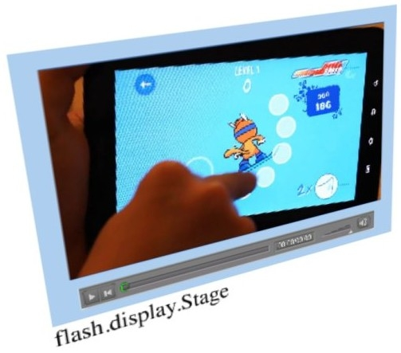
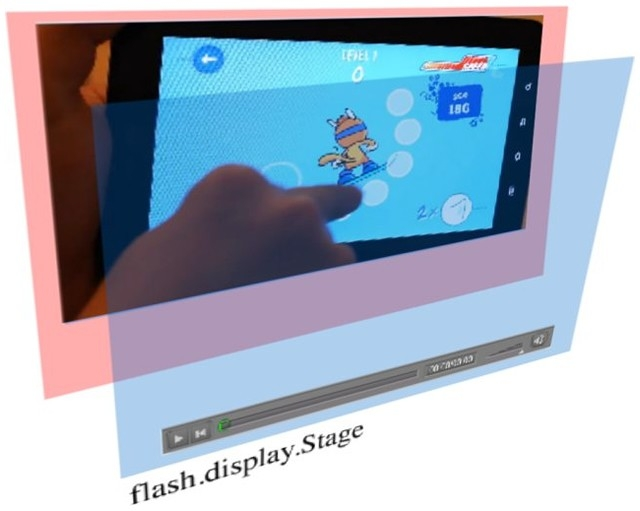

# Getting started with stage video

by Thibault Imbert

## Content

- [A new way to render video](#a-new-way-to-render-video)
- [StageVideo Limitations](#stagevideo-limitations)
- [StageVideo Requirements](#stagevideo-requirements)
- [The Stage Video API](#the-stage-video-api)
- [Working with color spaces](#working-with-color-spaces)
- [Gaining or losing stage video](#gaining-or-losing-stage-video)
- [Scenarios](#scenarios)
- [Where to go from here](#where-to-go-from-here)

## Requirements

### Prerequisite knowledge

A solid understanding of delivering video using Flash, including the
ActionScript APIs for video delivery and playback. Also helpful to know the
basics of HTTP, video delivery network protocols, and video encoding standards.

### User level

Intermediate

### Required products

- [Adobe AIR SDK](https://airsdk.dev/) or
  [Apache Flex SDK](https://flex.apache.org)
- Flash Builder or Adobe Animate (formerly Flash Professional)
- Flash Player or Adobe AIR runtime

### Sample files

- [simple-stage-video](https://github.com/joshtynjala/adobe-developer-connection-samples-archive/tree/main/simple-stage-video)

For the past few years, video has been one of the strongest trends on the web,
mainly pushed by Adobe Flash Player. H.264 and full-screen support introduced in
Flash Player 9 in 2007 really changed the game by making immersive HD video
experiences on the web possible. Recent implementations of Flash Player on
mobile devices have brought new ideas to the Flash Player team at Adobe for how
to display video in Flash and always improve the user experience. Stage video is
the result of those efforts.

The traditional method for rendering video in Flash Player uses the Video
object. The Video object is treated the same as any other object on the stage,
which gives developers an unprecedented amount of creative control. For example,
video can be displayed on each face of a spinning cube, or multiple videos can
be blended together with one another. The Video object is treated as any other
DisplayObject. Figure 1 illustrates this idea.

Figure 1. Multiple videos can be blended together using the Video object.

To support that level of creative control, Flash Player must do a significant
amount of processing for each video frame. Depending on the power of the
underlying device, this increased processing may decrease the frame rate of the
video, or it may increase the load that Flash Player places on the CPU.

### A new way to render video

To mitigate the performance impact of rendering video in the Video object, Adobe
has introduced stage video as a new way to render video. This approach takes
full advantage of the underlying video hardware. The result is a much lower load
on the CPU, which translates into higher frame rates on less powerful devices
and also less memory usage. With stage video, the StageVideo object does not sit
inside the Flash Player display list but sits behind the stage instead. Figure 2
illustrates this design.

Figure 2. The StageVideo object sits behind the Flash stage.

The performance benefits of stage video are especially pronounced for
televisions, set-top boxes, and mobile devices. These devices do not have CPUs
as powerful as desktop computers, but they do have very powerful video decoders
capable of rendering high-quality video content with very little CPU usage.
However, even on the desktop, stage video will dramatically change video
performance in Flash Player.

As a developer, you must understand that stage video is the second step of
enhancements related to video GPU acceleration in Flash Player. The first step
is encoding the video so as to take best advantage of the hardware acceleration
available on the target platform. Hence, to get the best experience possible,
you will need to have the two steps enabled. The H.264 codec is stage video's
best friend; using this will ensure you get full GPU acceleration from video
decoding to rendering. With this approach, no read-back (sending the data from
the GPU to the CPU) is required to composite the video frames in the display
list anymore. The
[YUV 4:2:0](https://en.wikipedia.org/wiki/Chroma_subsampling#4:2:0) formatted
video frames are converted to RGB through a GPU shader (DirectX9 or OpenGL) and
blitted onscreen. As a result, you will see higher pixel fidelity and some
reduction in CPU and memory usage.

### StageVideo Limitations

With stage video, the video is rendered onto a flash.media.StageVideo object
rather than a Video object. The StageVideo object is always shown in a
window-aligned rectangular region of the screen. Other graphics may be layered
on top of the StageVideo object, but it is not possible to layer objects behind
the video. Because StageVideo does not sit in the traditional display list but
is composited through the GPU, the following features are not available when the
StageVideo object is used:

- The StageVideo object cannot be rotated. Only orthogonal rotations (rotations
  in ninety-degree increments) are possible.
- The StageVideo object may not have a colorTransform or 3D transformations
  transform applied to it. It may not have a matrix transform applied that skews
  the video.
- The StageVideo object cannot have an alpha channel, blendMode, filter, mask,
  or scale9Grid applied to it.
- The video data cannot be copied into a BitmapData object (BitmapData.draw).
- The video cannot be bitmap-cached.
- The video data must not be embedded in the SWF file. StageVideo can be used
  only with videos originating from a NetStream object.
- Depending on the underlying hardware, some color spaces may not be supported.
  In such cases, Flash Player will choose a substitute color space. The new
  StageVideo ActionScript API provides a means to query the color space that is
  being used.
- Depending on the platform, the number of videos you are allowed to display in
  the video plane is limited. On most mobile systems, only one video is allowed
  at any time globally. That means that if you have several instances of SWF
  files showing at the same time, only the first SWF file will be able to
  display video in a hardware-accelerated fashion.
- To ensure compatibility between Flash Player on desktop and on TV devices, set
  `wmode` to `direct`.
- Avoid layering `wmode="transparent"` SWFs on top of each other. Platforms such
  as Google TV do not support `wmode="transparent"`. This means that all SWF
  instances are supported when `wmode="window"` regardless of the `<embed>` tag
  parameters.

In practice, none of the above restrictions will affect the most common use
case, which is a video player application. In cases where these restrictions are
acceptable, developers are strongly encouraged to use the StageVideo object.
Stage video is supported on the Google TV platform, on all AIR for TV platforms,
and it will soon be included on all platforms that support Flash.

If you want to read more about StageVideo on AIR for TV and Google TV, check out
the following article:
[Delivering video and content for the Flash Platform on TV](../../devices/articles/video-content-tv.md).

### StageVideo Requirements

To make sure stage video will be available, you must use `wmode="direct"` at all
times. This mode is highly recommended for video playback. It uses Direct3D on
Windows and OpenGL on Mac OS and Linux to actually perform video frame
compositing directly through the GPU. The limitation is that, in this mode,
Flash Player runs in its own context and having overlapping HTML content on top
of the player is not possible, for instance. If you decide to go with any other
mode, such as `wmode="window"`, `wmode="opaque"`, or `wmode="transparent"`, you
highly decrease the chances (see note) to have stage video available. As a
result, for consistency, it is highly recommended to use `wmode="direct"` at all
times.

**Note:** Some browsers such as Safari 4 (or later) or Internet Explorer 9,
where libraries like CoreAnimation (MacOS 10.6) or IE9 GPU APIs (Windows
Vista/7) can be leveraged, allow Flash Player to do compositing through the GPU
in the context of the browser as with `wmode="direct"`. As a result, this allows
stage video to be enabled regardless of the value of the `wmode` parameter. But
again, for consistency across browsers, just try to use `wmode="direct"` as much
as possible.

Now that you have learned the concept and limitations of stage video, see what
it looks like in terms of ActionScript implementation.

### The Stage Video API

Beginning with Flash Player 10.2, there is a new class called StageVideo that
represents a single video display instance in the hardware video plane.
StageVideo objects are created by Flash Player and cannot be instantiated on
their own. StageVideo objects can be accessed from the `stageVideos` vector
available on the Stage object:

    var v:Vector.<StageVideo> = stage.stageVideos;
    var sv:StageVideo;
    if ( v.length >= 1 )
    {
    	sv = v[0];
    }

The length of the `stage.stageVideos` vector will vary, depending on platform
and hardware availability, when the `stageVideos` property is accessed. The
maximum number of StageVideo objects you can expect is eight. Hence, if multiple
StageVideo objects are required in your application, this is completely possible
on the desktop. On mobile platforms, only one StageVideo object will be
available, so you will have to take this into account. Also, the length of the
vector will sometimes be zero. Rather than polling the length of the stageVideos
vector manually, to implement stage video correctly, you should always listen to
the `StageVideoAvailabilityEvent.STAGE_VIDEO_AVAILABILITY` event. This will
inform you about stage video ability.

At any time, you can listen to such an event and wait for the event to be
dispatched to react appropriately:

    stage.addEventListener(StageVideoAvailabilityEvent.STAGE_VIDEO_AVAILABILITY, onStageVideoState);

It will be dispatched once, right after registering your event handler, and
whenever the stage video availability changes over time. For more details about
this behavior, check the
[Gaining or losing stage video](#articlecontentAdobe_numberedheader_4) section.

In the `onStageVideoHandler`, rely on the `availability` property available in
the StageVideoAvailability event object:

    private function onStageVideoState(event:StageVideoAvailabilityEvent):void
    {
    	var available:Boolean = (event.availability == StageVideoAvailability.AVAILABLE);
    }

The `availability` property can have the following values:

- `StageVideoAvailability.AVAILABLE`: Stage video is available; at least one
  StageVideo object is waiting in the `stageVideos` vector.
- `StageVideoAvailability.UNAVAILABLE`: Stage video is not available; the
  `stageVideos` vector is empty.

Usually, once informed about the availability, you can decide what to do. If
stage video is available, a StageVideo object can be retrieved from the
`stage.stageVideos` vector. If stage video is not available, you will rely on a
classical Video object you have already created and use it as a fallback:

    private function toggleStageVideo(on:Boolean):void
    {
    	// if StageVideo is available, attach the NetStream to StageVideo
    	if (on)
    	{
    		if ( sv == null )
    		{
    			// retrieve the first StageVideo object
    			sv = stage.stageVideos[0];
    			sv.addEventListener(StageVideoEvent.RENDER_STATE, stageVideoStateChange);
    		}
    		sv.attachNetStream(ns);
    	} else
    	{
    		video.attachNetStream(ns);
    		stage.addChildAt(video, 0);
    	}
    	ns.play(FILE_NAME);
    }

You may have noticed that we also listen to a new event called
`StageVideoEvent.RENDER_STATE` on the StageVideo object. Note that this new
event is also available on the classical Video object through a similar event
called `VideoEvent.RENDER_STATE`, and informs us on how the video is being
rendered:

    private function stageVideoStateChange(event:StageVideoEvent):void
    {
    	var status:String = event.status;
    	resize();
    }

In Flash Player 10.1, it was not possible to know if the video frames were
decoded and composited through the GPU or not. This new event added to the
StageVideo and Video objects is fixing this limitation, beginning with Flash
Player 10.2. The `status` property can have the following values, available as
constants on the StageVideoEvent or VideoEvent classes:

- `VideoStatus.ACCELERATED`: The video is being decoded and composited through
  the GPU.
- `VideoStatus.SOFTWARE`: The video is being decoded though software and
  composited by the GPU, if dispatched by StageVideo, or through software, if
  dispatched by Video.
- `VideoStatus.UNAVAILABLE`: The video hardware has stopped decoding and
  compositing the video.

The StageVideoEvent is dispatched as soon as the NetStream is attached to the
StageVideo object, or VideoEvent for the Video object. For instance, if the
_status_ property from those events refers to `VideoStatus.SOFTWARE`, this
informs you that the video is being decoded through software. Then you can try
switching to another video stream—such as H.264 or a stream with different
dimensions—to give better chances to have it decoded on the GPU. If hardware
decoding is suddenly unavailable, you can fall back to a non-GPU accelerated
codec to force software decoding. Such an event can also be used for debugging
or logging to track the user experience.

As you can see, you can also use this event to handle video resize, as this new
event also tells you when the video size can be retrieved from the Video or
StageVideo objects and final width and height calculated depending on the
constraints.

This code computes the best size in the space available while preserving the
video ratio:

    private function resize ():void
    {
    	rc = computeVideoRect(sv.videoWidth, sv.videoHeight);
    	sv.viewPort = rc;
    }

Remember that StageVideo is not a DisplayObject, so it does not implement all
the expected properties that you'd use to position and scale a DisplayObject in
Flash. The previous code used the `viewPort` property rather than expected
properties like `width` and `height` to specify the video dimensions onscreen.

The StageVideo object exposes the following properties:

- `colorSpaces:Vector.<String>`: Color spaces available on the underlying
  hardware.
- `depth:int`: Depth of the StageVideo object. This property allows you to
  handle _z_-ordering among multiple StageVideo objects.
- `pan:Point`: Panning (similar to `x` and `y`); a Point object must be
  specified. By default, the value of `pan` is (0,0).
- `videoHeight:int`: Native height of the video stream; a read-only property.
- `videoWidth int`: Native width of the video stream; a read-only property.
- `viewport:Rectangle`: Visible surface (similar to `width` and `height`); a
  Rectangle object must be specified.
- `zoom:Point`: Zooming factor; a Point object must be specified. By default,
  the value of `zoom` is (1,1).

Note that StageVideo instances are rendered in order. The first StageVideo
object in the stageVideos vector is rendered first; the next ones are rendered
on top of the previous ones. To change this, you can manuallychange the order by
using the `depth` property:

    sv.depth = 0;
    sv2.depth = 1;

You may have noticed that the StageVideo object exposes a `colorSpaces` property
returning information regarding color spaces handled by the current hardware.
Now you'll discover now how this can be useful.

### Working with color spaces

The `colorSpaces` property can be accessed on a StageVideo object and returns a
Vector of Strings:

    var colorSpace:Vector.<String> = stageVideo.colorSpaces;

Color space names are enumerated in the flash.media.VideoColorSpace class:

    VideoColorSpace.BT601 = "BT.601";
    VideoColorSpace.UNKNOWN = "unknown";
    VideoColorSpace.BT709 = "BT.709";
    VideoColorSpace.SMPTE_240M = "SMPTE-240M";
    VideoColorSpace.USFCC:String = "USFCC";

Note that the player will try to match the color space of the StageVideo to the
color space of the video stream. On some machine configurations, if this
matching cannot be satisfied, Flash Player will then try to find the closest
match possible.

Keep in mind that some video containers may embed information regarding the
native color space of the video stream. As a result, Flash Player must respect
that. A common case is H.264, in which video streams are usually encoded in
`"BT.709"`—while the `colorSpaces` property might return `"BT.601"`, meaning the
underlying OS/graphics hardware did not have the capability to render a surface
in `"BT.709"` color space. If this happens, you can either revert back to using
software compositing (by using a classical Video object) or accept the color
mismatch. If `"unknown"` is returned, the platform does not offer a way to query
the actual color space being used.

### Gaining or losing stage video

Stage video may not be available when your SWF file is instantiated, but it may
become available at some time later. You may ask, why? As I explained before,
the `wmode` value you will choose when integrating your SWF file will determine
the stage video consistency across browsers. In some scenarios, you may not have
the ability to set `wmode="direct"`—for integration reasons in the HTML page,
for instance. Also, in full-screen mode, as Flash Player does not run in the
browser context, stage video will always be available regardless of the `wmode`
value. But note that when leaving full-screen mode, stage video may then become
unavailable again, placing your SWF file back in the browser context, impacted
by the `wmode` parameter.

**Note:** Because of this behavior, in a video player leveraging the StageVideo
API, you should always have a classical Video object to be used as a fallback.

As a result, you need to structure your video player in a way to react
appropriately. Luckily, this is fairly easy. If stage video becomes available,
just attach the NetStream object to the StageVideo object just retrieved. When
it becomes unavailable, just attach the previously attached NetStream to the
Video object used as a fallback.

Typically, you would modify your toggleStageVideo function as follows:

    private function toggleStageVideo(on:Boolean):void
    {
    	// if StageVideo is available, attach the NetStream to StageVideo
    	if (on)
    	{
    		stageVideoInUse = true;
    		if ( sv == null )
    		{
    			sv = stage.stageVideos[0];
    			sv.addEventListener(StageVideoEvent.RENDER_STATE, stageVideoStateChange);
    		}
    		sv.attachNetStream(ns);
    		if (classicVideoInUse)
    		{
    			// If using StageVideo, just remove the Video object from
    			// the display list to avoid covering the StageVideo object
    			// (always in the background)
    			stage.removeChild ( video );
    			classicVideoInUse = false;
    		}
    	} else
    	{
    		// Otherwise attach it to a Video object
    		if (stageVideoInUse)
    			stageVideoInUse = false;
    		classicVideoInUse = true;
    		video.attachNetStream(ns);
    		stage.addChildAt(video, 0);
    	}
    	if ( !played )
    	{
    		played = true;
    		ns.play(FILE_NAME);
    	}
    }

This code now handles properly situations where stage video becomes available or
unavailable with fallback to a classical Video object. When attaching the
NetStream back to a StageVideo object, as hardware resources must be allocated,
you may expect a little latency between the moment when you attach the NetStream
and the moment you see the pixels onscreen.

If you want to know more about how to leverage the StageVideo APIs, check the
files attached to this article. It contains a simple video player illustrating
all the different scenarios.

### Scenarios

As you have seen throughout this article, different scenarios can be met when
playing video in Flash Player. Here is a list of the different paths you can
encounter when playing video with the `Video` or `StageVideo` objects:

- **Video object playing a non-accelerated codec:** CPU will be used for
  decoding and compositing.
- **Video object playing a GPU accelerated codec (H.264):** GPU will be used for
  decoding but CPU will still be used for compositing.
- **StageVideo object playing a non-accelerated codec:** CPU will be used for
  decoding but GPU will be used for compositing.
- **StageVideo object playing a GPU accelerated codec (H.264):** GPU will be
  used for decoding and compositing. CPU will not be used at all for the entire
  pipeline. This is the "direct path" scenario you want to reach for best
  performance. Note that on Mac OS, hardware decoding of the H.264 video stream
  is available starting only with Snow Leopard, Mac OS 10.6.3.

### Where to go from here

Be sure to try out Flash Player 10.2, which introduces new features and
enhancements, including a new video hardware acceleration model that enables
dramatically enhanced video playback performance.

To fully enjoy this new StageVideo API, Adobe has introduced two little
improvements that were highly requested by the community:

- **Support for full-screen mode with multiple monitors:** Full-screen content
  will remain in full-screen mode on secondary monitors, allowing users to watch
  full-screen content while working on another display.
- **Full-screen detection capability:** The new `allowFullScreen` property, now
  available on the Stage object, enables developers to detect whetherthe current
  container/hosting page allows the player to go full-screen.

The StageVideo APIs will definitely change video performance in Flash. In some
scenarios, stage video can decrease reduce processor usage by up to 85 percent.
Even with the requirements to leverage it, make sure to use it as much as
possible. This will allow developers to leverage complete hardware acceleration
of the video-rendering pipeline, enabling best-in-class video playback
performance.
