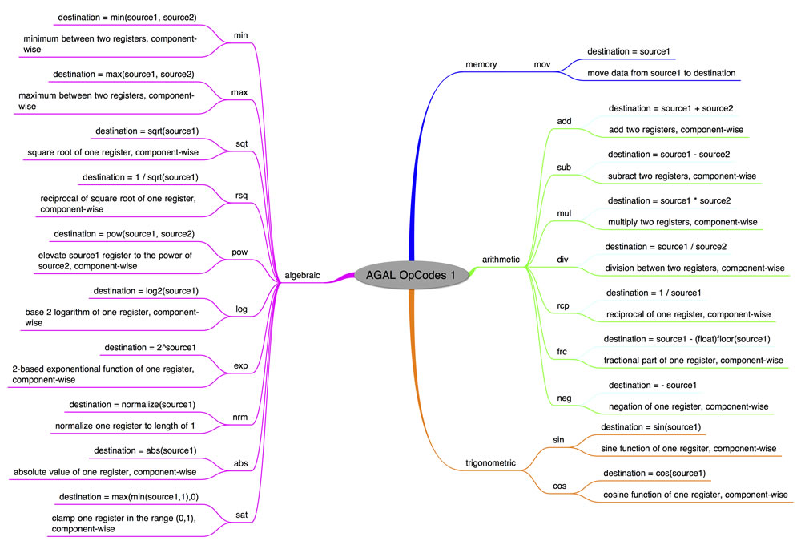
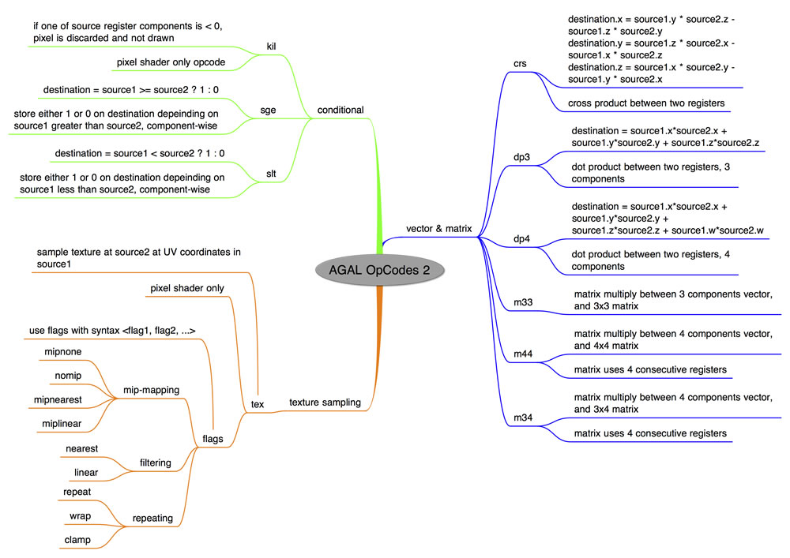

# What is AGAL

by Marco Scabia

## Content

- [Understanding Shading languages](#understanding-shading-languages)
- [Overview of AGAL and Pixel Bender 3D](#overview-of-agal-and-pixel-bender-3d)
- [Examining the syntax of AGAL](#examining-the-syntax-of-agal)
- [Identifying the main opcodes in AGAL](#identifying-the-main-opcodes-in-agal)
- [Working with AGAL registers](#working-with-agal-registers)
- [Creating a sample AGAL Shader](#creating-a-sample-agal-shader)
- [Building a sample ActionScript app with Program3D and AGAL Mini Assembler](#building-a-sample-actionscript-app-with-program3d-and-agal-mini-assembler)
- [Communicating to AGAL with ActionScript](#communicating-to-agal-with-actionscript)
- [Where to go from here](#where-to-go-from-here)

## Requirements

### Prerequisite knowledge

Basic familiarity with the Stage3D API is required. Prior knowledge of working
with Shaders and understanding how the Programmable Function Pipeline operates
is also recommended. Be sure to read first the first two tutorials in this
series on Stage3D (1. [How Stage3D works](./how-stage3d-works.md), 2.
[Vertex and Fragment Shaders](./vertex-and-fragment-shaders.md)) before
following along with these instructions.

### User level

Intermediate

### Required products

- [Adobe AIR SDK](https://airsdk.dev/) or
  [Apache Flex SDK](https://flex.apache.org)
- Flash Builder or Adobe Animate (formerly Flash Professional)
- Flash Player or Adobe AIR runtime

In this article you'll get an introduction to working with shading languages.
I'll cover the basics of using the low level shading language, called AGAL
(Adobe Graphics Assembly Language) that is included with the Stage3D API. You'll
learn what AGAL is, how it works, and how to use it as part of your
Stage3D-based ActionScript application.

### Understanding Shading languages

Before diving into AGAL specifically, it's a good idea to first understand what
a shading language is and how you can use it to create shaders.

Shaders are not written in ActionScript. They are not written in C++, or any
other general purpose language.

Shaders are usually written in a special language, called a shading language.

Shaders are programs that run on the GPU, so the most efficient way to code a
Shader is to use a language that is specifically engineered with the GPU in
mind. That's why you'll write Shaders using these special shading languages,
instead of using general purpose languages designed to code for a CPU.

There are several shading languages that have been used over the years, for the
two standard native 3D platforms (OpenGL and DirectX): GLSL and HLSL are two of
the most common shading languages.

For the Stage3D API, Adobe created two new shading languages to create programs
for the GPU: AGAL and Pixel Bender 3D.

### Overview of AGAL and Pixel Bender 3D

AGAL (Adobe Graphics Assembly Language) is an assembly language. It's a very low
level language, that is extremely close to what the GPU actually executes. A GPU
(and also a CPU for that matter) doesn't directly understand a high level kind
of language like ActionScript, which contains variables, classes, and so on.
GPUs only understand elementary machine language commands. There is a compiler
somewhere in the pipeline that translates the complex commands of the high level
language, into a series of simpler, lower level machine language commands.

With AGAL, you write commands directly at the lower level, similar to the
commands that the GPU understands.

Pixel Bender 3D is a much higher level language, so it's easier to use than
AGAL. Pixel Bender 3D is an extension of Pixel Bender, but it has been updated
to work with 3D and Shaders.

When it comes to choosing between Pixel Bender 3D and AGAL, there are pros and
cons to using both. Pixel Bender 3D is certainly a much easier language to use,
so it takes much less time to write a complex Shader.

On the other hand, AGAL is closer to how the GPU works. As a result, you get a
better understanding of what's really happening in your rendering pipeline. You
can hand optimize your Shader instead of letting a compiler do that for you. So,
if you invest the time to learn it, you may be able to create a better optimized
Shader using AGAL.

AGAL is also a good choice if your goal is to learn how Stage3D works. AGAL
enables you to run commands closer to the GPU—so it's easier to understand
what's really happening in the rendering pipeline.

It's important to note that when you use Pixel Bender 3D, you pre-compile your
Shaders at compile time. When you use AGAL, your Shaders come in the form of
Shader program strings, that are assembled into object code at run time. So, it
may be possible to create Shaders dynamically using AGAL.

For educational purposes on working with Stage3D, I believe that the best choice
is to start by learning AGAL.

### Examining the syntax of AGAL

AGAL is an assembly language. If you are used to the code syntax in
ActionScript, a language like AGAL that is an assembly might look a bit alien at
first.

Here's an example of an AGAL Vertex Shader:

    m44 op, va0, vc0
    mov v0, va1

I'll describe the syntax of the example above, so that you can decipher what
each of those assembly lines means.

Every line of the Shader is a command, specified by a 3 character string called
opcode.

The syntax of an AGAL code line is comprised of the following:

    <opcode> <destination>, <source 1>, <source 2 or sampler>

This is the key. Keep this syntax in mind and AGAL will suddenly stop looking
like unreadable gibberish.

Following the opcode, depending on the command, there may also be a destination,
and one or two sources. The destination and the sources are called registers:
small memory areas in the GPU for use by Shaders. I'll cover registers in more
detail later in this tutorial. The sources contain the values used in the
operation, and the destination is where the result is stored.

### Identifying the main opcodes in AGAL

AGAL features approximately 30 different opcodes. Here are some of the most
common ones.

- `mov:` moves data from source1 to destination, component-wise
- `add:` destination = source1 + source2, component-wise
- `sub:` destination = source1 – source2, component-wise
- `mul:` destination = source1 \* source2, component-wise
- `div:` destination = source1 / source2, component-wise
- `dp3:` dot product (3 components) between source1 and source2
- `dp4:` dot product (4 components) between source1 and source2
- `m44:` multiplication between 4 components vector in source1 and 4×4 matrix in
  source2
- `tex:` texture sample. Load from texture at source2 at coordinates source1.

Figure 1 and Figure 2 provide an overview of the full AGAL command set.

Figure 1. AGAL Memory, Arithmetic, Trigonometric and Algebraic related opcodes.

Figure 2. AGAL Vector and Matrix, Conditional, and Texture Sampling Related
opcodes.

### Working with AGAL registers

AGAL doesn't use variables to store data, like ActionScript and other high level
languages do. AGAL just uses registers.

Registers are small memory areas in the GPU that AGAL programs (Shaders) can use
during their execution. Registers are used to store both the sources and the
destination of AGAL commands.

You can also pass parameters to your Shaders through these registers.

Each register is 128 bits wide, which means that it contains 4 floating point
values. Each of these values is called a component of the register.

Register components can be accessed both through the coordinate accessors
(xyzw), and through the color accessors (rgba).

The first component of a register, can be accessed like this:

    <register name>.x

As well as with this code:

    <register name>.r

Sometimes registers contain coordinate-like data, while other times they contain
color data. By using the right kind of accessors, you can make your code clearer
and easier to read.

Some of the opcodes above, like `add`, perform their operations component wise.
This means that the addition operation is performed component by component, so
that the x component is added to the x component, the y component is added to
the y component, and so on.

There are six types of registers available.

#### 1. Attribute registers

These registers reference the Vertex Attribute data of the VertexBuffer that is
the input of the Vertex Shader. Therefore, they are only available in Vertex
Shaders.

This is the main data stream that the Vertex Shader is responsible for
processing. Each vertex attribute in the VertexBuffer has its own attribute
register.

In order to assign a VertexBuffer attribute to a specific attribute register,
use the function `Context3D:setVertexBufferAt()`, with the proper index.

Then from the Shader, access the attribute register with the syntax: `va<n>`,
where `<n>` is the index number of the attribute register.

There are a total of eight attribute registers available to Vertex Shaders.

#### 2. Constant registers

These registers serve the purpose of passing parameters from ActionScript to the
Shaders. This is performed with the `Context3D::setProgramConstants()` family of
functions.

These registers are accessed from the Shader with the syntax: `vc<n>` for Vertex
Shaders and `fc<n>` for Pixel Shaders, where `<n>` is the index number of the
constant register.

There are 128 constant registers available to Vertex Shaders, and 28
**c**onstant registers for Pixel Shaders.

#### 3. Temporary registers

These registers are available to Shaders, and they are used for temporary
calculations. Since AGAL doesn't use variables, you'll use temporary registers
to store data throughout your code.

Temporary registers are accessed with the syntax `vt<n>` (Vertex Shaders) and
`ft<n>` (Pixel Shaders) where `<n>` is the register number.

There are 8 temporary registers available for Vertex Shaders, and 8 for Pixel
Shaders.

#### 4. Output registers

The output registers are used by Vertex and Pixel Shaders to store the output of
their calculations. For Vertex Shaders, this output is the position of the
vertex. For Pixel Shaders it is the color of the pixel.

These registers are accessed with the syntax `op` for Vertex Shaders, and `oc`
for Pixel Shaders.

There is obviously only one output register for Vertex and for Pixel Shaders.

#### 5. Varying Registers

These registers are used to pass data from Vertex Shaders to Pixel Shaders. The
data that is passed is properly interpolated by the GPU, so that the Pixel
Shader receives the correct value for the pixel that is being processed.

Typical data that gets passed in this way is the vertex color or the UV
coordinates for texturing.

These registers can be accessed with the syntax `v<n>`, where `<n>` is the
register number.

There are 8 varying registers available.

#### 6. Texture sampler registers

Texture Sampler registers are used to pick color values from textures, based on
UV coordinates.

The texture to be used is specified through ActionScript with the call
`Context3D::setTextureAt().`

The syntax for using texture samplers is: `fs<n> <flags>`, where `<n>` is the
sampler index, and `<flags>` is a set of one or more flags that specifies how
the sampling should be made.

`<flags>` is a comma separated set of strings, that defines:

- texture dimension. Options: `2d, cube`
- mip mapping. Options: `nomip` (or `mipnone`, they are the same)
  `, mipnearest, miplinear`
- texture filtering. Options: `nearest, linear`
- texture repeat. Options: `repeat, wrap, clamp`

For example, a standard 2D texture without MIP mapping and linear filtering
could be sampled into temporary register `ft1`, with the following line:

    tex ft1, v0, fs0 <2d,linear,nomip>

In the example above, the varying register `v0` holds the interpolated texture
UVs.

### Creating a sample AGAL Shader

In this section, you'll go through a Shader example and get a better
understanding of how it operates.

Suppose the vertices in the Vertex Buffer contain vertex position, at offset 0,
and vertex color, at offset 3. The code looks like this:

    var vertices:Vector.<Number> = Vector.<Number>([
    	-0.3,-0.3,0, 1, 0, 0, // x, y, z, r, g, b
    	-0.3, 0.3, 0, 0, 1, 0,
    	0.3, 0.3, 0, 0, 0, 1]);

The goal is to make the Vertex Shader properly transform the vertex positions,
and to pass on each vertex color to the Pixel Shader.

You can achieve this with the following code:

    m44 op, va0, vc0 // pos to clipspace
    mov v0, va1 // copy color

The first line performs a 4×4 matrix multiplication between the vertex input
attribute register 0, va0, and a transformation matrix that is being passed in
from ActionScript. When rendering in perspective, this is usually the
transformation matrix from model space to clip space that we assume was passed
from ActionScript to the constant register 0, `vc0`.

Note: Clip space and perspective projection is discussed in more detail in the
next tutorial in this series, titled
[Working with Stage3D and perspective projection](./working-with-stage3d-and-perspective-projection.md).

The matrix can be passed to the Shader, into register `vc0` with the call:

    Context3D::setProgramConstantsFromMatrix(Context3DProgramType.VERTEX, 0, matrix, true );

The second line of the Vertex Shader, copies the vertex color data to Varying
Register 0, `v0`, so that it can get interpolated by the GPU, and passed to the
Pixel Shader.

The Pixel Shader simply copies the Varying Register `v0` color content to its
Output Register oc:

    mov oc, v0

So, this Vertex/Pixel Shader pair just transforms the 3D model vertices using a
transform matrix that gets passed in from ActionScript, and applies vertex
color.

This is it! Your first Vertex and Pixel Shaders.

### Building a sample ActionScript app with Program3D and AGAL Mini Assembler

So, how do you actually fit those bits of AGAL code into a working ActionScript
application? This is where the Stage3D API comes in.

    var program:Program3D = context3D.createProgram();

Before being able to use a `Program3D` (a Shader) for rendering, you first need
to upload it to the GPU. You do that by calling the method

    Program3D::upload(vertexByteCode: ByteArray, fragmentByteCode:ByteArray);

This method call needs as input the compiled, object code, version of the Vertex
and Fragment Shaders in order to upload it to the GPU.

A good way to compile AGAL Shaders into object code is to use the **AGAL Mini
Assembler**: a utility tool that takes as input the Vertex and Pixel Shaders
source code as strings, and compiles them at runtime into object code.

You can download AGAL Mini Assembler
[here.](https://github.com/Gamua/Starling-Framework/blob/master/starling/src/com/adobe/utils/AGALMiniAssembler.as)

So, first you are going to use AGAL Mini Assembler to compile the Vertex and
Pixel Shaders discussed above.

    var vertexShaderAssembler : AGALMiniAssembler = new AGALMiniAssembler();
    vertexShaderAssembler.assemble( Context3DProgramType.VERTEX,
    "m44 op, va0, vc0\n" + // pos to clipspace
    "mov v0, va1" // copy color
    );
    var fragmentShaderAssembler : AGALMiniAssembler= new AGALMiniAssembler();
    fragmentShaderAssembler.assemble( Context3DProgramType.FRAGMENT,
    "mov oc, v0"
    );

And then upload both Vertex and Pixel Shader programs to the GPU:

    var program:Program3D = context3D.createProgram();
    program.upload( vertexShaderAssembler.agalcode, fragmentShaderAssembler.agalcode);

### Communicating to AGAL with ActionScript

A Shader doesn't live just by itself. It is used by your main Stage3D based
ActionScript application. Therefore it needs the application to send to it the
data that needs to processed.

In general, Shaders will need VertexBuffer data (Vertex Attributes), Textures,
and additional parameters that the Shader may need from ActionScript, such as a
transform matrix.

At render time, before using a `Program3D`, and related VertexBuffers and
Textures, you'll need to enable them, by using the following calls:

- `Contex3D::setProgram(program:Program3D)`
- `Context3D::setVertexBufferAt(index:int, buffer:VertexBuffer3D, bufferOffset:int, format:String)`
- `Context3D::setTextureAt(sampler:int, texture:TextureBase)`

Note that `setVertexBufferAt` enables a specific Vertex Attribute at a certain
offset in the Vertex Buffer (parameter 3), and associates it to an Attribute
Register (stream) specified by index (first parameter).

The `setTextureAt` call enables a `Texture` and associates it with a certain
Texture Sampler specified by the first parameter `sampler`.

This would be the syntax to use these calls, right before rendering:

    // vertex position to attribute register 0
    context3D.setVertexBufferAt (0, vertexbuffer, 0, Context3DVertexBufferFormat.FLOAT_3);
    // assign texture to texture sampler 0
    context3D.setTextureAt( 0, texture );
    // assign shader program
    context3D.setProgram( program );

Before enabling any of these you need to make sure that they are uploaded to the
GPU, by calling the respective upload methods:

- `Program3D::upload()`
- `VertexBuffer3D::uploadFromVector(data:Vector.<Number>, startVertex:int, numVertices:int)`
- `Texture::uploadFromBitmapData(source:BitmapData, miplevel:uint = 0)`

Then you'll want to be able to pass in parameters to your Shaders as constants,
stored into Constant Registers. You do that with the following calls:

- `Context3D::setProgramConstantsFromVector(programType:String, firstRegister:int, data:Vector.<Number>, numRegisters:int = -1)`
- `Context3D::setProgramConstantsFromMatrix(programType:String, firstRegister:int, matrix:Matrix3D, transposedMatrix:Boolean = false)`

in order to write an ActionScript `Vector` or a `Matrix3D` respectively.

So, if you need to pass in a basic rotation matrix to your Shader you'll do
something like this:

    var m:Matrix3D = new Matrix3D();
    m.appendRotation(getTimer()/50, Vector3D.Z_AXIS);
    context3D.setProgramConstantsFromMatrix(Context3DProgramType.VERTEX, 0, m, true);

The matrix gets stored into Constant Register 0 here, for the Vertex Shader to
use.

### Where to go from here

This article introduced you to the concept of Shaders and to the AGAL shading
language. Creating a Shader is a required step if you want to build an
ActionScript 3D application that is based on the Stage3D API. While we didn't
get to build a fully working Stage3D application yet, the content of this
article is a fundamental block in being able to use the Stage3D API. In the next
article of this series I am going to put everything together, and show you how
to build an application that uses Stage3D to render a simple geometry.

- [4. Hello Triangle](./hello-triangle.md)
- [5. Working with Stage3D and perspective projection](./working-with-stage3d-and-perspective-projection.md)
- [6. Working with 3D cameras](./working-with-3d-cameras.md)
- [7. Mipmapping for smoother textures in Stage3D](./mipmapping-for-smoother-textures-in-stage3d.md)
