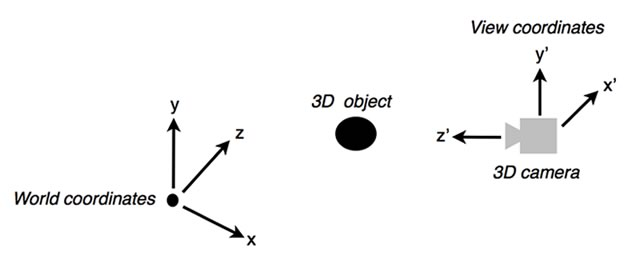

# Working with 3D cameras

by Marco Scabia

## Content

- [Working with 3D cameras](#working-with-3d-cameras-1)
- [Understanding world space and view space](#understanding-world-space-and-view-space)
- [Transforming 3D cameras](#transforming-3d-cameras)
- [Building a 3D camera application](#building-a-3d-camera-application)
- [Where to go from here](#where-to-go-from-here)

## Requirements

### Prerequisite knowledge

Experience setting up and running an ActionScript project based on the Stage3D
API is required. Prior knowledge of working with 3D perspective projection is
also recommended. Before following along with this tutorial, be sure to complete
the previous tutorials in this series on Stage3D (1.
[How Stage3D works](./how-stage3d-works.md), 2.
[Vertex and fragment shaders](./vertex-and-fragment-shaders.md), 3.
[What is AGAL](./what-is-agal.md), 4. [Hello Triangle](./hello-triangle.md), 5.
[Working with Stage3D and perspective projection](./working-with-stage3d-and-perspective-projection.md)).

### User level

Intermediate

### Required products

- [Adobe AIR SDK](https://airsdk.dev/) or
  [Apache Flex SDK](https://flex.apache.org)
- Flash Builder or Adobe Animate (formerly Flash Professional)
- Flash Player or Adobe AIR runtime

### Sample files

- [3d-cameras-demo](https://github.com/joshtynjala/adobe-developer-connection-samples-archive/tree/main/3d-cameras-demo)

In this tutorial you'll get an introduction to working with 3D cameras. A 3D
camera allows you to create an application where the user can roam through the
3D scene. The instructions provided in this tutorial describe how to create a
simple application that features a first person 3D camera that roams around a 3D
scene.

### Working with 3D cameras

To get a better understanding of 3D cameras, imagine you are shooting a movie.
You have to set up a scene that you want to shoot and you need a camera. To get
the footage, you'll roam through the scene with your camera, shooting the
objects in the scene from different angles and points of view.

The same filming process occurs with a 3D camera. You need a "virtual" camera,
which can roam around the "virtual" scene that you have created.

Two popular shooting styles involve watching the world through a character's
eyes (also known as a first person camera) or pointing the camera at a character
and keeping them in view (known as a third person camera).

This is the basic premise of a 3D camera: a virtual camera that you can use to
roam around a 3D scene, and render the footage from a specific point of view.

### Understanding world space and view space

To code this kind of behavior, you'll render the contents of the 3D world from
the camera's point of view, not just from the world coordinate system point of
view, or from some other fixed point of view.

Generally speaking, a 3D scene contains a set of 3D models. The models are
defined as a set of vertices and triangles, referenced to their own coordinate
system. The space in which the models are defined is called the model (or local)
space.

After placing the model objects into a 3D scene, you'll transform these models'
vertices using a "world transform" matrix. Each object has its own world matrix
that defines where the object is in the world and how it is oriented.

This new reference system is called "world space' (or global space). A simple
way to manage it is by associating a world transform matrix to each object.

In order to implement the behavior of a 3D camera, you'll need to perform
additional steps. You'll reference the world—not to the world origin—but to the
reference system of the 3D camera itself.

A good strategy involves treating the camera as an actual 3D object in the 3D
world. Like any other 3D object, you use a "world transform" matrix to place the
camera at the desired position and orientation in the 3D world. This **camera
world transform matrix** transforms the camera object from the original, looking
forward rotation (along the z-axis), to the actual world (xc, yc, zc) position,
and world rotation.

Figure 1 shows the relationships between the World (x, y, z) coordinate system
and the View (camera) (x', y', z') coordinate system.

Figure 1. Comparing World coordinate systems and View coordinate systems.

Now, you might be wondering what happens to the projection matrix transform
described in my previous tutorial titled
[Working with Stage3D and perspective projection](./working-with-stage3d-and-perspective-projection.md),
once you add 3D cameras into the equation. The way it works is that you still
apply the perspective projection transform last. So, if you are going to render
your 3D scene from the point of view of a 3D camera, you'll first want to apply
the 3D camera "view transform." After that, you'll apply the perspective
projection transform.

So, the entire set of transforms applied to a 3D model part of the 3D scene
looks like this:

    model space -> world space
    world space -> view space
    view space -> projection space

### Transforming 3D cameras

In this section you'll learn how to calculate the world space -\> view space
transform.

Begin with the camera world transform matrix, to transform the camera from the
world origin position and its "looking forward" rotation, to the actual current
camera position (xc, yc, zc) and its rotation into the 3D world.

Imagine that you are applying this transform as a Matrix3D property in your
application:

    protected var cameraWorldTransform:Matrix3D = new Matrix3D();

You can position the camera by modifying the matrix:

    cameraWorldTransform.appendRotation(20, Vector3D.Y_AXIS);
    cameraWorldTransform.appendTranslation(2, 3, 5);

Finally, in order to transform the objects as they are seen from the camera
point of view, you'll need the inverse of the camera world matrix.

    viewTransform = cameraWorldTransform.clone()
    viewTransform.invert();

Then, as you render each object, just append the `viewTransform` to each 3D
object's `worldTransform`.

### Building a 3D camera application

In this section you'll get started by creating a sample application that
features a 3D camera that roams around the 3D scene. I'll start from the code
provided in my previous tutorial titled
[Working with Stage3D and perspective projection](./working-with-stage3d-and-perspective-projection.md).

#### A camera keyboard controller

The process of properly controlling a 3D camera is not as simple as it might
seem. A "good" 3D camera should appear to move naturally. A 3D camera shouldn't
get into the way of the user. It should feel so natural that the user simply
forgets about it.

There are many ways to code a 3D camera controller. Controlling a 3D camera can
be as simple as rigidly stepping the camera by fixed amounts through the 3D
scene as the user presses keys on their keyboard, or it can be as involved as
attaching a full blown physics engine to the camera, including collision
detection with the objects inside the 3D scene.

This example illustrates how to build a simple 3D camera controller that uses
constant acceleration and some easing in order to control the camera based on
user interaction with the keyboard. First, you'll setup some code that
translates and rotates the camera around as the user presses the arrow keys.
Begin by defining the constant camera accelerations, and then calculate camera
velocities in order to set position and rotation from those values.

    protected const MAX_FORWARD_VELOCITY:Number = 0.05;
    protected const MAX_ROTATION_VELOCITY:Number = 0.5;
    protected const LINEAR_ACCELERATION:Number = 0.0005;
    protected const ROTATION_ACCELERATION:Number = 0.01;
    protected const DAMPING:Number = 1.09;
    ...
    stage.addEventListener( KeyboardEvent.KEY_DOWN, keyDownEventHandler );
    stage.addEventListener( KeyboardEvent.KEY_UP, keyUpEventHandler );
    ...
    protected function keyDownEventHandler(e:KeyboardEvent):void
    {
    	switch (e.keyCode)
    	{
    		case 37: // left arrow
    			cameraRotationAcceleration = -ROTATION_ACCELERATION;
    			break
    		case 38: // up arrow
    			cameraLinearAcceleration = LINEAR_ACCELERATION;
    			break
    		case 39: // right arrow
    			cameraRotationAcceleration = ROTATION_ACCELERATION;
    			break;
    		case 40: // down arrow
    			cameraLinearAcceleration = -LINEAR_ACCELERATION;
    			break;
    	}
    }

    protected function keyUpEventHandler(e:KeyboardEvent):void
    {
    	switch (e.keyCode)
    	{
    		case 37: // left arrow
    		case 39: // right arrow
    			cameraRotationAcceleration = 0;
    			break
    		case 38: // up arrow
    		case 40: // down arrow
    			cameraLinearAcceleration = 0;
    			break
    	}
    }

The two keyboard event handlers above simply set the linear (translation) and
rotation accelerations, based on keyboard input. These accelerations are then
used in the `updateViewMatrix` function, in order to calculate the current
camera world position and rotation.

In this example, the user presses the left and right arrows to rotate the
camera. The 3D camera's UP axis is always pointing up. In other words, the
camera will simply stand vertical and point forward. With this kind of setup,
rotating the camera involves applying a rotation around the Y axis. The
`updateViewMatrix` function applies this rotation, using the current camera
position as a pivot point.

The camera moves forward and backward as the user presses the up and down arrow
keys. Now, this camera, before applying the camera world transform matrix, will
be pointing along the z-axis, so the camera forward unity vector, in camera
local coordinates, is (0, 0, 1). Therefore, the camera forward velocity vector,
still in local coordinates, is something like this: `(0, 0, forwardVelocity)`.
The `updateViewMatrix` function calculates the updated camera position simply by
transforming this forward velocity vector to world coordinates.

    protected function updateViewMatrix():void
    {
    	cameraLinearVelocity.z = calculateUpdatedVelocity(cameraLinearVelocity.z, cameraLinearAcceleration, MAX_FORWARD_VELOCITY);
    	cameraRotationVelocity = calculateUpdatedVelocity(cameraRotationVelocity, cameraRotationAcceleration, MAX_ROTATION_VELOCITY);

    	cameraWorldTransform.appendRotation(cameraRotationVelocity, Vector3D.Y_AXIS, cameraWorldTransform.position);
    	cameraWorldTransform.position = cameraWorldTransform.transformVector(cameraLinearVelocity);

    	viewTransform.copyFrom(cameraWorldTransform);
    	viewTransform.invert();
    }

The `updateViewMatrix` function is also where the 3D camera magic happens, as
the updated `viewTransform` is calculated as the inverse of
`cameraWorldTransform`.

The `calculateUpdatedVelocity` function below simply calculates the updated
velocities starting from the current acceleration. It also adds some easing.

    protected function calculateUpdatedVelocity(curVelocity:Number, curAcceleration:Number, maxVelocity:Number):Number
    {
    	var newVelocity:Number;

    	if (curAcceleration != 0)
    	{
    		newVelocity = curVelocity + curAcceleration;
    		if (newVelocity > maxVelocity)
    		{
    			newVelocity = maxVelocity;
    		}
    		else if (newVelocity < -maxVelocity)
    		{
    			newVelocity = - maxVelocity;
    		}
    	}
    	else
    	{
    		newVelocity = curVelocity / DAMPING;
    	}
    	return newVelocity;
    }

### Camera rendering

After setting up the camera controller, the process of rendering the scene is
very simple. At every frame, right before rendering, you'll call the
`updateViewMatrix` function.

Then, you include the `viewTransform` matrix into the set of transforms that get
passed to the Vertex Shader, like this:

    protected function onRender(e:Event):void
    {
    	...
    	updateViewMatrix();

    	var m:Matrix3D = new Matrix3D();
    	m.appendRotation(getTimer()/30, Vector3D.Y_AXIS);
    	m.appendRotation(getTimer()/10, Vector3D.X_AXIS);
    	m.appendTranslation(0, 0, 2);
    	m.append(viewTransform);
    	m.append(projectionTransform);

    	context3D.setProgramConstantsFromMatrix(Context3DProgramType.VERTEX, 0, m, true);
    	...
    }

Here is the entire code used for the 3D camera application:

    package
    {
    	import com.adobe.utils.*;

    	import flash.display.Bitmap;
    	import flash.display.Sprite;
    	import flash.display.StageAlign;
    	import flash.display.StageScaleMode;
    	import flash.display3D.*;
    	import flash.display3D.textures.Texture;
    	import flash.events.*;
    	import flash.events.Event;
    	import flash.geom.Matrix3D;
    	import flash.geom.Rectangle;
    	import flash.geom.Vector3D;
    	import flash.utils.Timer;
    	import flash.utils.getTimer;

    	[SWF(width="800", height="600", frameRate="60", backgroundColor="#FFFFFF")]
    	/**
    	 *
    	 * @author Marco Scabia
    	 * http://iflash3d.com
    	 *
    	 */
    	public class CameraDemo extends Sprite
    	{
    		[Embed( source = "RockSmooth.jpg" )]
    		protected const TextureBitmap:Class;

    		protected var context3D:Context3D;
    		protected var vertexbuffer:VertexBuffer3D;
    		protected var indexBuffer:IndexBuffer3D;
    		protected var program:Program3D;
    		protected var texture:Texture;
    		protected var projectionTransform:PerspectiveMatrix3D;
    		protected var cameraWorldTransform:Matrix3D;
    		protected var viewTransform:Matrix3D;
    		protected var cameraLinearVelocity:Vector3D;
    		protected var cameraRotationVelocity:Number;
    		protected var cameraRotationAcceleration:Number;
    		protected var cameraLinearAcceleration:Number;

    		protected const MAX_FORWARD_VELOCITY:Number = 0.05;
    		protected const MAX_ROTATION_VELOCITY:Number = 0.5;
    		protected const LINEAR_ACCELERATION:Number = 0.0005;
    		protected const ROTATION_ACCELERATION:Number = 0.01;
    		protected const DAMPING:Number = 1.09;

    		public function CameraDemo()
    		{
    			stage.stage3Ds[0].addEventListener( Event.CONTEXT3D_CREATE, initMolehill );
    			stage.stage3Ds[0].requestContext3D();

    			stage.scaleMode = StageScaleMode.NO_SCALE;
    			stage.align = StageAlign.TOP_LEFT;

    			addEventListener(Event.ENTER_FRAME, onRender);

    			stage.addEventListener( KeyboardEvent.KEY_DOWN, keyDownEventHandler );
    			stage.addEventListener( KeyboardEvent.KEY_UP, keyUpEventHandler );
    		}

    		protected function keyDownEventHandler(e:KeyboardEvent):void
    		{
    			switch (e.keyCode)
    			{
    				case 37:
    					cameraRotationAcceleration = -ROTATION_ACCELERATION;
    					break
    				case 38:
    					cameraLinearAcceleration = LINEAR_ACCELERATION;
    					break
    				case 39:
    					cameraRotationAcceleration = ROTATION_ACCELERATION;
    					break;
    				case 40:
    					cameraLinearAcceleration = -LINEAR_ACCELERATION;
    					break;
    			}
    		}

    		protected function keyUpEventHandler(e:KeyboardEvent):void
    		{
    			switch (e.keyCode)
    			{
    				case 37:
    				case 39:
    					cameraRotationAcceleration = 0;
    					break
    				case 38:
    				case 40:
    					cameraLinearAcceleration = 0;
    					break
    			}
    		}

    		protected function initMolehill(e:Event):void
    		{
    			context3D = stage.stage3Ds[0].context3D;

    			context3D.configureBackBuffer(800, 600, 1, true);

    			var vertices:Vector.<Number> = Vector.<Number>([
    				-0.3,-0.3,0, 0, 0, // x, y, z, u, v
    				-0.3, 0.3, 0, 0, 1,
    				0.3, 0.3, 0, 1, 1,
    				0.3, -0.3, 0, 1, 0]);

    			// 4 vertices, of 5 Numbers each
    			vertexbuffer = context3D.createVertexBuffer(4, 5);
    			// offset 0, 4 vertices
    			vertexbuffer.uploadFromVector(vertices, 0, 4);

    			// total of 6 indices. 2 triangles by 3 vertices each
    			indexBuffer = context3D.createIndexBuffer(6);

    			// offset 0, count 6
    			indexBuffer.uploadFromVector (Vector.<uint>([0, 1, 2, 2, 3, 0]), 0, 6);

    			var bitmap:Bitmap = new TextureBitmap();
    			texture = context3D.createTexture(bitmap.bitmapData.width, bitmap.bitmapData.height, Context3DTextureFormat.BGRA, false);
    			texture.uploadFromBitmapData(bitmap.bitmapData);

    			var vertexShaderAssembler : AGALMiniAssembler = new AGALMiniAssembler();
    			vertexShaderAssembler.assemble( Context3DProgramType.VERTEX,
    				"m44 op, va0, vc0\n" + // pos to clipspace
    				"mov v0, va1" // copy uv
    			);
    			var fragmentShaderAssembler : AGALMiniAssembler= new AGALMiniAssembler();
    			fragmentShaderAssembler.assemble( Context3DProgramType.FRAGMENT,
    				"tex ft1, v0, fs0 <2d,linear,nomip>\n" +
    				"mov oc, ft1"
    			);

    			program = context3D.createProgram();
    			program.upload( vertexShaderAssembler.agalcode, fragmentShaderAssembler.agalcode);

    			cameraWorldTransform = new Matrix3D();
    			cameraWorldTransform.appendTranslation(0, 0, -2);
    			viewTransform = new Matrix3D();
    			viewTransform = cameraWorldTransform.clone();
    			viewTransform.invert();

    			cameraLinearVelocity = new Vector3D();
    			cameraRotationVelocity = 0;

    			cameraLinearAcceleration = 0;
    			cameraRotationAcceleration = 0;

    			projectionTransform = new PerspectiveMatrix3D();
    			var aspect:Number = 4/3;
    			var zNear:Number = 0.1;
    			var zFar:Number = 1000;
    			var fov:Number = 45*Math.PI/180;
    			projectionTransform.perspectiveFieldOfViewLH(fov, aspect, zNear, zFar);
    		}

    		protected function calculateUpdatedVelocity(curVelocity:Number, curAcceleration:Number, maxVelocity:Number):Number
    		{
    			var newVelocity:Number;

    			if (curAcceleration != 0)
    			{
    				newVelocity = curVelocity + curAcceleration;
    				if (newVelocity > maxVelocity)
    				{
    					newVelocity = maxVelocity;
    				}
    				else if (newVelocity < -maxVelocity)
    				{
    					newVelocity = - maxVelocity;
    				}
    			}
    			else
    			{
    				newVelocity = curVelocity / DAMPING;
    			}
    			return newVelocity;
    		}

    		protected function updateViewMatrix():void
    		{
    			cameraLinearVelocity.z = calculateUpdatedVelocity(cameraLinearVelocity.z, cameraLinearAcceleration, MAX_FORWARD_VELOCITY);
    			cameraRotationVelocity = calculateUpdatedVelocity(cameraRotationVelocity, cameraRotationAcceleration, MAX_ROTATION_VELOCITY);

    			cameraWorldTransform.appendRotation(cameraRotationVelocity, Vector3D.Y_AXIS, cameraWorldTransform.position);
    			cameraWorldTransform.position = cameraWorldTransform.transformVector(cameraLinearVelocity);

    			viewTransform.copyFrom(cameraWorldTransform);
    			viewTransform.invert();
    		}

    		protected function onRender(e:Event):void
    		{
    			if ( !context3D )
    				return;

    			context3D.clear ( 1, 1, 1, 1 );

    			// vertex position to attribute register 0
    			context3D.setVertexBufferAt (0, vertexbuffer, 0, Context3DVertexBufferFormat.FLOAT_3);
    			// uv coordinates to attribute register 1
    			context3D.setVertexBufferAt(1, vertexbuffer, 3, Context3DVertexBufferFormat.FLOAT_2);
    			// assign texture to texture sampler 0
    			context3D.setTextureAt(0, texture);
    			// assign shader program
    			context3D.setProgram(program);

    			updateViewMatrix();

    			var m:Matrix3D = new Matrix3D();
    			m.appendRotation(getTimer()/30, Vector3D.Y_AXIS);
    			m.appendRotation(getTimer()/10, Vector3D.X_AXIS);
    			m.appendTranslation(0, 0, 2);
    			m.append(viewTransform);
    			m.append(projectionTransform);

    			context3D.setProgramConstantsFromMatrix( Context3DProgramType.VERTEX, 0, m, true);

    			context3D.drawTriangles(indexBuffer);

    			context3D.present();
    		}
    	}
    }

### Where to go from here

In this article you received a simple introduction to 3D cameras. You learned
how to create a basic application based on Stage3D that features a roaming 3D
camera based on user input. The topic of 3D cameras is vast, and there is a lot
to cover if you want to research further. To learn more, I recommend a good book
by Mark Haigh-Hutchinson called
"[Real-Time Cameras](https://www.amazon.com/Real-Time-Cameras-Mark-Haigh-Hutchinson/dp/0123116341)."

You will also be interested in reading about
[Mipmapping](./mipmapping-for-smoother-textures-in-stage3d.md).
