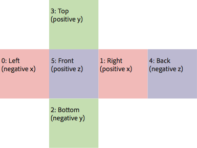

# Adobe Texture Format (ATF) tools user's guide

## by Thibault Imbert


## Content

- [ATF basics](#atf-basics)
- [png2atf](#png2atf)
- [pvr2atf](#pvr2atf)
- [dds2atf](#dds2atf)
- [ATFViewer](#atfviewer)
- [atfinfo](#atfinfo)
- [Where to go from here](#where-to-go-from-here)

## Requirements

### Prerequisite knowledge

Some familiarity with command-line tools and texture file formats will help you
make the most of this guide.

### User level

Intermediate

### Required products

- [Adobe AIR SDK](https://airsdk.dev/) or
  [Apache Flex SDK](https://flex.apache.org)
- Flash Player or Adobe AIR runtime

Adobe Texture Format, or ATF is the recommended file type for fixed texture
assets that are used with the Flash runtime's Stage3D API.

This guide is a reference for the following tools, which Adobe provides to
create and manage ATF files (Adobe Texture Files):

- png2atf
- pvr2atf
- dds2atf
- ATFViewer
- atfinfo

### ATF basics

ATF files rely on compression, and there are some limitations that you need to
keep in mind.

#### ATF compression

An ATF file is a file container for storing texture data. The ATF file format
achieves its lossy compression through the use of two common techniques:
[JPEG XR](https://www.itu.int/rec/T-REC-T.832) compression and block-based
compression. JPEG XR compression provides a competitive method to save storage
space and network bandwidth. Block-based compression provides a way to reduce
texture memory usage on the client, at a fixed ratio of 1:8 compared to RGBA
textures. ATF supports four types of block-based compression:
[DXT1](https://msdn.microsoft.com/en-us/library/bb147243%28v=VS.85%29.aspx)/[DXT5](https://msdn.microsoft.com/en-us/library/bb147243%28v=VS.85%29.aspx), [ETC1](https://www.khronos.org/registry/gles/extensions/OES/OES_compressed_ETC1_RGB8_texture.txt),
[ETC2](https://www.opengl.org/registry/specs/ARB/ES3_compatibility.txt), and
[PVRTC](https://web.archive.org/web/20170724100249/https://www.imgtec.com/powervr/insider/powervr-pvrtexlib.asp).

In ATF files, compression is performed on two levels. The first type of
compression is optional block-based compression. On top of that, standard
lossless or lossy JPEG XR compression is applied. Other features of the ATF file
format include:

- Embedding mipmaps
- Optionally embedding a complete cube map (sky map)
- Optional support for selecting an internal color space (4:4:4, 4:2:2, and
  4:2:0)

#### ATF limitations

ATF files have various limitations that are the direct result of existing
hardware capabilities on various mobile devices. These limitations include:

- The maximum size for a texture is 4096 by 4096 pixels  (if profile is
  baselineExtended or lower, maximum texture size is 2048 by 2048).
- The length of each side of a texture must be a power of two: 1, 2, 4, 8, 16,
  32, 64, 128, 256, 512, 1024, 2048 or 4096.
- If your texture uses the maximum 4096x4096 size, you must provide at least one
  regular mipmap level. This is because certain devices only allow texture sizes
  up to 1024x1024. The Flash runtime will automatically switch the texture size
  to 1024x1024 if necessary. Similary if your texture uses 2048\*2048 size, you
  must provide at lest one regular mipmap levels.

### png2atf

The png2atf command-line utility converts a PNG file to an ATF file. The
resulting ATF file can then be used with the Texture class's
`uploadCompressedTextureFromByteArray()` method. It takes any valid PNG file as
input. By default it converts the PNG file to either an RGB or RGBA ATF file,
depending on whether the PNG file includes transparency. The `png2atf `tool can
optionally create a texture with block-based compression.

#### Example usage

To convert a PNG file to an RGB or RGBA ATF file run the png2atf command:

    > png2atf -i test.png -o test.atf
    .
    [In 1365KB][Out 61KB][Ratio 4.49851%][LZMA:0KB JPEG-XR:61KB]

To create a texture file with block-based compression run the command with the
-c parameter; for example:

    > png2atf -c -i test.png -o test.atf
    ..........................................................
    [In 682KB][Out 682KB][Ratio 99.9954%][LZMA:937KB JPEG-XR:682KB]

#### Command-line options

Table 1 shows `png2atf `command-line options.

**Table 1.** png2atf command-line options

<table>
<colgroup>
<col style="width: 50%" />
<col style="width: 50%" />
</colgroup>
<tbody>
<tr class="odd">
<td width="139"><br />
<strong>Parameter</strong></td>
<td width="499"><p><strong>Description</strong></p></td>
</tr>
<tr class="even">
<td width="139"><p>-i &lt;file&gt;</p></td>
<td width="499"><p>Specifies the input file name.</p></td>
</tr>
<tr class="odd">
<td width="139"><p>-o &lt;file&gt;</p></td>
<td width="499"><p>Specifies the output file name.</p></td>
</tr>
<tr class="even">
<td width="139"><p>-c</p></td>
<td width="499"><p>Creates the output file with block-based compression.
Three types of block-based compression textures are created and embedded
into the output ATF file: DXT1, ETC1, ETC2, and PVRTC 4bpp. To create
ATF with multiple block-based texture, you can specify any combination
of e, e2, d, or p arguments to create ATF with ETC1, ETC2, DXT, or
PVRTC, respectively. Specifying only -c argument creates ATF with all
the four block-based compressions.</p>
<p>When you load this type of texture into Flash Player or AIR, the
runtime uses the appropriate format for the device.</p>
<p>If the PNG file includes transparency, <code>png2atf</code> creates
an RGBA texture instead. Use the <code>atfinfo</code> tool to find out
what format an ATF file includes.</p></td>
</tr>
<tr class="odd">
<td width="139"><p>-m</p></td>
<td width="499"><p>Creates a cube map texture. A cube map texture
requires six input files. The input files need to be named consecutively
in the form XXXn.png where XXX is the base file name and n=0-5, for
example: cube0.png, cube1.png, cube2.png, cube3.png, cube4.png,
cube5.png. You only specify the first file as the input file with the -i
parameter (cube0.png in this example).<br />
The arrangement of the files is shown in Figure 1.</p></td>
</tr>
<tr class="even">
<td width="139"><p>-n &lt;start&gt;,&lt;end&gt;</p></td>
<td width="499"><p>Turns off auto-generation of mipmaps and only embeds
a specific range of texture levels (the main texture plus mipmaps). The
range is defined in the form
<code>&lt;start&gt;</code>,<code>&lt;end&gt;</code>, where
<code>0</code> is the main texture and the mipmaps start with level 1.
If you leave off this parameter, <code>png2atf</code> generates all
applicable mipmap levels. However, in some cases (such as for sky maps)
it is not desirable to enable mipmaps.</p></td>
</tr>
<tr class="odd">
<td width="139"><p>-s</p></td>
<td width="499"><p>Silences the tool's output during compression. You
may want to use this parameter for batch processing.</p></td>
</tr>
<tr class="even">
<td width="139"><p>-4</p></td>
<td width="499"><p>Instructs the JPEG XR encoder to use the 4:4:4 color
space internally. This is the default for block-based compression. In
some cases it is desirable to use this color space for RGB/RGBA
textures, for example if you see color bleeding artifacts around red or
blue shapes or for normal maps.</p></td>
</tr>
<tr class="odd">
<td width="139"><p>-2</p></td>
<td width="499"><p>Instructs the JPEG XR encoder to use the 4:2:2 color
space internally. Adobe recommends that you do not use this color space
for block-based compression because it can cause severe
artifacts.</p></td>
</tr>
<tr class="even">
<td width="139"><p>-0</p></td>
<td width="499"><p>Instructs the JPEG XR encoder to use the 4:2:0 color
space internally. In general, Adobe recommends that you do not use this
color space for block-based compression because it can cause severe
artifacts. However, it might be worth experimenting with this option if
the image data is monochromatic.</p></td>
</tr>
<tr class="odd">
<td width="139"><p>-q &lt;0-180&gt;</p></td>
<td width="499"><p>Selects the quantization level, which determines how
much the image data should be compressed. Higher values create more
artifacts and smaller values reduce artifacts.<br />
A value of 0 means lossless compression (the default for block-based
compression textures). Adobe recommends that you do not use lossy
compression for block-based compression. However, it might be worthwhile
to experiment with this value on a case-by-case basis.<br />
The default value for RGB and RGBA textures is 30.<br />
This value should not be confused with the standard JPEG compression
factor. It is similar in concept, but it applies in a different
nonlinear range.</p></td>
</tr>
<tr class="even">
<td width="139"><p>-f &lt;0-15&gt;</p></td>
<td width="499"><p>Selects how many flex bits are trimmed during JPEG XR
compression. This option is not related to the quantization level.
Rather, it selects how much noise is retained across the image. Higher
values create more artifacts and lower values create fewer artifacts.
The default value is 0.</p></td>
</tr>
</tbody>
</table>



Figure 1. Texture files used to create a cube map ATF file

### pvr2atf

The `pvr2atf `command-line utility converts a PVR texture file to an ATF file.
The resulting ATF file can be used with the Texture class's
`uploadCompressedTextureFromByteArray() `method. This tool works similarly to
png2atf except that the input file is in the PVR texture format. For block-based
compression, you must provide precompressed textures in the form of three PVR
files.

#### Example usage

To convert a PVR file to an RGB or RGBA ATF file run the pvr2atf command; for
example:

    > pvr2atf -r test.pvr -o test.atf
    .
    [In 4096 KB][Out 410 KB][Ratio 10.0241%][LZMA:0KB JPEG-XR:410KB]

To create a texture file with block-based compression run the command shown
below, in which each PVR file represents a block-compressed format file:

    > pvr2atf -d test_dxt1.pvr -e test_etc1.pvr -p test_pvrtc.pvr -o test.atf
    ..........................................................
    [In 2048KB][Out 1704KB][Ratio 83.2007%][LZMA:937KB JPEG-XR:766KB]

To create a single block compressed file run the command shown below, in which
case other formats are left empty (however, this may potentially create runtime
exceptions when `uploadCompressedTextureFromByteArray() `is used):

    > pvr2atf -d test_dxt1.pvr -o test.atf
    ..........................................................
    [In 2048KB][Out 1704KB][Ratio 83.2007%][LZMA:937KB JPEG-XR:766KB]

#### Accepted PVR texture types

The `pvr2atf `tool accepts the following types of PVR files:

- OpenGL ES 2.0 RGB 888 (OGL_RGB_888)
- OpenGL ES 2.0 RBGA 8888 (OGL_RGBA_8888)
- DirectX 9 DXT 1 (D3D_DXT1, D3D_BC1)
- DirectX 9 DXT 5 (D3D*DXT5, D3D_BC3)  
  \_Note: This format is supported only in Flash Player 10.4 (SWF17) and newer.*
- ETC2 RGB 888  
  _Note: This format is supported only in AIR for mobile (SWF29) and newer._
- ETC2 RGBA 888  
  _Note: This format is supported only in AIR for mobile (SWF29) and newer._
- ETC1
- PVRTC 4BPP (opaque) (OGL_PVRTC4)
- PVRTC 4BPP (transparent) (OGL_PVRTC4)  
  *Note:* *This format is supported only in Flash Player 10.4 (SWF17) and
  newer.*

You should not create PVR file in SRGB format as the SRGB textures are not
supported in the runtime.

The tool does not accept flipped textures. Make sure that you create your PVR
texture with the flipping option turned off. This can be done using the
`-yflip0 `option of the
[PVRTexTool](https://web.archive.org/web/20170724100249/http://www.imgtec.com/powervr/insider/powervr-pvrtextool.asp)
command-line tool or by deselecting the Flipped checkbox in the PVRTexTool GUI
tool.

#### Command-line options

Table 2 shows `pvr2atf `command-line options.

**Table 2.** pvr2atf command-line options

<table>
<colgroup>
<col style="width: 50%" />
<col style="width: 50%" />
</colgroup>
<tbody>
<tr class="odd">
<td width="111"><br />
Parameter</td>
<td width="528"><p>Description</p></td>
</tr>
<tr class="even">
<td width="111"><p>-r &lt;file&gt;</p></td>
<td width="528"><p>Specifies the input RGB or RGBA PVR file. This option
can't be used together with the -d, -e, or -p options.</p></td>
</tr>
<tr class="odd">
<td width="111"><p>-d &lt;file&gt;</p></td>
<td width="528"><p>Specifies the input DXT1 PVR file.</p></td>
</tr>
<tr class="even">
<td width="111"><p>-e &lt;file&gt;</p></td>
<td width="528">Specifies the input ETC1 PVR file.</td>
</tr>
<tr class="odd">
<td width="111"><p>-e2 &lt;file&gt;</p></td>
<td width="528">Specifies the input ETC2 PVR file.<br />
<em>Note: This command line option is supported in SWF version 29</em>
<em>and newer</em>.</td>
</tr>
<tr class="even">
<td width="111"><p>-p &lt;file&gt;</p></td>
<td width="528"><p>Specifies the input PVRTC PVR file.</p></td>
</tr>
<tr class="odd">
<td width="111"><p>-o &lt;file&gt;</p></td>
<td width="528"><p>Specifies the output file.</p></td>
</tr>
<tr class="even">
<td width="111"><p>-s</p></td>
<td width="528"><p>Silences the tool's output during compression. You
may want to use this parameter for batch processing.</p></td>
</tr>
<tr class="odd">
<td width="111"><p>-4</p></td>
<td width="528"><p>Instructs the JPEG XR encoder to use the 4:4:4 color
space internally. This is the default for block-based compression. In
some cases it is desirable to use this color space for RGB/RGBA
textures, for example if you see color bleeding artifacts around red or
blue shapes or for normal maps.</p></td>
</tr>
<tr class="even">
<td width="111"><p>-2</p></td>
<td width="528"><p>Instructs the JPEG XR encoder to use the 4:2:2 color
space internally. Adobe recommends that you do not use this color space
for block-based compression because it can cause severe
artifacts.</p></td>
</tr>
<tr class="odd">
<td width="111"><p>-0</p></td>
<td width="528"><p>Instructs the JPEG XR encoder to use the 4:2:0 color
space internally. In general, Adobe recommends that you do not use this
color space for block-based compression because it can cause severe
artifacts. However, it might be worth experimenting with this option if
the image data is monochromatic.</p></td>
</tr>
<tr class="even">
<td width="111"><p>-q &lt;0-180&gt;</p></td>
<td width="528"><p>Selects the quantization level, which determines much
the image data should be compressed. Higher values create more artifacts
and smaller values reduce artifacts.<br />
A value of 0 means lossless compression (the default for block-based
compression textures). Adobe recommends that you do not use lossy
compression for block-based compression. However, it might be worthwhile
to experiment with this value on a case-by-case basis.<br />
The default value for RGB and RGBA textures is 30.<br />
This value should not be confused with the standard JPEG compression
factor. It is similar in concept, but it applies in a different
nonlinear range.</p></td>
</tr>
<tr class="odd">
<td width="111"><p>-f &lt;0-15&gt;</p></td>
<td width="528"><p>Selects how many flex bits are trimmed during JPEG XR
compression. This option is not related to the quantization level.
Rather, it selects how much noise is retained across the image. Higher
values create more artifacts and lower values create fewer artifacts.
The default value is 0.</p></td>
</tr>
</tbody>
</table>

### dds2atf

The `dds2atf `command line utility converts DDS texture file to ATF file. The
resulting ATF file can then be used with the
`uploadCompressedTextureFromByteArray() `method of ActionScript 3 API. The tool
works similarly to png2atf, except that you have to provide input files in the
DDS texture file format.

**Example usage**  
To convert a DDS file to an ATF file run the dds2atf command; for example:

    > dds2atf -i test.dds -o test.atf

**Accepted DDS texture types**  
The `dds2atf` utility accepts the following types of DDS files:

- DirectX 9 RGB 888 (D3DFMT_R8G8B8)
- DirectX 9 BGRA 8888 (D3DFMT_A8R8G8B8)
- DirectX 9 DXT 1 (D3DFMT_DXT1)
- DirectX 9 DXT5 (D3DFMT*DXT5)  
  \_Note: This format is only supported in Flash Player 10.4 (SWF17) and newer.*

**Command-line options**

Table 3 shows `dds2atf `command-line options.

**Table 3.** dds2atf command-line options

<table>
<colgroup>
<col style="width: 50%" />
<col style="width: 50%" />
</colgroup>
<tbody>
<tr class="odd">
<td width="111"><br />
Parameter</td>
<td width="528"><p>Description</p></td>
</tr>
<tr class="even">
<td width="111"><p>-i &lt;file&gt;</p></td>
<td width="528"><p>Specifies the input DDS file.<br />
</p></td>
</tr>
<tr class="odd">
<td width="111"><p>-o &lt;file&gt;</p></td>
<td width="528"><p>Specifies the output file.</p></td>
</tr>
<tr class="even">
<td width="111"><p>-4</p></td>
<td width="528">Instructs the JPEG XR encoder to use the 4:4:4 color
space internally. This is the default for block-based compression. In
some cases it is desirable to use this color space for RGB/RGBA
textures, for example if you see color bleeding artifacts around red or
blue shapes or for normal maps.</td>
</tr>
<tr class="odd">
<td width="111"><p>-2</p></td>
<td width="528"><p>Instructs the JPEG XR encoder to use the 4:2:2 color
space internally. Adobe recommends that you do not use this color space
for block-based compression because it can cause severe
artifacts.</p></td>
</tr>
<tr class="even">
<td width="111"><p>-0</p></td>
<td width="528"><p>Instructs the JPEG XR encoder to use the 4:2:0 color
space internally. In general, Adobe recommends that you do not use this
color space for block-based compression because it can cause severe
artifacts. However, it might be worth experimenting with this option if
the image data is monochromatic.</p></td>
</tr>
<tr class="odd">
<td width="111"><p>-q &lt;0-180&gt;</p></td>
<td width="528"><p>Selects the quantization level, which determines much
the image data should be compressed. Higher values create more artifacts
and smaller values reduce artifacts.<br />
A value of 0 means lossless compression (the default for block-based
compression textures). Adobe recommends that you do not use lossy
compression for block-based compression. However, it might be worthwhile
to experiment with this value on a case-by-case basis.<br />
The default value for RGB and RGBA textures is 30.<br />
This value should not be confused with the standard JPEG compression
factor. It is similar in concept, but it applies in a different
nonlinear range.</p></td>
</tr>
<tr class="even">
<td width="111"><p>-f &lt;0-15&gt;</p></td>
<td width="528"><p>Selects how many flex bits are trimmed during JPEG XR
compression. This option is not related to the quantization level.
Rather, it selects how much noise is retained across the image. Higher
values create more artifacts and lower values create fewer artifacts.
The default value is 0.</p></td>
</tr>
<tr class="odd">
<td>-n &lt;start,end&gt;</td>
<td><p>Embeds a specific range of textures for texture streaming. Range
starts from 0 for the main texture, and 1 and above for mip levels. The
size information of the main level is retained when the .atf file is
created even when a sub set of ranges are selected.<br />
Typical example for texture streaming, creating three levels for a
512x512 texture:<br />
dds2atf –n 1,1 –i i.dds –o ohigh.atf<br />
dds2atf –n 2,2 –i i.dds –o omed.atf<br />
dds2atf –n 3,9 –i i.dds –o olow.atf</p>
<p>To stream these three levels, create a 512x512 texture in
ActionScript and then upload olow.atf, omed.atf, and ohigh.atf in this
sequence.<br />
<em>Note: Texture streaming is only supported in Flash Player 10.4 and
newer.<br />
</em> </p></td>
</tr>
</tbody>
</table>

### ATFViewer

ATFViewer is a GUI tool for previewing and inspecting ATF files. The primary
purpose of ATFViewer is to audit DXT1, ETC1, ETC2, and PVRTC compression
artifacts.

To open and view an ATF file, launch the ATFViewer application, and then choose
File \> Open or drag an ATF file into the window from the file system. The ATF
file's contents appear in the main window (see Figure 2).

> Image Missing

<!--  -->

Figure 2. The ATFViewer tool

The snippet preview area (also shown below) shows an example of how to load the
ATF file in ActionScript 3 code.

```actionscript
[Embed( source = "mytexture.atf", mimeType="application/octet-stream")]
public static const CubeTextureAsset:Class;

public var context3D:Context3D;
public function init():void{
	var cubeTexture:CubeTexture = context3D.createCubeTexture(512, Context3DTextureFormat.COMPRESSED, false);
	var cubeTextureAsset:ByteArray = new CubeTextureAsset() as ByteArray;
	cubeTexture.uploadCompressedTextureFromByteArray(cubeTextureAsset, 0);
}
```

### atfinfo

The `atfinfo `command-line utility displays internal information about ATF
files. It prints the size, mipmap count, texture type, and texture format of the
ATF file, as well as whether the file contains a cube map. It also lists the
ActionScript 3 class and texture format that correspond to the format of the ATF
file. The following is an example invocation of `atfinfo `and its output:

```
> atfinfo -i hello.atf
File Name          : hello.atf
ATF Version        : 3
ATF File Type      : RAW Compressed (DXT1+ETC1+PVRTV4bpp+ETC2 RGB)
Size               : 512x512
Cube Map           : no
Empty Mipmaps      : no
Embedded Levels    : XXXXXXXXXX (512x512,256x256,128x128,64x64,32x32,16x16,8x8,4x4,2x2,1x1)
AS3 Texture Class  : Texture (flash.display3D.Texture)
AS3 Texture Format : Context3DTextureFormat.COMPRESSED (flash.display3D.Context3DTextureFormat)
```

### Where to go from here

For more information on the benefits of using ATF files, see
[Introducing compressed textures with the ATF SDK](./introducing-compressed-textures.md).

> This work is licensed under a
> [Creative Commons Attribution-Noncommercial-Share Alike 3.0 Unported License](https://creativecommons.org/licenses/by-nc-sa/3.0/)
