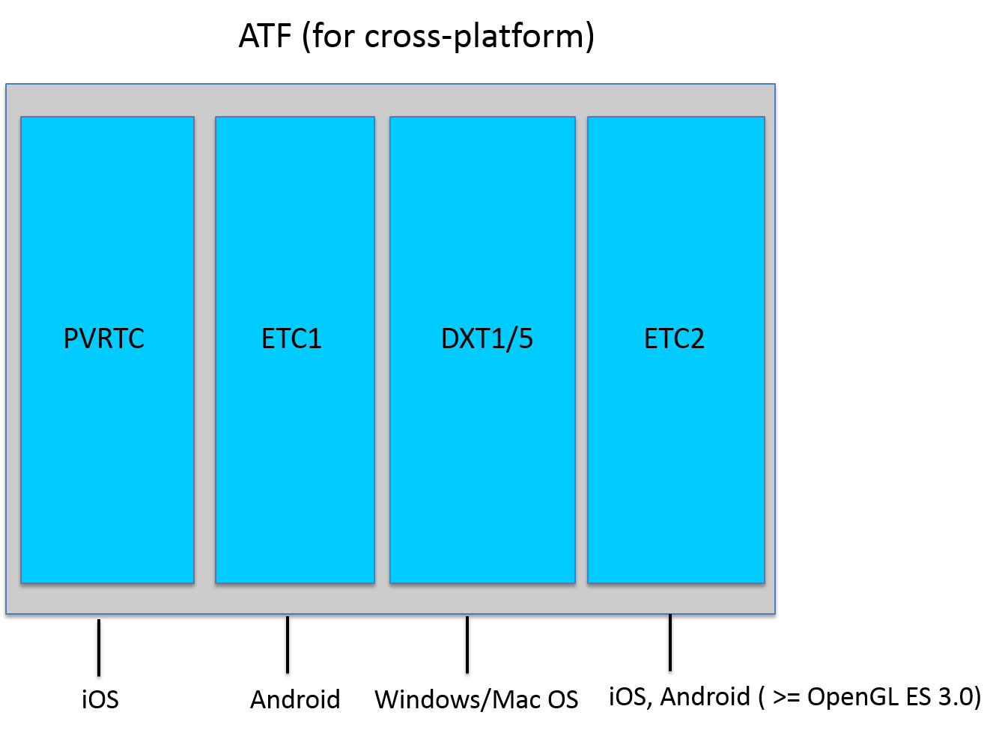
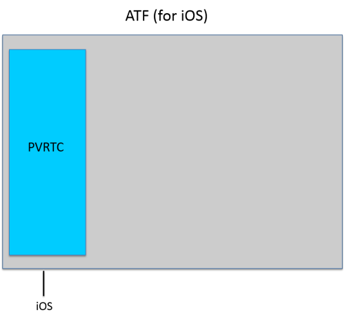
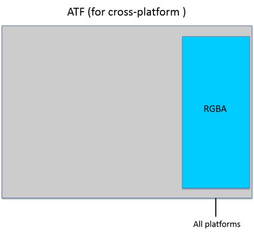
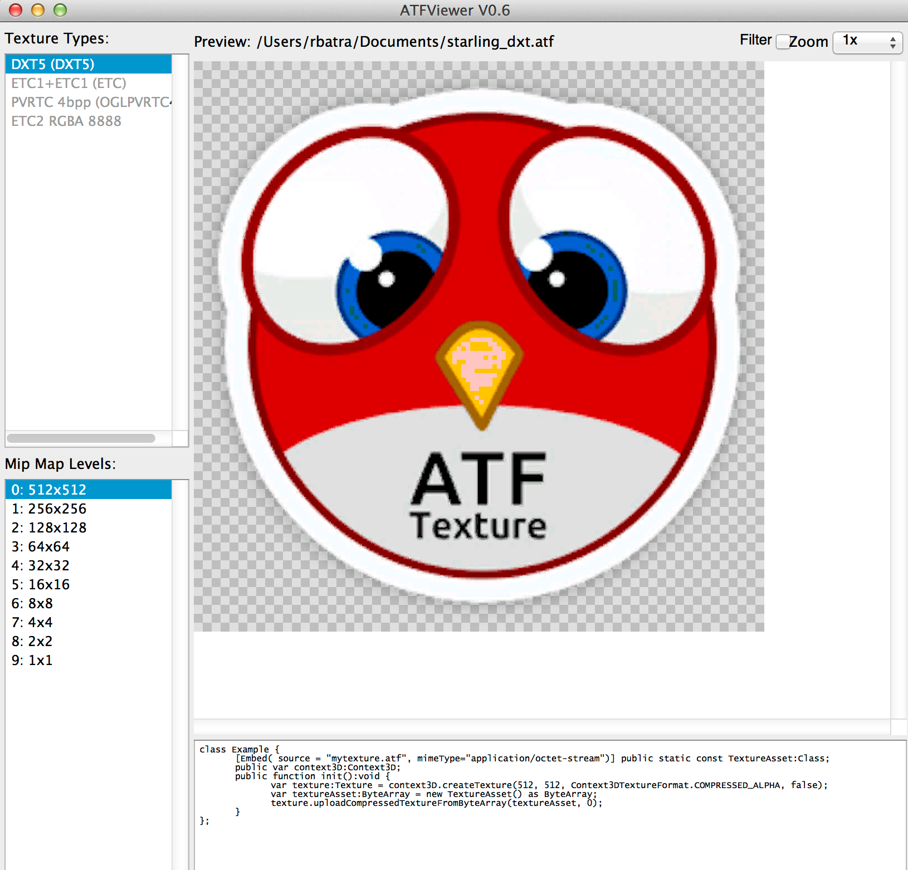

# Introducing compressed textures with the ATF SDK

by Thibault Imbert


## Content

- [What is the ATF SDK?](#what-is-the-atf-sdk)
- [How to use the tools](#how-to-use-the-tools)
- [Using compressed textures in ActionScript](#using-compressed-textures-in-actionscript)
- [Where to go from here](#where-to-go-from-here)

## Requirements

### Prerequisite knowledge

Previous experience with texture file formats and ActionScript will help you
make the most of this guide.

### User level

Intermediate

### Required products

- [Adobe AIR SDK](https://airsdk.dev/) or
  [Apache Flex SDK](https://flex.apache.org)
- Flash Player or Adobe AIR runtime

Adobe introduced support for Adobe Texture Format (ATF) in Stage3D with the
first release of Adobe Gaming SDK in the year 2012. ATF is a container format
for compressed textures. With AIR 18, the ATF tools have been moved to the AIR
SDK. So the latest ATF tools with support for ETC2 texture compression (ATF file
version 3) are available only in the AIR SDK and not in the Adobe Gaming SDK.
These tools let you create and inspect ATF texture files. This article provides
an overview of the Adobe Texture Format, ATF tools, and how to use compressed
textures in Stage3D.

### What is the ATF SDK?

First, you'll need some background on the different types of texture formats and
how they're used.

When doing GPU programming with any technology, you have two options for how you
handle your textures: you can use compressed or uncompressed images. When using
uncompressed textures, an uncompressed file format like PNG is used and uploaded
to the GPU. Because GPUs don't support the PNG file format natively, your
texture is actually stored in CPU memory. The same thing applies for JPEG
images—graphics chipsets don't know anything about JPEG so they are also decoded
in CPU memory.

It would be better to use GPU memory instead of CPU memory. However, in order to
use GPU memory you must use the right kind of texture file for the GPU. Each
platform has different support for compressed textures depending on the hardware
chipset being used. Table 1 lists the differences.

**Table 1.** Compressed texture formats supported by platform and chipset

|                                         |                      |                                   |
| --------------------------------------- | -------------------- | --------------------------------- |
| Platform                                | Chipset              | Format                            |
| iOS                                     | Imagine Technologies | PVRTC                             |
| Android                                 | Qualcomm             | ETC1                              |
| Android                                 | Mali                 | ETC1                              |
| Android                                 | NVidia               | ETC1/DXT1/DXT5                    |
| Android                                 | PowerVR              | PVRTC/ETC1                        |
| Windows                                 | (any)                | DXT1/DXT5                         |
| Mac OS                                  | (any)                | DXT1/DXT5                         |
| Android & iOS (OpenGL ES 3.0 and above) | (any)                | ETC2 (part of core functionality) |

OpenGL ES 3.0 introduced high quality ETC2 compression as a standard feature.
The 'ETC2' scheme expands ETC1 in a backwards-compatible way to provide higher
quality RGB compression as well as compression of RGBA data (RGB plus alpha).
ETC2 support is added in ATF file format version 3 in AIR SDK 18 Beta.

#### Why ATF?

As you can imagine by looking at Table 1, if you develop a game targeting all
high end as well as low end iOS devices, Android devices, and desktop platforms,
you need to supply your textures compressed in the corresponding format for each
platform, which would look like this (for each asset):

- DXT for Windows and Mac OS
- ETC1 or DXT or ETC2 for Android
- PVRTC or ETC2 for iOS

Of course it is a pain to provide all the required versions of the textures,
detect at runtime the platform on which your application is running, and upload
the corresponding texture. Wouldn't it be cool if you could just rely on one
single container that would wrap all the textures for each platform, and then
have Flash Player or Adobe AIR automatically extract the required texture
depending on the platform? This is what ATF gives you.

Along with enabling you to use one file for all the different compressed texture
formats, ATF offers the following additional benefits:

- Faster rendering
- Lower texture memory requirements (extremely important on devices like the
  first-generation iPad on which memory is very limited)
- Faster texture uploads into texture memory
- Automatic generation of all required mipmaps (you can disable this if needed)
- Higher resolution textures with the same memory footprint (when using
  compressed textures)
- Support for cubemaps
- Availability of additional lossless and lossy compression options
- Provision to pack any combination of compression formats in ATF file depending
  on your requirement

#### ATF internals

You can think of the ATF format as a container for compressed images.  By
default, all the texture formats (PVRTC, ETC1, DXT1/DXT5, and ETC2) are embedded
in the ATF file (see Figure 1).



Figure 1. Default ATF file structure

For each platform, AIR or Flash Player automatically extracts the appropriate
texture. However, in some cases you may want to target only a limited set of
platforms. Why should you embed desktop textures if you are only publishing for
mobile, or Android textures if you are targeting iOS only? To accommodate this
use case, you can choose to embed only one texture type inside the ATF file,
making your assets smaller. An ATF asset that targets only iOS, only includes a
PVRTC texture (see Figure 2). Similarly, an ATF asset that targets only high end
mobile devices (having OpenGL ES version greater than or equal to 3) only
includes ETC2 texture - leading to similar rendering results on both iOS and
android with a single texture.



Figure 2. ATF file structure for an iOS-only asset

The same applies to ETC1 if  you are targeting Android (see Figure 3).

> Image Missing

<!-- -->

Figure 3. ATF file structure for an Android only asset

**Note:** If you are familiar with the ETC1 format, you may be wondering how
transparency is handled. The Flash runtime uses a dual ETC1 approach with two
textures, one for the alpha channel and one for the colors. The ATF tools create
these two textures for you; however, ETC2 natively supports RGBA compression.

An example ATF file for a desktop only asset would include only the DXT texture
(see Figure 4).

> Image Missing

<!-- -->

Figure 4. ATF file structure for a desktop only asset

The difference between the DXT1 and DXT5 formats is alpha support. DXT1 does not
support transparency, but DXT5 does. The ATF tools automatically detect if your
images have transparency and select the proper DXT version for you. Also note
that ATF is not alpha premultiplied.

Figure 5 shows an example of ATF file for high end android and iOS mobile
devices, that is, devices supporting OpenGL ES 3.0 or above.

> Image Missing

<!--  -->

Figure 5. ATF file structure for high end android and iOS mobile devices

If you want to store uncompressed textures inside an ATF file, you can also do
that (see Figure 6).



Figure 6. ATF file structure with an uncompressed RGBA asset

This is helpful if you want to use uncompressed textures but still want to use a
cube map, automatic mipmap support, or even texture streaming.

### How to use the tools

Now that you know a little more about ATF, the next step is creating an ATF
file. The ATF tools in AIR SDK include command-line utilities for creating ATF
files. It also includes command-line tools as well as the ATFViewer GUI tool for
previewing and inspecting ATF files.

For the complete list of tools in the SDK and a full command-line reference, see
the ATF tools user's guide.

#### png2atf

The main tool you need to know about is `png2atf`. As you can guess from the
name, this tool takes a PNG file and produces an ATF file. The following
examples demonstrate using the `png2atf` tool:

    // package leaf.png with all 3 formats (DXT5, PVRTC and ETC1x2)
    > png2atf.exe �?c �?i leaf.png �?o leaf.atf
    [In 213KB][Out 213KB][Ratio 99.9703%][LZMA:0KB JPEG�?XR:213KB]

    // package a specific range of mipmaps
    > png2atf.exe �?c �?n 0,5 �?i leaf.png �?o leaf0,5.atf
    [In 213KB][Out 213KB][Ratio 99.8825%][LZMA:0KB JPEG�?XR:213KB]

    //package only DXT format
    > png2atf.exe �?c d �?i leaf.png �?o leaf_dxt5.atf
    [In 85KB][Out 85KB][Ratio 100.045%][LZMA:0KB JPEG�?XR:85KB]

    //package only ETC1 format
    > png2atf.exe �?c e �?i leaf.png �?o leaf_etc1.atf
    [In 85KB][Out 85KB][Ratio 100.045%][LZMA:0KB JPEG�?XR:85KB]

    //package only PVRTC format
    > png2atf.exe �?c p �?i leaf.png �?o leaf_pvrtc.atf
    [In 42KB][Out 42KB][Ratio 100.089%][LZMA:0KB JPEG�?XR:42KB]

    // package only ETC2 format
    > png2atf.exe -c e2 -i leaf.png -o leaf_etc2.atf
    [In 85KB][Out 85KB][Ratio 100.123%][LZMA:0KB JPEG-XR:85KB]

    // package PVRTC and ETC2 format
    > png2atf.exe -c p,e2 -i leaf.png -o leaf_pvrtc_etc2.atf
    [In 128KB][Out 128KB][Ratio 100.043%][LZMA:0KB JPEG-XR:128KB]

    // package DXT and ETC2 format
    > png2atf.exe -c d,e2 -i leaf.png -o leaf_dxt_etc2.atf
    [In 170KB][Out 170KB][Ratio 100.032%][LZMA:0KB JPEG-XR:170KB]

    // package DXT, PVRTC, and ETC1 format
    > png2atf.exe -c d,p,e -i leaf.png -o leaf_dxt_pvrtc_etc1.atf
    [In 213KB][Out 213KB][Ratio 100.002%][LZMA:0KB JPEG-XR:213KB]

You can package any combination of compression formats to suit your
requirements.

If you want to store an uncompressed texture inside your ATF just leave off the
`-c` argument:

    //package as uncompressed (RGBA) format
    > png2atf.exe �?i leaf.png �?o leaf_uncompressed.atf
    [In 341KB][Out 43KB][Ratio 12.8596%][LZMA:0KB JPEG�?XR:43KB]

Another cool feature is that ATF files can also be used with streaming. To
generate three subfiles you can do this:

    png2atf �?m �?n 0,0 �?c �?i cubecat0.png �?o cubecat_c_high.atf
    png2atf �?m �?n 1,2 �?c �?i cubecat0.png �?o cubecat_c_med.atf
    png2atf �?m �?n 3,20 �?c �?i cubecat0.png �?o cubecat_c_low.atf

Support for texture streaming shipped in Flash Player 11.3 and AIR 3.3. Make
sure to create the texture with streaming on, by specifying a value for the
`streamingLevel` argument when you use the Context3D object's `createTexture()`
method to create the Texture instance.

You can also create an ATF file containing a cube map texture; for example:

    // to create an ATF for a cube map texture
    // prepare a png file for each side of the cube as follows:
    // �?X: cube0.png
    // +X: cube1.png
    // �?Y: cube2.png
    // +Y: cube3.png
    // �?Z: cube4.png
    // +Z: cube5.png
    > png2atf.exe �?c �?m �?i cube0.png �?o cube.atf

#### pvr2atf

If you have used the PVRTexTool (from Imagination Technologies PowerVR SDK) to
generate PVR textures, you can use the `pvr2atf` command-line tool from the ATF
SDK to convert your PVR texture files to ATF files. The tool is similar to
`png2atf` except that the input file must be in the PVR texture format.

To convert a PVR file named test.pvr to an RGB or RBGA ATF file, run this
command:

    > pvr2atf -r test.pvr -o test.atf
    [In 4096KB][Out 410 KB][Ratio 10.0241%][LZMA:0KB JPEG-XR:410KB]

#### ATFViewer

ATFViewer is a graphical tool that lets you preview and inspect ATF files. Its
primary purpose is to audit DXT1, ETC1, PVRTC, and ETC2 compression artifacts.
You can open and view an ATF file by choosing File \> Open or by dragging the
file from the file system into the window.

Figure 7 shows an example of using ATFViewer to view a test file. You can
preview the texture for each format. ATFViewer also provides a code snippet
preview that shows how to load the ATF file in raw ActionScript 3 Stage3D code.

> Image Missing

<!-- -->

Figure 7. The ATFViewer application

When you open an ATF texture that contains only one specific compression format,
ATFViewer shows that. For example, when ATFViewer is used to preview an ATF file
containing only DXT textures, the ETC1, PVRTC, and ETC2 entries in the texture
list are grayed out (see Figure 8).



Figure 8. The ATFViewer application

#### Other tools

In addition to the primary tools described here, the ATF SDK includes
command-line tools for creating ATF files from other formats, inspecting PNG
files, and getting information about ATF files.  See the
[ATF tools user's guide](./atf-users-guide.md) for more details.

### Using compressed textures in ActionScript

The way you use compressed textures from ActionScript depends on whether you're
working directly in the Stage3D APIs or whether you're using Starling. To cover
the entire set of capabilities for ATF textures, you need to meet these
requirements:

- If you are using Stage3D directly, you need to use the
  [latest AGALMiniAssembler](https://github.com/PrimaryFeather/Starling-Framework/blob/master/starling/src/com/adobe/utils/AGALMiniAssembler.as).
- Support for ATF version 2 (without ETC2 support) is present from AIR SDK 3.4
  and Flash Player 11.4 (swf-version 17) onwards.
- You need to use AIR SDK 18 and Flash Player 18 or newer for ATF files with
  ETC2 support  
  (ATF version 3).
- You need to use swf-version 29 for ATF file version 3.

#### Using compressed textures with Stage3D

To use compressed textures with Stage3D, you need to create a Texture object
using the `Context3D.createTexture()` method. For the format argument, use the
value `Context3DTextureFormat.COMPRESSED_ALPHA` or
`Context3DTextureFormat.COMPRESSED`. Finally, call your Texture object's
`uploadCompressedTextureFromByteArray()` method, passing your ATF file's bytes
as the first argument; for example:

```actionscript
[Embed(source="mytexture.atf", mimeType="application/octet�?stream")]
public static const TextureAsset:Class;

public var context3D:Context3D;

public function init():void
{
	var texture:Texture = context3D.createTexture(256, 256, Context3DTextureFormat.COMPRESSED_ALPHA, false);
	var textureAsset:ByteArray = new TextureAsset() as ByteArray;
	texture.uploadCompressedTextureFromByteArray(textureAsset, 0);
}
```

If you're using a cube map texture, use the `Context3D.createCubeTexture()`
method to create a CubeTexture instance instead:

```actionscript
var texCubemap:CubeTexture = context3D.createCubeTexture(256, Context3DTextureFormat.COMPRESSED_ALPHA, false);
var textureAsset:ByteArray = new TextureAsset() as ByteArray;
texCubemap.uploadCompressedTextureFromByteArray(textureAsset, 0);
```

In addition, depending on the format of the texture, you need to specify either
"`dxt1`" or "`dxt5`" as the texture sampler of your fragment shader:

- Use "`dxt1`" if your texture format is `Context3DTextureFormat.COMPRESSED`
  (regardless of whether the texture format is DXT, PVRTC, ETC1, or ETC2)
- Use "`dxt5`" if your texture format is
  `Context3DTextureFormat.COMPRESSED_ALPHA` (regardless of whether the texture
  format is DXT, PVRTC, ETC1, or ETC2)
- Use nothing if your texture format is `Context3DTextureFormat.BGRA`

**Note**: ETC2 compressed textures are decoded in software by the runtime for
low end mobile devices, so there is no advantage of ETC2 compression on those
devices which are below OpenGL ES 3.0. The same holds true for Flash player and
AIR on desktop.

### Where to go from here

Refer to the [ATF tools user's guide](./atf-users-guide.md) for details and
usage examples for the tools that make up the ATF SDK.

> This work is licensed under a
> [Creative Commons Attribution-Noncommercial-Share Alike 3.0 Unported License](https://creativecommons.org/licenses/by-nc-sa/3.0/)
