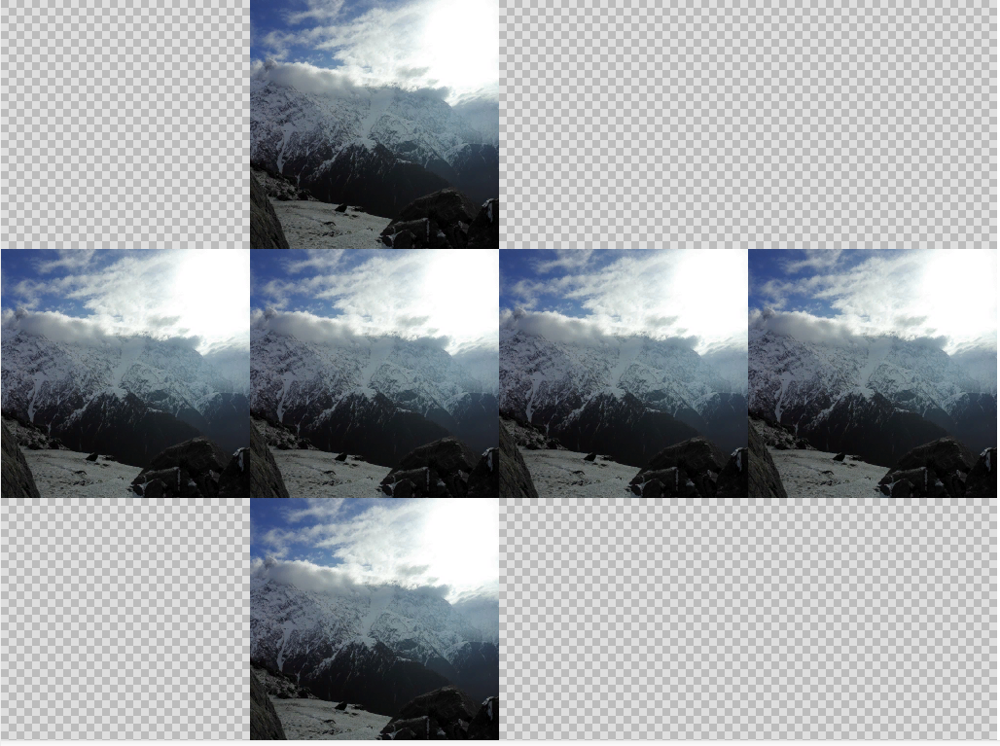
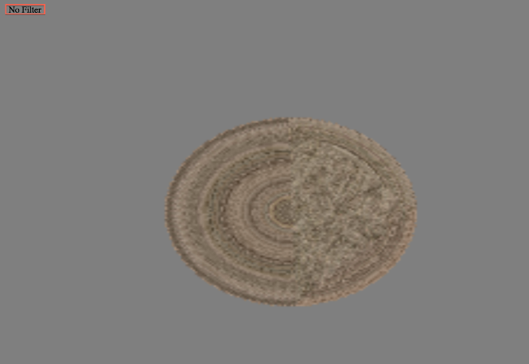
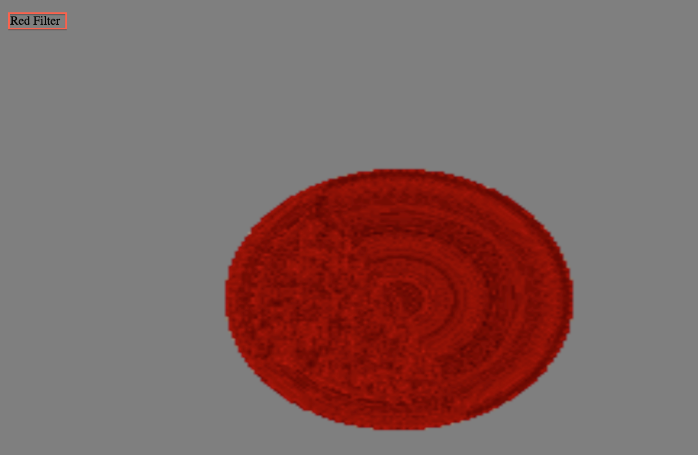
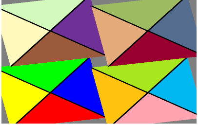

# Using advanced texture features in Stage3D

## by Nimisha


## Content

- [CubeTexture](#cubetexture)
- [RectangleTexture](#rectangletexture)
- [RenderToTexture](#rendertotexture)
- [Multiple Render Targets](#multiple-render-targets)
- [Where to go from here](#where-to-go-from-here)

## Requirements

### Prerequisite knowledge

Familiarity working with the Stage3D API and a basic understanding of how it is
structured is required. Basic knowledge of Vertex and Fragment Shaders, and the
AGAL shading language is also recommended. Before completing this tutorial, be
sure to follow along with the previous tutorials in this series on Stage3D
(1. [How Stage3D works](../../flashplayer/articles/how-stage3d-works.md),
2. [Vertex and Fragment Shaders,](../../flashplayer/articles/vertex-fragment-shaders.md) 3.[What is AGAL](../../flashplayer/articles/what-is-agal.md), 4.
[Hello Triangle](../../flashplayer/articles/hello-triangle.md), 5.
[Introducing Compressed Textures](./introducing-compressed-textures.md)).

### User level

Advanced

### Required products

- [Adobe AIR SDK](https://airsdk.dev/) or
  [Apache Flex SDK](https://flex.apache.org)
- Flash Builder or Adobe Animate (formerly Flash Professional)
- Flash Player or Adobe AIR runtime

### Sample files

- Sample Projects Missing
  <!-- - [RectangleTextureSample.zip](/web/20151120192135/http://www.adobe.com/content/dotcom/en/devnet/archive/flashruntimes/articles/using-advanced-texture-features-in-Stage3D/_jcr_content/articlePrerequistes/multiplefiles/node_1437027001117/file.res/RectangleTextureSample.zip)
    (48 KB)-->
  <!-- - [CubemapATF.zip](/web/20151120192135/http://www.adobe.com/content/dotcom/en/devnet/archive/flashruntimes/articles/using-advanced-texture-features-in-Stage3D/_jcr_content/articlePrerequistes/multiplefiles/node_1437026783527/file.res/CubemapATF.zip)
    (10779 KB)-->
  <!-- - [RTT.zip](/web/20151120192135/http://www.adobe.com/content/dotcom/en/devnet/archive/flashruntimes/articles/using-advanced-texture-features-in-Stage3D/_jcr_content/articlePrerequistes/multiplefiles/node_1437027603032/file.res/RTT.zip)
    (48 KB)-->
  <!-- - [MRT.zip](/web/20151120192135/http://www.adobe.com/content/dotcom/en/devnet/archive/flashruntimes/articles/using-advanced-texture-features-in-Stage3D/_jcr_content/articlePrerequistes/multiplefiles/node_1437027887692/file.res/MRT.zip)-->

### Introduction

Textures are image residents in GPU memory, usable for rendering. A texture
image must first be uploaded to the GPU memory in order to be used during
rendering. The texture class in the Stage3D API includes support for applying
textures. The texture class represents a 2-dimensional texture uploaded to a
rendering context. It defines a 2D texture for use during rendering. Texture
cannot be instantiated directly; its instances are created using
`Context3D::createTexture()` method.

### CubeTexture

A CubeTexture is a texture, wherein each mipmap level consists of six 2D images.
The images are arranged in a cube-shape, as represented by the name of this
texture.

The CubeTexture class represents a cube texture uploaded to a rendering context.
It defines a Cubemap texture for use during rendering. Cube mapping is used for
many rendering techniques, such as environment maps, skyboxes, and skylight
illumination. Cubemaps can have multiple mipmap levels. To create a CubeTexture
object you need to use the
[`Context3D::createCubeTexture()`](<https://help.adobe.com/en_US/FlashPlatform/reference/actionscript/3/flash/display3D/Context3D.html#createCubeTexture()>)method;this
object cannot be created directly.

A CubeTexture can be created using Cubemap ATF, which looks as shown in figure1
below:



Figure 1. Cubemap ATF with six faces, to be used for creating CubeTexture

Cubemap ATF can be used in ActionScript with the following code:

```actionscript
class Example
{
	[Embed( source = "mytexture.atf", mimeType="application/octet-  stream")]
	public static const CubeTextureAsset:Class;
	public var context3D:Context3D;

	public function init():void
	{
	var cubeTexture:CubeTexture = context3D.createCubeTexture(1024,Context3DTextureFormat.COMPRESSEDALPHA, false);
	var cubeTextureAsset:ByteArray = new CubeTextureAsset() as ByteArray;
	cubeTexture.uploadCompressedTextureFromByteArray(cubeTextureAsset, 0);
	}
}
```

To create CubeMap texture sample, download Flash Builder project
<u>CubeMapATF.zip</u> (_attached as sample file on the top of this page_) and
import it in Flash Builder.

CubeTexture can also be created using PNG files in the following way:

```actionscript
[Embed( source = "cubesky_c00.png" )]    var SkyBitmap0:Class;
[Embed( source = "cubesky_c01.png" )]   var SkyBitmap1:Class;
[Embed( source = "cubesky_c02.png" )]   var SkyBitmap2:Class;
[Embed( source = "cubesky_c03.png" )]   var SkyBitmap3:Class;
[Embed( source = "cubesky_c04.png" )]   var SkyBitmap4:Class;
[Embed( source = "cubesky_c05.png" )]   var SkyBitmap5:Class;

public var cubeMap:CubeTexture;
private var cubeImgMap:Array = [new SkyBitmap0(), new SkyBitmap1(),
new SkyBitmap2(), new SkyBitmap3(), new SkyBitmap4(), new SkyBitmap5()];
public var context3D:Context3D;
cubeMap = context3D.createCubeTexture( 512, "bgra", false );
context3D.setTextureAt( 0, cubeMap );
uploadCubeTextureWithMipmaps();

public function uploadCubeTextureWithMipmaps() : void
{
	var ws : int;
	var hs : int;
	var level : int = 0;
	var tmp : BitmapData;
	var src:BitmapData;
	var transform : Matrix;
	for(var i:uint = 0; i < 6; i++)
	{
		src = cubeImgMap[i].bitmapData;
		ws = src.width;
		hs = src.height;
		level = 0;
		tmp = new BitmapData ( src.width, src.height );
		transform = new Matrix();
		while ( ws >0 && hs > 0 )
		{
		tmp.draw(src,transform, null, null, null, true );
		cubeMap.uploadFromBitmapData( tmp, i, level );
		transform.scale(0.5,0.5);
		level ++;
		ws >>= 1;
		hs >>= 1;
		}
	}
}
```

### RectangleTexture

A RectangleTexture is a texture that contains a single 2D image with no mipmaps.
It has no power-of-two restrictions on its size.

The RectangleTexture ActionScript class represents a 2-dimensional texture
uploaded to a rendering context. It defines a 2D texture for use during
rendering but the texture cannot be instantiated directly. You have to create
instances by using `Context3D::createRectangleTexture()` method, which is
analogous to the existing `createTexture()` and `createCubeTexture()` methods.
This creates a new texture object of class TextureRectangle with similar upload
functions as Texture, but without the miplevel parameter.

**Note**: _RectangleTexture is supported from baseline profiles. Compressed
textures are not supported for rectangle textures._

They are most beneficial for use in _render to texture_ cases. If a rectangle
texture is used with a sampler that uses mip map filtering or repeat wrapping
the drawTriangles, call will fail.

To create RectangleTexture in Action Script code, download Flash Builder project
<u>RectangleTextureSample.zip</u> (_attached as sample file on the top of this
page_).

```actionscript
[Embed( source = "/res/WideColorGamut.dds",mimeType="application/octet-stream" )]
private const TextureAsset:Class;
private var texture:RectangleTexture;

texture = context3DExample.createRectangleTexture(399,200,Context3DTextureFormat.BGRA,true);

var ta:ByteArray = new TextureAsset as ByteArray;
texture.uploadFromByteArray(ta,0);
texture.addEventListener(ErrorEvent.ERROR,handleError);
```

### RenderToTexture

During game development, many times there are needs such as creating shadows of
objects, reflection, and providing light effects. Instead of doing this in
multiple passes, you can draw the entire game to a texutre, and then apply the
interesting effects and render to 3D models.

Let us discuss this with an interesting use-case. Suppose there is a car driving
game, where a scene is drawn from driver’s point of view and you want to create
more realistic experience when using left, right and rear view mirrors of the
car. In this case, you can use RenderToTexture method to render the scene from
the point of view of the rear mirror, and the same texture can be manipulated
and used for the left and right mirrors.

Context3D provides a method `setRenderToTexture()` that can be used for setting
the specified texture as rendering targets.  
You can use texture type as a render target to perform the rendering in texture,
instead of backbuffer. This could be useful in many scenarios, such as.

1.  Post processing
2.  Light mapping
3.  Shadows

Here, post processing scenario is discussed in detail below. For the other two
scenarios, you can visit these links:
[light mapping](https://web.archive.org/web/20151120192135/http://www.flare3d.com/blog/2013/04/04/real-time-light-baking-with-flare3d/)
and
[shadow](https://web.archive.org/web/20151120192135/http://www.saltgames.com/2011/2d-shadow-effects/#more-441).

**Post processing**

Post processing is a mechanism for applying an effect just before the final
image is shown to the user. With `Stage3D`, you can do similar effects in real
time with 2D or 3D scenes. You can use `Context3D.setRenderToTexture` method to
control where the rendering occurs and can apply any post processing using scene
texture by manipulating the fragment shader.

In figure 2 and figure 3, you can see the output with no filter and with red
filter, respectively.



Figure 2. Output with no filter



Figure 3. Output with red filter

You can download the sample project <u>RTT.zip</u> for RenderToTexture
(_attached as sample file on the top of this page_).

### Multiple Render Targets

Suppose in the same car driving game example (_use-case mentioned in
RenderToTexture section above_), if you want to create night vision of texture
and also apply some blur effect with different lighting conditions. For
achieving this, you can use different render targets to store required
information for lighting calculation, colors, and surface information which
in-turn is used to create the entire scene.

Multiple render targets feature allows fragment shader to write data in upto
four different targets. This eliminates the need to render objects multiple
times for different effects. `Stage3D` provides a method
`setRenderToTexture(texture,antiAlias,surfaceSelector,colorOutputIndex)`, which
has an additional parameter that allows texture to be bound to one of the four
output slots. If more than one slot is used, all of those slots needs to be
written by fragment program and all of the output slots need to be of same
format and size, for example (width, height, and bit depth).

**Note:** _During rendering to the backbuffer, only the first output color is
valid. It is not possible to mix rendering with render targets and the
backbuffer._

See figure 4 below for the output of sample application for multiple render
targets.



Figure 4. Output of sample application for multiple render targets

In this example, we are creating 4 different render targets with different
textures and recombining those render targets in the backbuffer into 4 quads, to
verify if the output is correct.

You can download the sample project <u>MRT.zip</u> for multiple render targets
(_attached as sample file on the top of this page_).

### Where to go from here

We recommend you to read
[Mipmapping for smoother textures in Stage3D](../../flashplayer/articles/mipmapping-for-smoother-textures-in-stage3d.md),
which introduces you to the problem of 'texture sampling aliasing' that often
shows up when rendering texture mapped geometries and covers the techniques
available for reducing the effects of this problem in the rendered scene.

You can refer
to [Adobe Texture Format (ATF) tools user's guide](./atf-users-guide.md) for
information on tools, which Adobe provides to create and manage ATF files
