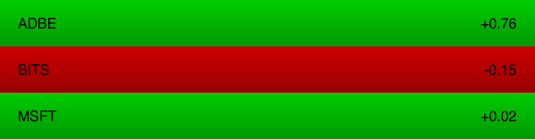
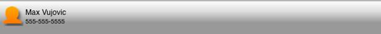

# Flex mobile performance checklist

by Max Vujovic

## Content

- [ActionScript item renderer optimizations](#actionscript-item-renderer-optimizations)
- [MXML item renderer optimizations](#mxml-item-renderer-optimizations)
- [View optimizations](#view-optimizations)
- [General graphics optimizations](#general-graphics-optimizations)
- [Where to go from here](#where-to-go-from-here)

## Requirements

### Prerequisite knowledge

This article requires a basic understanding of Adobe Flex programming. It is
intended for both beginning and advanced Flex users who are writing their first
Flex mobile apps and are looking for a basic performance guide.

### User level

Intermediate

This article covers performance decisions you can make to keep your Flex mobile
app running smoothly. The single most important step you can take to ensure
solid performance is to use and build off of the many highly-optimized mobile
components, skins, and item renderers that ship with Flex 4.6. Using these
components and following the set of best practices outlined in this article, you
will enjoy high framerates and quick load times on iOS, Android, and QNX devices
with a single Flex code base.

### ActionScript item renderer optimizations

A mobile app may include dozens of item renderers, and when your app does, it is
important to optimize them. Optimizing item renderers will keep your
application's framerate high during scrolling, which will give your users a
smooth, responsive experience. The Flex team recommends you write item renderers
in ActionScript to achieve optimal performance. ActionScript item renderers are
more difficult to write than MXML item renderers, but the performance gains can
be significant. While MXML item renderers provide many conveniences including
state syntax, dynamic layout, and binding expressions, ActionScript item
renderers strip these out for speed.

#### Subclass LabelItemRenderer or IconItemRenderer

You can improve performance by writing your item renderer in ActionScript and
building off of the highly-optimized Flex LabelItemRenderer or IconItemRenderer.
To implement your LabelItemRenderer or IconItemRenderer subclass, you override
the item renderer's data setter and the `createChildren` , `measure` ,
`drawBackground` , and `layoutContents` methods.

To get started with an ActionScript template that extends LabelItemRenderer and
overrides those methods, follow these steps:

1.  In Flash Builder 4.6, choose File \> New \> Item Renderer.
2.  Type your item renderer's name.
3.  Select the second template titled Custom ActionScript Item Renderer For
    Mobile List (ActionScript).
4.  Click Finish.

The generated code will include comments that explain what to do in each
overriden method. To get more specific code examples for each overidden method,
don't be afraid to dive into the superclass's methods.

If you're familiar with the Flex component lifecycle, you may notice one new
convention: `updateDisplayList` has been divided into two new methods,
`drawBackground` and `layoutContents` . In LabelItemRenderer and
IconItemRenderer, `updateDisplayList` simply calls `drawBackground` first and
calls `layoutContents` second.

Figure 1 shows an example of a simple ActionScript item renderer that displays
stock ticker symbols and their change in value.

Figure 1. The StockRenderer item renderer

The StockRenderer class extends LabelItemRenderer, uses a custom background, and
creates an additional StyleableTextField to display the stock's change in value.
Here is the code:

    public class StockRenderer extends LabelItemRenderer
    {
    	private const PADDING:Number = 20;
    	private const GAP:Number = 40;

    	private var change:Number;
    	private var changeLabel:StyleableTextField;

    	public function StockRenderer()
    	{
    		super();
    	}

    	override public function set data(value:Object):void
    	{
    		super.data = value;

    		change = (data ? data.change : 0.0);
    		changeLabel.text = (change > 0 ? "+" : "") + change.toString();

    		invalidateDisplayList();
    	}

    	override protected function createChildren():void
    	{
    		super.createChildren();

    		if (!changeLabel)
    		{
    			// Create a StyleTextField to display the stock's change value, and add it to the display list.
    			changeLabel = StyleableTextField(createInFontContext(StyleableTextField));
    			changeLabel.styleName = this;
    			changeLabel.editable = false;
    			changeLabel.selectable = false;
    			changeLabel.multiline = false;
    			changeLabel.wordWrap = false;
    			addChild(changeLabel);
    		}
    	}

    	override protected function measure():void
    	{
    		// Determine the item renderer's desired width and height.
    		measuredWidth = PADDING + labelDisplay.getPreferredBoundsWidth() + GAP + changeLabel.getPreferredBoundsWidth() + PADDING;
    		measuredHeight = PADDING + Math.max(labelDisplay.getPreferredBoundsHeight(), changeLabel.getPreferredBoundsHeight()) + PADDING;

    		measuredMinWidth = measuredWidth;
    		measuredMinHeight = measuredHeight;
    	}

    	override protected function drawBackground(unscaledWidth:Number,
    											   unscaledHeight:Number):void
    	{
    		// Choose green or red for the background color based on the stock's change value.
    		var backgroundColors:Array = (change >= 0 ? [0x00CC00, 0x009900] : [0xCC0000, 0x990000]);

    		// Create a matrix to rotate the background gradient 90 degrees.
    		var matrix:Matrix = new Matrix();
    		matrix.createGradientBox(unscaledWidth, unscaledHeight, Math.PI / 2, 0, 0);

    		// Draw the gradient background.
    		graphics.beginGradientFill(GradientType.LINEAR, backgroundColors, [1.0, 1.0], [0, 255], matrix);
    		graphics.drawRect(0, 0, unscaledWidth, unscaledHeight);
    		graphics.endFill();
    	}

    	override protected function layoutContents(unscaledWidth:Number,
    											   unscaledHeight:Number):void
    	{
    		// Position labelDisplay against the left edge, and vertically align it.
    		var labelDisplayX:Number = PADDING;
    		var labelDisplayY:Number = (unscaledHeight - labelDisplay.getPreferredBoundsHeight()) / 2;
    		setElementPosition(labelDisplay, labelDisplayX, labelDisplayY);

    		// Position changeLabel against the right edge, and vertically align it.
    		var changeLabelX:Number = unscaledWidth - changeLabel.getPreferredBoundsWidth() - PADDING;
    		var changeLabelY:Number = (unscaledHeight - changeLabel.getPreferredBoundsHeight()) / 2;
    		setElementPosition(changeLabel, changeLabelX, changeLabelY);
    	}

    }

#### When displaying an image in an item renderer, use or subclass IconItemRenderer

Internally, IconItemRenderer uses the Flex ContentCache class to cache
externally downloaded icon images. This means that when a user scrolls down a
list containing IconItemRenderers, external images will take a moment to load
from the server, but when the user scrolls back up, the images will appear
immediately, coming directly from the IconItemRenderer cache.

#### Use StyleableTextField to display text instead of Label or RichText

StyleableTextField is much faster at rendering text than Label or RichText, so
always use it to display text in ActionScript item renderers. Note that
StyleableTextField is ActionScript only, so you cannot use it in MXML item
renderers or MXML views.

### MXML item renderer optimizations

Writing item renderers in ActionScript will yield optimal performance. However,
you can still approach similar performance levels with MXML item renderers, but
you will need to carefully tune them with the following optimizations.

#### Keep your item renderer's appearance static and carefully use cacheAsBitmap

The `cacheAsBitmap` property can affect performance positively or negatively,
depending on how it's used. Only set `cacheAsBitmap` to `true` on an item
renderer if its internal appearance does not change frequently. When the item
renderer's appearance stays the same and only its position changes, the runtime
can quickly redraw the item renderer's cached bitmap in its new position.
However, every time the item renderer's internal appearance changes, the runtime
has to recreate a bitmap, which takes time and can hurt performance.

The same goes for all components, not just item renderers. For example, never
set `cacheAsBitmap` on a List. A List component's internal appearance changes
every frame during scrolling, which would require the runtime to regenerate
expensive bitmaps every frame, slowing the framerate down to a crawl.

#### Keep your item renderer rectangular and opaque and set opaqueBackground

Unlike `cacheAsBitmap` , which can easily hurt performance if misused,
`opaqueBackground` can only improve performance. However, your item renderer
must be rectangular and opaque for it to render correctly.

Under the hood, the `opaqueBackground` property instructs the runtime to use a
highly optimized rendering path that can ignore transparency calculations.

To use the `opaqueBackground` property, you set it to a specific color on an
item renderer. Even though you set a single color for `opaqueBackground` , you
can still completely draw over that color with another custom opaque background
and reap the performance benefits.

Here's a simple item renderer that sets `opaqueBackground` for performance gains
and completely paints over the solid background color with a gradient-filled
Rect:

    <s:ItemRenderer xmlns:fx="http://ns.adobe.com/mxml/2009"
    				xmlns:s="library://ns.adobe.com/flex/spark"
    				cacheAsBitmap="true"
    				opaqueBackground="0xFF0000"
    				autoDrawBackground="false">

    	<s:Rect left="0" right="0" top="0" bottom="0">
    		<s:fill>
    			<s:LinearGradient rotation="90">
    				<s:GradientEntry color="#FFFFFF" ratio="0"/>
    				<s:GradientEntry color="#DDDDDD" ratio=".33"/>
    				<s:GradientEntry color="#999999" ratio=".66"/>
    			</s:LinearGradient>
    		</s:fill>
    	</s:Rect>

    	<s:Label id="labelDisplay" left="5" right="5" top="15" bottom="15"/>

    </s:ItemRenderer>

#### If you draw your own background, turn off autoDrawBackground

If you define a background Rect in your item renderer as in the previous code
example, you should turn off `autoDrawBackground` . This instructs Flex to not
waste time drawing a default background that you will paint over anyway.

#### Use Label instead of RichText to display text

Although StyleableTextField is the fastest component for displaying text, you
cannot use it in MXML. The next fastest component that you can use in MXML is
Label. Most importantly, you should always avoid using RichText in your app
because it is not optimized for mobile.

#### Override the data setter instead of using binding expressions

Under the hood, binding expressions dispatch events and run extra ActionScript
code. Complex binding expressions and two way binding expressions are even more
expensive. Luckily, you can easily avoid using binding expressions in an item
renderer by updating its display in an overridden data setter.

For example, you can override the item renderer's data setter like this:

    <s:ItemRenderer xmlns:fx="http://ns.adobe.com/mxml/2009"
    				xmlns:s="library://ns.adobe.com/flex/spark"
    				cacheAsBitmap="true"
    				opaqueBackground="0xFF0000"
    				autoDrawBackground="false">

    	<fx:Script>
    		<![CDATA[

    			override public function set data(value:Object):void
    			{
    				super.data = value;

    				if (data)
    				{
    					nameLabel.text = data.name;
    					phoneNumberLabel.text = data.phoneNumber;
    				}
    				else
    				{
    					nameLabel.text = "";
    					phoneNumberLabel.text = "";
    				}
    			}

    		]]>
    	</fx:Script>

    	<s:Rect id="background" left="0" right="0" top="0" bottom="0" >
    		<s:fill>
    			<s:LinearGradient rotation="90">
    				<s:GradientEntry color="#FFFFFF" ratio="0"/>
    				<s:GradientEntry color="#DDDDDD" ratio=".33"/>
    				<s:GradientEntry color="#999999" ratio=".66"/>
    			</s:LinearGradient>
    		</s:fill>
    	</s:Rect>

    	<s:Label id="nameLabel" left="5" right="5" top="15" bottom="15" fontSize="12"/>
    	<s:Label id="phoneNumberLabel" left="5" right="5" top="30" bottom="15" fontSize="10"/>

    </s:ItemRenderer>
    The previous method is much faster than using binding in an item renderer like this:
    <?xml version="1.0" encoding="utf-8"?>
    <s:ItemRenderer xmlns:fx="http://ns.adobe.com/mxml/2009"
    				xmlns:s="library://ns.adobe.com/flex/spark"
    				cacheAsBitmap="true"
    				opaqueBackground="0xFF0000"
    				autoDrawBackground="false">

    	<s:Rect id="background" left="0" right="0" top="0" bottom="0" >
    		<s:fill>
    			<s:LinearGradient rotation="90">
    				<s:GradientEntry color="#FFFFFF" ratio="0"/>
    				<s:GradientEntry color="#DDDDDD" ratio=".33"/>
    				<s:GradientEntry color="#999999" ratio=".66"/>
    			</s:LinearGradient>
    		</s:fill>
    	</s:Rect>

    	<s:Label id="nameLabel" value="{data.name}" left="5" right="5" top="15" bottom="15" fontSize="12"/>
    	<s:Label id="phoneNumberLabel" value="{data.phoneNumber}" left="5" right="5" top="30" bottom="15" fontSize="10"/>

    </s:ItemRenderer>

The previous method is much faster than using binding in an item renderer like
this:

    <?xml version="1.0" encoding="utf-8"?>
    <s:ItemRenderer xmlns:fx="http://ns.adobe.com/mxml/2009"
    				xmlns:s="library://ns.adobe.com/flex/spark"
    				cacheAsBitmap="true"
    				opaqueBackground="0xFF0000"
    				autoDrawBackground="false">

    	<s:Rect id="background" left="0" right="0" top="0" bottom="0" >
    		<s:fill>
    			<s:LinearGradient rotation="90">
    				<s:GradientEntry color="#FFFFFF" ratio="0"/>
    				<s:GradientEntry color="#DDDDDD" ratio=".33"/>
    				<s:GradientEntry color="#999999" ratio=".66"/>
    			</s:LinearGradient>
    		</s:fill>
    	</s:Rect>

    	<s:Label id="nameLabel" value="{data.name}" left="5" right="5" top="15" bottom="15" fontSize="12"/>
    	<s:Label id="phoneNumberLabel" value="{data.phoneNumber}" left="5" right="5" top="30" bottom="15" fontSize="10"/>

    </s:ItemRenderer>

**When displaying external images in your item renderer, use a shared
ContentCache**

If you are downloading external images into an item renderer, you don't want to
re-download them every time the data item scrolls in and out of view. As
mentioned before, the ActionScript IconItemRenderer uses a ContentCache to keep
your app from re-downloading assets. You can make a similar optimization in your
MXML item renderer by declaring a static ContentCache instance and setting any
BitmapImage component's `contentLoader` property to it. Then, all item renderers
of that type will share the ContentCache instance, which will automatically load
and cache your images. This is easier than it sounds, so check out this code
example:

    <s:ItemRenderer xmlns:fx="http://ns.adobe.com/mxml/2009"
    				xmlns:s="library://ns.adobe.com/flex/spark"
    				cacheAsBitmap="true"
    				opaqueBackground="0xFF0000"
    				autoDrawBackground="false"
    				initialize="initializeHandler(event)">

    	<fx:Script>
    		<![CDATA[
    			import mx.events.FlexEvent;

    			import spark.core.ContentCache;

    			static private const iconCache:ContentCache = new ContentCache();

    			private function initializeHandler(event:FlexEvent):void
    			{
    				icon.contentLoader = iconCache;
    			}

    			override public function set data(value:Object):void
    			{
    				super.data = value;

    				if (data)
    				{
    					nameLabel.text = data.name;
    					phoneNumberLabel.text = data.phoneNumber;
    					icon.source = data.imageUrl;
    				}
    				else
    				{
    					nameLabel.text = "";
    					phoneNumberLabel.text = "";
    					icon.source = null;
    				}
    			}

    		]]>
    	</fx:Script>

    	<s:Rect id="background" left="0" right="0" top="0" bottom="0" >
    		<s:fill>
    			<s:LinearGradient rotation="90">
    				<s:GradientEntry color="#FFFFFF" ratio="0"/>
    				<s:GradientEntry color="#DDDDDD" ratio=".33"/>
    				<s:GradientEntry color="#999999" ratio=".66"/>
    			</s:LinearGradient>
    		</s:fill>
    	</s:Rect>

    	<s:BitmapImage id="icon" top="10" left="5" width="32" height="32" />
    	<s:Label id="nameLabel" left="40" right="5" top="15" bottom="15" fontSize="12"/>
    	<s:Label id="phoneNumberLabel" left="40" right="5" top="30" bottom="15" fontSize="10"/>

    </s:ItemRenderer>

#### To position components, use BasicLayout or ConstraintLayout instead of nesting Group containers

You should keep the display hierarchy as shallow as possible. Nesting Group
containers with combinations of VerticalLayout and HorizontalLayout to create
complex layouts will run a lot of unnecessary layout code. Instead, consider
using ConstraintLayout or specifying component positions explicitly using
BasicLayout constraints such as `left` , `right` , `top` , and `bottom` . You
might have noticed that in the code examples, I've already been specifying
positions explicitly instead of using nested Groups or dynamic layouts.

Consider the following three ways to lay out ContactRenderer (see Figure 2), an
MXML item renderer that displays an individual's name and phone number.

Figure 2. A single ContactRenderer instance.

You can lay out the ContactRenderer using BasicLayout like this:

    	<s:BitmapImage id="icon" top="10" left="5" width="32" height="32" />
    	<s:Label id="nameLabel" left="40" right="5" top="15" bottom="15" fontSize="12"/>
    	<s:Label id="phoneNumberLabel" left="40" right="5" top="30" bottom="15" fontSize="10"/>

You can also use ConstraintLayout like this:

    	<s:layout>
    		<s:ConstraintLayout>
    			<s:constraintColumns>
    				<s:ConstraintColumn id="leftPaddingColumn" width="5"/>
    				<s:ConstraintColumn id="iconColumn" width="32"/>
    				<s:ConstraintColumn id="middleGapColumn" width="3"/>
    				<s:ConstraintColumn id="textColumn" width="100%"/>
    				<s:ConstraintColumn id="rightPaddingColumn" width="5"/>
    			</s:constraintColumns>
    			<s:constraintRows>
    				<s:ConstraintRow id="topPaddingRow" height="10"/>
    				<s:ConstraintRow id="firstRow" height="16"/>
    				<s:ConstraintRow id="secondRow" height="16"/>
    				<s:ConstraintRow id="bottomPaddingRow" height="10"/>
    			</s:constraintRows>
    		</s:ConstraintLayout>
    	</s:layout>

    	<s:BitmapImage id="icon"
    				   left="iconColumn:0" top="firstRow:0"
    				   width="32" height="32"/>
    	<s:Label id="nameLabel"
    			 left="textColumn:0" right="textColumn:0" top="firstRow:5"
    			 fontSize="12"/>
    	<s:Label id="phoneNumberLabel"
    			 left="textColumn:0" right="textColumn:0" bottom="secondRow:2"
    			 fontSize="10"/>

It is best to avoid positioning elements by nesting Group components like this:

    	<s:Group>
    		<s:layout>
    			<s:HorizontalLayout paddingLeft="5" paddingTop="10" paddingBottom="10" gap="3"/>
    		</s:layout>
    		<s:BitmapImage id="icon" width="32" height="32" />
    		<s:Group>
    			<s:layout>
    				<s:VerticalLayout gap="3" paddingTop="5" paddingBottom="5"/>
    			</s:layout>
    			<s:Label id="nameLabel" fontSize="12"/>
    			<s:Label id="phoneNumberLabel" fontSize="10"/>
    		</s:Group>

#### Use a Group and FXG Graphics instead of a BorderContainer

BorderContainer is a convenient component for drawing a container with a border
and a background, but it is not optimized for mobile. Instead, use a Group
containing a Rect to achieve the same visual effect.

Use a Group containing a Rect like this:

    	<s:Group width="200" height="200">
    		<s:Rect left="0" right="0" top="0" bottom="0">
    			<s:fill>
    				<s:SolidColor color="#CCCCCC"/>
    			</s:fill>
    			<s:stroke>
    				<s:SolidColorStroke color="#999999"/>
    			</s:stroke>
    		</s:Rect>
    		<!-- Define child components here -->
    	</s:Group>

Avoid using a BorderContainer like this:

    	<s:BorderContainer width="200" height="200"
    					   backgroundColor="#CCCCCC" borderColor="#999999">
    		<!-- Define child components here -->
    	</s:BorderContainer>

### View optimizations

Mobile views should be written in MXML. Unlike item renderers, there is usually
only one view visible at a time, so the ease of use of MXML outweighs the
performance benefits of ActionScript. Regardless, there are important
optimizations you need make to ensure your app is quick and responsive when
switching between views.

#### Override the data setter instead of using bindings or initializing a View's appearance in a creationComplete handler

Do not initialize a View's appearance in a `creationComplete` handler because
this can cause the view to be reprocessed, which will delay the view transition.
Instead, change your view's appearance in an overridden data setter. As with
item renderers, overriding the data setter can eliminate expensive binding
expressions.

#### Start asynchronous operations in viewActivate and cancel them in viewDeactivate

Asynchronous operations such as server calls can return during view transitions
and require extra code to run, potentially causing a view transition to stutter.
It's best to start an asynchronous operation after the view has already
transitioned onto the screen, in a `viewActivate` handler. You should also
consider cleaning up outstanding asynchronous calls in a `viewDeactivate`
handler before switching views.

#### Initialize child components lazily

Before a view transition begins, Flex needs to create and lay out all of a
view's children. You should keep views as lightweight as possible initially to
minimize the delay between user interaction and when a view transition starts
playing. Whenever possible, create components incrementally after the view has
already transitioned onto the screen, which is after the `viewActivate` event.
Definitely avoid creating components that are not visible in the initial state
of the view.

#### Use includeIn or excludeFrom instead of the visible property to hide child components

When possible, use `includeIn` and `excludeFrom` to remove components from the
display list when they shouldn't be visible. This keeps them from being
processed. In contrast, if you set `visible` to `false` the components will
remain on the display list, requiring unnecessary layout and rendering
processing.

#### To keep views in memory, set destructionPolicy to "never"

If a user switches back to a view frequently, you might want to avoid the cost
of creating it again by keeping it in memory. However, remember that memory is a
precious resource on mobile devices! Keeping complex views in memory (or even
keeping too many simple views) can decrease performance if you are pushing the
limits of the device's RAM.

To improve processing time at the expense of consuming more memory, set
`destructionPolicy` to `"never"` on a View like this:

    <s:View xmlns:fx="http://ns.adobe.com/mxml/2009"
    		xmlns:s="library://ns.adobe.com/flex/spark"
    		title="My View"
    		destructionPolicy="never">
    	<!-- define child components here -->
    </s:View>

### General graphics optimizations

The following optimizations help you speed up various types of graphics in your
app, whether the graphics are found in item renderers, views, or other
components.

#### Create multiple copies of an image instead of scaling it or using bitmap smoothing

Image scaling with smoothing looks great but requires a lot of processing power.
Instead of creating one large image asset and scaling it down for different
screen resolutions and DPI levels, create multiple versions of the image asset
in different sizes. Check out Flex computer scientist Jason San Jose's article
[Flex Mobile Skins – Part 2: Handling Different Pixel Densities](./mobile-skinning-part2.md)
for a detailed tutorial with best practices.

#### Use prebaked assets, text doubling, or RectangularDropShadow instead of filters

Like most high-quality image processing operations, Spark filters are
computationally expensive on mobile devices, and you should avoid them in favor
of other techniques. Most of the time, you can draw a drop shadow directly into
your image assets. When working with text, you can duplicate it and offset it to
create a drop shadow effect. If you want a drop shadow on a rectangular
component, Flex provides a very efficient replacement for DropShadowFilter
called RectangularDropShadow. RectangularDropShadow is not a filter, but a
component, which you can use much like a Rect.

Use RectangularDropShadow like this:

    	<s:Group width="200" height="200">
    		<!-- drop shadow -->
    		<s:RectangularDropShadow left="0" right="0" top="0" bottom="0"
    								 distance="3" alpha="0.5"/>

    		<!-- background and border -->
    		<s:Rect left="0" right="0" top="0" bottom="0">
    			<s:fill>
    				<s:SolidColor color="#DDDDDD"/>
    			</s:fill>
    			<s:stroke>
    				<s:SolidColorStroke color="#999999"/>
    			</s:stroke>
    		</s:Rect>

    		<!-- define child components here -->
    	</s:Group>

Avoid using DropShadowFilter like this:

    	<s:Group width="200" height="200">
    		<!—- drop shadow -->
    		<s:filters>
    			<s:DropShadowFilter distance="3" alpha="0.5"/>
    		</s:filters>

    		<!-- background and border -->
    		<s:Rect left="0" right="0" top="0" bottom="0">
    			<s:fill>
    				<s:SolidColor color="#DDDDDD"/>
    			</s:fill>
    			<s:stroke>
    				<s:SolidColorStroke color="#999999"/>
    			</s:stroke>
    		</s:Rect>

    		<!-- define child components here -->
    	</s:Group>

#### Use BitmapImage instead of Image for embedded images

The BitmapImage component is a lightweight version of the Image component. Both
components can display embedded image assets. The biggest difference between
them is that Image can load external images right out of the box, whereas
BitmapImage requires some set up to load external images.

Unlike BitmapImage, Image is also skinnable and supports a missing image
indicator. For embedded images, you don't need all of these extra features, and
you should use the lighter-weight BitmapImage component instead.

Use the BitmapImage component like this:

    <s:BitmapImage source="@Embed('assets/icon.jpg')"/>

Avoid using the Image component like this:

    <s:Image source="@Embed('assets/icon.jpg')"/>

#### Use PNGs over GIFs and JPEGs

The runtime is simply faster at decoding the PNG file format, so you should use
it instead of GIF and JPEG images wherever you have a choice.

#### Use FXG files for nontrivial vector graphics

For convenience, you should use MXML primitives to draw simple vector graphics
like background rectangles. However, for more complex shapes and vector artwork,
you should create FXG files in Adobe Illustrator or a similar design tool. FXG
files consist of a precompiled sequence of drawing instructions that can execute
faster and use less memory than a large set of primitives declared in MXML.

#### Reduce the number of effects running concurrently

Flex provides effects such as Resize or Fade, which make it easy to animate the
user interface in response to touch interaction. It's best to limit the number
of effects running at the same time because they can add up in terms of
processing cost.

#### Use CSS styles instead of reskinning a component whenever possible

By using CSS styles, you leverage the highly-optimized default Flex mobile
skins. Most of the time, styling will be sufficient for customizing the look and
feel of your UI components. For some examples of CSS styling, see Holly
Schinsky's article
[Styling your Flex 4.5 Mobile Application Tabs and ActionBar](https://web.archive.org/web/20120103161627/http://devgirl.org/2011/05/09/styling-the-flex-4-5-mobile-application-tabs-and-actionbar/).

#### When creating a custom skin, extend the default mobile skins in ActionScript

If CSS styling is insufficient, you may decide to write a custom mobile skin for
a component. You should write the skin in ActionScript and extend the default
Flex mobile skins to take advantage of their underlying performance
optimizations. Check out
[Jason San Jose's series of articles on mobile skinning](./mobile-skinning-part1.md)
to guide you through the process.

### Where to go from here

At every step in your app's development process, make sure you're hitting your
performance benchmarks. Don't let yourself layer on another feature until you're
satisfied with your app's performance at its current stage. Saying "I'll fix it
later" can be the first warning sign of an overambitious feature or a poor
architectural choice. Both are much easier to address sooner rather than later.

Many of the optimizations in this checklist come directly from the fantastic
talks by former and current Flex SDK team members, including Evtim Georgiev,
Steven Shongrunden, Glenn Ruehle, and Ryan Frishberg.

> This work is licensed under a
> [Creative Commons Attribution-Noncommercial-Share Alike 3.0 Unported License](https://creativecommons.org/licenses/by-nc-sa/3.0/)
