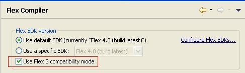
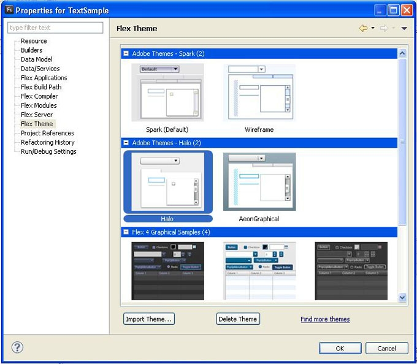
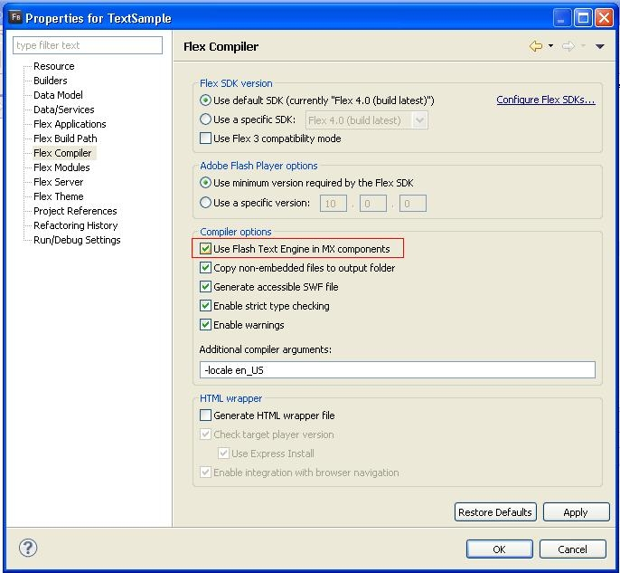

# Differences between Flex 3 and Flex 4

by Joan Lafferty

## Content

- [Migrating applications to Flex 4](#migrating-applications-to-flex-4)
- [An overview of Flex 4 architecture changes](#an-overview-of-flex-4-architecture-changes)
- [New components and containers](#new-components-and-containers)
- [Changes in effects](#changes-in-effects)
- [Working with text](#working-with-text)
- [Backwards compatibility with Flex 3](#backwards-compatibility-with-flex-3)

## Requirements

### Prerequisite knowledge

This article assumes knowledge of the Flex 3 Framework.

### User level

Intermediate

### Required products

- Apache Flex SDK

The Flex 4 release is a major change from Flex 3. Flex 4 introduces a new
component and skinning architecture. As a Flex 3 developer, however, you will
likely not encounter too many challenges when compiling Flex 3 applications with
Flex 4 , since a goal of the new release is to maintain backwards compatibility
with Flex 3.

In this article, I will provide a general overview of the main objectives in
Flex 4, architecture differences, and an introduction to changes in components,
layouts, use of states, and effects. I'll also answer some questions regarding
what to expect when you compile your Flex 3 application in Flex 4. This article
will not cover all of the new features and functionality in Flex 4.

Throughout this document, the term MX components refers to components originally
included in Flex 3. The term Spark components refers to the new set of
components in Flex 4.

### Migrating applications to Flex 4

When migrating Flex 3 applications to Flex 4, you should not expect to do very
much work. Other than bug fixes and a change in the default theme, you can look
forward to your application generally working the same (or better) than it did
in Flex 3. However, there are a few things to watch out for.

#### Player dependency

Be sure that you compile against Flash Player 10. The Flex 4 SDK requires Flash
Player 10 support.

#### Type selectors require a namespace

A CSS type selector names the Flex class to style. For example, the following
are type selectors for Button and DateField:

    Button {
    	cornerRadius: 10;
    }
    DateField {
       color: #780800;
    }

As of the Flex 4 SDK, when an application uses type selectors, a namespace is
required. If you are using only the MXML 2006 namespace in your Flex
Application, add the following default namespace declaration to your CSS:

    <mx:Style>

    @namespace "http://www.adobe.com/2006/mxml";
    …
    </mx:Style>

If you are using multiple namespaces in your application, then you will need to
provide each of the namespaces in your CSS. For an example, see
[Namespaces and packages in Flex 4](#namespaces-and-packages-in-flex-4) later in
this article.

Further, if an application used a method like
StyleManager.getStyleDeclaration("Button"), the type selector will need to
include its package. For example, the call to getStyleDeclaration() would change
to StyleManager.getStyleDeclaration("mx.controls.Button").

#### Theme change

The default theme for Flex 3 (MX) components is now the Spark theme. Therefore,
your application may look and size itself differently when you compile it using
the Flex 4 SDK. If, however, you want to use the Flex 3 look you still can
because Flex 4 includes the Halo theme from Flex 3. To compile using the Halo
theme, you can use the additional compiler argument -compatibility-version=3.0.
In Flash Builder 4, you can do this in the Properties Panel. In the Properties
Panel, select, Flex Compiler and click the checkbox for "Use Flex 3
compatibility mode" (see Figure 1).

Figure 1. Using Flex 3 Compatibility Mode

Alternatively, the theme can be changed from the default Spark theme to Halo in
the Properties -\> Flex Theme panel. In the "Flex Theme" panel, click on the
Halo theme (see Figure 2).

Figure 2. Selecting the Halo Theme in the Properties Panel

If you do choose to use the new Spark theme, note that many of the styles that
worked with the Halo theme do not work in the Spark theme. The Spark theme only
supports a limited number of styles. To understand which styles are available
for the Spark skin, you should reference the ASDoc. For each style listed per
component, a "Theme" will be designated. If no theme is designated, then, the
style is available for both the Halo and Spark theme. Flex 4 has also added a
Wireframe skin that was designed to be used for quick mock-ups. The wireframe
theme does not support style changes.

In addition to the theme change, the default preloader has changed to the
mx.preloaders.SparkDownloadProgressBar for Flex 4 applications. This lighter
weight preloader should shorten start-up time a little. If you want to use the
Flex 3 preloader, you only need to change one line of code. In your
`Application` tag add the following:
`preloader="mx.preloaders.DownloadProgressBar"`.

If you are migrating an application from Flex 3 to Flex 4 , I do not recommend
that you replace each of your Flex 3 MX components with their corresponding Flex
4 components. This is probably not a good investment of your time. Instead, move
to the Flex 4 component architecture for new applications.

#### Automation Library location change

In Flex 3, automation libraries were present under {sdk}/frameworks/libs and in
the Flex 4 , it is available under {sdk}/frameworks/libs/automation. Users
should ensure that they don't have a copy of automation libraries under the
frameworks/libs.

### An overview of Flex 4 architecture changes

One of the major themes in the Flex 4 SDK is "Design in Mind". This goal
involves creating a smoother workflow between designers and developers. To help
achieve this, the framework provides a clear separation of the visuals for a
component and the rest of its behavior. In Flex 3, an individual component's
code included logic around its behavior, layout, and visual changes. In Flex 4,
the components are factored out into different classes, each handling specific
pieces of behavior.

As specified in the
[Gumbo Architecture Document](https://web.archive.org/web/20080730163935/http://opensource.adobe.com/wiki/display/flexsdk/Gumbo+Component+Architecture):

"The main component class, the one whose class name matches the component's MXML
tag name, encapsulates the core behavior of the component. This includes
defining what events the component dispatches, the data that component
represents, wiring up any sub-components that act as parts of the main
component, and managing and tracking internal component state (we discuss states
in more detail below).

Coupled with that component class is a skin class which manages everything
related to the visual appearance of the component, including graphics, layout,
representing data, changing appearance in different states, and transitioning
from state to state. In the Halo model, Flex component skins were assets
responsible for only one part of the graphics of a component. Changing any other
aspect of a component's appearance, like layout or visualization of states,
required sub-classing the component and editing the ActionScript code directly.
In the Gumbo model, all of this is defined declaratively in the skin class,
primarily through new graphics tags called FXG tags."

As an example of the architecture discussed above, you can look at the code for
the spark.components.Button class. This class only contains logic around the
component's behavior. All of the visuals for this component are defined in the
skin class spark.skins.spark.ButtonSkin

For performance reasons, the Flex 4 SDK has provided building blocks for
developers to pick and choose the functionality that you need. Heavyweight
functionality such as scrolling and virtualization that is not needed by all
applications is not turned on by default.

#### Namespaces and packages in Flex 4

While keeping Flex 3 classes intact in the same mx.\* packages, the Flex 4 SDK
introduces the spark.\* packages for components, core classes, effects, filters,
layouts, primitives, skins, and utils.

The Flex 4 SDK provides a new set of components and effects that share many of
the same class names as Flex 3 components. To avoid name collisions in MXML, the
Flex 4 SDK comes with four distinct namespaces: MXML 2006, MXML 2009, Spark, and
Mx.

**MXML 2006:** The legacy MXML language namespace used in previous versions of
Flex. Flex 3 applications compiled using Flex 4 can continue using this
namespace.

URI: http://www.adobe.com/2006/mxml

Default Prefix: mx

**MXML 2009:** The new MXML language namespace. This is purely a language
namespace, and does _not_ contain component tags.

URI: http://ns.adobe.com/mxml/2009  
Default Prefix: fx

**Spark:** This namespace includes all of the new Spark components. It should be
used in conjunction with the MXML 2009 language namespace.

URI: library://ns.adobe.com/flex/spark  
Default Prefix: s

**MX:** This namespace includes all of the MX components. It should be used in
conjunction with the MXML 2009 language namespace.

URI: library://ns.adobe.com/flex/mx  
Default Prefix: mx

Here is a small example that uses the MXML 2009, Spark, and Halo namespaces to
create a simple Flex 4 application. This sample uses a MX DateChooser and a
Spark Button.

    <s:Application
      xmlns:fx="http://ns.adobe.com/mxml/2009"
      xmlns:s="library://ns.adobe.com/flex/spark"
      xmlns:mx="library://ns.adobe.com/flex/mx">

    	<mx:DateChooser id="main_calendar" x="20" y="20"/>
    	<s:Button label="submit" x="220" y="20"/>

    </s:Application>

Flex 4 SDK has also added multiple namespace support in CSS. If you are using
the MXML 2009, Spark, and MX namespaces along with Type selectors, you will need
to define a set of namespaces in your CSS definitions to avoid name collisions.

Here is an example of CSS that uses type selectors for both MX and Spark
components:

    <fx:Style>

    	@namespace s "library://ns.adobe.com/flex/spark";
    	@namespace mx "library://ns.adobe.com/flex/mx";

    	s|Button {
    		color: #FF0000;
    	}

    	mx|DateChooser {
    		color: #FF0000;
    	}

    </fx:Style>

#### Default Property and the Declarations tag

Prior to the release of the Flex 4 SDK, the Flex language allowed the
`Application` root tag to include visual children and non-visual children. The
visual children were added to the` Application` with `addChild()` and non-visual
children were treated as property declarations. Going forward, non-visual
children that represent new property declarations are not allowed as immediate
children of an `Application`. You can add these non-visual children under a
`<fx:Declarations>` tag. This includes non-visual children such as effects,
validators, formatters, data declarations, and RPC classes. Here is a short
example:

    <s:Application xmlns:fx="http://ns.adobe.com/mxml/2009"
      xmlns:s="library://ns.adobe.com/flex/spark">
    	<fx:Declarations>
    		<s:Fade id="fadeEffect" target="{targetButton}" alphaFrom="1" alphaTo="0" />
    	</fx:Declarations>
    	<s:Button id="targetButton" />
    	<s:Button label="play effect" click="fadeEffect.play()" x="80" />
    </s:Application>

### New components and containers

As I mentioned earlier, Flex 4 SDK introduces a number of new component classes
that use the new architecture, which should make skinning and other
customizations much more straightforward. Here is a table showing Flex 3 MX
components and their Flex 4 Spark counterparts:

| Flex 3 MX Component                 | Flex 4 Spark Component                                         |
| ----------------------------------- | -------------------------------------------------------------- |
| mx.controls.Button                  | spark.components.Button                                        |
| mx.controls.ButtonBar               | spark.components.ButtonBar                                     |
| mx.controls.CheckBox                | spark.components.CheckBox                                      |
| mx.controls.ComboBox                | spark.components.DropDownList (w/o editability)                |
| mx.controls.HorizontalList          | spark.components.List (with a HorizontalLayout)                |
| mx.controls.HRule                   | spark.primitives.Line                                          |
| mx.controls.HScrollBar              | spark.components.HScrollBar                                    |
| mx.controls.HSlider                 | spark.components.HSlider                                       |
| mx.controls.Image                   | spark.primitives.BitmapImage (w/o support for external images) |
| mx.controls.LinkBar                 | spark.components.ButtonBar (with a custom skin)                |
| mx.controls.LinkButton              | spark.components.Button (with a custom skin)                   |
| mx.controls.List                    | spark.components.List                                          |
| mx.controls.NumericStepper          | spark.components.NumericStepper                                |
| mx.controls.RadioButton             | spark.components.RadioButton                                   |
| mx.controls.RadioButtonGroup        | spark.components.RadioButtonGroup                              |
| mx.controls.TextArea                | spark.components.TextArea                                      |
| mx.controls.TabBar                  | spark.components.TabBar                                        |
| mx.controls.TextInput               | spark.components.TextInput                                     |
| mx.controls.TileList                | spark.components.List (with a TileLayout)                      |
| mx.controls.ToggleButtonBar         | spark.components.ButtonBar                                     |
| mx.controls.VideoDisplay            | spark.components.VideoPlayer                                   |
| mx.controls.VRule                   | spark.primitives.Line                                          |
| mx.controls.VScrollBar              | spark.components.VScrollBar                                    |
| mx.controls.VSlider                 | spark.components.VSlider                                       |
| mx.core.Application                 | spark.components.Application                                   |
| mx.core.Window                      | spark.components.Window                                        |
| mx.core.WindowedApplication         | spark.components.WindowedApplication                           |
| mx.containers.ApplicationControlBar | spark.components.Application (with the controlBarContent)      |
| mx.containers.Canvas                | spark.components.Group                                         |
| mx.containers.ControlBar            | spark.components.Panel (with the controlBarContent property)   |
| mx.containers.HBox                  | spark.components.HGroup                                        |
| mx.containers.Panel                 | spark.components.Panel                                         |
| mx.containers.Tile                  | spark.components.Group (with a TileLayout)                     |
| mx.containers.VBox                  | spark.components.VGroup                                        |

Adobe encourages you to use MX components and containers along with Spark
components. Because Adobe continues to build components atop the same base class
(UIComponent), there should be full interoperability between Spark and MX. Here
is a table of the components and containers that do not currently have direct
Spark equivalent classes.

| **Flex 3 classes with no direct Flex 4 counterpart** |
| ---------------------------------------------------- |
| mx.controls.Alert                                    |
| mx.controls.ColorPicker                              |
| mx.controls.DataGrid                                 |
| mx.controls.DateChooser                              |
| mx.controls.DateField                                |
| mx.controls.Menu                                     |
| mx.controls.MenuBar                                  |
| mx.controls.PopUpButton                              |
| mx.controls.PopUpMenuButton                          |
| mx.controls.ProgressBar                              |
| mx.controls.RichTextEditor                           |
| mx.controls.Tree                                     |
| mx.containers.Accordion                              |
| mx.containers.DividedBox                             |
| mx.containers.Form                                   |
| mx.containers.Grid                                   |
| mx.containers.TabNavigator                           |
| mx.containers.TitleWindow                            |
| mx.containers.ViewStack                              |

To use a MX Navigator (ViewStack, Accordion, TabNavigator) with Spark
Components, the children of the navigator should be a NavigatorContent
component. Otherwise, you will not be able to use Spark primitives in your MX
navigator. Here is an example:

    <mx:ViewStack id="vs" selectedIndex="{tb.selectedIndex}">
    	<s:NavigatorContent label="bar">
    	   <s:layout>
    		 <s:VerticalLayout />
    	   </s:layout>
    	   <s:Label text="bar" />
    	   <s:TextInput />
    	</s:NavigatorContent>
    </mx:ViewStack>

#### Changes in states syntax

Flex 4 has promoted the states functionality to a full MXML language feature. As
a result, you will likely find states to be much more flexible and direct. The
new states syntax is more _inline_, allowing state-specific changes to be
specified in context. Here are the key differences in the Flex 4 syntax:

- Only states are defined within the states array.
- In the new states syntax, you cannot use `AddChild` and `RemoveChild`.
  Instead, you define a component's role in a particular state on the component
  itself using the `includeIn` and `excludeFrom` attributes.

In the following Flex 3 example, states are used to include a Button and remove
a TextInput only when the `currentState` of the document is `submitState`. This
approach can get very verbose with more complex states.

    <mx:states>
    	<mx:State name="submitState" basedOn="">
    		<mx:AddChild relativeTo="{loginForm}" >
    		   <mx:Button label="submit" bottom="10" right="10"/>
    		</mx:AddChild>
    		<mx:RemoveChild target="{firstTextInput}"/>
    	</mx:State>
    </mx:states>

    <mx:TextInput id="firstTextInput" />
    <mx:Canvas id="loginForm" />

Here is the simpler Flex 4 code using `includeIn` and `excludeFrom`.

    <s:states>
    	<s:State name="submitState" />
    </s:states>
    <s:TextInput id="firstTextInput" excludeFrom="submitState" />
    <s:Group id="loginForm" >
    	<s:Button label="submit" bottom="10" right="10" includeIn="submitState"/>
    </s:Group>

- `SetProperty`, `SetStyle`, and `SetEventHandler` have been replaced by a new
  _dot_ syntax, which allows you to qualify MXML attribute values with a
  specific state identifier.

In the following Flex 3 example, the code defines a property, style, and event
for a Button in `submitState`.

    <mx:states>
    	<mx:State name="submitState" basedOn="">
    		<mx:SetProperty target="{submitButton}" name="label" value="submit" />
    		<mx:SetStyle target="{submitButton}" name="textDecoration" value="underline"/>
    		<mx:SetEventHandler target="{submitButton}" name="click" handler="trace('done');"/>
    	</mx:State>
    	<mx:State name="clearState" basedOn="">
    		<mx:SetProperty target="{submitButton}" name="label" value="clear" />
    		<mx:SetEventHandler target="{submitButton}" name="click" handler="emptyDocument()" />
    	</mx:State>
    </mx:states>

    <mx:Button id="submitButton" />

In Flex 4, the code looks like this:

    <s:states>
    	<s:State name="submitState" />
    	<s:State name="clearState" />
    </s:states>

    <s:Button label.submitState="submit" textDecoration.submitState="underline"
       click.submitState="trace('done')" click.clearState="emptyDocument()"
       label.clearState="clear" textDecoration.clearState="none"/>

- A component can no longer be in an undefined or null state. By default, the
  first declared state is the initial state of a component.  
  The new syntax is available when a document uses the MXML 2009 language
  namespace. You cannot mix the legacy syntax and the new states syntax. The old
  syntax is available only in the MXML 2006 namespace.

Additionally, each component now supports a set of states defined in its skin
class, which makes it simpler to apply visual changes depending on the state of
a component. For example, if you look at the skin for the Spark Button, you will
find the following states defined:

    <s:states>
    	<s:State name="up" />
    	<s:State name="over" />
    	<s:State name="down" />
    	<s:State name="disabled" />
    </s:states>

The ButtonSkin class defines what happens visually to a Spark Button in each one
of these states.

This is only a brief introduction to the new Flex 4 states syntax.

### Changes in effects

Many improvements have been made in the Flex 4 effects infrastructure. While MX
effects will only work on controls based off of UIComponent, the Spark effects
can operate on any target including the new graphic primitives in the framework.
All of these effect classes live in the spark.effects.\* package. Because Spark
effects work on MX components, Spark components, and graphic primitives, Adobe
recommends that you use Spark effect classes for future applications.

I've kept this description brief because you can get much more information about
the new functionality in the effects classes from Chet Haase's
[Effects in Adobe Flex 4](./flex4_effects_pt1.md) article.

#### Changes in layout

In previous versions of Flex, the layout of components and containers were
defined inside individual controls. Therefore, you had components such as List,
TileList, and HorizontalList, which all share the same functionality except
their layout. Still, their layout logic was defined within these component
classes. In the Flex 4, layout has been decoupled from components. Now, Spark
components such as Application, List, ButtonBar, and Panel can define their
layouts declaratively. In all of the components, containment is managed by the
Group class and the layout of the Group's children is delegated to an associated
layout object. The layouts support both Spark and MX components in addition to
the FXG graphic primitives. Layouts can even be changed at runtime.

As a developer, you can easily write custom layouts and swap them in and out of
various individual components. Here is an example of defining a vertical List,
horizontal List and a tiled List.

Vertical List (the default layout of a Spark List is VerticalLayout):

    <s:List />

Horizontal List:

    <s:List>
    	<s:layout>
    		<s:HorizontalLayout />
    	</s:layout>
    </s:List>

Tiled List:

    <s:List>
    	<s:layout>
    		<s:TileLayout />
    	</s:layout>
    </s:List>

As I noted earlier, the Flex 4 architecture is set up to provide developers with
building blocks to pick and choose what functionality they need. By default,
virtualization and scrolling is not turned on. To add the option for scrollbars
on a Group and turn on virtualization, you will need to:

1\) Set `useVirtualLayout` to `true` on your layout object2) Add a `Scroller`
component to your Group.

Here is an example of using virtualization and scrolling on a Spark Panel:

    <s:Panel title="Horizontal Panel" width="300" height="220" left="20" top="20">
    	<s:Scroller width="100%" height="100%">
    		<s:Group>
    		   <s:layout>
    			   <s:HorizontalLayout useVirtualLayout="true" />
    		   </s:layout>
    		   <s:TextInput />
    		   <s:Button label="clear" />
    		   <mx:DateChooser />
    		   <s:Button label="submit" />
    		</s:Group>
    	</s:Scroller>
    </s:Panel>

### Working with text

All of the Spark components use the new text engine in Flash Player 10. These
new classes offer low-level support for controlling text metrics, vertical text,
typographic elements such as ligatures, and bidirectional text. The Flex 4 SDK
has leveraged this functionality in all of the Spark components that use text.
For more information on the text primitives and text components provided in Flex
4, see the "Text primitives" section of the
[Spark Text Primitives spec](https://web.archive.org/web/20090611010724/http://opensource.adobe.com/wiki/display/flexsdk/Spark+Text+Primitives).

The Spark components also now use the DefineFont4 embedded font format in Flash
Player 10 and AIR 1.5. By default, the MX components do not use DefineFont4.
This causes some overhead when mixing Spark and MX components in an Application
and embedding fonts. If you want to use the same embedded font for all of your
components, you will need to add an additional theme compiler argument to your
project. With this new theme, both the MX and Spark components will use the same
DefineFont4 font engine. You can add this compiler argument by checking an
option "Use Flash Text Engine in MX components" in the Properties -\> Flex
Compiler panel. (see Figure 3).

Figure 3. Allow MX components to use DefineFont4 font engine.

When using text in a Flex 4 application, I recommend using one of Flex 4's three
Spark text components. They all use the flash player's new text engine and will
provide higher quality text, kerning and rotation for device fonts and
bi-directional text. Here are the differences between the available text
components in Flex 4.

|                                   | Multi-line | Truncation | Selectable |
| --------------------------------- | ---------- | ---------- | ---------- |
| mx.controls.Label                 | no         | yes        | yes        |
| mx.controls.Text                  | yes        | no         | yes        |
| spark.components.Label            | yes        | yes        | no         |
| spark.primitives.RichEditableText | yes        | yes        | no         |
| spark.primitives.RichText         | yes        | no         | yes        |

|                                   | Editable | HTML formatting | Scrolling |
| --------------------------------- | -------- | --------------- | --------- |
| mx.controls.Label                 | no       | yes             | no        |
| mx.controls.Text                  | no       | yes             | no        |
| spark.components.Label            | no       | no              | no        |
| spark.primitives.RichEditableText | no       | yes             | no        |
| spark.primitives.RichText         | yes      | yes             | yes       |

### Backwards compatibility with Flex 3

As in Flex 3, you can compile your application with an additional compiler
argument:

    -compatibility-version=3.0.0.

This compiler argument will allow your applications to use some of the Flex 3
behavior instead of the new Flex 4 behavior.

**Note:** You cannot selectively keep a subset of the Flex 4 behavioral changes
when invoking Flex 3 compatibility. If you compile with the argument
`-compatibility-version=3.0.0`, you will get all of the Flex 3 behavior
described in the documentation.

### Where to go from here

Hopefully, the migration from Flex 3 to the Flex 4 is relatively painless. The
framework is designed to be mostly backwards compatible. Plus, once you get
acquainted with the new architecture, you'll find that it is more
‘**flex**'ible!

> This work is licensed under a
> [Creative Commons Attribution-Noncommercial-Share Alike 3.0 Unported License](https://creativecommons.org/licenses/by-nc-sa/3.0/)
