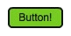
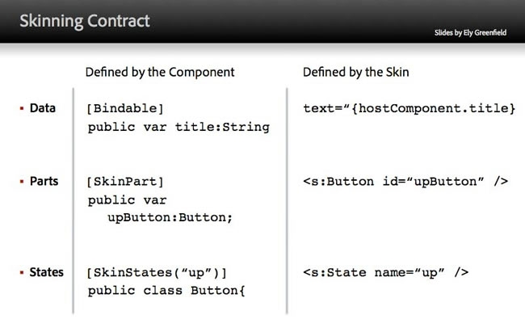
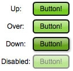
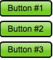

# Introducing skinning in Apache Flex 4

by Ryan Frishberg

## Content

- [Writing a simple button skin](#writing-a-simple-button-skin)
- [Introducing the skinning contract](#introducing-skinning-in-apache-flex-4)
- [Skinning contract continued: skin parts](#skinning-contract-continued-skin-parts)
- [Creating a skinnable component](#creating-a-skinnable-component)

## Requirements

### Prerequisite knowledge

This article assumes knowledge of the Flex 3 Framework.

### User level

Intermediate

### Required products

- Apache Flex SDK

### Sample files

- [flex4-skinning-sample](https://github.com/joshtynjala/adobe-developer-connection-samples-archive/tree/main/flex4-skinning-sample)

One of the main themes for the Flex 4 (codename: Gumbo) release is "Design in
Mind", and skinning is a big part of that theme. Flash Player is the delivery
mechanism for some of the most creative work to be found on the web today.
However, Flex applications have gained a reputation for looking too similar to
each other, as many developers choose to use the Flex default look and feel
(known as Halo) as opposed to applying extensive styling or skinning.

Flex 4 makes it easier to completely change the look and feel of an application.
The new skinning architecture builds on top of other changes in Flex 4 and
provides a clean separation between the logic and visual elements of a
component. Because of this, none of the components in Flex 4 contains any
information about their visual appearance. All of that information is contained
in the skin file, and thanks to FXG and the new states syntax, the new skin
files can be completely written in MXML, making them easier to read and write,
as well as easier to access with tools.

In this article, you'll learn about the improvements to the skinning
architecture in Flex 4. By writing a basic skin for a button, you'll learn a
little bit about FXG and the new states syntax. Next, you'll learn about the
contract a component and a skin use to interact with each other through the
process of skinning a slider. Lastly, you'll delve into skinnable components as
you create a new component ripe for skinning.

Note: Throughout this document, the term Halo components refers to components
originally included in Flex 3. The term Spark components refers to the new set
of components in Flex 4.

### Writing a simple button skin

FXG is a declarative markup language for vector graphics built to take advantage
of Flash Player. With the new markup, it is easy to create a custom button. For
this button, start with a simple rectangle with text inside of it (see Figure
1).

**Sample1.mxml**

    <?xml version="1.0" encoding="utf-8"?>
    <s:Application xmlns:fx="http://ns.adobe.com/mxml/2009"
    xmlns:s="library://ns.adobe.com/flex/spark">
    	<s:Group verticalCenter="0" horizontalCenter="0">
    		<s:Rect id="rect" radiusX="4" radiusY="4" top="0"
    		   right="0" bottom="0" left="0">
    		   <s:fill>
    			   <s:SolidColor color="0x77CC22" />
    		   </s:fill>
    		   <s:stroke>
    			   <s:SolidColorStroke color="0x131313" weight="2"/>
    		   </s:stroke>
    		</s:Rect>

    		<s:Label text="Button!" color="0x131313"
    				textAlign="center" verticalAlign="middle"
    				horizontalCenter="0" verticalCenter="1"
    				left="12" right="12" top="6" bottom="6"
    		/>
    	</s:Group>
    </s:Application>

Figure 1. The sample1 button

If you're familiar with Flex 3, you'll be familiar with the syntax above, though
you might not be familiar with the specific components used. The Group container
is the basic, chromeless container in Spark. `Rect` is a new FXG graphic
primitive, and it's what you'd expect—a rectangle. The last component in the
document, Label, is a new text component in Spark. The MXML reads just like a
description of the component—it's a rectangle with rounded corners that has a
1-pixel dark-gray stroke and a green fill with some text in the center.

One of the great things about FXG is that not only is it much easier to
understand than programmatic drawing instructions, it is also much more toolable
because of the structure of XML. For more info about FXG, see the
[FXG specification](https://web.archive.org/web/20090212105455/http://opensource.adobe.com/wiki/display/flexsdk/FXG+1.0+Specification).

### Converting your Button graphic to a Button skin

So far, the MXML document is just static artwork with no interactivity. It
doesn't yet take advantage of the new skinning features in Flex 4. For that, you
need to hook it up to the Button component and use it as a skin. To create a
skin file for Spark, create a new MXML file with `Skin` as the root tag. Then,
copy in the graphics code from above:

**ButtonSkin1.mxml**

    <?xml version="1.0" encoding="utf-8"?>
    <s:Skin xmlns:fx="http://ns.adobe.com/mxml/2009" xmlns:s="library://ns.adobe.com/flex/spark" alpha.disabled=".5">

    	<!-- states -->
    	<s:states>
    		<s:State name="up" />
    		<s:State name="over" />
    		<s:State name="down" />
    		<s:State name="disabled" />
    	</s:states>

    	<!-- border and fill -->
    	<s:Rect id="rect" radiusX="4" radiusY="4" top="0" right="0" bottom="0" left="0">
    		<s:fill>
    		   <s:SolidColor color="0x77CC22" />
    		</s:fill>
    		<s:stroke>
    		   <s:SolidColorStroke color="0x131313" weight="2"/>
    		</s:stroke>
    	</s:Rect>

    	<!-- text -->
    	<s:Label text="Button!" color="0x131313"
    			textAlign="center" verticalAlign="middle"
    			horizontalCenter="0" verticalCenter="1"
    			left="12" right="12" top="6" bottom="6"
    	/>
    </s:Skin>

You'll notice there is one more addition in the file states. I will discuss them
a little later.

With your skin file complete, you need to associate it with a Button component.
Every skinnable component in the Spark architecture is associated with a skin
via the `skinClass` CSS style that can be set either through style sheets or
inline via MXML. In this case, I'll use the latter:

**Sample2.mxml**

    <?xml version="1.0" encoding="utf-8"?>
    <s:Application xmlns:fx="http://ns.adobe.com/mxml/2009" xmlns:s="library://ns.adobe.com/flex/spark">
    	<s:Button verticalCenter="0" horizontalCenter="0" skinClass="ButtonSkin1"
    			 click="trace('I\'ve been clicked!')" focusIn="trace('focus...on me?')" />
    </s:Application>

Figure 2. The sample2 button

You've now hooked up the button to a new skin file. The Button component
contains all the behavioral logic for the button. It adds the event listeners,
dispatches new events, figures out what state the component is in, and so on.
The skin doesn't have to deal with any of that and just defines the visuals of
the component.

However, the Button doesn't look any different than the static graphic you first
created. The button is interactive, but it doesn't appear that way. This is
because you haven't yet defined how the button looks in different states.

### Introducing the skinning contract

A static skin is pretty boring. For something interesting, the skin must be able
to interact with the component and vice versa. These two elements interact with
each other through the skinning contract. There are three pieces to this: skin
states, data, and parts (see Figure 3). On one side, the component defines these
three different pieces, and on the other side, the skin reacts to them.

Figure 3. The skinning contract comprises data, parts, and states.

### Defining skin states

Each skinnable component in Spark has a set of skin states. You can change the
appearance of your skin based on what skin state the component is in. For a
Button, there are four basic skin states: `up`, `over`, `down`, and `disabled`.
You can modify the skin to have a different appearance in each of these states
(see Figure 4).

**ButtonSkin2.mxml**

    <?xml version="1.0" encoding="utf-8"?>
    <s:Skin xmlns:fx="http://ns.adobe.com/mxml/2009"
    xmlns:s="library://ns.adobe.com/flex/spark" alpha.disabled=".5">

    	<!-- states -->
    	<s:states>
    		<s:State name="up" />
    		<s:State name="over" />
    		<s:State name="down" />
    		<s:State name="disabled" />
    	</s:states>

    	<!-- dropshadow for the down state only -->
    	<s:Rect radiusX="4" radiusY="4" top="0" right="0" bottom="0"
    		left="0" includeIn="down">
    		<s:fill>
    		   <s:SolidColor color="0"/>
    		</s:fill>
    		<s:filters>
    		   <s:DropShadowFilter knockout="true" blurX="5" blurY="5"
    		   alpha="0.32" distance="2" />
    		</s:filters>
    	</s:Rect>

    	<!-- border and fill -->
    	<s:Rect id="rect" radiusX="4" radiusY="4" top="0" right="0"
    		 bottom="0" left="0">
    		<s:fill>
    		   <s:SolidColor color="0x77CC22" color.over="0x92D64E"
    		   color.down="0x67A41D"/>
    		</s:fill>
    		<s:stroke>
    		   <s:SolidColorStroke color="0x131313" weight="2"/>
    		</s:stroke>
    	</s:Rect>

    	<!-- highlight on top -->
    	<s:Rect radiusX="4" radiusY="4" top="2" right="2" left="2"
    		height="50%">
    		<s:fill>
    		   <s:LinearGradient rotation="90">
    			   <s:GradientEntry color="0xFFFFFF" alpha=".5"/>
    			   <s:GradientEntry color="0xFFFFFF" alpha=".1"/>
    		   </s:LinearGradient>
    		</s:fill>
    	</s:Rect>

    	<!-- text -->
    	<s:Label text="Button!" color="0x131313"
    			textAlign="center"
    			verticalAlign="middle"
    			horizontalCenter="0" verticalCenter="1"
    			left="12" right="12" top="6" bottom="6"
    	 />
    </s:Skin>

**ButtonSkin2.mxml**

Figure 4. The four skin states of the Button

Based on what skin state it is in, the component looks different because of how
you've defined the skin. This skin file is taking advantage of the new _dot
syntax_ for states. This is a new feature in Flex 4, which makes writing state
modifications much more clear and concise. The syntax is
`property.stateName="value of that property in that state"`. For example,
`alpha.disabled=".5"` means that when the button goes into the `disabled` skin
state, the skin will change the alpha to 50%. In the `over` and `down` states,
I've defined a different fill color with
`color.over="0x92D64E" color.down="0x67A41D"`.

With the new state syntax, there's an `includeIn` and `excludeFrom` property on
every MXML component. The drop shadow in the button skin is only included in the
`down` state, which gives it a nice pressed look. Also, to jazz up the skin,
I've added another rectangle to highlight the top of the button in all states.

**Note:** For more info on the enhanced state syntax in Flex 4, check out the
[new states syntax specification](https://web.archive.org/web/20090129232335/http://opensource.adobe.com/wiki/display/flexsdk/Enhanced+States+Syntax).

Playing around with the button is an interactive experience as the button
changes its visual appearance based on its skin state. One thing you will
notice, though, is that the component's text is hard-coded to "Button!". In the
next section, you'll see how to hook up the skin to display the component's
data, in this case, the Button's `label` property.

### Grabbing data from the component

I recommend that you always put `HostComponent` metadata in your skin. The
`HostComponent` metadata points to the component you're skinning, and it is
required to access the component from the skin. When defined, your skin has a
`hostComponent` property that points back to the component. In your Button skin,
you can use this `hostComponent` property to bind to the label property of the
button.

**ButtonSkin3.mxml:**

    <?xml version="1.0" encoding="utf-8"?>
    <s:Skin xmlns:fx="http://ns.adobe.com/mxml/2009"
    xmlns:s="library://ns.adobe.com/flex/spark" alpha.disabled=".5">

    	<fx:Metadata>
    	   [HostComponent("spark.components.Button")]
    	</fx:Metadata>

    	...

    	<!-- text -->
    	<s:Label text="{hostComponent.label}" color="0x131313"
    			textAlign="center"
    			verticalAlign="middle"
    			horizontalCenter="0" verticalCenter="1"
    			left="12" right="12" top="6" bottom="6"
    	 />
    </s:Skin>

When the button is declared, the text in the skin will be based on the `label`
property.

**Sample4.mxml:**

    <?xml version="1.0" encoding="utf-8"?>
    <s:Application xmlns:fx="http://ns.adobe.com/mxml/2009"
    xmlns:s="library://ns.adobe.com/flex/spark">

    	<fx:Style>
    		@namespace s "library://ns.adobe.com/flex/spark";
    				s|Button {
    		   skinClass: ClassReference("ButtonSkin3");
    		}
    	</fx:Style>

    	<s:layout>
    		<s:VerticalLayout />
    	</s:layout>
    	<s:Button label="Button #1" />
    	<s:Button label="Button #2" />
    	<s:Button label="Button #3" />
    </s:Application>

The main application declares three buttons. Each button uses the same skin
file, `ButtonSkin3`, because of the CSS type selector defined. However, each
button has a different label. Because the skin now pulls the `label` property to
display the text, the buttons look as you'd expect, with different text (see
Figure 5).

Figure 5. The buttons now display their own labels.

You've seen two of the three parts of the skinning contract, states and data.
Skin states are a way for the component to drive interactions while the skin
defines the look and feel of the component in those states. Data, the
user-settable properties on the component, can be pulled into the skin through
the use of `HostComponent` metadata and the `hostComponent` property. In the
example above, the skin pulls data (the `label` property) from the Button
component. The other way to hook up the data is by using the skin parts
mechanism to push data in to the skin part.

### Skinning contract continued: skin parts

Skin parts make up the third part of the skinning contract. Each skinnable
component in Spark has a set of skin parts that help define the component. In
the case of a scrollbar, there are four skin parts: the increment button, the
decrement button, the track, and the thumb. In the case of a Button, there is
just one skin part, the labelDisplay. This is a part that the Button component
asks for. In the Button skin above, rather than binding the text to
`{hostComponent.label}`, if you give the text component an id of `labelDisplay`,
the Button will recognize this skin part and push the label property down into
the skin.

**ButtonSkin4.mxml:**

    <?xml version="1.0" encoding="utf-8"?>
    <s:Skin xmlns:fx="http://ns.adobe.com/mxml/2009"
    xmlns:s="library://ns.adobe.com/flex/spark" alpha.disabled=".5">

    	<fx:Metadata>
    	   [HostComponent("spark.components.Button")]
    	</fx:Metadata>

    	<!-- states -->
    	<s:states>
    		<s:State name="up" />
    		<s:State name="over" />
    		<s:State name="down" />
    		<s:State name="disabled" />
    	</s:states>

    	<!-- dropshadow for the down state only -->
    	<s:Rect radiusX="4" radiusY="4" top="0" right="0" bottom="0"
    		left="0" includeIn="down">
    		<s:fill>
    		   <s:SolidColor color="0"/>
    		</s:fill>
    		<s:filters>
    		   <s:DropShadowFilter knockout="true" blurX="5" blurY="5"
    		   alpha="0.32" distance="2" />
    		</s:filters>
    	</s:Rect>

    	<!-- border and fill -->
    	<s:Rect id="rect" radiusX="4" radiusY="4" top="0" right="0"
    		bottom="0" left="0">
    		<s:fill>
    		   <s:SolidColor color="0x77CC22" color.over="0x92D64E"
    		   color.down="0x67A41D"/>
    		</s:fill>
    		<s:stroke>
    		   <s:SolidColorStroke color="0x131313" weight="2"/>
    		</s:stroke>
    	</s:Rect>

    	<!-- highlight on top -->
    	<s:Rect radiusX="4" radiusY="4" top="2" right="2" left="2" height="50%">
    		<s:fill>
    		   <s:LinearGradient rotation="90">
    			   <s:GradientEntry color="0xFFFFFF" alpha=".5"/>
    			   <s:GradientEntry color="0xFFFFFF" alpha=".1"/>
    		   </s:LinearGradient>
    		</s:fill>
    	</s:Rect>

    	<!-- text -->
    	<s:Label id="labelDisplay" color="0x131313" textAlign="center"
    			verticalAlign="middle"
    			horizontalCenter="0" verticalCenter="1"
    			left="12" right="12" top="6" bottom="6"
    	/>

    	<!-- transitions -->
    	<s:transitions>
    		<s:Transition>
    		  <s:CrossFade target="{rect}" />
    		</s:Transition>
    	</s:transitions>
    </s:Skin>

`Label` no longer binds to the host component. Instead, I gave it an id of
`labelDisplay`, which is a part that Button is looking for. The Button component
takes care of hooking up the data for you and pushes its `label` property into
the `labelDisplay`.

In addition to assigning a label element skin part, I've also added a simple
`CrossFade` transition in the skin. The skin file is where all the visual
aspects of a component are defined, including transitions. In this case, any
time the button changes states, you'll get a nice fade transition between the
states.

### Skinning a slider

Skin parts are not just for pushing data from the component into the skin, the
component can also use them to hook up behaviors. To see this more clearly,
consider the slider control. The two main parts for a slider are the track and
the thumb. In this case, the component isn't pushing any data into the skin
parts to be displayed, but it's adding event listeners to these parts and
performing some layout of the thumb based on the `value` property of the
component. For instance, when the track is clicked, the component updates its
`value` property and positions the thumb appropriately. In addition, there's a
dynamic skin part, dataTip, which is used when dragging the thumb to display
popup information. The example shown in Figure 6 is a simple, modified slider.

 and original slider (right).")

Figure 6. The modified slider (left) and original slider (right).

To build this, your skin file must declare the three skin parts: thumb, track,
and dataTip.

**MySliderSkin.mxml**

    <?xml version="1.0" encoding="utf-8"?>
    <s:Skin xmlns:fx="http://ns.adobe.com/mxml/2009"
    	  xmlns:s="library://ns.adobe.com/flex/spark"
    	  minWidth="11" minHeight="100" alpha.disabled="0.5">
    	 <fx:Metadata>
    	   [HostComponent("spark.components.VSlider")]
    	</fx:Metadata>
    	<s:states>
    		<s:State name="normal" />
    		<s:State name="disabled" />
    	</s:states>

    	<fx:Declarations>
    		<fx:Component id="dataTip">
    		   <s:DataRenderer minHeight="24" minWidth="40" x="20">
    			   <s:Rect top="0" left="0" right="0" bottom="0">
    				   <s:fill>
    					   <s:SolidColor color="0xFFF46B" alpha=".9"/>
    				   </s:fill>
    				   <s:filters>
    					   <s:DropShadowFilter angle="90" color="0x999999" distance="3"/>
    				   </s:filters>
    			   </s:Rect>

    			   <s:Label id="labelField" text="{data}"
    						horizontalCenter="0" verticalCenter="1"
    						left="5" right="5" top="5" bottom="5"
    						textAlign="center" verticalAlign="middle" color="0x555555" />
    		   </s:DataRenderer>
    		</fx:Component>
    	</fx:Declarations>

    	<s:Button id="track" left="5" right="5" top="0" bottom="0" skinClass="MyTrackSkin" />
    	<s:Button id="thumb" left="0" right="0" width="18" height="8" skinClass="MyThumbSkin" />

    </s:Skin>

Once defined in the skin, the component is in charge of hooking up these skin
parts. It adds event listeners on the thumb so you can drag the thumb around the
track. It also positions the thumb based on the value. Take a look at the sample
source code to see `MyTrackSkin` and `MyThumbSkin`. There you'll see more
examples of FXG in action. Notice that the thumb skin as defined has a
completely different shape than the default Spark skin thumb.

The dataTip skin part is dynamic—it's a part that the component is in charge of
creating and laying out. In this case, as you drag around the thumb, the dataTip
pops up and is positioned to the right of the thumb. Because of the skinning
contract, the skin can just define the skin parts, and the visual aspects of
them, without having to worry about attaching any behavior to these parts. All
of that hook-up logic is handled in the component.

Note: Many of the built-in components in Flex 4 use skin parts to not only
attach behavior to the parts but also to push down data into the skin parts. The
other way to get data in the skin is to pull them through the `hostComponent`
property.

When creating a skin for a component, not all of the skin parts are required.
For example, VSlider's dataTip skin part is not required. If it's not there, no
data tip will show up.

### Creating a skinnable component

The skinnable Spark components aren't doing anything special behind the scenes.
They have data properties and advertise the skin parts and skin states they need
through metadata. They also hook into a few key methods for managing the
lifecycle of skins and skin parts. You can easily create a new skinnable
component that does the same thing.

To demonstrate this, you can create a simple NoteCard component, which can be
used to display notes on screen. In the example shown in Figure 7, the
application has created multiple notes filled with random quotations.

Figure 7. NoteCard component instances.

The main application just creates a NoteCard with a random quote and rotates it
a little bit. The interesting part of the application is the NoteCard class,
which extends the spark.components.supportClasses.SkinnableComponent class and
hooks in to the skinning lifecycle methods.

**NoteCard.as:**

    package
    {

    [SkinState("normal")]
    [SkinState("disabled")]
    public class NoteCard extends SkinnableComponent
    {
    	public function NoteCard()
    	{
    		super();
    	}

    	[SkinPart(required="true")]
    	public var labelDisplay:TextBase;

    	[SkinPart(required="false")]
    	public var closeButton:Button;

    	private var _text:String;

    	public function get text():String
    	{
    		return _text;
    	}

    	public function set text(value:String):void
    	{
    		if (_text == value)
    		   return;
    		_text = value;
    	}

    	...
    }
    }

This component declares data properties, skin states, and skin parts. For the
data, NoteCard has a public `text` property. Also, NoteCard has two skin states,
`normal` and `disabled`, declared with the `SkinStates` metadata on top of the
class. This tells the skin that it needs to implement these two states.

NoteCard also has two skin parts, as declared via the `SkinPart` metadata. The
`SkinPart` metadata goes right above the name of the skin part. In this case,
labelDisplay is a required `TextBase` skin part, and closeButton is an optional
`Button` skin part.

Because the skin is loaded up at runtime, when the component first starts up,
you aren't guaranteed to have a skin at all. You also aren't guaranteed to have
all of the skin parts, especially if they are optional. It is the framework's
job to hook up the part declared in the skin to the component property
definitions and to inform the component that they are ready through the skinning
lifecycle methods.

### Implementing skin states on the component

To hook up the skin states, you override `getCurrentSkinState()` to return the
state your skin should currently be in. In this case, it'll either return
`"normal"` or `"disabled"`. When some event causes your skin state to
invalidate, the component should call `invalidateSkinState()`.

**NoteCard.as**

    package
    {
    [SkinState("normal")]
    [SkinState("disabled")]
    public class NoteCard extends SkinnableComponent
    {
    	...
    	override public function set enabled(value:Boolean) : void
    	{
    		if (enabled != value)
    		   invalidateSkinState();
    		super.enabled = value;
    	}

    	override protected function getCurrentSkinState() : String
    	{
    		if (!enabled)
    		   return "disabled";
    		return "normal"
    	}

    	...
    }
    }

When the `enabled` property gets set, the setter calls `invalidateSkinState()`.
This informs the skin that its state needs to change, and
`getCurrentSkinState()` will be called.

### Hooking up skin parts to the component

To hook up the skin parts, there are two primary methods you should override,
`partAdded()` and `partRemoved()`. These methods tell you when a particular skin
part is added and when one is removed. Parts can get added or removed when a
skin is loaded up, a skin is swapped at runtime, a part comes online because it
was deferred and may only exist in certain states, or a dynamic part was newly
created. When the part gets added, you should take the opportunity to push any
data you want down into it and hook up any event listeners. When the part gets
removed, you should do the opposite.

**NoteCard.as**

    package
    {
    public class NoteCard extends SkinnableComponent
    {
    	[SkinPart(required="true")]
    	public var labelDisplay:TextBase;

    	[SkinPart(required="false")]
    	public var closeButton:Button;

    	public function set text(value:String):void
    	{
    		if (_text == value)
    		   return;
    		_text = value;

    		if (labelDisplay)
    		   labelDisplay.text = value;
    	}

    	override protected function partAdded(partName:String, instance:Object) : void
    	{
    	   super.partAdded(partName, instance);

    	   if (instance == labelDisplay)
    		   labelDisplay.text = _text;
    	   if (instance == closeButton)
    		   closeButton.addEventListener(MouseEvent.CLICK, closeButton_clickHandler);
    	}

    	override protected function partRemoved(partName:String, instance:Object) : void
    	{
    	   super.partRemoved(partName, instance);

    		if (instance == closeButton)
    		   closeButton.removeEventListener(MouseEvent.CLICK, closeButton_clickHandler);
    	}

    	protected function closeButton_clickHandler(event:MouseEvent) : void
    	{
    	   event.stopPropagation();

    	   IVisualElementContainer(parent).removeElement(this);
    	}
    }
    }

In `partAdded()`, when the labelDisplay is hooked up, I push the `text` property
into that skin part. Also, in the `text` setter, I check to see if the
labelDisplay is present and hooked up—and if it is, I make sure to keep the
`text` property of the labelDisplay synchronized with the component. In
`partAdded()`, I add a click event listener to the closeButton skin part. In
`partRemoved()`, I make sure to remove that same click event listener.

As a `SkinnableComponent`, that's all you need to do to participate in this
powerful skinning mechanism. When someone creates a skin for this component,
they need to implement the skin states and hook up to the skin parts in order to
get the desired behavior. The chalkboard skin shown in Figure 6 can be found in
the sample source files, and even though this is a simple component definition,
you can completely change the look and feel of it by using a different skin.
That's the true power of skinning.

**Note:** When creating skinnable components, you might have to decide whether
certain behavior belongs in the component or in the skin. There's no clear, hard
line you must follow. Do whatever makes your job easier. As a general guideline,
however, everything defining the look and feel of the component should be in the
skin file, declared in MXML. On the other hand, if multiple skins want that
particular behavior, then it might be a good idea to put that behavior in the
skinnable component. For example, the positioning of the thumb in a slider is
done in VSlider and HSlider, not in the skin.

### Where to go from here

Skinning in Flex 4 has undergone a major revision. There's a clear separation
between the component and its skin. The component contains the data, behavior,
and core logic for the component, while the skin defines the look and feel of
the component. The component is written in ActionScript and the skin in MXML,
which is possible thanks to FXG and the new states syntax. These two pieces, the
component and the skin, communicate with each other through the skinning
contract. Because they are separate files, new skins can easily be swapped in to
completely change the look and feel of the component.

For more information about skinning in Flex 4, check out the
[skinning architecture specification](https://web.archive.org/web/20090125013312/http://opensource.adobe.com/wiki/display/flexsdk/Gumbo+Skinning)
as well as the
[Gumbo Component Architecture whitepaper](https://web.archive.org/web/20080730163935/http://opensource.adobe.com/wiki/display/flexsdk/Gumbo+Component+Architecture).

> This work is licensed under a
> [Creative Commons Attribution-Noncommercial-Share Alike 3.0 Unported License](https://creativecommons.org/licenses/by-nc-sa/3.0/)
