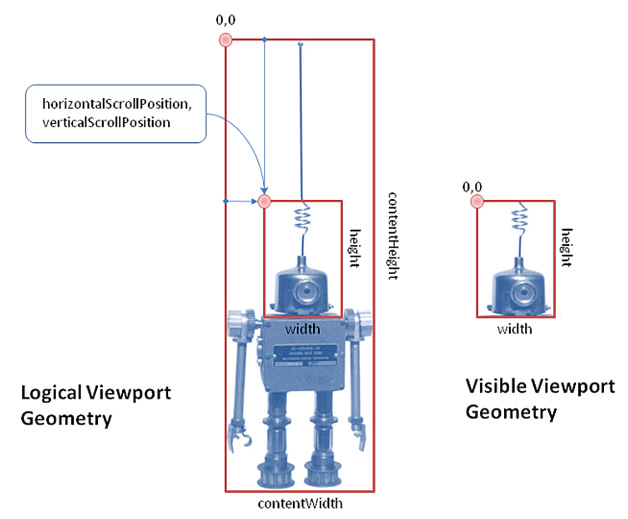

# Introduction to viewports and scrolling in Flex 4

by Hans Muller

## Content

- [Scrolling and viewports overview](#scrolling-and-viewports-overview)
- [The Scroller class](#the-scroller-class)
- [The IViewport interface and classes](#the-iviewport-interface-and-classes)
- [Comparison with MX scrolling](#comparison-with-mx-scrolling)

## Requirements

### Prerequisite knowledge

Familiarity with ActionScript, Flex 3, and basic 2D graphics concepts will be
helpful in understanding the concepts discussed in this article.

### User Level

Intermediate

### Required products

- Apache Flex SDK
- Adobe Flash Builder

### Sample files

- [flex4-viewport-scrolling](https://github.com/joshtynjala/adobe-developer-connection-samples-archive/tree/main/flex4-viewport-scrolling)

Flex 4 provides an interface called IViewport that all scrollable components
must implement, and Scroller, a component that uses scrollbars to enable
interactive scrolling of a viewport (a component that implements IViewport).
This support for interactive scrolling is an essential feature of all graphical
user interface (GUI) toolkits. The Flex 4 approach is intended to be more
efficient than the one used in Flex 3; see the section
[Comparison with MX scrolling](#comparison-with-mx-scrolling) for more details.

Many Flex components, including List and TextArea, include a Scroller and a
viewport as part of their skin, so that developers don't have to worry about
enabling scrolling. This article explains how the IViewport interface works and
includes a simple Scroller example. If you're interested in creating your own
interactive scrolling components or just want a better understanding of how Flex
4 scrolling works, read on.

### Scrolling and viewports overview

GUIs use scrolling to display a document that is bigger than the space available
on the user's screen.

In Spark (the new component and skinning architecture in Flex 4), the IViewport
interface defines a way to scroll a small rectangular clipping window that
exposes a large document a little bit at a time. In this context scrolling
refers to moving the origin of the little clipping window relative to the large
document.

The Spark Scroller component provides a conventional GUI for scrolling a
viewport interactively. It displays a pair of vertical and horizontal scrollbars
whose thumb positions define the X and Y origin of the clipping rectangle. By
default, the scrollbars are only shown when they are needed.

Figure 1 shows the basic geometry of the situation in terms of IViewport
properties: width, height, contentWidth, contentHeight,
horizontalScrollPosition, verticalScrollPosition.

Figure 1. IViewport geometry and relevant properties.

The viewport's contentWidth and contentHeight properties define the horizontal
and vertical extents of whatever is drawn in the viewport, that is, the
viewport's content. The viewport's width and height properties define the size
of the visible subset of the content, that is, the size of what appears on the
screen and the size of the viewport's clipping rectangle. The
horizontalScrollPosition and verticalScrollPosition properties define the origin
of the clipping rectangle. Applications can scroll a viewport by modifying these
properties.

### The Scroller class

The Spark Scroller class is a container for a single viewport, like a Group or a
DataGroup.

A Scroller displays vertical and horizontal scrollbars whose values are bound to
the viewport's horizontalScrollPosition and verticalScrollPosition properties.
The size of the scrollbar thumbs and the maximum limit for their values are
based on the relative size of the viewport's content, as specified by
contentWidth and contentHeight.

The code below is a simple example of the Scroller class. The Scroller's
viewport is a Group, which contains an Image that is displayed in the center of
the viewport.

    <?xml version="1.0" encoding="utf-8"?>
    <s:Application backgroundColor="0x000000"
       xmlns:s="library://ns.adobe.com/flex/spark"
       xmlns:mx="library://ns.adobe.com/flex/mx">
       <s:Scroller left="1" right="1" top="1" bottom="1">
    	  <s:Group>
    		 <mx:Image source="guyrobot.jpg"
    			horizontalCenter="0"
    			verticalCenter="0">/
    	  </s:Group>
       </s:Scroller>
    </s:Application>

By default the Scroller displays its scrollbars when they're needed–when the
viewport's content size is larger than its actual size. You can change this
policy with the verticalScrollPolicy and horizontalScrollPolicy properties. The
default value for these properties, auto, causes the scrollbars to display as
needed. Set these properties to on to unconditionally display a scrollbar, and
off to unconditionally hide a scrollbar.

### The IViewport interface and classes

The basic Spark container classes are called Group and DataGroup, and they share
a common base class called GroupBase. GroupBase implements IViewport, so
anything you can create within a Group or a DataGroup can be displayed in a
Scroller, since Scroller just requires its viewport to implement IViewport.

Most of the IViewport interface should look familiar to you based on the
discussion so far:

    public interface IViewport extends IVisualElement {
       function get width():Number;
       function get height():Number;
       function get contentWidth():Number;
       function get contentHeight():Number;
       function get horizontalScrollPosition():Number;
       function set horizontalScrollPosition(value:Number):void;
       function get verticalScrollPosition():Number;
       function set verticalScrollPosition(value:Number):void;
       function getHorizontalScrollPositionDelta(scrollUnit:uint):Number;
       function getVerticalScrollPositionDelta(scrollUnit:uint):Number;
       function get clipAndEnableScrolling():Boolean;
       function set clipAndEnableScrolling(value:Boolean):void;
    }

A viewport's width and height are its actual width and height and its
contentWidth and contentHeight are the maximum X and Y extent of its contents.
For example, if a viewport contained a rectangle (a spark.primitives.Rect
object) with its origin at 10,20 and its width and height set at 100, then the
viewport's contentWidth would be 110 and its contentHeight would be 120. In the
example above, the image's origin is 0,0 (the default) and so the Group's
contentWidth and contentHeight are the same as the image's width and height,
respectively.

The Boolean clipAndEnableScrolling property turns support for scrolling on and
off. If it's false, then the viewport does not clip its content and the scroll
positions do not control scrolling. The GroupBase class defines
clipAndEnableScrolling to be false by default so if you're building a custom
scrolling container you must explicitly set this property to true. Scroller sets
cllipAndEnableScrolling=true for its viewport automatically. Scrolling is
disabled by default because turning it on causes memory to be allocated for the
visible part of the viewport and because text and graphics that are supposed to
fit within a viewport's bounds sometimes stray just a little bit outside due to
numerical factors and antialiasing.

The getHorizontalScrollPositionDelta and getVerticalScrollPositionDelta methods
of the IViewport interface compute the distance to needed to scroll by a line or
a page. These methods are used to compute the distance to be scrolled when the
user clicks a Scroller's scrollbar track or up/down buttons, rolls the mouse
wheel, or presses the Page Up, Page Down, or Arrow keys on the keyboard.

### Comparison with MX scrolling

The Spark viewport and scrolling API is similar to the one provided by MX. The
fundamental container classes (Container in MX, Group and DataGroup in Spark)
are capable of scrolling. Unlike Spark, in MX all containers have scrolling
enabled by default, and there's no need to use a special scrolling container to
add scrollbars. In MX, if a container's contents extend beyond its bounds,
scrollbars appear according to the container's scrollPolicy property.

The changes in Spark were motivated by a desire to reduce the size and
complexity of typical applications. Most containers in most applications don't
need scrollbars or scrolling and there's a cost in complexity and footprint for
giving all containers that ability in MX. The policy in Flex 4 beta is sometimes
referred to as pay as you go, which is to say that your application's footprint
and performance should reflect just the SDK features that you need.

### Where to go from here

There is a great deal more to be said about how the IViewport interface and
Scroller class can be used and extended.

For more information on the viewport and scrolling APIs, take a look at
IViewport, Scroller, GroupBase, Group, DataGroup, and the rest of the classes in
the [Apache Flex ASDoc Reference](https://flex.apache.org/asdoc/).

> This work is licensed under a
> [Creative Commons Attribution-Noncommercial-Share Alike 3.0 Unported License](https://creativecommons.org/licenses/by-nc-sa/3.0/)
