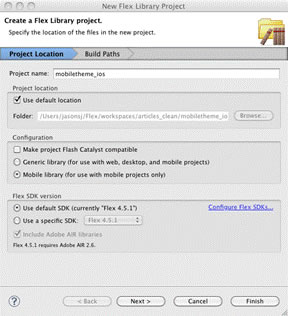
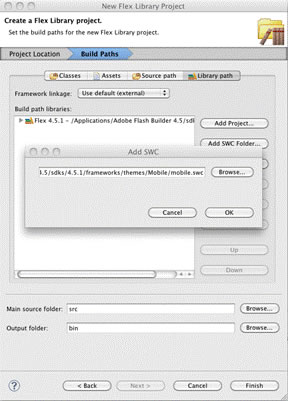
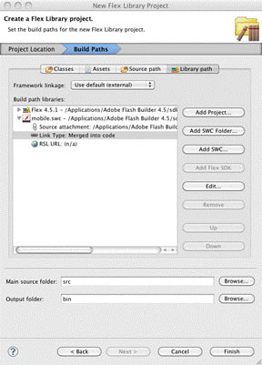
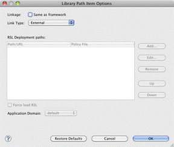
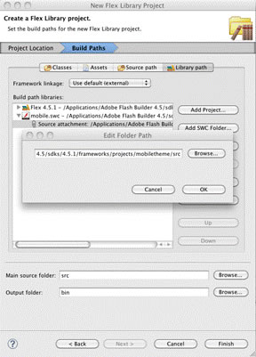
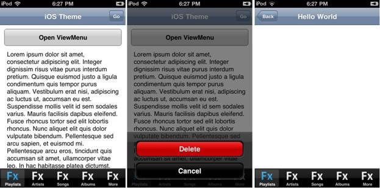

# Flex mobile skins – Part 3: Multiplatform development

by Jason San Jose

## Content

- [Notable platform differences](#notable-platform-differences)
- [Creating platform-specific skins and styles](#creating-platform-specific-skins-and-styles)
- [ActionBar styling tutorial](#actionbar-styling-tutorial)
- [Mobile theme overlay tutorial](#mobile-theme-overlay-tutorial)
- [Where to go from here](#where-to-go-from-here)

## Requirements

### Prerequisite knowledge

Familiarity with ActionScript, CSS, and Flex skinning is required. Read
[Part 1](./mobile-skinning-part1.md) and [Part 2](./mobile-skinning-part2.md) of
this series before completing this tutorial.

### User level

Intermediate

### Required products

- Apache Flex SDK
- Adobe Flash Builder

### Sample files

- [mobile-skinning-part3](https://github.com/joshtynjala/adobe-developer-connection-samples-archive/tree/main/mobile-skinning-part3)

In [Part 2](./mobile-skinning-part2.md) of this series on creating Flex mobile
skins, I discussed the effect of screen density (DPI) on component skinning and
layout of mobile applications. I also showed how to use application scaling,
density-specific bitmaps, and CSS media queries to adjust and accommodate for
various DPI values.

Aside from screen size, screen density, and form factor differences, Flex mobile
application developers now have to address differences across platforms. In
addition to Android, Flex 4.5.1 and Flash Builder 4.5.1 support two more
platforms to target for Flex Mobile projects: Apple iOS and BlackBerry Tablet
OS. Each of these platforms has their own distinct look and feel, UI patterns,
and Human Interface Guidelines (HIG).

The Mobile theme in Flex 4.5 doesn't cater to any one specific platform. Like
Spark, the Mobile theme has a neutral look and feel with design elements that
generally work across platforms. Depending on your needs and your customers'
needs, you have the freedom to change the appearance of your applications
quickly using CSS styling or you might opt for additional control with more
advanced mechanisms such as custom skinning, FXG, or even platform-specific
skins that blend in well with other native applications.

### Notable platform differences

Each platform supported by AIR has its own unique features, characteristics, and
challenges. Flex 4.5.1 accounts for a few of these challenges already and gives
you the option to add new, platform-specific behavior when necessary. This
section briefly covers the major differences that can have an effect on both the
visual and behavioral design of your application.

#### Hardware buttons

AIR on Android adds keyboard support for buttons found on Android hardware:
Home, Back, Menu, and Search. These buttons may be on the physical hardware or
may be present on-screen. Some device manufacturers omit the Search button.

The Back button on Android is used to navigate back to the previous activity,
even if that activity is not part of the current application.

iOS devices and the BlackBerry PlayBook don't have a dedicated Back button.
Instead, iOS and PlayBook applications typically place an optional soft Back
button in the top left corner of the screen. For these two platforms, the Back
button's navigation behavior is local to each application.

The Menu button on Android opens an options menu (that is, the ViewMenu mobile
component in Flex 4.5). The options menu displays a list of commands (as
buttons) that are used in the current activity.

The closest equivalent on iOS is the action sheet. The action sheet displays a
list of actions available for the currently active or currently selected item.

The BlackBerry PlayBook has a touch-sensitive bezel that applications can use to
display a container of arbitrary controls.

The Search button on Android is typically used for search data within the
application context. For example, a contacts application would provide a text
search to filter contact data. The search activity on Android has a consistent
look and feel for all applications. Neither iOS nor BlackBerry Tablet OS have
application-specific search UI design elements.

#### Usable screen area

Android 2.x and iOS show a status bar at the top of the application that is
hidden when an application is using full screen mode.

In Android 3.x Honeycomb, the status bar at the bottom of the screen is always
visible, full screen or not.

Applications for the BlackBerry PlayBook are run in full screen by default. A
swipe down from the top right corner will show the system status bar, but this
will not resize the AIR application window.

#### Typography

The default sans serif device font used by AIR differs by device. The PlayBook
uses Myriad Pro, iOS uses Helvetica, and Android uses Droid Sans.

To be clear, even when using the same font size across devices with the same
DPI, font metrics will be different due to the different fonts in use. The
amount of text you can fit in a given area will vary across screen sizes and
platforms (see Figure 1).

, in the center an Apple iPod 4th generation (portrait), and on the right a Samsung Galaxy S (portrait) using the default styles in the Flex Mobile theme.")

Figure 1. On the left a BlackBerry PlayBook (landscape, cropped), in the center
an Apple iPod 4th generation (portrait), and on the right a Samsung Galaxy S
(portrait) using the default styles in the Flex Mobile theme.

Single lines of text are generally ascent centered (that is, not including
descenders in text height) across all platforms. Skins in the Mobile theme also
use ascent centering.

#### Soft keyboard

All three platforms have soft keyboard support in both portrait and landscape
orientations.

Some Android phones, however, have a permanent hardware keyboard and no soft
keyboard (for example, Motorola Droid Pro), and others have an optional hardware
keyboard that supersedes the soft keyboard when open.

Android also allows third-party soft keyboards. Keyboards such as Swype and
SwiftKey integrate seamlessly with AIR.

The size of the soft keyboard varies by platform, device, and even device
orientation. Soft keyboards for all three platforms are aligned with the bottom
edge of the screen in all orientations.

By default, Flex Mobile projects built in Flash Builder are automatically
configured to shrink and grow the application height when the soft keyboard is
activated and deactivated respectively.

#### Text input

On Android and BlackBerry PlayBook, text entry in an AIR application's TextField
and the new StyleableTextField controls work without any issues.

The implementation of these controls on iOS, however, is a special case. In
order to get full featured error correction and text selection on iOS, text
editing occurs in a native control that is overlaid on top of the stage. This
technique creates a few limitations when editing TextField and
StyleableTextField content on iOS, including:

- The `restrict` property is not supported while editing. The restrict behavior
  is applied after exiting a TextField.
- Whitespace and dash characters are smaller, potentially causing multiline text
  to reflow when entering and exiting an editable TextField.
- Text is not clipped by `scrollRect` properties specified on ancestor
  containers.
- Keyboard events are not fired.
- The native clear button (a gray circle with an X) always appears in the
  TextInput and is not configurable.

#### Color depth

AIR on Apple iOS and BlackBerry Tablet OS supports 32-bit color. AIR on Android
is currently limited to 16-bit color using RGB565.

#### Human interface guidelines

Each platform vendor has its own set of Human Interface Guidelines (HIG) also
known as UI guidelines:

- [Apple: Human Interface Guidelines](https://developer.apple.com/design/human-interface-guidelines)
- [Google: Design for Android](https://developer.android.com/design/ui)

Following these conventions will help you create Flex mobile applications that
look and feel like their native counterparts.

#### Platform-specific wrap-up

I've barely scratched the surface with respect to platform-specific issues.

While AIR allows designers and developers to build applications on a common
runtime, it's still important to know when and how to take platform-specific
differences into account while designing your applications. Flex mobile projects
give you a range of options from using a single UI across all platforms to
redesigning your UI for each supported platform.

### Creating platform-specific skins and styles

Flex 4.5.1 and Flash Builder 4.5.1 provide basic tools for defining and using
platform-specific styles and skins in your projects.

#### Using CSS media queries

In Part 2 of this series on creating Flex mobile skins, I discussed how to use
the `application-dpi` custom media feature in a CSS media query to set
DPI-specific styles such as font size and padding values. Flex 4.5 supports one
additional custom media feature: `os-platform` . This feature allows developers
to specify platform-specific styles. Here's a simple example that sets a default
ActionBar `chromeColor` value, as well as Android-specific and iOS-specific
values:

    ActionBar { chromeColor: #000000; }
    @media (os-platform: "Android")
    {
    	ActionBar { chromeColor: #999999; /* dark gray */ }
    }
    @media (os-platform: "IOS")
    {
    	ActionBar { chromeColor: #6DA482; /* blue */ }
    }

This example code uses the default ActionBarSkin skin class from the Mobile
theme and changes the `chromeColor` property. You can use this same technique to
completely replace the default skin with your own platform-specific skin.

#### Using themes

The main drawback of using CSS for platform-specific skins is that all skins and
their assets, regardless of platform, are compiled into your application. This
is necessary since CSS media queries are computed at runtime, not compile-time.
The end result is a larger binary file (APK, BAR, or IPA file), which increases
download time and your application's footprint.

Another way to get platform-specific skins and styles is to compile your
application separately for each platform, each time overlaying a different theme
via the `theme` compiler argument. This gives you platform-specific styling
without bloating your application binary.

Note that Flash Builder 4.5.1 does not have built-in support for per platform
compiler arguments in a single project. You have three options:

- Create your own build scripts
- Manually change the arguments per platform for every build
- Refactor your project into multiple projects that share the same base project
  and/or libraries

The third option provides the most control, giving you more options to add
platform-specific behavior (for example, an on-screen back button for iOS and
BlackBerry Tablet OS).

If you choose to use themes this way, choose a build option that works best for
your workflow.

### ActionBar styling tutorial

As usual, the simplest way to make changes to appearance is to use CSS styles.
For this example, I'll expand the ActionBar example styles I showed earlier to
add a few more platform-specific nuances.

I have an app that I'm developing for a fictitious business reviews startup
named _holr!_. They want their ActionBar to look like those in native
applications on all three platforms, but they don't have the budget to spend on
a custom skin.

For this tutorial, I'll show CSS examples for each platform. Remember that these
styles should be defined in the application MXML file either in an `<fx:Style>`
tag inline or an external file.

I'll start with the following application MXML, which I created using the
View-based Application template from the Flex Mobile project wizard:

    <?xml version="1.0" encoding="utf-8"?>
    <s:ViewNavigatorApplication
    	xmlns:fx=http://ns.adobe.com/mxml/2009
    	xmlns:s="library://ns.adobe.com/flex/spark"
    	firstView="views.holrHomeView">
    	<fx:Style>
    		@namespace s "library://ns.adobe.com/flex/spark";

    	</fx:Style>
    	<s:navigationContent>
    		<s:Button label="Back"/>
    	</s:navigationContent>
    	<s:actionContent>
    		<s:Button label="Save"/>
    	</s:actionContent>
    </s:ViewNavigatorApplication>

Ideally, if my goal is to have a single binary, I would add some logic to
suppress the back button in the ActionBar when running on Android. For this
styling example, I'll leave it alone to keep things simple.

#### Android

The Mobile theme does a pretty good job of reflecting the look of today's
Android applications. The flat-styled buttons are perfect for the job. All I
have to do is change the `chromeColor` property to use the client's signature
red color (see Figure 2). Since I'll be using the same color across all
platforms, I don't need to wrap this rule in a media query.

    s|ActionBar
    {
    	chromeColor: #990000;
    }

")

Figure 2. holr! on Android (240 DPI)

Titles in the ActionBar are left-aligned by default. If you want to center the
title (see Figure 3), add `titleAlign:center` to the `ActionBar` style rule.

 with titleAlign=center ")

Figure 3. holr! on Android (240 DPI) with titleAlign=center

#### Apple iOS

ActionBar styling for iOS gets a little bit trickier. The title is
center-aligned and the buttons have a distinct shape and some non-zero padding.
Luckily, the ActionBar has a `defaultButtonAppearance` style with two options
for normal and beveled.

Setting the `defaultButtonAppearance` style of the ActionBar to `beveled`
automatically sets several style values, including beveled buttons, padding
around the navigation and action groups, and center title alignment (see
Figure 4) `.` To see all the settings used for
`defaultButtonAppearance=beveled`, find the Mobile theme's defaults.css file at
`[Flex SDK]/frameworks/projects/mobiletheme/defaults.css` and look for usage of
the `.beveled` style name selector.

    @media (os-platform: "IOS")
    {
    	s|ActionBar
    	{
    		defaultButtonAppearance: beveled;
    	}
    }

")

Figure 4. holr! on Apple iPod Touch 4th generation (320 DPI)

#### BlackBerry Tablet OS

Styling the ActionBar for BlackBerry can be a little more complicated. The
reason I say that is because RIM provides their own Flash UI framework with
their own MovieClip-based components. While it's possible to integrate the
native RIM components, in this example, I'll stick with Flex.

RIM uses an ActionBar-like container at the top of their built-in applications.
Many of these apps use a background image or texture that shows through a
transparent ActionBar. Like iOS, RIM uses center-aligned titles. However, RIM
uses a normal font weight for their titles instead of bold.

RIM uses rounded buttons on the left and right of the ActionBar. Unlike iOS
however, RIM does not use an arrow-styled back button (see Figure 5).

The PlayBook has an actual screen DPI of 170. This is high enough that the
`fontSize` the Flex team selected for the 160 DPI classification is a tad
smaller than what RIM recommends. I'll make some `fontSize` adjustments in this
example to compensate. For a full set of styles with updated `fontSize` values
for the PlayBook, download the defaults_BlackBerry_PlayBook.css sample file.

You can get pretty close to the RIM look and feel, but you'll have to override a
few CSS rules from the Mobile theme that use advanced CSS selectors.

    @media (os-platform: "QNX")
    {
    	s|ActionBar
    	{
    		defaultButtonAppearance: beveled;
    	}

    	s|ActionBar #titleDisplay
    	{
    		fontSize: 22;
    		fontWeight: normal;
    	}

    	s|ActionBar.beveled s|Group#navigationGroup s|Button
    	{
    		/* use the rounded button instead of the arrow button */
    		skinClass: ClassReference("spark.skins.mobile.BeveledActionButtonSkin");
    	}

    	s|ActionBar.beveled s|Group#actionGroup s|Button,
    	s|ActionBar.beveled s|Group#navigationGroup s|Button
    	{
    		fontSize: 16;
    		fontWeight: normal;
    	}
    }

")

Figure 5. holr! on BlackBerry PlayBook (160 DPI)

The final application file looks like this:

    <?xml version="1.0" encoding="utf-8"?>
    <s:ViewNavigatorApplication xmlns:fx="http://ns.adobe.com/mxml/2009"
    	xmlns:s="library://ns.adobe.com/flex/spark"
    	firstView="views.holrHomeView">
    	<fx:Style>
    		@namespace s "library://ns.adobe.com/flex/spark";
    		@namespace s "library://ns.adobe.com/flex/spark";

    		s|ActionBar
    		{
    			chromeColor: #990000;
    		}

    		@media (os-platform: "IOS")
    		{
    			s|ActionBar
    			{
    				defaultButtonAppearance: beveled;
    			}
    		}

    		@media (os-platform: "QNX")
    		{
    			s|ActionBar
    			{
    				defaultButtonAppearance: beveled;
    			}

    			s|ActionBar #titleDisplay
    			{
    				fontSize: 24;
    				fontWeight: normal;
    			}

    			s|ActionBar.beveled s|Group#navigationGroup s|Button
    			{
    				/* use the rounded button instead of the angled back button */
    				skinClass: ClassReference("spark.skins.mobile.BeveledActionButtonSkin");
    			}

    			s|ActionBar.beveled s|Group#actionGroup s|Button,
    				s|ActionBar.beveled s|Group#navigationGroup s|Button
    			{
    				fontSize: 20;
    				fontWeight: normal;
    			}

    			global
    			{
    				fontSize: 20;
    			}
    		}
    	</fx:Style>
    	<s:navigationContent>
    		<s:Button label="Back"/>
    	</s:navigationContent>
    	<s:actionContent>
    		<s:Button label="Save"/>
    	</s:actionContent>
    </s:ViewNavigatorApplication>

A quick note about the advanced CSS selectors: The Mobile theme uses `styleName`
and `ID` selectors to isolate styles to specific ActionBar skin parts. I do this
to avoid inadvertently styling other components in the ActionBar content groups.
For example, I don't want the buttons in the ActionBar to have the same
`fontSize` value as the title text. I really want the title to stand out with
larger text.

#### Styling wrap-up

Styling the built-in Mobile theme skins is pretty simple. Although
platform-specific styling for the ActionBar is more complex, it isn't too
difficult thanks to the `defaultButtonAppearance` and `titleAlign` styles.

### Mobile theme overlay tutorial

Now it's time for the hard part. This second tutorial will help you lay the
groundwork to build your own themes for Flex Mobile projects.

If you prefer, you can skip the main tutorial and go straight to my example iOS
theme. This theme is just a proof of concept, but it does demonstrate how
powerful Flex skinning can be.

To clarify, the tutorial that follows explains how to create a theme overlay
that uses the Mobile theme as a base theme. In general, Flex 4 theme authors
should create overlays for the Spark theme for desktop projects or the Mobile
theme for mobile applications. Many important style attributes are only valid
when using a specified theme name. For example, `chromeColor` is only valid in
the Spark and Mobile themes. If you create and use a standalone theme and
reference `chromeColor` in CSS or MXML, the compiler will log an error.

#### Phase 1: Create a theme project

The first step to creating a custom theme is to create a library project. This
project will output the theme SWC that you can reuse across any compatible
project.

1.  Choose File \> New \> Flex Library Project.
2.  Type a name for the project; for example, type **mobiletheme_ios**.
3.  Under Configuration, choose Mobile Library to include mobilecomponents.swc
    (see Figure 6).

Figure 6. Creating a mobile library.

4.  Click Next.

Since you're extending the Mobile theme, you need to add its SWC in order to
extend classes and reference other dependencies from the theme.

5.  Click Add SWC.
6.  In the Add SWC dialog box (see Figure 7), type the path to the Mobile theme
    SWC in the SDK:
    `[Adobe Flash Builder]/sdks/4.5.1/frameworks/themes/Mobile/mobile.swc`.
7.  Click OK.

Figure 7. Adding the Mobile theme SWC.

Once it is added to the Build Path Libraries tree, the SWC should be expanded.

8.  Double-click Link Type (see Figure 8).

Figure 8. The Link Type of mobile.swc.

1.  Select External as the Link Type (see Figure 9) and click OK.

Figure 9. Changing the link type to External.

This is required so that dependencies that you add from the Mobile theme SWC
aren't also compiled into your custom theme. The default mobile project
configuration (see `[Flex SDK]/frameworks/airmobile-config.xml`) adds the Mobile
theme SWC by default. Later on when creating the Flex Mobile project, you don't
have to add the Mobile theme SWC separately.

10. Double-click Source Attachment for mobile.swc
11. Set the location to
    `[Adobe Flash Builder]/sdks/4.5.1/frameworks/projects/mobiletheme/src` and
    click OK (see Figure 10).

Figure 10. Changing the source location.

This is required to support features such as Go To Definition for classes in the
Mobile theme. The path that Flash Builder initially uses after you add the SWC
is incorrect.

12. Click Finish to create the project.

#### Phase 2: Configure the library project for theme development

Now that you have a project, a few more steps are required to configure it as a
theme.

1.  Create a defaults.css file in your project's root directory (not the main
    `src` folder, but the project folder itself). This file will define the
    style rules for the theme.
2.  Choose Project \> Properties.
3.  On the Flex Library Compiler page, in Additional Compiler Arguments, add:

    -include-file defaults.css ../defaults.css.

4.  Click OK.

This completes the basic setup of a theme SWC. After defining styles in
defaults.css and adding additional skin classes, the SWC file in the project
`bin` folder can be used as a theme overlay in two ways:

- Add -theme+=/path/to/theme.swc to the Additional Compiler Arguments on the
  Flex Compiler properties page.
- Import the theme SWC by choosing Project \> Properties \> Flex Theme.

If you're producing themes, you can add metadata and a preview image along with
your theme SWC or CSS file for a more polished importing experience.

#### Phase 3: Create a Flex Mobile project

After setting up the theme, but before creating my skins, I'll set up a project
to test my theme as I'm developing it. In this project, I use a few techniques
to make iterating on my theme a bit easier.

1.  Choose File \> New \> Flex Mobile Project. Type a project name, use the
    defaults settings, and click Next.
2.  Click Add Project and add your theme project.
3.  Click Finish and Flash Builder will create the project.
4.  Choose Project \> Properties.
5.  In the Flex Compiler properties page, add **-theme+=/\<theme project
    name\>/bin/\<theme project name\>.swc** to the Additional Compiler
    Arguments. This argument applies the theme overlay to the project.
6.  Click OK.
7.  In the theme project, add a class named ThemeClasses to the default package.
8.  In the mobile project, in the main Application MXML file, add a reference to
    this class in an `<fx:Script>` tag. A simple statement such as
    `ThemeClasses;` is sufficient.

You might be wondering why I don't use the Flex Theme properties page in the
project Properties dialog box to set up a theme. The short answer is that the
theme feature in Flash Builder was designed mainly for importing prebuilt themes
that don't change. As I make incremental changes to the theme project, I want my
mobile project to recompile. These steps are the minimum required to get Flash
Builder to recompile the mobile project when the theme project changes.

#### Phase 4: Create skins and styles

This phase makes up the bulk of the work. I've already described the mobile
skinning development process in detail in [Part 1](./mobile-skinning-part1.md)
and [Part 2](./mobile-skinning-part2.md) of this series on creating Flex mobile
skins. To recap, the process is as follows:

1.  Create graphic assets as FXG.
2.  Create a new MobileSkin-based skin or subclass an existing Mobile theme
    skin.
3.  Define the `hostComponent` property.
4.  Specify the FXG assets.
5.  Support Mobile theme styles as appropriate (for example, `chromeColor` ).
6.  Specify CSS style rules in the theme's defaults.css file. For each component
    you plan to support, specify the custom `skinClass` and style values that
    are not affected by DPI.
7.  Specify additional CSS style rules using the `application-dpi` media query
    feature to filter values specific for each DPI for font size and padding
    styles.
8.  Repeat for each host component.

Since I've covered this process already in earlier articles, I'll skip the gory
details. If you've followed the steps in this tutorial so far, you can copy the
CSS example from the first tutorial in this article into the theme library
project defaults.css file. When you run the mobile project, it will pick up the
style rules from the theme.

#### Proof of concept: iOS theme

The iOS theme that I created relies heavily on custom skins based on the
MobileSkin base class and the default skins from the Flex 4.5 Mobile theme.

Since themes are intended to be used with any type of project, I didn't use the
`os-platform` media query feature to filter style rules based on platform. This
gives me the flexibility to use my iOS theme on Android or BlackBerry Tablet OS
applications if desired.

To try out the iOS theme with Flash Builder 4.5.1, download the
mobiletheme_ios_usage.fxp sample file and follow the instructions below.

1.  Choose File \> Import Flash Builder Project.
2.  Navigate to and select mobiletheme_ios_usage.fxp.
3.  Click Finish.
4.  Select the mobiletheme_ios_usage project and click the Run button (or choose
    Run \> Run As \> Mobile Application).

Flash Builder automatically creates a run configuration for you.

5.  For the Target Platform, select Apple iOS.
6.  For the Launch Method, select On Desktop.
7.  Select an iOS device to simulate.
8.  Click Run (see Figure 11).

Figure 11. The proof of concept application running on a 4th Generation iPod

To package and deploy this project to an iOS device, you'll need to set up an
Apple Developer account.

To learn more about mobile skinning and the work I've done in this proof of
concept, see my blog post titled
[Example: iOS Theme for Flex Mobile Projects](https://web.archive.org/web/20110623024952/http://blogs.adobe.com/jasonsj/2011/06/ios-theme-for-flex-mobile-projects-proof-of-concept.html).

### Where to go from here

As you build mobile applications, consider which platform-specific patterns that
you might apply to your project. As the smartphone and tablet market continues
to grow and diversify, AIR and Flex will continue to provide a powerful
cross-platform approach to mobile application development.

> This work is licensed under a
> [Creative Commons Attribution-Noncommercial-Share Alike 3.0 Unported License](https://creativecommons.org/licenses/by-nc-sa/3.0/)
