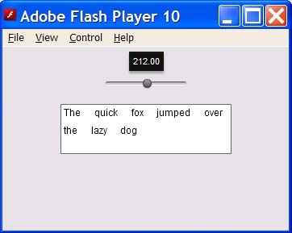
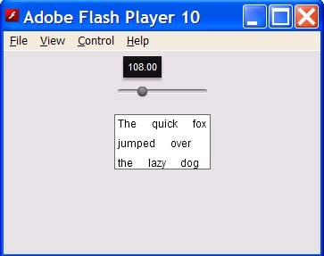

# Spark layouts with Apache Flex 4

by Evtim Georgiev

## Content

- [Comparing Spark and MX layouts](#comparing-spark-and-mx-layouts)
- [Working with the Spark Layouts](#working-with-the-spark-layouts)
- [Creating a custom Spark layout](#creating-a-custom-spark-layout)

## Requirements

### Prerequisite knowledge

This article assumes knowledge of the Flex 3 Framework.

### User level

Intermediate

### Required products

- Apache Flex SDK

### Sample files

- [spark-flow-layout](https://github.com/joshtynjala/adobe-developer-connection-samples-archive/tree/main/spark-flow-layout)

Spark, the new component and skinning architecture in Flex 4, brings a lot to
the RIA table and addresses a number of pain points in skinning, CSS,
components, states, animation, text, graphics tags, layouts, and more.

In this article I'm going to focus on Spark layouts. I will provide an overview
of the major architectural differences between Spark and Flex 3 layouts. After a
brief discussion of usage differences I'll step through creating a custom Spark
layout—a simple flow layout class.

Throughout this article the term MX refers to layouts, components, and the
general architecture of the Flex 3 framework. The term Spark refers to layouts,
components, and the general architecture introduced with Flex 4.

### Comparing Spark and MX layouts

As with most other features of the new Spark architecture, the new layouts are
in fact based on the already powerful MX layout system. Flex 3 developers will
feel at home with the general execution flow, APIs, and layout logic. However,
there are also a number of additions and changes that are driven by the Spark
goal of more modular design.

#### Common characteristics

For the developer working in MXML, not much has changed. Properties such as
`width`, `height`, `minWidth`, `explicitWidth`, and `percentWidth` as well as
their syntax and semantics have not changed. Well-known styles such as `left`,
`right`, `top`, `horizontalCenter`, and `baseline` are supported.

The component developer will find familiar elements as well. The core
LayoutManager class and component lifecycle have stayed the same. The three
familiar methods for component developers—`commitProperties()`, `measure()`, and
`updateDisplayList()`—are still called by the LayoutManager in the same order
and the invalidation rules have not changed.

Components still have their default size calculated when their `measure()`
method is called. Also, Components still have their children sized and arranged
when their `updateDisplayList()` method is called.

#### Notable changes

Perhaps the most obvious layout difference is that in Spark the layouts have
been separated from the containers! When a Spark container `measure()` or
`updateDisplayList()` method is called, the task of measurement and child
arrangement is promptly delegated to a Spark layout instance. This separation
comes along with a number of other related novelties:

- Layout logic is abstracted in separate classes inheriting from the LayoutBase
  class. LayoutBase is the minimum contract for a class to be a Spark layout.
- New APIs are introduced as a contract between Spark layouts and the elements
  they measure, size, and position. These are represented by the ILayoutElement
  interface and are designed to support robust 2D and 3D transformations. If
  you're not creating your own layout, then you probably don't care about this
  interface, but if you do, it will hopefully save you a lot of time.
- Layout _virtualization_ — the creation, destruction, and recycling of
  itemRenderers for data containers — is fully implemented by the DataGroup
  container, Spark's basic building block for data containers. Spark layouts can
  support virtualization relatively easily because the heavy lifting is done by
  the DataGroup.
- The display list order is now decoupled from the child order in Spark
  containers. For example the first child can render on top of the last child.

#### Improvements and new features

The changes in the Spark layout are geared towards making the whole system more
modular, powerful, and extensible. Here is a list of the new features and
enhancements that Spark brings as a direct result of the aforementioned changes:

- **Assignable layouts** — Since the layout logic is separate from the
  containers, Spark containers can be assigned different Spark layouts, even at
  run time. This reduces the number of container classes, while promoting
  modularity and code reuse. For example, in Spark there is only one List class.
  To get similar functionality to the legacy MX TileList, you simply assign it a
  new TileLayout instance.
- **Custom layouts** — Together with the separation of the layout logic from the
  containers, the new LayoutBase class and the ILayoutElement interface enable
  developers to quickly and easily create powerful layouts that can be mixed and
  matched with stock Spark containers.
- **Arbitrary 2D transformations** — The stock Spark layouts now support
  arbitrary 2D transformations. This support is built into the ILayoutElement
  interface that is implemented by all children of a Spark container. This makes
  developing custom layouts with 2D transform support effortless.
- **Per-pixel scrolling everywhere** — The reworked virtualization support in
  DataGroup allows for smooth per-pixel scrolling in Spark containers.
  Implementing scrolling support in a custom layout, again, is a breeze.
- **3D support** — The LayoutBase and ILayoutElement interfaces are designed
  with 3D support in mind. There are already 3D custom layouts examples floating
  around the web, including CoverFlow, Carousel, and WheelLayout to name a few.
- **Depth order** — Developers can specify the depth of each child, either in
  MXML or from a custom layout.
- **Post-layout transforms** — Developers can specify properties like `x`, `y`,
  `z`, `rotation`, `scale`, and more without affecting the layout. Since now all
  the stock Spark layouts have built-in 2D transform support, this new feature
  comes quite handy in lots of cases. Consider a hover over effect for example,
  where moving the mouse over a thumbnail in a horizontal list can scale it up a
  little or flip it in 3D, without actually pushing the siblings to the right.
- **Consistent coordinate space** — All of the size properties `width`,
  `height`, `measuredWidth`, and `measuredHeight` are now _always_ consistently
  pre-transform. This eliminates confusing rules like "`measuredWidth` is
  `unscaled` in `measure()`, but scaled in `updateDisplayList()`".

### Working with the Spark Layouts

Because layouts and containers are separated in Spark, there are a few notable
changes that you need to take into account when working with the layouts. Take a
moment to examine the following table of MX layout container classes and their
corresponding combination of Spark layout and container:

| MX Containers | Corresponding combination of Spark Layout and Container |
| ------------- | ------------------------------------------------------- |
| Canvas        | Group with BasicLayout (no advanced constraints)        |
| HBox          | Group with HorizontalLayout (or the HGroup class)       |
| VBox          | Group with VerticalLayout (or the VGroup class)         |
| Tile          | Group with TileLayout                                   |
| List          | List with VerticalLayout                                |
| TileList      | List with TileLayout                                    |

Note that Spark provides convenient classes for commonly used combinations*—*the
HGroup and VGroup classes are simple Group classes that have HorizontalLayout
and VerticalLayout by default.

#### MXML syntax

To specify the layout for a container, set its `layout` property to an instance
of a Spark layout:

    <s:List id="list">
    	<s:layout>
    		<s:HorizontalLayout/>
    	</s:layout>
    	...
    </s:List>

All layout properties are accessible through that layout class instance. Here's
an example that shows how to configure the gap and the vertical alignment:

    <s:List id="list">
    	<s:layout>
    		<s:HorizontalLayout gap="0" verticalAlign="justify"/>
    	</s:layout>
    	...
    </s:List>

This new MXML syntax has another benefit. All the layout-related properties for
the container are naturally separated into the layout class. It's very
convenient to go through all of the properties for a specific layout and use
code hinting to figure out what's supported by that layout.

#### Scrollbars

The Spark containers Group and DataGroup are light-weight basic building block
classes. Even though they support clipping and scrolling, they don't put up
scrollbars automatically like MX does. Spark exposes lower-level APIs that allow
for manual hook-up of scrollbars to Group and DataGroup –
`clipAndEnableScrolling`, `horizontalScrollPosition`, `verticalScrollPosition`,
`contentWidth`, and `contentHeight`. But there's also a higher-level component
that facilitates this process. Wrapping any Group or DataGroup in a Scroller
will enable clipping and scrolling, and the Scroller will take care of hooking
up and displaying scrollbars when necessary:

    <s:Scroller width="200">
    	<s:Group>
    		<s:layout>
    			<s:HorizontalLayout gap="0" verticalAlign="justify"/>
    		</s:layout>
    		<s:Button label="one"/>
    		<s:Button label="two"/>
    		<s:Button label="three"/>
    		<s:Button label="four"/>
    		<s:Button label="five"/>
    	</s:Group>
    </s:Scroller>

In fact, that's exactly how scrolling is implemented for the rest of the Spark
containers. Their skins contain a `contentGroup` or `dataGroup` part that is
placed inside a Scroller. Take a look at the default List skin (the file
`spark/skins/spark/ListSkin.mxml` comes with Flex 4):

    ...
    <!--- The Scroller component to add scroll bars to the list. -->
    <s:Scroller left="0" top="0" right="0" bottom="0" id="scroller" minViewportInset="1" focusEnabled="false">
    	<!--- The container for the data items. -->
    	<s:DataGroup id="dataGroup" itemRenderer="spark.skins.spark.DefaultItemRenderer">
    	   <s:layout>
    		   <s:VerticalLayout gap="0" horizontalAlign="contentJustify" />
    	   </s:layout>
    	</s:DataGroup>
    </s:Scroller>
    ...

Of course, all Spark scrolling APIs, scrollbars, layouts, and the Scroller class
naturally support per-pixel scrolling.

### Creating a custom Spark layout

A major goal of the Spark layouts is to simplify the process of creating custom
layouts. Even though a new layout requires the creation of a separate class, you
can get it to a functional state with relatively few lines of code. After that
you can choose to gradually add more functionality to meet your specific
requirements. To explore this, I'm going to create a simple FlowLayout class in
which all the elements of a container are arranged horizontally, wrapping to the
next row when the container width limit is reached. See Figure 1 and Figure 2
for a container with text elements, arranged by a FlowLayout at different width
settings.

Figure 1. Text within a List container with FlowLayout and width set to 212
pixels

Figure 2. Text within a List container with FlowLayout and width set to 108
pixels

#### Size and position elements

The minimal requirements for a functional Spark layout are deriving from the
base class LayoutBase and implementing the `updateDisplayList()` method. Here's
what an empty layout skeleton looks like:

    public class FlowLayout extends LayoutBase
    {
    	override public function updateDisplayList(containerWidth:Number, containerHeight:Number):void
    	{
    		// TODO: iterate over the elements of the container,
    		// resize and position them.
    	}
    }

When a layout is assigned to a container, the layout's `target` property is
updated with that container. Looping over the target's elements is
straightforward. Data containers, like DataGroup and List, use item renderer
instances for each data item being displayed. The creation, recycling and
destruction of item renderers is provided by the container. These containers are
also referred to as _virtualized_ since item renderers are created and reused
for only a portion of all the data items. Typically, layouts that support
virtualization use the scroll position and size to calculate which data items
fall within the viewport and request elements only for the visible data items.
When the layout requests an element, the data container will create and return
the item renderer for the corresponding data item. For this example however, the
FlowLayout requests an element for each data item as layout virtualization is
beyond the scope of this article. If the container is virtualized, I call the
`getVirtualElementAt()` method, otherwise I call `getElementAt()`:

    var layoutTarget:GroupBase = target;
    var count:int = layoutTarget.numElements;
    for (var i:int = 0; i < count; i++)
    {
    	var element:ILayoutElement = useVirtualLayout ?
    		layoutTarget.getVirtualElementAt(i) :
    		layoutTarget.getElementAt(i);
    }

Resizing and positioning the elements is also straightforward using the
ILayoutElement APIs. The interface provides several useful methods to query the
minimum, maximum, and preferred sizes as well as get and set element bounds,
both pre- and post-transform. There are also methods for manipulating the 2D/3D
transformation matrices. A detailed review of these is beyond the scope of this
article, but here's a quick comparison with the APIs that the MX layout
containers use:

| MX APIs on UIComponent (pre-transform only) | Spark APIs through ILayoutElement (pre- or post-transform) |
| ------------------------------------------- | ---------------------------------------------------------- |
| getExplicitOrMeasuredWidth()                | getPreferredBoundsWidth()                                  |
| setActualSize()                             | setLayoutBoundsSize()                                      |
| get x, get y                                | getLayoutBoundsX(), getLayoutBoundsY()                     |
| move()                                      | setLayoutBoundsPosition()                                  |

The following ILayoutElement APIs are used in the implementation of the
`updatedisplayList()` method:

- Resize the element using `setLayoutBoundsSize(width, height)`. Quick tip: pass
  in `NaN` to set the element to its preferred size.
- Get the current bounds of the element through `getLayoutBoundsWidth()` and
  `getLayoutBoundsHeight()`.
- Position the element with `setLayoutBoundsPosition(x, y)`; the coordinates are
  relative to the container's origin.

Here is what the `updateDisplayList()` code looks like (the code is also in the
sample file `FlowLayout1.as`):

    for (var i:int = 0; i < count; i++)
    {
    	// get the current element, we're going to work with the
    	// ILayoutElement interface
    	var element:ILayoutElement = useVirtualLayout ?
    			   layoutTarget.getVirtualElementAt(i) :
    			   layoutTarget.getElementAt(i);
    	element.setLayoutBoundsSize(NaN, NaN);
    	// Find out the element's dimensions sizes.
    	// We do this after the element has been already resized
    	// to its preferred size.
    	var elementWidth:Number = element.getLayoutBoundsWidth();
    	var elementHeight:Number = element.getLayoutBoundsHeight();

    	// Would the element fit on this line, or should we move
    	// to the next line?
    	if (x + elementWidth > containerWidth)
    	{
    		// Start from the left side
    		x = 0;

    		// Move down by elementHeight, we're assuming all
    		// elements are of equal height
    		y += elementHeight;
    	}

    	// Position the element
    	element.setLayoutBoundsPosition(x, y);
    	// Update the current position, add a gap of 10
    	x += elementWidth + 10;
    }

Now that the FlowLayout is functional, I can configure the container using the
familiar MXML syntax (this code is also in the sample FlowLayoutTest.mxml file):

    <s:List id="list1" width="{widthSlider.value}" height="112"
    dataProvider="{new ArrayCollection(
    	   'The quick fox jumped over the lazy dog'.split(' '))}">
    	<!-- Configure the layout to be the FlowLayout -->

    	<s:layout>
    	   <my:FlowLayout/>
    	</s:layout>
    </s:List>

#### Scrolling support

The FlowLayout works pretty well, but scrolling doesn't seem to function. I want
the FlowLayout to be scrollable. In theory this means that I need to complete
the following steps:

1.  Add scrollbars.
2.  Hook up the scrollbars with the layout's `horizontalScrollPosition` and
    `verticalScrollPosition` properties (these properties are implemented by the
    LayoutBase class).
3.  Calculate the ranges for the scrollbars and keep them in sync whenever the
    values change.

Having a Scroller in the default List skin automatically addresses steps 1
and 2. In practice, all I really have to do is calculate the scrollbar ranges.
This is basically the total width and height of the scrollable area of the
container—the so called _content size_. Calculating the content size is easy
enough. I find the maximum extents of all the elements while resizing and
arranging them in the `updateDisplayList()` method. At the very end of that
method I set the updated content size using the following code (see the sample
`FlowLayout2.as` file):

    layoutTarget.setContentSize(maxWidth, maxHeight);

#### Adding properties

The common way to configure Spark layouts is through properties they expose.
Adding properties to a custom layout is just like adding properties to any Flex
class. It's a good idea to check the `target` property for `null` because in
certain scenarios, for example during initialization, a property setter may get
called before the `target` has been initialized. Also make sure that when the
property value changes, the target container size and/or display list are
invalidated appropriately. This ensures that the LayoutManager will call the
container back to recalculate the layout. Here's what the `horizontalGap`
property setter of FlowLayout looks like (this code is also in the sample
`FlowLayout3.as` file):

    public function set
    horizontalGap(value:Number):void
    {
    	_horizontalGap = value;
    	var layoutTarget:GroupBase = target;
    	if (layoutTarget)
    	   layoutTarget.invalidateDisplayList();
    }

When invoked by the LayoutManager, the container will delegate to the
`measure()` and `updateDisplayList()` methods of the layout. In this example,
I'm going include the newly added `horizontalGap` property in the position
calculation for the next element. The code, near the bottom of the
`updateDisplayList()` loop, looks like this:

    // Update the current position, add the gap
    x += elementWidth + _horizontalGap;

#### Measuring the container's default size

In Flex, measurement determines the default size of a component. The default
size is used when the component doesn't have an explicit size defined. For
example, a MX Canvas that contains some text, but doesn't have its `width` or
`height` explicitly specified, will measure its default size to be just big
enough to display all the text.

In Spark, whenever a container needs to be measured, the `measure()` method of
its layout is called. Typically a layout loops over the elements and calculates
the ideal area to fit all the elements in. The layout sets the default size
through the container's properties `measuredWidth`, `measuredHeight`,
`measuredMinWidth,` and `measuredMinHeight`. Later the container may be resized
to its default size depending on its particular settings as well as its parent's
settings and layout. At the end, the layout's `updateDisplayList()` method will
be called with the final size of the container. There are a few notable things
to keep in mind:

- The `measure()` method is not always called. For example, in cases where the
  container already has explicit sizes, the measurement will be optimized away.
- Containers that have clipping and scrolling enabled ignore the measured
  minimum sizes. This is because the user can scroll and view any part of the
  content, regardless of the container size.

For the FlowLayout example, I implemented a very simplistic measurement. The
`measure()` method calculates the default size for all the elements arranged
horizontally in a single row. The code looks like this (it is also in the
attached `FlowLayout4.as` file):

    override public function measure():void
    {
    	var totalWidth:Number = 0;
    	var totalHeight:Number = 0;
    	// loop through the elements
    	var layoutTarget:GroupBase = target;
    	var count:int = layoutTarget.numElements;
    	for (var i:int = 0; i < count; i++)
    	{
    	   // get the current element, we're going to work with the
    	   // ILayoutElement interface
    	   var element:ILayoutElement = useVirtualLayout ? layoutTarget.getVirtualElementAt(i) :
    		   layoutTarget.getElementAt(i);

    	   // In virtualization scenarios, the element returned could
    	   // still be null. Look at the typical element instead.
    	   if (!element)
    		   element = typicalLayoutElement;
    	   // Find the preferred sizes
    	   var elementWidth:Number = element.getPreferredBoundsWidth();
    	   var elementHeight:Number = element.getPreferredBoundsHeight();
    		   totalWidth += elementWidth;
    		   totalHeight = Math.max(totalHeight, elementHeight);
    	}
    	if (count > 0)
    	   totalWidth += (count - 1) * _horizontalGap;
    	   layoutTarget.measuredWidth = totalWidth;
    	   layoutTarget.measuredHeight = totalHeight;

    	// Since we really can't fit the content in space any
    	// smaller than this, set the measured minimum size
    	// to be the same as the measured size.
    	// If the container is clipping and scrolling, it will
    	// ignore these limits and will still be able to
    	// shrink below them.
    	layoutTarget.measuredMinWidth = totalWidth;
    	layoutTarget.measuredMinHeight = totalHeight;
    }

Since the `horizontalGap` property is taken into account during measurement,
changing the value should invalidate the target container size:

    public function set horizontalGap(value:Number):void
    {
    	_horizontalGap = value;

    	// We must invalidate the layout
    	var layoutTarget:GroupBase = target;
    	if (layoutTarget)
    	{
    	   layoutTarget.invalidateSize();
    	   layoutTarget.invalidateDisplayList();
    	}
    }

A final note on measurement—it's a good idea to test layout measurement in
bare-bone containers like Group as there are no default container sizes. Using
any skinned container, like List or Panel, brings the skin's default sizes into
the picture and makes testing more difficult. The sample file
`FlowLayoutTestMeasure.mxml` demonstrates the FlowLayout measure logic in the
context of the Group container.

### Where to go from here

As part of Flex 4, the Spark architecture has a lot of evolutionary changes in
the layout system that bring numerous new and exciting possibilities. This
article merely scratches the surface of Spark layouts.

For more information on the layout APIs, take a look at `LayoutBase`,
`ILayoutElement,IViewport`, `Scroller`, `GroupBase`, `DataGroup` and the related
classes in the [Apache Flex ASDoc Reference](https://flex.apache.org/asdoc/).

> This work is licensed under a
> [Creative Commons Attribution-Noncommercial-Share Alike 3.0 Unported License](https://creativecommons.org/licenses/by-nc-sa/3.0/)
