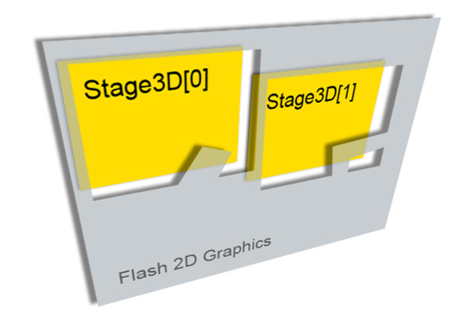
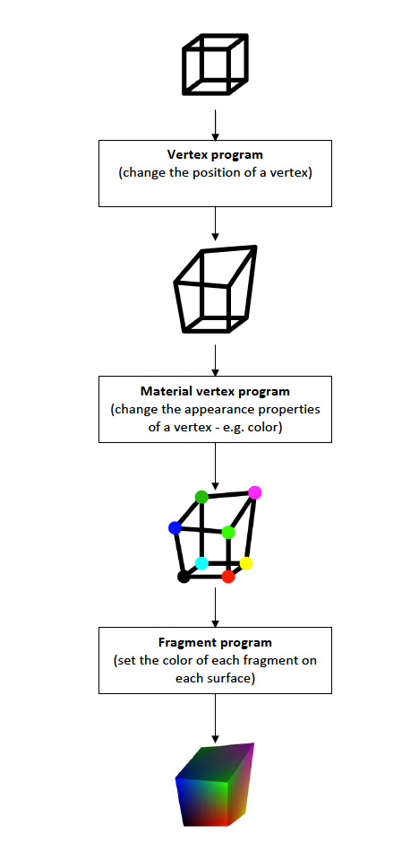
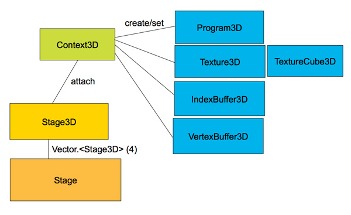

# Introducing Molehill: 3D APIs for Adobe Flash Player and Adobe AIR

by Thibault Imbert

At MAX 2010 in Los Angeles, Adobe announced the introduction of the Molehill
APIs in the Adobe Flash runtimes on mobile and desktop. Molehill is the codename
for Stage3D, the set of 3D GPU-accelerated APIs that will be exposed in
ActionScript 3 in Adobe Flash Player and Adobe AIR. This will enable high-end 3D
rendering inside the Adobe Flash Platform.

Molehill will rely on DirectX 9 on Windows and OpenGL 1.3 on Mac OS X and Linux.
On mobile platforms like Android, Molehill will rely on OpenGL ES 2.
Technically, the Molehill APIs are truly 3D, GPU-programmable, and shader-based.
They will expose features that 3D developers have been wanting for a long time
in Flash, such as programmable vertex and fragment shaders, to enable things
like vertex skinning on the GPU for bones animation as well as native
z-buffering, stencil color buffering, cube textures, and more.

In terms of performance, Adobe Flash Player 10.1 today renders thousands of
non-z-buffered triangles at approximately 30Hz. With the new 3D APIs, developers
can expect hundreds of thousands of z-buffered triangles to be rendered at HD
resolution in full screen at around 60Hz. Molehill will make it possible to
deliver sophisticated 3D experiences across almost every computer and device
connected to the Internet.

## How does Molehill work?

The existing Flash Player 2.5D APIs that Adobe introduced in Flash Player 10 are
not going away. The Molehill APIs will offer a solution for advanced 3D
rendering requiring full GPU acceleration. Depending on the project you are
working on, you will be able to decide which APIs you want to use.

Adobe recently introduced the concept of Stage Video in Flash Player 10.2,
available as a beta on Adobe Labs. Stage Video relies on the same design, by
enabling full GPU acceleration for video, from decoding to presentation. With
this new rendering model, Adobe Flash Player presents the video frames or 3D
buffer not inside the display list but inside a texture sitting behind the stage
painted through the GPU. This allows Adobe Flash Player to directly paint
on-screen the content available on the graphics card memory. No more read back
is required to retrieve the frames from the GPU to push them on-screen through
the display list on the CPU.

As a result, because the 3D content sits behind the Flash Player stage and is
not part of the display list, the Context3D and Stage3D objects are not display
objects. That means you cannot interact with them the same way you interact with
any DisplayObject, and rotations, blend modes, filters, and many other effects
cannot be applied (see Figure 1).

**Figure 1.** With Stage Video, 3D content sits behind the Flash Player stage.

From an ActionScript APIs standpoint, as a developer you interact with the two
main objects: a Stage3D and a Context3D object. You request a 3D context from
Adobe Flash Player, and a Context3D object will be created for you.

But what happens if the GPU driver is incompatible? Will you get a black screen
that fails silently? Flash Player will still return a Context3D object, using
software fall-back internally, so you will still get all the Molehill features
and the same API, but they will be running on the CPU. To achieve this, we rely
on a very fast CPU rasterizer from TransGaming Inc. called SwiftShader. The
great news is that even when running on software, SwiftShader runs about 10
times faster than today’s vector rasterizer available in Flash Player 10.1, so
you can expect some serious performance improvements even when running in
software mode.

The beauty of Molehill APIs is that you do not have to worry about what is
happening internally. It doesn’t matter whether you are running on DirectX,
OpenGL, or SwiftShader, and you don’t have to use a different API for OpenGL on
Mac OS X, Linux, or OpenGL ES 2 when running on a mobile platform. Everything is
transparent for you as a developer. You program one single API, and Adobe Flash
Player handles this for you internally and does the translation behind the
scenes.

It is important to remember that the Molehill APIs do not use a fixed function
pipeline. They use only a programmable pipeline, which means that you will have
to work with vertex and fragment shaders to display anything on-screen. For
this, you will be able to upload your shaders as pure low-level Adobe Graphics
Assembly Language (AGAL) bytecode as a ByteArray on the graphics card. As a
developer, you have two ways to do this: You can write your shaders at the
assembly level, which requires an advanced understanding of how shaders work. Or
you can use a higher level language like Pixel Bender 3D, which will expose a
more natural way to program your shaders and compile the appropriate AGAL
bytecode.

In order to represent your triangles, you will need to work with VertexBuffer3D
and IndexBuffer3D objects by passing vertices coordinates and indices. Once your
vertex shaders and fragment shaders are ready, you can upload them to the
graphics card through a Program3D object. Basically, a vertex shader deals with
the position of the vertices used to draw your triangles, whereas a fragment
shader handles the appearance of the pixels used to texture your triangles.
Figure 2 illustrates the difference between the types of shaders.

**Figure 2.** Vertex shaders vs. fragment shaders.

Finally, all those objects are passed to the Context3D object. Figure 3
illustrates the overall interaction of objects.

**Figure 3.** Object interaction with the Molehill APIs.

As you can see, the Molehill APIs are very low-level and expose features for
advanced developers who want to work with 3D. Of course, some developers will
prefer working with higher level frameworks, which expose ready-to-use APIs.
Adobe took care of that, too.

## Building mountains out of Molehill

Many ActionScript 3 developers prefer working with a light, a camera, and a
plane rather than a vertex buffer and shaders bytecode. So to make sure everyone
can enjoy the power of Molehill, we are actively working with existing 3D
frameworks like Alternativa3D, Flare3D, Away3D, Sophie3D, Yogurt3D, and more.
Today most of these frameworks are already Molehill-enabled and will be released
when Molehill is available in the next version of the Flash runtimes.

Most of the developers from these frameworks were at MAX this year to present
sessions about how they leveraged Molehill in their respective framework. We
expect developers to build their engine on top of Molehill. Hence advanced 3D
developers and non-3D developers will both benefit from Molehill.

## Where to go from here?

Check out the following list of articles about Stage3D, codenamed Molehill.

1. [How Stage3D works](../devnet/flashplayer/articles/how-stage3d-works.md)
2. [Vertex and fragment shaders](../devnet/flashplayer/articles/vertex-and-fragment-shaders.md)
3. [What is AGAL?](../devnet/flashplayer/articles/what-is-agal.md)
4. [Hello Triangle](../devnet/flashplayer/articles/hello-triangle.md)
5. [Working with Stage3D and perspective projection](../devnet/flashplayer/articles/working-with-stage3d-and-perspective-projection.md)
6. [Working with 3D cameras](../devnet/flashplayer/articles/working-with-3d-cameras.md)
7. [Mipmapping for smoother textures in Stage3D](../devnet/flashplayer/articles/mipmapping-for-smoother-textures-in-stage3d.md)

---

_Thibault Imbert is a Flash Player Product Manager focused on graphics and
rendering._
